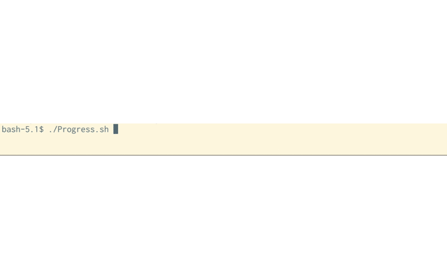

## 関連記事
- [【wLu】Bashで便利なコマンドを作ってみようって話](https://suzukiiichiro.github.io/posts/2021-12-23-suzuki/)
- [【unComp】Bashで便利なコマンドを作ってみようって話](https://suzukiiichiro.github.io/posts/2021-12-23-02-suzuki/)
- [【プログレスバー】Bashでプログレスバーを作ってみようって話](https://suzukiiichiro.github.io/posts/2021-12-23-03-suzuki/)

## プログレスバー
ターミナルで、処理の進捗が表示されるプログレスバーというのがあります。
処理が進むにつれて、ジリジリとメーターが右に増えていくあれです。
シェルスクリプトでも作れないものかとチャレンジしたので参考にして下さい

## 使い方

処理のループ中に以下の1行を追記します。
```
progress "$#" "$MAX"; set - "$@" count ;
```

## 実行手順
以下のソースコードを適当なファイル名で保存して下さい。ここではProgress.shとします。
```
$ :> Progress.sh
$ vim Progress.sh
# vimで以下のソースコードを貼り付けて保存
# ソースコードのファイルエンコードをUTF-8に変更します。
$ nkf -wLu Progress.sh > Progress.sh.utf8
# ファイルエンコードを変更したファイルを元のファイル名にリネームします。
$ mv Progress.sh.utf8 Progress.sh
# 実行権限を付与します
$ chmod +x Progress.sh
# 実行
$ ./Progress.sh
```

## ソースコード
```
#! /bin/bash

#######################################
# 進捗を表示するプログレスバー
#  
#######################################
#
#
# percent $1 
# GT      $2
progress(){

  percent=$1;
  GT=$2;  

  column=`expr 71 \* "$percent" / $GT`;
  nspace=`expr 71 - "$column"`;

  #プログレスバーのカーソルを左端に戻すリターンコードと[の文字をbarに代入
  bar='\r['; 

  #位置パラメータの数($#)を１にリセット（カウンタとして流用）
  set dummy ;
  while [ $# -le "$column" ];do
    bar=$bar'=';      # barに=を追加
    set - "$@" dummy; # $#をインクリメント
  done
  bar=$bar'>';        #barの先端に>を追加

  #位置パラメータの数($#)を１にリセット（カウンタとして流用）
  set dummy ;
  while [ $# -le "$nspace" ]; do 
    bar=$bar' ';
    set - "$@" dummy;
  done
  bar=$bar']'$percent/$GT'\c'; # barに]と１行分のプログレスバーを表示

  echo -e "$bar"; 
}

#######################################
# メイン処理
#
set count ;
MAX=100 ; #最大値を100とする。実際に掛かる処理数の最大値を入れて下さい。
#
for (( i=0; i<$MAX; i++)){
  # ループする処理に以下の一行を埋め込めばプログレスバーが表示されます。
  progress "$#" "$MAX"; set - "$@" count ;
}
echo "";
#
#終了
exit ;
```

## 使い方

シェルスクリプトで自作したなんらかの処理ファイルにprogress()関数を貼り付けます。

自作ソースの中のループ処理の関数の頭に以下を追記します。
MAX=100; は、処理の最大値を指定します。
処理のループ最大数が150階であれば、以下の通りに修正します。
```
set count;
MAX=150;
```
forやwhileループ処理の中に以下を埋め込みます。
```
progress "$#" "$MAX"; set - "$@" count ;
```

最後にforまたはwhileループを抜けた後に
```
echo "";
```

を追加します。これだけです。

## 実行結果



