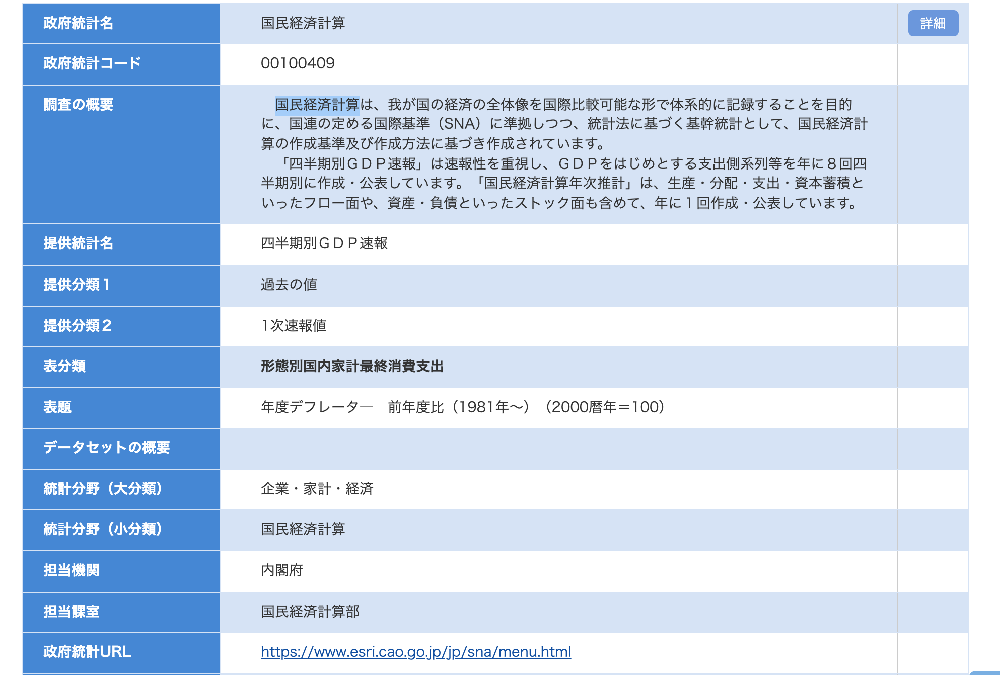
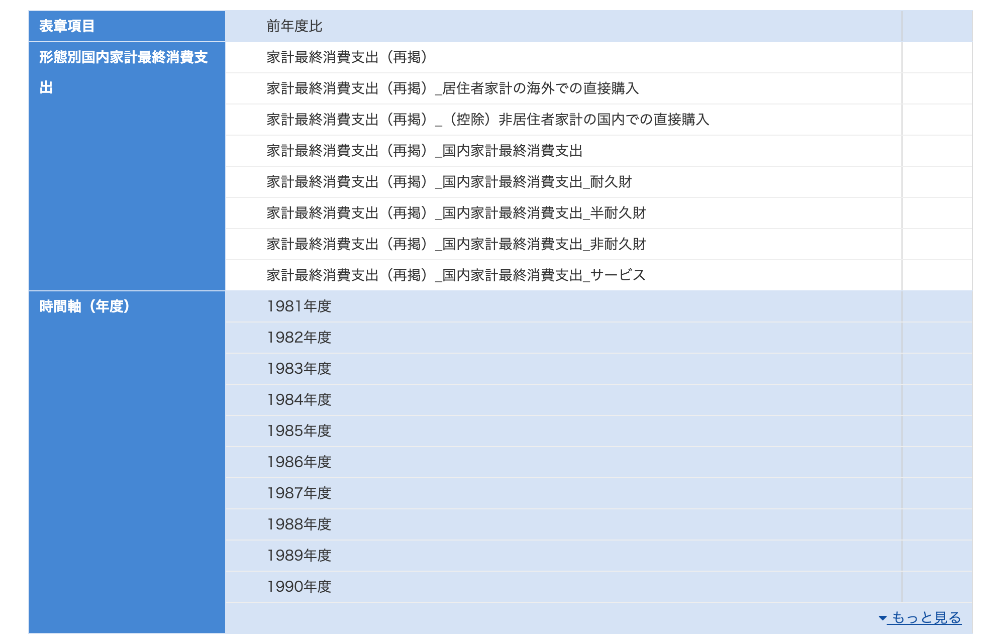
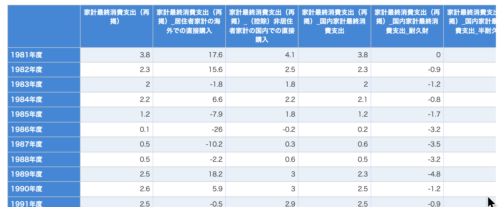

 今回は前回登場したデータの内容を調べてみましょう。  
 「統計表情報取得」（リスト取得）APIで取得したデータをもとにe-Statのサイト（https://www.e-stat.go.jp/）からデータを見つけてみましょう。  
 
 ```
 <LIST_INF id="0003384123">
            <STAT_NAME code="00100409">国民経済計算</STAT_NAME>
            <GOV_ORG code="00100">内閣府</GOV_ORG>
            <STATISTICS_NAME>四半期別ＧＤＰ速報 過去の値 1次速報値</STATISTICS_NAME>
            <TITLE>形態別国内家計最終消費支出 年度デフレータ—　前年度比（1981年～）（2000暦年＝100）</TITLE>
            <CYCLE>四半期</CYCLE>
            <SURVEY_DATE>201007-201009</SURVEY_DATE>
            <OPEN_DATE>2020-04-01</OPEN_DATE>
            <SMALL_AREA>0</SMALL_AREA>
        </LIST_INF>
```
## データを検索してみよう
 IDで検索できるのが一番良いのですが、キーワード検索のテキストフィールドに入力して検索してもダメでした。  
 
 しょうが無いので、TITLE全文「形態別国内家計最終消費支出 年度デフレータ—　前年度比（1981年～）（2000暦年＝100）」で検索しましたがでダメでした。  

 少し削って、「形態別国内家計最終消費支出 年度デフレータ—　前年度比」  だと４０５件。  
 多すぎるので、SURVEY_DATE、OPEN_DATEを使って調査年、調査月、公開年月で絞り込むと２件に絞り込めました。  
 あとはSTATISTICS_NAMEで特定できました。  
 
 
 ## 詳細ページに行ってみましょう
 
 https://www.e-stat.go.jp/stat-search/database?page=1&query=%E5%BD%A2%E6%85%8B%E5%88%A5%E5%9B%BD%E5%86%85%E5%AE%B6%E8%A8%88%E6%9C%80%E7%B5%82%E6%B6%88%E8%B2%BB%E6%94%AF%E5%87%BA%20%E5%B9%B4%E5%BA%A6%E3%83%87%E3%83%95%E3%83%AC%E3%83%BC%E3%82%BF%E2%80%94%E3%80%80%E5%89%8D%E5%B9%B4%E5%BA%A6%20%20%20%20%20%20%20&layout=dataset&year=20100&month=23070900&open_date=202004&statdisp_id=0003384123&metadata=1&data=1
 
 上段が「統計表情報取得」の内容  
 
 下段が「メタ情報取得」の内容見たいです。  
 
 
 DBをクリックするとグラフが表示されました。  
 
 
 
 行情報が「1981年度、1982年度、1983年度。。。」  
 列情報が「家計最終消費支出（再掲）、家計最終消費支出（再掲）_居住者家計の海外での直接購入、。。。」  
 
 
 なんと、APIクリックすると丁寧にクエリを表示してくれました(API仕様書とか見る必要ないですね)。  
 
 
 フォーマットもXML,JSON,CSVが選べますね。  
 私はCSVの方が扱いやすいのでこれからはCSVでダウンロードすることにします。  
 
 
 appIdがカラに空になっているので追加してcurlで叩くだけでいいですね。至れり尽くりです。  
 
```          
curl "http://api.e-stat.go.jp/rest/3.0/app/getSimpleStatsData?appId=xxxxxxx&lang=J&statsDataId=0003384123&metaGetFlg=Y&cntGetFlg=N&explanationGetFlg=Y&annotationGetFlg=Y&sectionHeaderFlg=1&replaceSpChars=0"
    
"tab_code","表章項目","cat01_code","形態別国内家計最終消費支出","time_code","時間軸（年度）","unit","value","annotation"
"17","前年度比","11","家計最終消費支出（再掲）","1981100000","1981年度","％","3.8",""
"17","前年度比","11","家計最終消費支出（再掲）","1982100000","1982年度","％","2.3",""
"17","前年度比","11","家計最終消費支出（再掲）","1983100000","1983年度","％","2",""
.
.
.
"17","前年度比","12","家計最終消費支出（再掲）_居住者家計の海外での直接購入","1981100000","1981年度","％","17.6",""
"17","前年度比","12","家計最終消費支出（再掲）_居住者家計の海外での直接購入","1982100000","1982年度","％","15.6",""
"17","前年度比","12","家計最終消費支出（再掲）_居住者家計の海外での直接購入","1983100000","1983年度","％","-1.8",""
```

## データの見方は？

DBで表示させた「統計表表示」と見比べてみると  


```       
"17","前年度比","11","家計最終消費支出（再掲）","1981100000","1981年度","％","3.8","" 
```

が１行目「1981年度」の１列目「家計最終消費支出（再掲）」に該当するみたいですね。  
１セル、１行のデータ構造みたいですね。  
１列目の情報がしばらく続いて、全行終わると次は２列目の情報みたいな構成だということがわかりました。  
          
          
          
## 国民経済計算って何
このデータは国民経済計算を算出したものということですが、国民経済計算ってなんでしょう？  

内閣府のサイトによると  
国民経済計算は「四半期別ＧＤＰ速報」と「国民経済計算年次推計」の２つからなっている。「四半期別ＧＤＰ速報」は速報性を重視し、ＧＤＰをはじめとする支出側系列等を、年に８回四半期別に作成・公表している。「国民経済計算年次推計」は、生産・分配・支出・資本蓄積といったフロー面や、資産・負債といったストック面も含めて、年に１回作成・公表している。  

GDPを算出するための何かみたいですね。  


googleの検索結果を見てみると、国や地方自治体のサイトや経済学の解説サイトがメインで、たまに今年のGDPはどうだったという記事でちょっと書かれてたりしました。  

記事の中でちょっと気になったのは、  
日本では新型コロナウイルスの影響で個人消費が落ち込んでおり、貯蓄が増加傾向にあります。内閣府の国民経済計算によると、2020年に消費されずに貯蓄に回ったお金は、一律10万円の特別定額給付金の影響もあり、35.8兆円に達しました。この額は前年の5倍の水準です。   
所得に対する貯蓄の割合を示す家計貯蓄率は13.1%と19年度（3.7%）から大きく上昇した。  

前年度から比較して急激に大きくなったという部分(5倍も！)。こういうのは是非ピックアップしたいと思いました。  

## e-Statでのマイニングの目的は

とわ言え「国民経済計算」全般的に堅い感じですね。。。。  

私のe-Statマイニングの目的は大量の政府公開データに埋もれている中から人の興味を引きそうな面白そうなコンテンツをピックアップしてわかりやすくサマリーを表示することなのです。  

キーワードランキングを見てみると「アイスクリーム」「身長・体重の平均値」みたいな面白そうな柔らかめのコンテンツもあるんです。  


次回から、  
・e-Statの森の中から面白いコンテンツを見つけよう  
・うまくサマライズして表示しよう  
　　興味深い列情報に絞りたい  
　　前年度から５倍とか急激に変化した部分をピックアップして伝えたい  
という視点からe-Statを調査していきたいと思います。  
