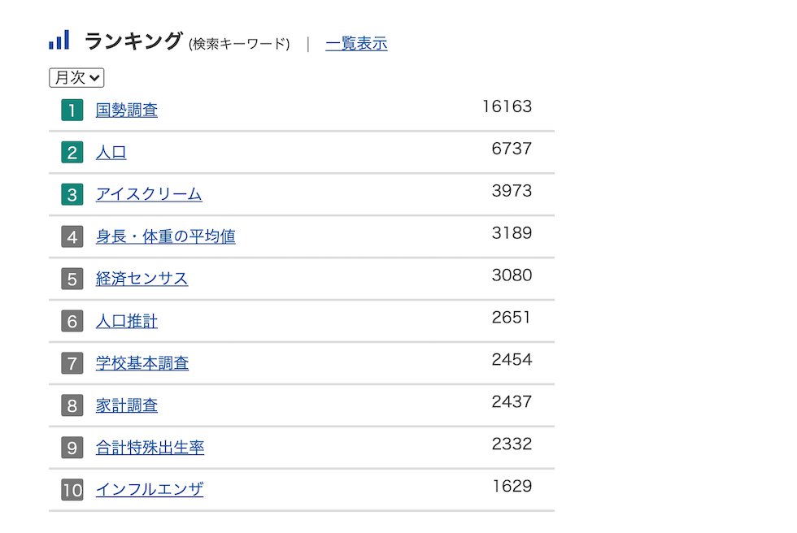
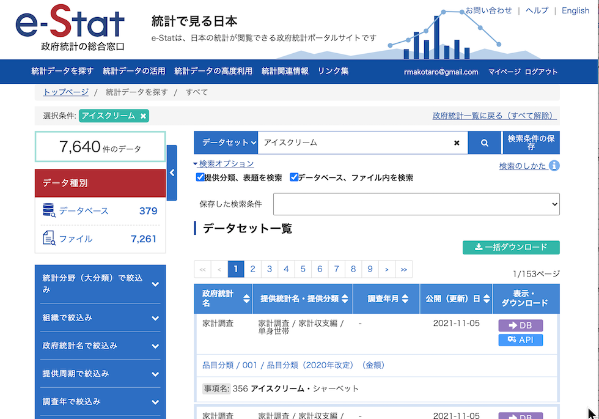
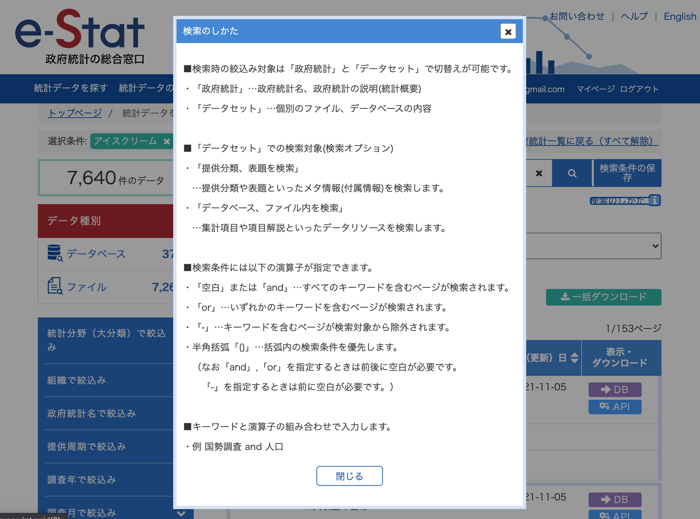
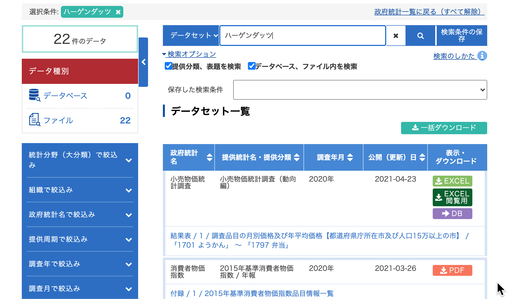
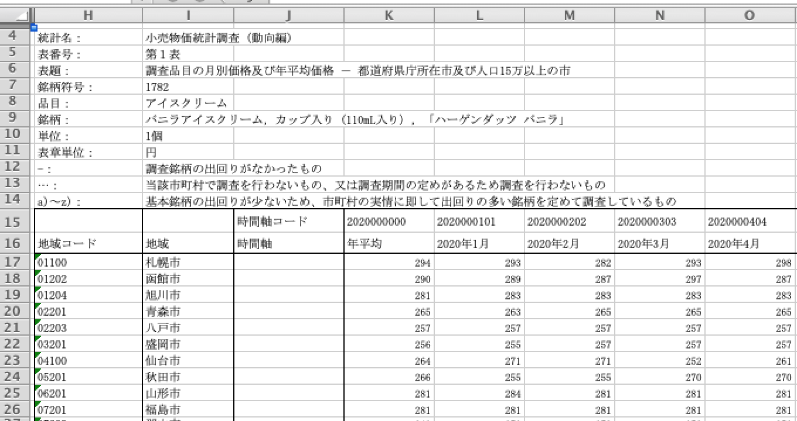
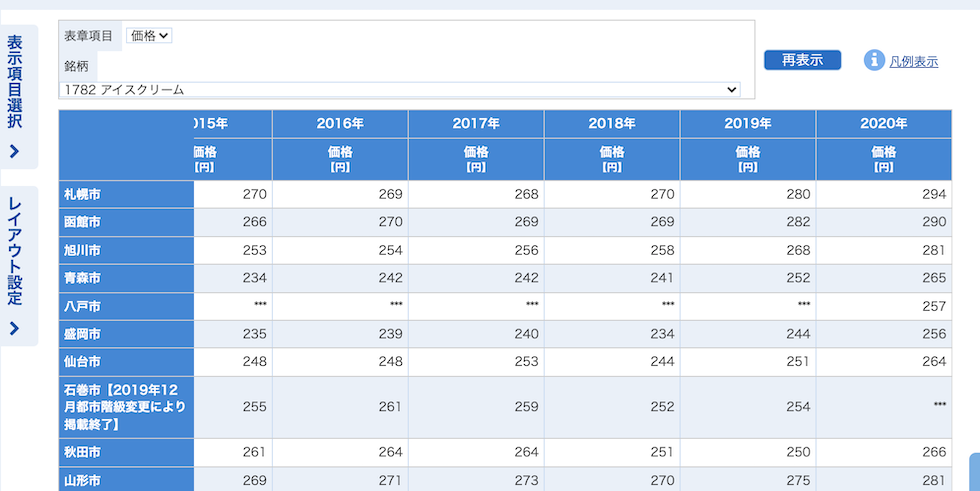
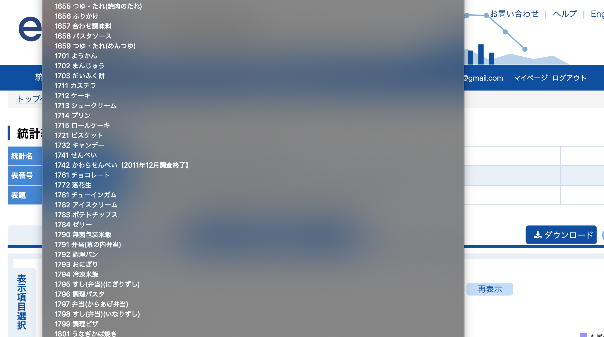
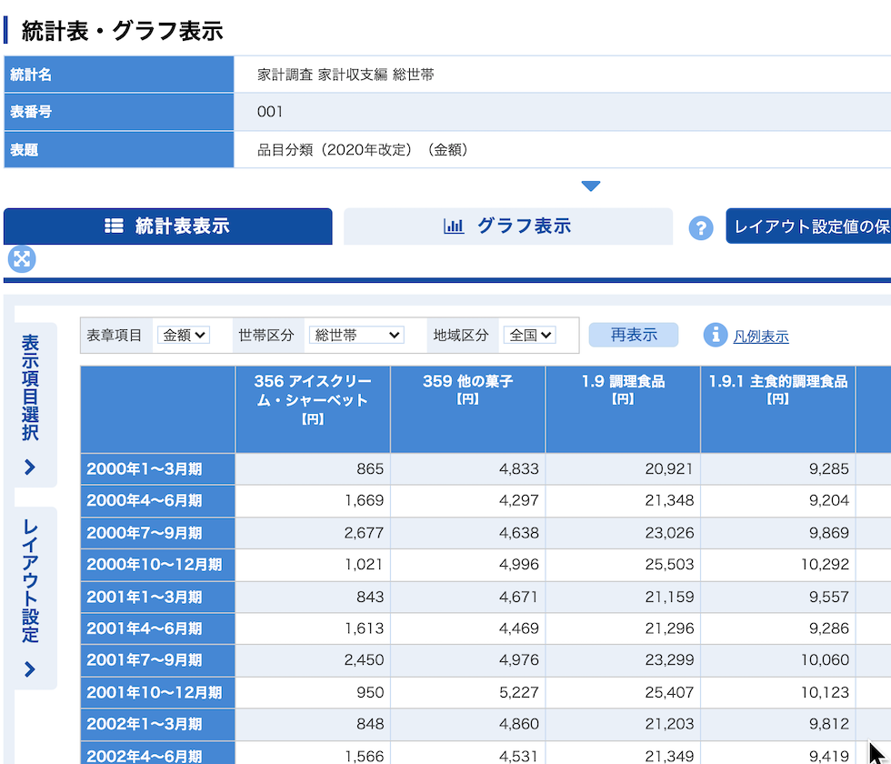

私のe-Statでのデータマイニングの現在の目的は以下の通りです  
大量の政府公開データの中から  
①面白そうなデータをピックアップする  
②データをわかりやすくサマライズする  
　・列情報などを必要な項目に絞り込む  
　・前年度比５倍とか急激な変化があった場合をピックアップできるようにする  
最終的にはこれらを自動でできるようにしたいです。  

今回は、まず①面白そうなデータをピックアップすることを目的にe-Statを見てみましょう。  

## ランキングページを見てみよう
e-Statのトップページ（https://www.e-stat.go.jp/）の画面の下の方にランキングという欄があります。  
そのランキングの現在(2021/12/26)３位が「アイスクリーム」なんです。  



## アイスクリームが含まれるのはどんなデータか
「アイスクリーム」は柔らかめのキーワードなので面白いデータの予感がします。  
「アイスクリーム」が含まれるデータはどんなデータなんでしょうか？  
ちょっと見てみましょう。  

https://www.e-stat.go.jp/stat-search?page=1&query=%E3%82%A2%E3%82%A4%E3%82%B9%E3%82%AF%E3%83%AA%E3%83%BC%E3%83%A0&layout=dataset  



「アイスクリーム」が含まれるデータは7640件あるみたいです。  
ちょっと多いですね。。。  
検索条件なのですが、提供分類、表題を検索　データベース、ファイル内を検索にチェックがついています。  
「検索のしかた」をみてみるとキーワードのOR検索やAND検索もできそうです。  


ちなみに検索キーワードでの絞り込みはAPI(統計表情報取得)でももちろんできます。  

 ``` 
curl "https://api.e-stat.go.jp/rest/3.0/app/getSimpleStatsList?appId=xxxxxxxxxx&searchWord=アイスクリーム"
 ``` 

アイスクリームだと数が多すぎるので試しに「ガリガリ君」で検索してみましたが、0件でした。「ハーゲンダッツ」で検索したところ22件引っかかってきました。  



「ハーゲンダッツ」どこに出てくるのかなと思ってAPIを一通り叩いてみたのですがAPIの実行結果からは「ハーゲンダッツ」は見つけられませんでした。  
エクセル表示を見てみたところ、「銘柄」という項目に「バニラアイスクリーム，カップ入り（110mL入り），「ハーゲンダッツ バニラ」」とありました。  
どうも全国のアイスクリームの価格を「ハーゲンダッツ　バニラ」を基準に算出しているみたいです。  




ちなみに、2020年だと１番安いのが長野市の221円で１番高いのが那覇市の300円でした。  


単にハーゲンダッツの価格ってだけだと少しパンチ力弱いかもしれませんね。。。  

個人的には明治のスーパーカップが１位でジャンボモナカが２位でとかアイスクリーム売れ筋ランキングとかの方が楽しいのですが、政府はそこまで調べてくれないですよね。  

## 小売統計調査とは
小売物価統計調査はお米の価格から葬儀代まで約８００の小売価格を調査したデータ
調査結果は、年金等の給付見直しの際の基礎資料や、公共料金の上限値を決める際の資料として、幅広く利用されているそうです。 
アイスクリームは約８００ある中の項目の一つです。

 

小売物価統計調査をピックアップするとしたら、ここ数年で値段が大きく変化しているものや地域間の差が特に大きいものとかですかね。  

「小売物価統計」でgoogle検索して面白そうな記事を見てみると  
「今年のX’マスケーキは小さくなるか」という記事がありました。  

ケーキにもよく使われる小麦や油量種子はとりわけ高騰が目立つ  
→  
小売物価統計調査によると、東京都区部の小売価格で、今年11月の1kgあたりの小麦価格は1年前より約20円上昇した。食用油に至っては1kgあたり約60円と大幅な値上がりで、価格が比較的安定している食品の代名詞ともなってきた鶏卵でさえ、1パックあたり約12円上昇した。  
→  
クリスマスイブにケーキを買って帰る人も多いだろうが、今年は例年と比べて値段がほとんど同じなのにサイズが小さくなっていても不思議ではない。  

こんな感じのものは自動的にピックアップできると理想的なんですけどね。  

## 今日のところのまとめ
自動的にピックアップするとしたら  
・柔らかめのキーワード  
・ここ数年間で値が急激に変化してるもの  
・地域間の格差が大きいもの  
ですかね。データを見ていって判定項目を増やしていきたいと思います。  

その他、アイスクリームでの検索結果には「家計調査」というのもありました。  
家計の４半期での支出額の平均を出したものなのですが、アイスクリームの支出は当然夏が冬の倍くらい多い感じになってます。  

アイスクリームは当たり前ですが、その他季節によって大きく支出が違うものって何なのかは少し興味がありますね。  
毎月や四半期ごとに値があるものについては、期間によって差が大きいものはピックアップしても良いかもしれませんね。  

 

## 書籍の紹介
{{% amazon

title="UNIXという考え方―その設計思想と哲学 単行本 – 2001/2/23"
url="https://www.amazon.co.jp/UNIX%25E3%2581%25A8%25E3%2581%2584%25E3%2581%2586%25E8%2580%2583%25E3%2581%2588%25E6%2596%25B9%25E2%2580%2595%25E3%2581%259D%25E3%2581%25AE%25E8%25A8%25AD%25E8%25A8%2588%25E6%2580%259D%25E6%2583%25B3%25E3%2581%25A8%25E5%2593%25B2%25E5%25AD%25A6-Mike-Gancarz/dp/4274064069/ref=sr_1_1?keywords=unix%25E3%2581%25A8%25E3%2581%2584%25E3%2581%2586%25E8%2580%2583%25E3%2581%2588%25E6%2596%25B9&amp;qid=1667786898&amp;qu=eyJxc2MiOiIxLjEwIiwicXNhIjoiMC4zOSIsInFzcCI6IjAuMzEifQ%253D%253D&amp;sprefix=unix%25E3%2581%25A8%25E3%2581%2584%25E3%2581%2586%252Caps%252C257&amp;sr=8-1&_encoding=UTF8&tag=nlpqueens09-22&linkCode=ur2&linkId=0249eb4cab50d700fb6949eb9aeafef1&camp=247&creative=1211"
imageUrl="https://m.media-amazon.com/images/I/518ME653H3L._SX330_BO1,204,203,200_.jpg"
summary=`   UNIX系のOSは世界で広く使われている。UNIX、Linux、FreeBSD、Solarisなど、商用、非商用を問わず最も普及したOSのひとつであろう。そしてこのOSは30年にわたって使用され続けているものでもある。なぜこれほど長い間使われてきたのか？ その秘密はUNIXに込められた数々の哲学や思想が握っている。
   そもそもUNIXはMulticsという巨大なOSの開発から生まれたものだ。あまりに巨大なMulticsはその複雑さゆえに開発は遅々として進まず、その反省からケン・トンプソンが作ったのがUNIXの初めとされる。その後デニス・リッチーら多数の開発者が携わり、UNIXは発展した。本書はこのUNIXに込められた「思想と哲学」を抽出し、数々のエピソードとともにUNIXの特徴を浮き彫りにしていく。

   たとえば本書で述べられているUNIXの発想のひとつとして「過度の対話式インタフェースを避ける」というものがある。UNIXのシステムは初心者には「不親切」なつくり、つまり親切な対話式のインタフェースはほとんどなく、ユーザーがコマンドを実行しようとするときはオプションをつける形をとっている。この形式はオプションをいちいち覚えねばならず、初心者に決してやさしくない。しかしこれはプログラムを小さく単純なものにし、他のプログラムとの結合性を高くする。そして結果としてUNIXのスケーラビリティと移植性の高さを支えることになっているのだ。このような形式で本書では9つの定理と10の小定理を掲げ、UNIXが何を重視し、何を犠牲にしてきたのかを明快に解説している。

   最終章にはMS-DOSなどほかのOSの思想も紹介されている。UNIXの思想が他のOSとどう違うかをはっきり知ることになるだろう。UNIXの本質を理解するうえで、UNIX信者もUNIX初心者にとっても有用な1冊だ。（斎藤牧人）`
%}}

{{% amazon

title="詳解 シェルスクリプト 大型本  2006/1/16"

url="https://www.amazon.co.jp/gp/proteect/4873112672/ref=as_li_tl?ie=UTF8&camp=247&creative=1211&creativeASIN=4873112672&linkCode=as2&tag=nlpqueens09-22&linkId=ef087fd92d3628bb94e1eb10cb202d43"

summary=`Unixのプログラムは「ツール」と呼ばれます。
Unixは、処理を実現するために複数の道具(ツール)を組み合わせる「ソフトウェアツール」という思想の下に設計されているためです。
そしてこれらツールを「組み合わせる」ということこそがUnixの真髄です。
また、シェルスクリプトの作成には言語自体だけでなくそれぞれのツールに対する理解も求められます。
つまり、あるツールが何のためのものであり、それを単体あるいは他のプログラムと組み合わせて利用するにはどのようにすればよいかということを理解しなければなりません。
本書は、Unixシステムへの理解を深めながら、シェルスクリプトの基礎から応用までを幅広く解説します。
標準化されたシェルを通じてUnix(LinuxやFreeBSD、Mac OS XなどあらゆるUnix互換OSを含む)の各種ツールを組み合わせ、
目的の処理を実現するための方法を詳しく学ぶことができます。
`
imageUrl="https://m.media-amazon.com/images/I/51EAPCH56ML._SL250_.jpg"
%}}

{}


{{% amazon

title="[改訂第3版]シェルスクリプト基本リファレンス ──#!/bin/shで、ここまでできる (WEB+DB PRESS plus) 単行本（ソフトカバー）  2017/1/20"

url="https://www.amazon.co.jp/gp/proteect/4774186945/ref=as_li_tl?ie=UTF8&camp=247&creative=1211&creativeASIN=4774186945&linkCode=as2&tag=nlpqueens09-22&linkId=8ef3ff961c569212e910cf3d6e37dcb6"

summary=`定番の1冊『シェルスクリプト基本リファレンス』の改訂第3版。
シェルスクリプトの知識は、プログラマにとって長く役立つ知識です。
本書では、複数のプラットフォームに対応できる移植性の高いシェルスクリプト作成に主眼を置き、
基本から丁寧に解説。
第3版では最新のLinux/FreeBSD/Solarisに加え、組み込み分野等で注目度の高いBusyBoxもサポート。
合わせて、全収録スクリプトに関してWindowsおよびmacOS環境でのbashの動作確認も行い、さらなる移植性の高さを追求。
ますますパワーアップした改訂版をお届けします。`
imageUrl="https://m.media-amazon.com/images/I/41i956UyusL._SL250_.jpg"
%}}

{{% amazon

title="新しいシェルプログラミングの教科書 単行本"

url="https://www.amazon.co.jp/gp/proteect/4797393106/ref=as_li_tl?ie=UTF8&camp=247&creative=1211&creativeASIN=4797393106&linkCode=as2&tag=nlpqueens09-22&linkId=f514a6378c1c10e59ab16275745c2439"

summary=`エキスパートを目指せ!!

システム管理やソフトウェア開発など、
実際の業務では欠かせないシェルスクリプトの知識を徹底解説

ほとんどのディストリビューションでデフォルトとなっているbashに特化することで、
類書と差別化を図るとともに、より実践的なプログラミングを紹介します。
またプログラミング手法の理解に欠かせないLinuxの仕組みについてもできるかぎり解説しました。
イマドキのエンジニア必携の一冊。

▼目次
CHAPTER01 シェルってなんだろう
CHAPTER02 シェルスクリプトとは何か
CHAPTER03 シェルスクリプトの基本
CHAPTER04 変数
CHAPTER05 クォーティング
CHAPTER06 制御構造
CHAPTER07 リダイレクトとパイプ
CHAPTER08 関数
CHAPTER09 組み込みコマンド
CHAPTER10 正規表現と文字列
CHAPTER11 シェルスクリプトの実行方法
CHAPTER12 シェルスクリプトのサンプルで学ぼう
CHAPTER13 シェルスクリプトの実用例
CHAPTER14 テストとデバッグ
CHAPTER15 読みやすいシェルスクリプト
`
imageUrl="https://m.media-amazon.com/images/I/41d1D6rgDiL._SL250_.jpg"
%}}


