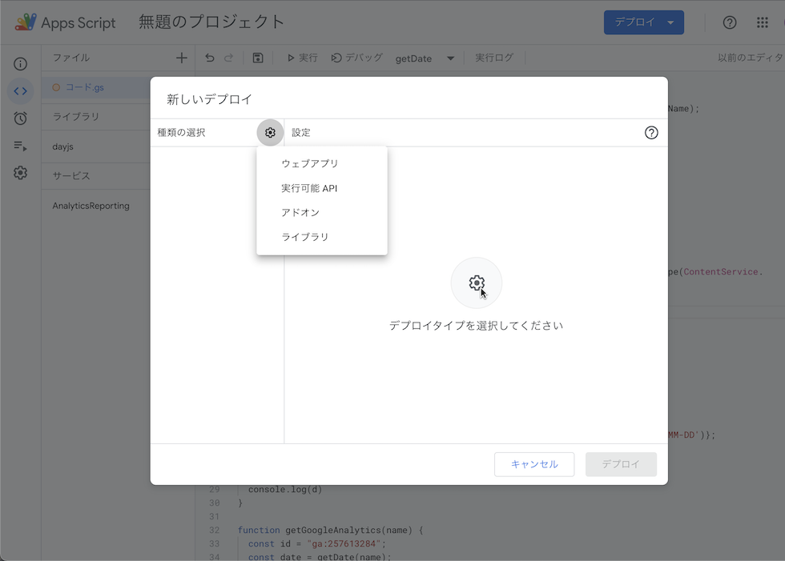
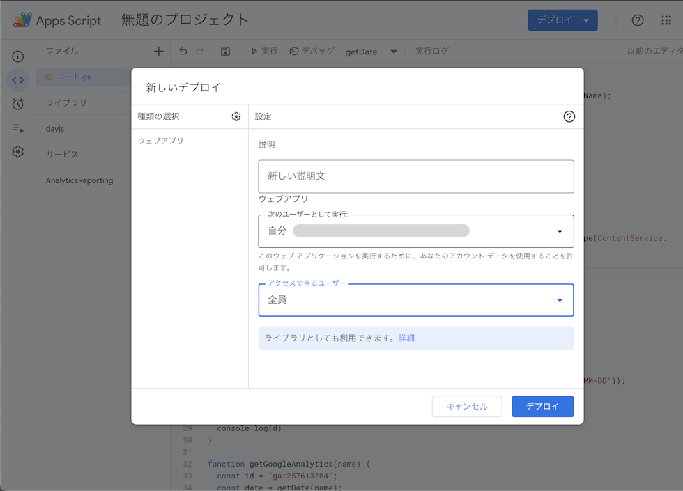
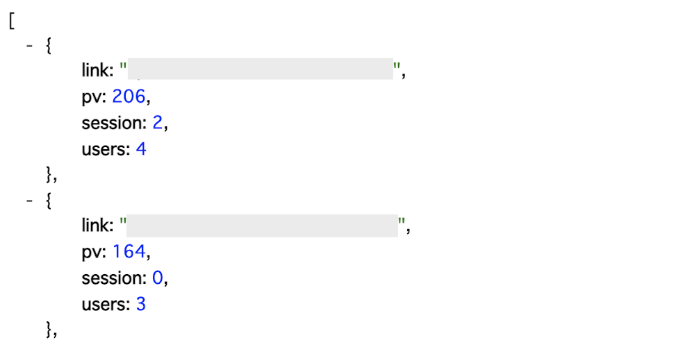
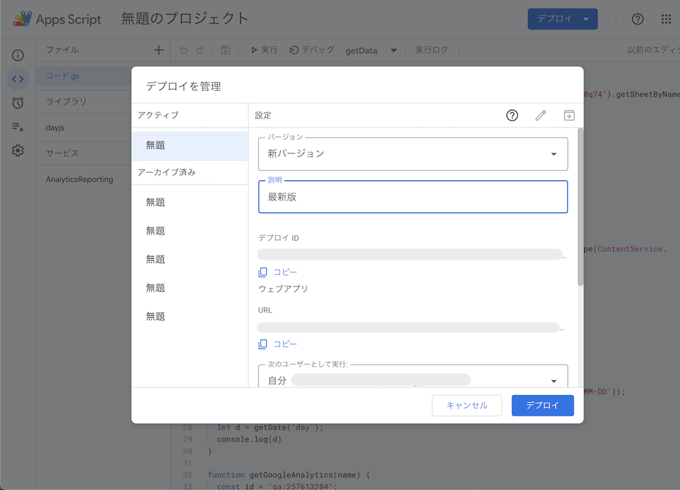
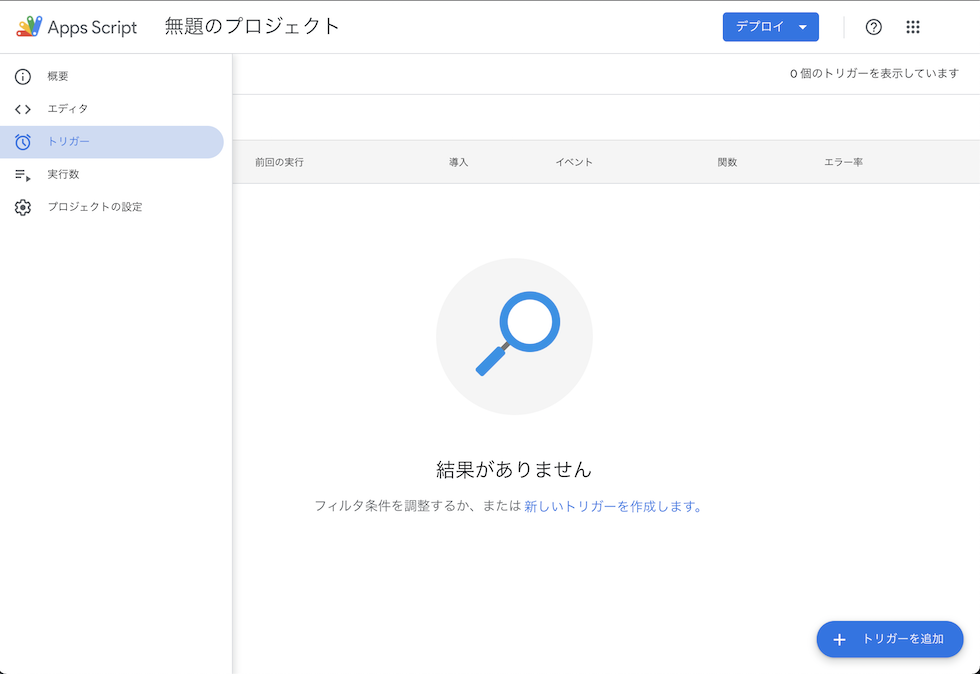

簡単にできるHugoで人気の記事を表示する方法の2回目になります。
[前回（簡単にできるHugoで人気の記事を表示する方法 #01）](/posts/2022-01-06-01-wyoshi/)ではGAS（Google App Scripts）を使ってアナリティクスのデータをスプレッドシートに反映するところまで説明しました。
今回は前回作成したスプレッドシートからデータを取得して、Hugoと連携するところまでやっていきましょう。

## スプレッドシートのデータをJSONで取得
Hugoやjsなどとの連携を簡単にするために、スプレッドシートのデータをjsonで取得できるようにします。

前回作成したプログラムを開きます。
開き方は前回の「[簡単にできるHugoで人気の記事を表示する方法 #01](/posts/2022-01-06-01-wyoshi/)」にある「スプレッドシートの設定」を確認してください。

スプレッドシートのデータをjsonで取得するためには、APIを使用するケースもありますが、今回はAPIを使用しないで取得します。

プログラムの内容は下記になります。

スプレッドシートのIDはスプレッドシートのURL部分の
docs.google.com/spreadsheets/d/ ```スプレッドシートのID``` /edit#gid=0
といったように docs.google.com/spreadsheets/d/ と edit に囲まれた部分になります。


```javascript
function getData(sheetName) {
  const sheet = SpreadsheetApp.openById("スプレッドシートのID").getSheetByName(sheetName);
  const rows = sheet.getDataRange().getValues();
  const keys = rows.splice(0, 1)[0];
  return rows.map(row => {
    let obj = {};
    row.map((item, index) => obj[keys[index]] = item);
    return obj;
  });
}

function doGet(e) {
  let data = getData(e.parameter.sheetname);
  return ContentService.createTextOutput(JSON.stringify(data, null, 2)).setMimeType(ContentService.MimeType.JSON);
}

```

### プログラムの説明

#### doGetってなに？
```doGet(e)``` はこのプログラムをURLから実行できるようにした際にパラメータの値を取得して処理を行う関数です。
ここでは ```getData()```という関数に、クエリパラメータ```sheetname```を渡しております。
URLにすると、https://〜/exec?sheetname=パラメータ
となります。

このパラメータ部分にスプレッドシートのシート名を渡すことで、該当するスプレッドシートのデータを表示できるようになるというわけです。

#### getDataでやってること
```getData(sheetName)``` では先程のクエリパラメータ```sheetname```の値を使って、シートから情報を取得してjsonに格納している部分です。

指定したシートIDの値がある範囲からから値を取得するのが下記のプログラムです。
```javascript
const rows = sheet.getDataRange().getValues();
```

その取得した値からタイトル、jsonのキーとなる部分を keys として格納します。
そしたら先程取得した rows の値をループで取得しながらjson形式のデータに加工します。

すると、
```
[
  [リンク, pv数, session数, users数],
  [リンク, pv数, session数, users数]
]
```
というデータが
```
[
  {link: リンク, pv: pv数, session: session数, users: users数},
  {link: リンク, pv: pv数, session: session数, users: users数}
]
```
というjson形式に加工することができました。
ここまでを保存しておきます。

このプログラムを公開してURLでアクセスできるようにしましょう。

## GASのプログラムをデプロイして公開
それではここまでのファイルをデプロイして、Webでアクセスできるようにしましょう。
右上にある「デプロイ」を押して、新しいデプロイをクリックします。

すると、「新しいデプロイ」となるので、歯車のマーク「デプロイを有効にする」をおして、「ウェブアプリ」を選択します。


設定の画面になるので、説明などを入力します。
「次のユーザーとして実行」は自身のアドレスでかまいません。
「アクセスできるよユーザー」部分は「 **全員** 」とします。
これによって、Hugoから呼び出した際に実行できるようになります。


ここまで設定できたら「デプロイ」を押して、プログラムを公開します。
表示されたウェブアプリのURLが表示されるので、コピーしておきます。

先程コピーしたURLの末尾に```?sheetname=month```を追加してアクセスしてみましょう。
https://script.google.com/macros/s/〜/exec?sheetname=month
URLはこのような形になります。

正常にアクセスできていれば

とjson形式のデータが表示されるはずです。

### エラーが出た場合
```
TypeError: Cannot read property 'getDataRange' of null（行 3、ファイル「コード」）
```
というエラーが出た場合はパラメータが記述されていないだけなので、パラメータを記述することで正常に取得できます。
それ以外の場合は、「デバッグ」を使ってエラーを特定していく必要があります。
デバッグでは```doGet```はクエリ取得できないので、```e.parameter.sheetname```部分を```"month"```と直書きしてデバッグを実行します。

#### デプロイには注意
デプロイで「新しいデプロイ」を選択するとURLが変わる点に注意です。
GASでウェブアプリのURLを固定するための方法は、「デプロイを管理」から更新をするようにします。
- 「デプロイ」の「デプロイを管理」を押します。
- そして、右にある鉛筆マークの「編集」を押します。
すると、編集画面になり、バージョンや説明を修正することができます。
- バージョン部分を「新しいバージョン」として、説明に「最新版」とでも打っておきましょう。
- この状態で「デプロイ」をクリックします。

上記の作業で、URLを固定したままウェブアプリを公開することができます。



## Hugoと連携して人気の記事を表示する
アナリティクスとスプレッドシートを使って人気の記事をjsonで取得する事ができるようになったので、Hugoと連携します。
Hugoにはjsonを取得する機能がついているので、その機能を使ってデータを取得します。

```html:popularArticlesMonth.html
{{ $json := getJSON "https://script.google.com/macros/s/〜/exec?sheetname=month" }}

<aside class="widget archives sidearticle-contents--wrapper" id="popular-articles--month">
  <div class="contents-area">
    <header><h2 class="section-title">人気の記事（1ヶ月以内）</h2></header>
    <div class="sidearticle-contents">
      <div class="flex article-list--tile">
        {{ $page := .Site.Pages }}
        {{ range first .Site.Params.widgets.populerArticles.limit $json }}
          {{ $article := index (where $page ".RelPermalink" "eq" .link ) 0  }}
          {{ if $article }}
            <article>
              <h3 class="article-title"><a href="{{ $article.RelPermalink }}">{{- $article.Title -}}</a></h3>
            </article>
          {{ end }}
        {{ end }}
      </div>
    </div>
  </div>
</aside>
```

```getJSON``` のURLは先ほど作成したGASのウェブアプリURLになります。
今回は月間の人気記事を取得したいので、```?sheetname=month```としてあります。
年の場合は```year```日の場合は```day```などとすることで必要な情報を取得できます。

使用しているテンプレートにも夜と思いますが、layouts/partials/widget/popularArticlesMonth.html として保存しておきましょう。

このファイルをHugoで読み込むことで人気の記事を表示する事ができるようになります。

取得する人気の記事件数は```config.yaml```などのhugoの設定ファイル内のwidhetsに```populerArticles```を追加して記述しておきます。
```yaml:config.yaml
    widgets:
        enabled:
            - popular-articles
        populerArticles:
            limit: 10
```

### 人気の記事を表示するプログラムの解説
まずはサイト全体の記事を取得しておきます。
```
{{ $page := .Site.Pages }}
```
次に、取得したjsonのデータを設定で指定した範囲で取得します。
```
{{ range first .Site.Params.widgets.populerArticles.limit $json }}
...
{{ end }}
```
取得したデータからリンクに一致する記事を探します。
配列のデータで検索されているので、```index```を使って0番目の記事を取得しています。
あとは通常の記事と同じように扱えます。
```
{{ $article := index (where $page ".RelPermalink" "eq" .link ) 0  }}
```
今回は画像無しでタイトルのみの表示となりますが、データ自体は他の記事と同じなので画像やカテゴリ、本文などにもアクセス可能です。

## 自動更新の設定
サイトに人気の記事を表示させることができました。
今の設定だと人気の記事が更新されないので、GASの「トリガー」を使って定期的にアナリティクスのデータをjsonに反映するようにしておきます。

```javascript
function setMonth() {
  getGoogleAnalytics('month');
}
function setDay() {
  getGoogleAnalytics('day');
}
function setYear() {
  getGoogleAnalytics('year');
}

function all() {
  setDay();
  setMonth();
  setYear();
}
```
月だけでなく、日、年のデータも取得する夜にしておきます。
そして、それらをすべて実行する関数「all」も追加しておきましょう。ここで保存しておきます。
これで準備ができました。

左袖にあるストップウォッチアイコンを押して、「トリガー」を追加します。


- 「トリガーを追加」を押して、「実行する関数」で実行したい関数を選びます。今回は月間のデータを取得したいので「setMonth」を選択します。
- 「実行するデプロイを選択」は「Head」のままで構いません。
- 「イベントのソースを選択」は「時間主導型」に変更して、時間で実行するようにしておきます。
- 「時間ベースのトリガーのタイプを選択」を更新したい頻度で選択します。月間のデータなので1日おきくらいに更新でもいいかもしれません。「日付ベースのタイマー」を選択します。
一日おきではなく、毎時で更新したい場合は「時間ベースのタイマー」など各自にあったタイマーを選択してください。
- 「時刻を選択」で更新したい時間を選びます。とりあえず「午前4時〜5時」くらいに更新するようにしておきます。
- 「エラー通知設定」は各自で好きなタイミングで受信するようにしてください。私はいっぱい来ると嫌なので、「1週間おきに通知を受け取る」にしてあります。
以上で設定が終わりました。下にある「保存」を押して保存します。


これで定期的にアナリティクスのデータがスプレッドシートに反映されるようになりました。


## まとめ
Hugoで人気の記事を表示するには
- Googleアナリティクスの連携
- スプレッドシートを使ってjsonを作成

上記の2つを使うことで簡単に導入可能です。

Hugoを使って人気の記事を作成するにはサイトや投稿を公開した際になりますが、GitHub Actionsなどを使えばcron処理で定期的に再構築をかけることが可能なので、数十分おきに人気の記事を更新したり、スプレッドシートとgasのレン系の際にjsonを作成したので、javascriptでjsonを読み取って表示するといったことも可能です。

## ソース
前回と今回で作成したソースになります。

#### GASとスプレッドシートを使ってHugoに人気の記事を表示する
```javascript
function getData(sheetName) {
  const sheet = SpreadsheetApp.openById("シートID").getSheetByName(sheetName);
  const rows = sheet.getDataRange().getValues();
  const keys = rows.splice(0, 1)[0];
  return rows.map(row => {
    let obj = {};
    row.map((item, index) => obj[keys[index]] = item);
    return obj;
  });
}

function doGet(e) {
  let data = getData(e.parameter.sheetname);
  return ContentService.createTextOutput(JSON.stringify(data, null, 2)).setMimeType(ContentService.MimeType.JSON);
}

function getDate(type) {
  let calc = 'd';
  switch(type) {
    case "month": calc = 'M'; break;
    case "year": calc = 'y'; break;
    default: calc = 'd'; break;
  }
  const d1 = dayjs.dayjs().locale('ja');
  return {start: d1.subtract(1, calc).format('YYYY-MM-DD'), end: d1.format('YYYY-MM-DD')};
}

function getGoogleAnalytics(name) {
  const id = "ga:ビューID";
  const date = getDate(name);
  const response = AnalyticsReporting.Reports.batchGet({
    reportRequests: [{
      viewId: id,
      dateRanges: [{startDate:date.start,endDate: date.end}],
      samplingLevel: 'LARGE',
      metrics: [
        {expression: 'ga:pageviews'},
        {expression: 'ga:sessions'},
        {expression: 'ga:users'},
      ],
      dimensions: [
        {name: 'ga:pagePath'}
      ],
      orderBys: [{
        fieldName: 'ga:pageviews',
        sortOrder: "DESCENDING",
      }],
    }]
  });
  let rows = JSON.parse(response).reports[0].data.rows;
  rows = rows.filter(f => /posts/.test(f.dimensions[0])).map(f => {
      return f.dimensions.concat(f.metrics[0].values);
  });
  let sheet = SpreadsheetApp.getActive().getSheetByName(name);
  sheet.clear();
  rows.unshift(["link", "pv", 'session', 'users']);
  sheet.getRange(1, 1, rows.length, rows[0].length).setValues(rows);
}

function setMonth() {
  getGoogleAnalytics('month');
}
function setDay() {
  getGoogleAnalytics('day');
}
function setYear() {
  getGoogleAnalytics('year');
}

function all() {
  setDay();
  setMonth();
  setYear();
}
```

#### Hugoで人気の記事を表示する
```html
<aside class="widget archives sidearticle-contents--wrapper" id="popular-articles--month">
  <div class="contents-area">
    <header><h2 class="section-title">人気の記事（1ヶ月以内）</h2></header>
    <div class="sidearticle-contents">
      <div class="flex article-list--tile">
        {{ $page := .Site.Pages }}
        {{ range first .Site.Params.widgets.populerArticles.limit $json }}
          {{ $article := index (where $page ".RelPermalink" "eq" .link ) 0  }}
          {{ if $article }}
            <article>
              <h3 class="article-title"><a href="{{ .context.RelPermalink }}">{{- .context.Title -}}</a></h3>
            </article>
          {{ end }}
        {{ end }}
      </div>
    </div>
  </div>
</aside>
```

## 書籍の紹介
{{% amazon

title="Googleアナリティクス プロフェッショナル　～分析・施策のアイデアを生む最強リファレンス "

url="https://www.amazon.co.jp/Google%E3%82%A2%E3%83%8A%E3%83%AA%E3%83%86%E3%82%A3%E3%82%AF%E3%82%B9-%E3%83%97%E3%83%AD%E3%83%95%E3%82%A7%E3%83%83%E3%82%B7%E3%83%A7%E3%83%8A%E3%83%AB-%EF%BD%9E%E5%88%86%E6%9E%90%E3%83%BB%E6%96%BD%E7%AD%96%E3%81%AE%E3%82%A2%E3%82%A4%E3%83%87%E3%82%A2%E3%82%92%E7%94%9F%E3%82%80%E6%9C%80%E5%BC%B7%E3%83%AA%E3%83%95%E3%82%A1%E3%83%AC%E3%83%B3%E3%82%B9-%E5%B1%B1%E6%B5%A6-%E7%9B%B4%E5%AE%8F/dp/4297112612?__mk_ja_JP=%E3%82%AB%E3%82%BF%E3%82%AB%E3%83%8A&crid=JWVEKDNY44QV&keywords=google+%E3%82%A2%E3%83%8A%E3%83%AA%E3%83%86%E3%82%A3%E3%82%AF%E3%82%B9&qid=1641514280&s=books&sprefix=google+%E3%82%A2%E3%83%8A%E3%83%AA%E3%83%86%E3%82%A3%E3%82%AF%E3%82%B9%2Cstripbooks%2C197&sr=1-17-spons&psc=1&spLa=ZW5jcnlwdGVkUXVhbGlmaWVyPUFEVkxWVEZDSTdSQzQmZW5jcnlwdGVkSWQ9QTA1MDMwNDYyUTRGU1dQUEFQOTdTJmVuY3J5cHRlZEFkSWQ9QTNDR0ZTNUlLTUJHNUsmd2lkZ2V0TmFtZT1zcF9idGYmYWN0aW9uPWNsaWNrUmVkaXJlY3QmZG9Ob3RMb2dDbGljaz10cnVl&linkCode=ll1&tag=nlpqueens09-22&linkId=5dfbf1278031207773d96916ecce46dd&language=ja_JP&ref_=as_li_ss_tl"

summary=`ウェブ制作者から、マーケター、ウェブアナリストまで必携の1冊
「Googleアナリティクスはどこへ向かうのか?進化し続けるツールのポテンシャルを最大限に引き出したときに、新しい分析や施策のアイディアが生まれる」`

imageUrl="https://m.media-amazon.com/images/I/51PXFiYP7aL._SL250_.jpg"
%}}
{{% amazon

title="Google Apps Script目的別リファレンス 実践サンプルコード付き"

url="https://www.amazon.co.jp/Google-Apps-Script%E7%9B%AE%E7%9A%84%E5%88%A5%E3%83%AA%E3%83%95%E3%82%A1%E3%83%AC%E3%83%B3%E3%82%B9-%E5%AE%9F%E8%B7%B5%E3%82%B5%E3%83%B3%E3%83%97%E3%83%AB%E3%82%B3%E3%83%BC%E3%83%89%E4%BB%98%E3%81%8D-%E6%B8%85%E6%B0%B4/dp/4798062405?pd_rd_w=BsqYY&pf_rd_p=d8f6e0ab-48ef-4eca-99d5-60d97e927468&pf_rd_r=ADPJ0069C04W5M44N6YQ&pd_rd_r=16303d6e-b3f9-4aa6-9f06-d3e66775e8f4&pd_rd_wg=joLm1&pd_rd_i=4798062405&psc=1&linkCode=ll1&tag=nlpqueens09-22&linkId=f78c47c375494f0b51c423506367a868&language=ja_JP&ref_=as_li_ss_tl"

summary=`Excelのマクロに似た「スクリプト」を書けば、Gmailや「スプレッドシート」などのGoogleサービスを更に効率的に、思うように使えます。そのスクリプトを書いて実行するプログラミング環境が、Google Apps Script(GAS)。`

imageUrl="https://m.media-amazon.com/images/I/41OIKEUEOIL._SL250_.jpg"
%}}
