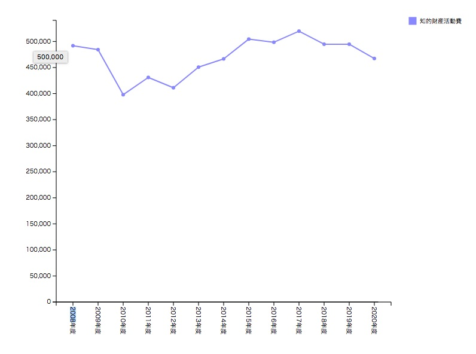

## e-Statで新着一覧を取得しよう
 毎日自動的に処理できるようにしたいので新着一覧を取得する必要があります。  
新着一覧は、リスト取得用のAPIでupdateDateに日付を指定してその日の更新分を取得してくるようにしました。  

```          
wget "https://api.e-stat.go.jp/rest/3.0/app/getSimpleStatsList?updatedDate=20220111&appId=xxxxxxxxxxxx&lang=J" -O new.csv
```          

STAT_CODEが政府統計コード、TABLE_INFがデータセットIDになります。  

```          
"0003254482","00552010","知的財産活動調査","00552","特許庁","知的財産活動調査","","","","","","","","","","","","1-1","業種別出願件数階級別 売上高、営業利益高、経常
利益高、従業者数、研究関係従業者数及び研究費","（注1）各設問項目によって標本数が異なるため、例えば研究関係従業者数の集計結果が従業者数の集計結果を上回るなど、大小関係の逆転が生じ得る点に留意する必要がある。（注2）業種
「個人」において売上高等の記載される場合があるが、これは事業を営む個人事業主が調査票の業種を「個人」として回答したことによる。","業種別出願件数階級別","","","","年
度次","0","2022-01-11","0","該当なし","0","2022-01-11","11","情報通信・科学技術","03","知的財産"
```          


データセットID（TABLE_INF）を使って個別データを取得しましょう。  

```          
wget "http://api.e-stat.go.jp/rest/3.0/app/getSimpleStatsData?appId=xxxxxxxxxxxxxxx&lang=J&statsDataId=0003254482&metaGetFlg=Y&cntGetFlg=N&explanationGetFlg=Y&annotationGetFlg=Y&sectionHeaderFlg=1&replaceSpChars=0" -O 0003254482.csv
```          

## 知的財産活動調査とは

今日の課題は新着一覧に出てきた「知的財産活動調査」をどう処理するか検討してみましょう。  

知的財産活動調査は、我が国における知的財産活動の現状を定量的に把握することを目的とした一般統計調査とのことです。  
特許権などの利用状況を調査したものみたいです。  

 
知的財産活動調査のデータセット数ですが１４０件もあります。  
統計のデータセット数は１つの時もあればこのように１００を超える時もあるみたいです。  
これだけデータセット数が多いとこの中から主要なデータセットを選択してサマリーを作成するのは大変ですね。  


google検索で「知的財産活動調査」の分析記事を調べてみると  

https://www.semiconportal.com/archive/editorial/industry/17.html  
知的財産担当者数は増加傾向にあり、2004年度は、約45,500人で前年度に比べ16.6 ％増加。  
企業等の知的財産活動費は約9,200 億円で前年度に比べ17.1 ％増加。  
特許権の活用状況 国内における2004年度の特許権の利用率は48.2 ％であり、依然として所有する権利の約半数が利用されていないことがわかる。  

https://www.jstage.jst.go.jp/article/jasmin/2018s/0/2018s_246/_article/-char/ja/  
　研究開発活動が利益率に対して最も顕著なプラスの効果を持っていたのは「医薬品製造業」であった．また，研究費投資から利益率向上には25年程度のラグがあることも示された  

「知的財産担当者数」「知的財産活動費」「特許権の利用率」あたりがよく出るキーワードみたいです。  

主要なキーワードの抽出方法なのですが、「知的財産活動調査」のように統計名でgoogle検索した結果に対して、「知的財産担当者数」「知的財産活動費」などのデータセット名で検索して件数が多いものを主要なキーワードとして取り扱うことができるか検討してみたいと思います。  

「利益率」という面白いキーワードがあったのですが、統計の中にはそのままのデータはありませんでした。「経常利益高」という項目があるのでこれを「知的財産活動費」で割り算する必要がありそうです。  
「利益率」が出せそうなら出してみるというのも検討してみると面白いかもしれません。  

主要なキーワードとしては、「知的財産担当者数」「知的財産活動費」「特許権の利用率」のようにその統計に固有のものもありますが、「利益率」「担当者数」「費用」「利用率」など汎用的に重要な項目もあるのかなと思いました。  

データセットの先頭にある「売上高、営業利益高、経常利益高、従業者数、研究関係従業者数及び研究費」は「特許権の利用率」は含まないものの「経常利益高」「知的財産担当者数」「知的財産活動費」を含むものでした。  
データセットが大量にある統計の場合先頭のデータセットはまとめ的なデータになるのでしょうか。他の統計も見てみようと思います。  

データセットの中に「標本数」というものがありました。「標本数」は、アンケート結果の回収数です。データの信用性を図る上では大切な項目ですが、サマリーを作成する際は除外しても良い項目かもしれません。  


 
 

 ## 書籍の紹介
{{% amazon

title="UNIXという考え方―その設計思想と哲学 単行本 – 2001/2/23"
url="https://www.amazon.co.jp/UNIX%25E3%2581%25A8%25E3%2581%2584%25E3%2581%2586%25E8%2580%2583%25E3%2581%2588%25E6%2596%25B9%25E2%2580%2595%25E3%2581%259D%25E3%2581%25AE%25E8%25A8%25AD%25E8%25A8%2588%25E6%2580%259D%25E6%2583%25B3%25E3%2581%25A8%25E5%2593%25B2%25E5%25AD%25A6-Mike-Gancarz/dp/4274064069/ref=sr_1_1?keywords=unix%25E3%2581%25A8%25E3%2581%2584%25E3%2581%2586%25E8%2580%2583%25E3%2581%2588%25E6%2596%25B9&amp;qid=1667786898&amp;qu=eyJxc2MiOiIxLjEwIiwicXNhIjoiMC4zOSIsInFzcCI6IjAuMzEifQ%253D%253D&amp;sprefix=unix%25E3%2581%25A8%25E3%2581%2584%25E3%2581%2586%252Caps%252C257&amp;sr=8-1&_encoding=UTF8&tag=nlpqueens09-22&linkCode=ur2&linkId=0249eb4cab50d700fb6949eb9aeafef1&camp=247&creative=1211"
imageUrl="https://m.media-amazon.com/images/I/518ME653H3L._SX330_BO1,204,203,200_.jpg"
summary=`   UNIX系のOSは世界で広く使われている。UNIX、Linux、FreeBSD、Solarisなど、商用、非商用を問わず最も普及したOSのひとつであろう。そしてこのOSは30年にわたって使用され続けているものでもある。なぜこれほど長い間使われてきたのか？ その秘密はUNIXに込められた数々の哲学や思想が握っている。
   そもそもUNIXはMulticsという巨大なOSの開発から生まれたものだ。あまりに巨大なMulticsはその複雑さゆえに開発は遅々として進まず、その反省からケン・トンプソンが作ったのがUNIXの初めとされる。その後デニス・リッチーら多数の開発者が携わり、UNIXは発展した。本書はこのUNIXに込められた「思想と哲学」を抽出し、数々のエピソードとともにUNIXの特徴を浮き彫りにしていく。

   たとえば本書で述べられているUNIXの発想のひとつとして「過度の対話式インタフェースを避ける」というものがある。UNIXのシステムは初心者には「不親切」なつくり、つまり親切な対話式のインタフェースはほとんどなく、ユーザーがコマンドを実行しようとするときはオプションをつける形をとっている。この形式はオプションをいちいち覚えねばならず、初心者に決してやさしくない。しかしこれはプログラムを小さく単純なものにし、他のプログラムとの結合性を高くする。そして結果としてUNIXのスケーラビリティと移植性の高さを支えることになっているのだ。このような形式で本書では9つの定理と10の小定理を掲げ、UNIXが何を重視し、何を犠牲にしてきたのかを明快に解説している。

   最終章にはMS-DOSなどほかのOSの思想も紹介されている。UNIXの思想が他のOSとどう違うかをはっきり知ることになるだろう。UNIXの本質を理解するうえで、UNIX信者もUNIX初心者にとっても有用な1冊だ。（斎藤牧人）`
%}}

{{% amazon

title="詳解 シェルスクリプト 大型本  2006/1/16"

url="https://www.amazon.co.jp/gp/proteect/4873112672/ref=as_li_tl?ie=UTF8&camp=247&creative=1211&creativeASIN=4873112672&linkCode=as2&tag=nlpqueens09-22&linkId=ef087fd92d3628bb94e1eb10cb202d43"

summary=`Unixのプログラムは「ツール」と呼ばれます。
Unixは、処理を実現するために複数の道具(ツール)を組み合わせる「ソフトウェアツール」という思想の下に設計されているためです。
そしてこれらツールを「組み合わせる」ということこそがUnixの真髄です。
また、シェルスクリプトの作成には言語自体だけでなくそれぞれのツールに対する理解も求められます。
つまり、あるツールが何のためのものであり、それを単体あるいは他のプログラムと組み合わせて利用するにはどのようにすればよいかということを理解しなければなりません。
本書は、Unixシステムへの理解を深めながら、シェルスクリプトの基礎から応用までを幅広く解説します。
標準化されたシェルを通じてUnix(LinuxやFreeBSD、Mac OS XなどあらゆるUnix互換OSを含む)の各種ツールを組み合わせ、
目的の処理を実現するための方法を詳しく学ぶことができます。
`
imageUrl="https://m.media-amazon.com/images/I/51EAPCH56ML._SL250_.jpg"
%}}

{}


{{% amazon

title="[改訂第3版]シェルスクリプト基本リファレンス ──#!/bin/shで、ここまでできる (WEB+DB PRESS plus) 単行本（ソフトカバー）  2017/1/20"

url="https://www.amazon.co.jp/gp/proteect/4774186945/ref=as_li_tl?ie=UTF8&camp=247&creative=1211&creativeASIN=4774186945&linkCode=as2&tag=nlpqueens09-22&linkId=8ef3ff961c569212e910cf3d6e37dcb6"

summary=`定番の1冊『シェルスクリプト基本リファレンス』の改訂第3版。
シェルスクリプトの知識は、プログラマにとって長く役立つ知識です。
本書では、複数のプラットフォームに対応できる移植性の高いシェルスクリプト作成に主眼を置き、
基本から丁寧に解説。
第3版では最新のLinux/FreeBSD/Solarisに加え、組み込み分野等で注目度の高いBusyBoxもサポート。
合わせて、全収録スクリプトに関してWindowsおよびmacOS環境でのbashの動作確認も行い、さらなる移植性の高さを追求。
ますますパワーアップした改訂版をお届けします。`
imageUrl="https://m.media-amazon.com/images/I/41i956UyusL._SL250_.jpg"
%}}

{{% amazon

title="新しいシェルプログラミングの教科書 単行本"

url="https://www.amazon.co.jp/gp/proteect/4797393106/ref=as_li_tl?ie=UTF8&camp=247&creative=1211&creativeASIN=4797393106&linkCode=as2&tag=nlpqueens09-22&linkId=f514a6378c1c10e59ab16275745c2439"

summary=`エキスパートを目指せ!!

システム管理やソフトウェア開発など、
実際の業務では欠かせないシェルスクリプトの知識を徹底解説

ほとんどのディストリビューションでデフォルトとなっているbashに特化することで、
類書と差別化を図るとともに、より実践的なプログラミングを紹介します。
またプログラミング手法の理解に欠かせないLinuxの仕組みについてもできるかぎり解説しました。
イマドキのエンジニア必携の一冊。

▼目次
CHAPTER01 シェルってなんだろう
CHAPTER02 シェルスクリプトとは何か
CHAPTER03 シェルスクリプトの基本
CHAPTER04 変数
CHAPTER05 クォーティング
CHAPTER06 制御構造
CHAPTER07 リダイレクトとパイプ
CHAPTER08 関数
CHAPTER09 組み込みコマンド
CHAPTER10 正規表現と文字列
CHAPTER11 シェルスクリプトの実行方法
CHAPTER12 シェルスクリプトのサンプルで学ぼう
CHAPTER13 シェルスクリプトの実用例
CHAPTER14 テストとデバッグ
CHAPTER15 読みやすいシェルスクリプト
`
imageUrl="https://m.media-amazon.com/images/I/41d1D6rgDiL._SL250_.jpg"
%}}


