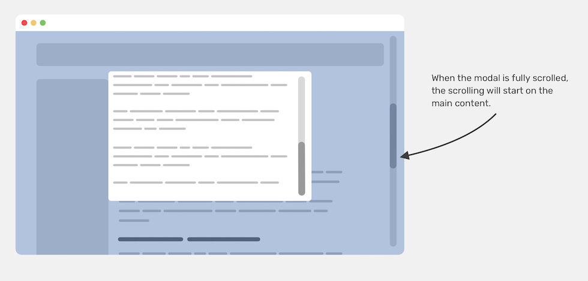
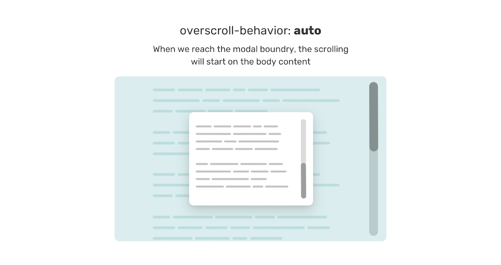
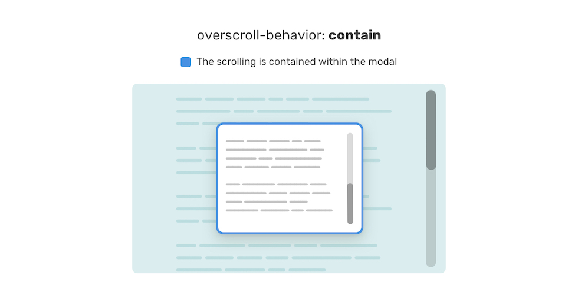
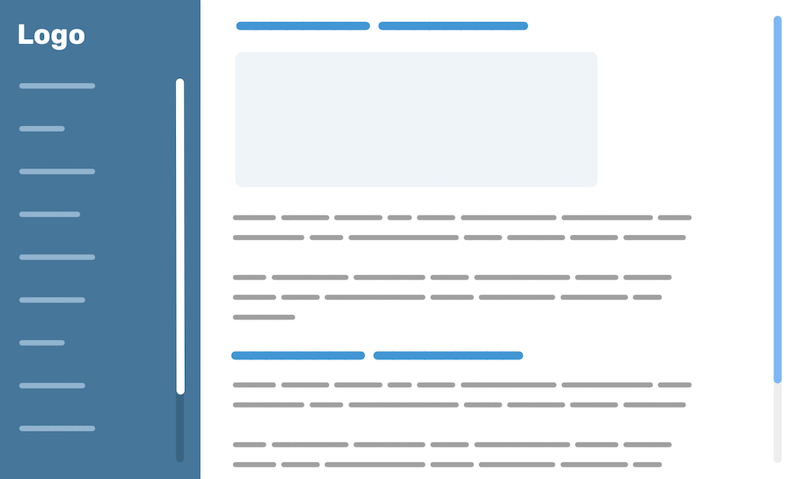
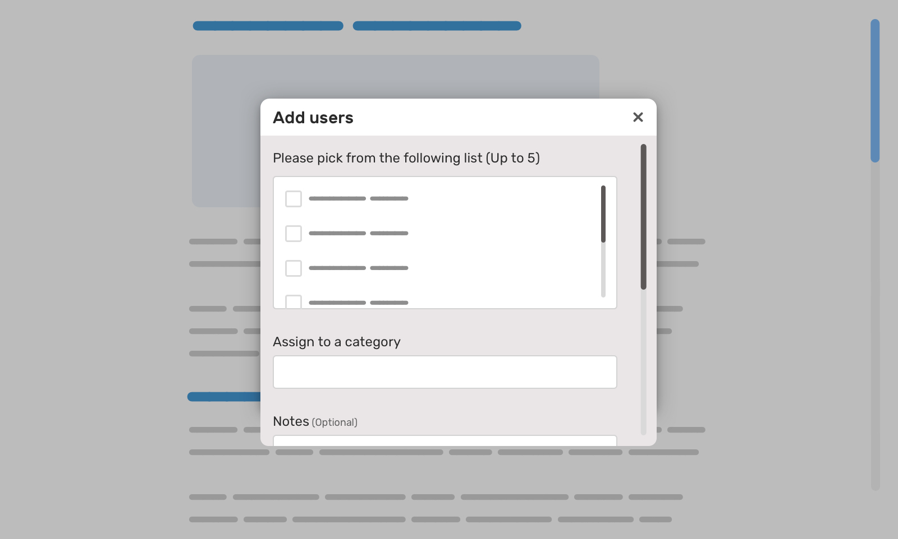
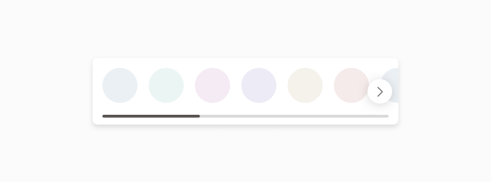

**出典元**：[ Prevent Scroll Chaining With Overscroll Behavior - Ahmad Shadeed ](https://ishadeed.com/article/prevent-scroll-chaining-overscroll-behavior/)


`position: fixed`の要素があるとしましょう。スクロールがある場合は、要素の下部の境界に到達すると、ブラウザはbody要素をスクロールし続けることに気付くでしょう。これは望ましくない混乱を招く効果です。ありがたいことに、CSSで修正できます。 この記事では、`overscroll-behavior` CSSプロパティ、それが解決する問題、その仕組み、および使用場所について説明します。


## はじめに

非常に一般的な問題を取り上げましょう。ビューポートの中央に配置されたモーダルダイアログがあります。そのモーダルの下に、実際のWebページのコンテンツがあります。


モーダルコンテンツの最後に到達すると、ブラウザは代わりにメインページのコンテンツをスクロールし続けます。これはスクロールチェーンと呼ばれます。これはデフォルトの動作であり、`overscroll-behavior`という新しいCSSプロパティでオーバーライドできるようになりました。



多くの場合、この動作は不要であり、ユーザーがモーダルコンテンツに集中できなくなる可能性があります。上の図では、モーダルの最後に到達したときに、ページがスクロールし続けていることに注目してください。


## 無理やり対応する
以前は、javascriptを介してbody要素に`overflow: hidden`を適用することでこれを修正していました。モーダルが開かれると、オーバーフローの適用を担当するクラスが本体に追加されます。

```css
body.modal-open {
 overflow: hidden;
}

.modal.is-open {
 display: block;
}
```
このやり方は、以前はデスクトップブラウザ間で完全に機能していましたが、iOS上のSafariでは動作しませんでした。これを機能させるには、body要素に`position: fixed`を追加する必要もあります。

```css
body.modal-open {
  position: fixed;
  overflow: hidden;
}
.modal.is-open {
  display: block;
}
```

これは機能しますが、ブラウザが一番上までスクロールし、ユーザーが手元のタスクから気をそらしてしまいます。これは、他の問題を引き起こす修正です。

ベン・フレインによる [記事](https://benfrain.com/preventing-body-scroll-for-modals-in-ios/) に固定されたものを除いて、私はその解決策を知りません。 ベンの記事のスニペットによると、モーダルがアクティブになったら、`<body>`要素に以下を追加する必要があります。


```css
.bg-scrolling-element-when-modal-active {
  /* when modal active */
  touch-action: none;
  -webkit-overflow-scrolling: none;
  overflow: hidden;
  /* Other browsers */
  overscroll-behavior: none;
}
```

2018年にクライアントプロジェクトに取り組んだことを覚えています。そこでは、iOSのモバイルメニューの本文のスクロールを防ぐことはできないと彼に話しました。

彼は：
> プログラミングで不可能なことは何もありません。解決策があると確信している。

といっていました。

「プログラミング？」と思うかもしれませんが、それはCSSを指します。多くのことを試して、研究し続けましたが、完璧な解決策はありませんでした。

それでは時間を遡って、`overscroll-behavior`をソリューションに紹介したいと思います。


## overscroll-behaviorについて
`overscroll-behavior`プロパティは、スクロール領域の境界に到達したときにブラウザが実行する処理を設定します。 Safariを除くすべての主要なブラウザで[サポートされています。プロパティは、`overscroll-behavior-x`および`overscroll-behavior-y`の省略形です。 `overscroll-behavior`を設定すると、両方の軸が設定されることに注意してください。

設定可能な値を見てみましょう。


### overscroll-behavior: auto
デフォルト値は `auto` で、これによりスクロールチェーンが可能になります。スクロール要素があり、その境界に達すると、ブラウザは`<body>`コンテンツをスクロールし続けます。






### overscroll-behavior: contain
その名前から、値`contain`には、要素の境界内にスクロールが含まれます。次の図では、スクロールは青い輪郭のラッパー内に含まれています。






### overscroll-behavior: none
`none`を設定すると、 `contains` と同様の効果があり、 **さらに** ページの上部または下部に達したときのバウンス効果を防ぎます。


## ユースケースと例
`overscroll-behavior` がどのように機能するかがわかったところで、いくつかの便利なユースケースを見てみましょう。


### モバイルナビゲーション
モバイルナビゲーションが長すぎる場合、スクロールが速すぎると、本文のコンテンツでスクロールチェーンの問題が発生する可能性があります。

次の図には、スクロール可能な長いナビゲーションリストがあります。


スクロールが含まれていない場合は、本文のコンテンツもスクロールします。それを避けることができます

```css
.nav {
  overscroll-behavior-y: contain;
  overflow-y: auto;
}
```
動画で見てみましょう。



ナビゲーションの下に表示される半透明の背景を追加しました。 `overscroll-behavior-y`プロパティをオフに切り替えたときの動作に注意してください。

オフに切り替えると、ボディスクロールが発生します。

ただし、ナビゲーションが短く（つまり、スクロールできない）、ユーザーが理由もなくスクロールしようとすると、`overscroll-behavior-y: contain`であっても、本文がスクロールすることに注意してください。



残念ながら、記事の冒頭で紹介した「無理やり対応」以外の修正方法はわかりません。


### サイドナビゲーション
`overscroll-behavior` のもう1つの便利な使用法は、サイドバーとメインがある場合です。その場合、サイドバーは固定されており、コンテンツが長すぎるとスクロール可能になる可能性があります。



サイドバーの端の境界に達したときにメインセクションがスクロールしないようにするには、次を追加する必要があります。

```css
.aside {
  overscroll-behavior-y: contain;
}
```


### チャットコンポーネント


Facebookに触発されたチャットコンポーネントは、 `overscroll-behavior` の完璧なユースケースです。これを使用して、最後に到達したときにボディがスクロールしないようにできます。

```css
.aside {
  overscroll-behavior-y: contain;
}
```


### モーダルコンテンツ

記事内で最初に行った例はモーダルなので、繰り返しません。ただし、モーダル内にリストが必要な場合があり、そのリストがスクロール可能である場合は、スクロールチェーンを発生させたくありません。



モーダルのオプションのリストに注意してください。これはスクロール可能なリストです。その境界に達すると、モーダルコンテンツがスクロールします。これを回避するには、 `overscroll-behavior` を使用します。

```css
.list-wrapper {
  overscroll-behavior-y: contain;
  overflow-y: auto;
  max-height: 130px;
}
```


### 水平リスト
Facebookのホームページでこのユースケースを見つけました。ユーザーのリストがあるセクションがあり、次の図に示すように水平方向にスクロールします。



これは`overscroll-behavior-x`のベストな使い方です。

```css
.list {
  overscroll-behavior-x: contain;
}
```

## まとめ
CSS `overscroll-behavior` は、何年も前に無理やり対応していた問題を解決する便利なプロパティです。


## オススメの書籍
{}


{}
