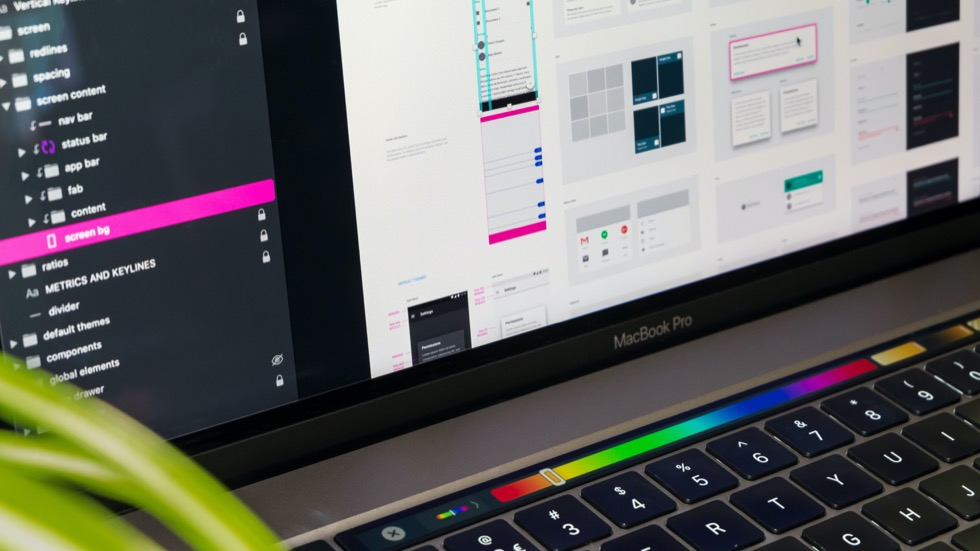

## はじめに
「未経験でもWebデザイナー、コーダーになろう」ではWebデザイナーやコーダーなどWeb業界を目指す方に、現役Webデザイナー兼コーダーができるだけわかりやすく、Webサイトをデザインしたり、作ったりする方法は情報を伝える講座です。
初心者の方、そうでない方など、いろいろな方大歓迎です。
まずはWebデザイナーやコーダーと言われる人たちがいる、Web業界の実際はこうだよというのをお伝えします。

### Web業界に入るためには未経験だと厳しい？

* 未経験だと厳しい？
* 学校で習わないと難しそう。

このようなことを思っているかもしれません。しかし、そんなことなありません。
Webで働いてみたいという気持ちとポートフォリオと呼ばれる作品集。
なにより少しでもできるてしまえば、入れる業界だと思います。

### 初期費用が色々かかる？

* パソコンを用意
* Photoshopなどの高いアプリを買う必要がある

こういったことで、初期費用が色々かかるかと思っている人も多いと思います。
今の時代は様々なWebサービスを駆使していろいろなことが無料でできます。

もちろん、パソコンを持っていたほうが作業は簡単かもしれませんが、iPhoneやiPad、廉価なChromeBookやWindowsなどでもデザインからコーディングまでできてしまいます。
特にiPhoneやiPadはデザインに特化することができると思います。

そういったサービスやコンテンツ、アプリを使用してデザインからコーディングを行って誰でも簡単に自分のサイトを持つことができるようになりました。
ほんといい時代になりましたね。

## WEBデザイナーとは

Webデザイナーと聞いてイメージするのは

* カッコいいサイトをデザインしている人
* 美的センスがいりそう
* Photoshopを使ってデザインをしている

と思うかもしれません。しかし、それが重要だと私は思いません。
もっと重要なのは「情報をわかりやすくして、配置する力」ではないかと思います。

### WEBデザイナーとは「情報をわかりやすくして、配置する人」
Webデザイナーと一般的なデザイナーの違いは「Webデザイナーは何かを表現するものではない」と言う点だと思います。
「Webデザイナーは情報をわかりやすくして、配置する人」こういうものではないかなと私は考えてます。

デザインする上で、大事なのはそれぞれの関係性はどうなっているかです。
それをわかりやすく伝える、そのためには関連性があるものは近くにあったほうがいい。
そうやって散らばっている情報と情報をつなげていく。それがWebデザイナーではないかと思います。

### Webコーダーは「Webデザインを表示して、使い勝手を作る人」
WebコーダーはWebデザインを実際にHTMLと言われる言語に書き換えて、CSSと呼ばれる言語でHTMLをお化粧していきます。

お化粧をしていく上で大事なのはGoogleやBingのクローラーと呼ばれるプログラムに拾われやすくするということを意識しなければなりません。
これを **SEO** といいますが、今は知らなくても大丈夫です。
簡単に言えば、ネットという広い海に出すためにわかりやすい地図を作ってくれる人にわかりやすく伝えるということです。

デザイナーは見た目を作っていきますが、コーダーは使い勝手を作っていると言ってもいいのかもしれません。

その他にも、Javascriptと呼ばれる言語を使って動きやいろいろな処理を行う場合もあります。

## Webデザイナーとコーダーは別のほうがいい？
Webデザイナーとコーダーが別々の作業を行って、もう片方の仕事内容を知らないでもいいかといえば、そうではありません。相互に理解していたほうがいいと思います。

### Webデザイナーがコーディングを知らない場合
例えば、Webデザイナーがボタンを押したときや開閉機能をつけたときの挙動をデザインしたとします。その場合の動作は誰が考えるのでしょう？
多くの場合はデザイナーの頭の中に「ふわっと出したい」や「回転しながら出したい」といった考えがあるかと思います。スライドするコンテンツについても同様です。
その際に、コーディングを知らなかったら指示を出せずに、コーダーの解釈でデザインが行われてしまいます。

### Webコーダーがデザインを知らない場合
逆にコーダーがデザインを知らないと、どうでしょうか。
小さなデザインを見落として、デザイナーが作ったものと違うものが出来上がってしまうかもしれません。
小さなデザインだったら気にならないのでは？と思うかもしれませんが、デザインではその違いが大きな違いにつながったりします。

### お互いに知ることが大事
お互いのことを知っていることで、仕事の効率も上がると思いますし、デザイナーはそのうち「自分で書いたほうがより良いデザインができる」と考え、コーダーは「なんかデザインがおかしいから、デザインから自分でやってみる」といったことも往々にしてあります。
わたしはそうでした。

特にWebのコンテンツはいろいろなことができてしまうので、知っているのと知らないのでは雲泥の差になります。

{}
両方できるメリット
: Webデザインとコーディングが両方できると、なんとアプリを作ることができてしまいます。なので、自分の力を増やしていくために、片方だけではなくデザインとコーディング、両方の力を養っていったほうが断然いいですね。
{}

## Webデザイナーとコーダーに重要なこと
Webデザイナーとコーダーになる上で特に大事なことが2点あります。

- サイトのターゲットは誰なのか
- サイトの最終的なゴール地点はどこなのか
- サイトの使い勝手はいいか
- 必要としている情報に簡単にアクセスできるか
- サイトのやブランドの持つイメージ

上記のようなことに注意して、デザインやコーディングを行っていく必要があります。

例えば、若者向けのサイトなのに、すごく文字が大きかったり、その逆などは使う側にとってのストレスとなってしまいます。
デザインで言えば **配色** や **文字サイズ** には特に気をつける必要があります。
コーダーで言えば **対象としているブラウザで崩れがないか** や **動きがうるさくないか** といったことに気をつける必要があります。

{}
UXとは？
: UX（User eXperience）といいます。日本語ではユーザー体験となりますね。ユーザーのストレスにならないようにすることを、Webを通してユーザーに快適な空間や体験を与えるということです。
{}

## 次回の予定
次回からはまず、簡単なWebデザインをしていきたいと思います。
といっても、いきなりデザインを行うのは大変なのでまずは既存のサイトや、簡単な1ページのサイトの大枠を作成できたらなと思います。

それではまたの講座で会いましょう。

## おすすめの書籍
{}

{{% amazon title=" 1冊ですべて身につくHTML & CSSとWebデザイン入門講座 " url="https://www.amazon.co.jp/1冊ですべて身につくHTML-CSSとWebデザイン入門講座-Mana/dp/4797398892/?tag=nlpqueens09-22" summary=` 【全国の書店員さんがオススメする本「CPU大賞」第1位受賞!】

ずっと、一番売れているHTML本!
Web界隈やデザイナーに大人気! Web関連の情報やデザインについて記事が学べる『Webクリエイターボックス』の管理人、 Manaによる渾身のHTML & CSSとWebデザインが学べる本です。
著者は、カナダやオーストラリア、イギリスの企業でWebデザイナーとして働き、現在は全国各地でWeb関連のセミナーに登壇し、Webサイト制作のインストラクターとして教育に携わっている。ブログ「Webクリエイターボックス」は2010年日本のアルファブロガーアワードを受賞。` imageUrl="https://images-fe.ssl-images-amazon.com/images/I/51xAu2jeqrL.jpg" %}}

{}

