**出典元**：[Web design trends for 2022 | Layout](https://getflywheel.com/layout/web-design-trends-2022/)

この2年間で学んだことは、私たちは常に新しいものに適応し続けなければならないということです。2022年に向けて、デザイナーは人生のカオスを受け入れ、それをデザインで表現し始めています。

2022年のトレンドは、より大胆で、よりクリエイティブで、よりインタラクティブなデザインに移行しています。クリエイターは、より破壊的なものに傾倒し、「良い」ウェブデザインとされるものの境界を押し広げようとしています。

2022年に期待されるトレンドを取り入れ、新しい年のクリエイティビティを高めてください。

## インタラクティブなミニサイト

あなたの実力をアピールしてください。専門性の高いコンテンツとインタラクションで、小規模で統制のとれた環境でスキルを発揮することは、デザイナーが新しいクライアントを獲得するための1つの方法です。また、潜在的な顧客に対しては、「作ることを楽しむ」ことで、オンリーワンの体験を提供できることをアピールしています。

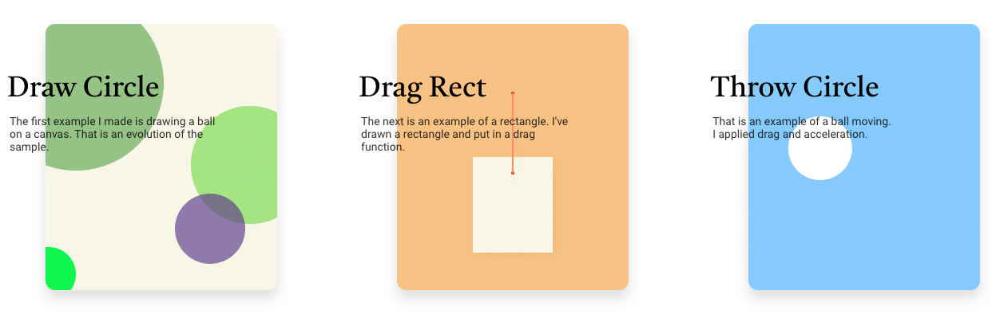

韓国の開発者、Jungik Leeが制作した、3つの簡単なタスクのいずれかをクリアする[ミニサイト](https://canvas.jjangik.com/?ckattempt=1)です。たくさんの色と簡単な操作で、いろいろなものを作ったり動かすことができ、カラフルな丸でページが埋め尽くされる様子は、実に楽しいものです。

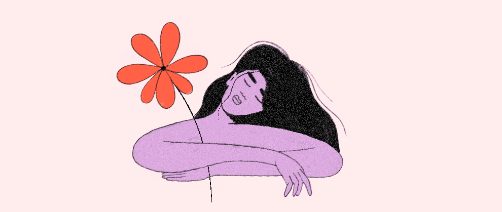

アムステルダム在住のウェブデザイナー、ヴィクトワール・ドゥイさんの[小さなポートフォリオサイト](https://victoiredouy.com/) では、インタラクティビティを駆使して人々の関心を集めています。カーソルを動かすだけで、色を変えたり、糸を引っ張ったり、オブジェクトを動かしたりできます。

## レトロな雰囲気のあるデザイン
米国のWebデザイナーの平均年齢は37歳で、ミレニアル世代に位置づけられます。ミレニアル世代はインターネットを日常的に利用するようになった最初の世代ですから、多くのデザイナーがウェブ創成期に流行したアートやタイポグラフィー、カラーに影響を受けているのは当然といえば当然でしょう。

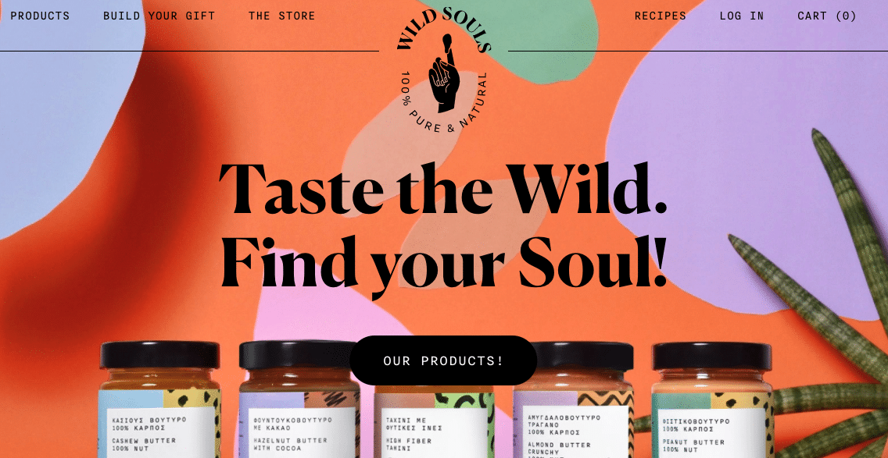

[Wild Souls](https://www.wildsouls.gr/en)のEコマースサイトは、カラフルなシェイプと重なり合うスタイルで、食品会社にふさわしい楽しくて活気のある美学を表現しています。 ナッツ、ナッツバター、ハチミツ、マーマレードの専門店で、商品の上にカーソルを置くと、90年代にインスパイアされたビジュアルテーマをもとに、新しい質感や形がセンスよく追加されます。

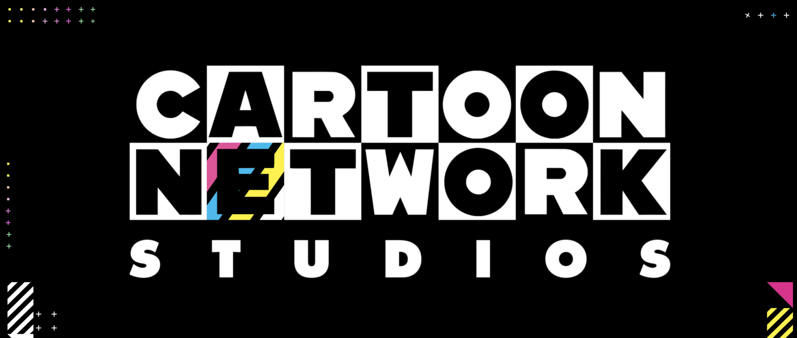

[カートゥーン ネットワーク](https://www.cartoonnetworkstudios.com/)は、白と黒を基調とし、大胆な色使いと楽しいアニメーションで、レトロでありながらトレンドを押さえたサイトです。

## オープンコンセプトデザイン
この大流行が、私たちのデザイン嗜好にも影響を与えているのかもしれません。なぜなら、デザインに多くのオープンスペースを設けるという新たなトレンドが生まれたからです。6フィート（約3.5メートル）とはいかないまでも、デザイナーはセクション間のスペースをどんどん広げ、見出しに集中し、時にはヒーロー画像を完全に削除してユーザーに十分なスペースを与えています。

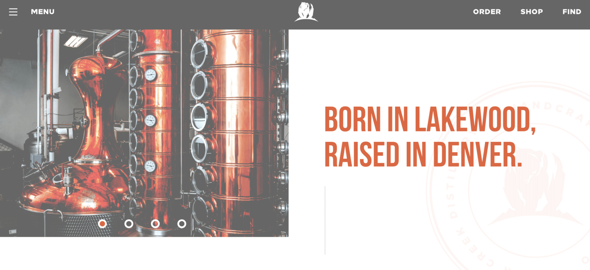

どんな種類の蒸留酒もシャープでキレがあり、コロラド州デンバーにあるベア・クリーク蒸留所のウェブサイトも、余計な添加物を排除しています。ウェブサイトのデザインコンセプトは、彼らが精製するウォッカ、バーボン、ラム、ウイスキーと同様にクリーンです。

[アタルソン](https://atlason.com/) は、ニューヨークを拠点に、プロダクトとパッケージのデザイン、素材調達、製造を行っている会社です。サステナビリティは彼らのプロセスの中核であり、クリーンな製造という考え方は、ホワイトスペースの使用によってサイトでも視覚的に反映されています。このオープンスペースにより、デザインされた製品にスポットライトが当たり、画像上のホバー効果により、製品の概要や企業価値の説明が表現されています。

## より多くのカスタマイズ
ユーザーがオンライン上で時間とお金を費やす機会が増えるにつれ、プロバイダーはより幅広い層のユーザーにアピールするための新たな方法を見出しています。そのため、多くのプロバイダーは、サイトやアプリで利用できるパーソナライゼーションのレベルを高め、すべてのサイトが従うべき標準的なアクセシビリティのベストプラクティスを超える[インクルージョン機能](https://www.impactplus.com/blog/inclusive-ux-examples)の大幅な改善を行っています。

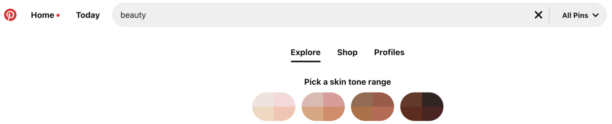

[Pinterest](https://www.pinterest.com/) の「ビューティー」カテゴリは、サイト内でもっとも検索されているカテゴリの1つであり、同社はすべてのユーザーに対してより包括的に対応する必要性を認識していました。Pinterestは現在、「skin tone range」機能を提供することで、このカテゴリーにおいてより速く、よりパーソナライズされた体験を生み出しています。多くのユーザーにとって、これはアプリ上の明るい肌色の過飽和状態に対する答えであり、すべてのPinterestユーザーがより迅速かつ容易に自分に合った外見を見つけることができるようになりました。

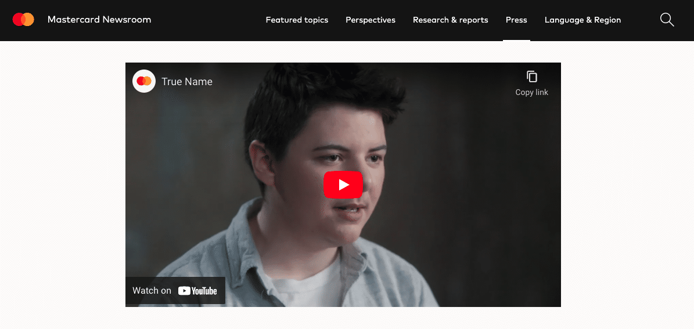

Mastercardは、「[True Name](https://www.mastercard.com/news/press/news-briefs/it-s-time-to-enable-people-to-use-their-true-name-on-cards/)」システムを構築することで、より多くのカード会員が取引時に自分の本当のアイデンティティを表現できるようにする方法を見出しました。これにより、トランス系やノンバイナリのMastercard保有者は、法的に名前が変更されているかどうかにかかわらず、デッドネームの代わりに本名をカードに記載することができるようになりました。

## 3Dオブジェクト、2Dスクロール
3Dモデルを使ったデザインと、フラットな2Dのコンテンツ表現は、説得力があり、完全に一体化しているように見えます。インタラクティブな3D要素を背景に、消化しやすいコンテンツを予測可能な方法で提示することは、ユーザーが物理的な概念をよりよく理解するためにとくに有効です。

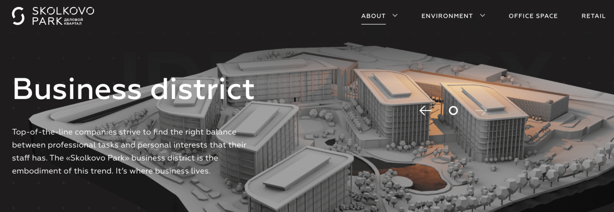

ロシア・モスクワの中心部に位置するこの新しいビジネス街のプロモーションサイトは、3Dのセンターピースとシンプルでフラットなコンテンツに焦点を当てた素晴らしい例です。トップページには[スコルコボ・パーク](https://skolkovoforbusiness.ru/en/features/#home)の可動式模型が表示されていますが、目立つように配置されたコンテンツの影に隠れることはありません。

[One Ocean Science](https://oneoceanscience.com/)は、海洋保全と研究のグローバルリーダーを学際的な視点でつなぐことを目的とした、知識共有型のサミットです。ホームページでは、地球の3Dモデルの上を2Dでスクロールし、スクロールに合わせてさまざまな地域とそこで行われている研究を強調することでユーザーに情報を与えてます。

## ブルータリズム・ライト
ブルータリズムとは、非常にブロック的で幾何学的な、厳しい芸術や建築のスタイルを指します。[ウェブデザイン](https://uxdesign.cc/brutalist-web-design-is-taking-over-the-internet-fee3c66139b5)では、従来のルールにとらわれず、ミニマリズムを追求した、大胆かつシンプルなスタイルが目立ちます。白と黒を基調としたサイトが多く、装飾はほとんどなく、文字も太く、峻厳な仕上がりになっているのが特徴です。

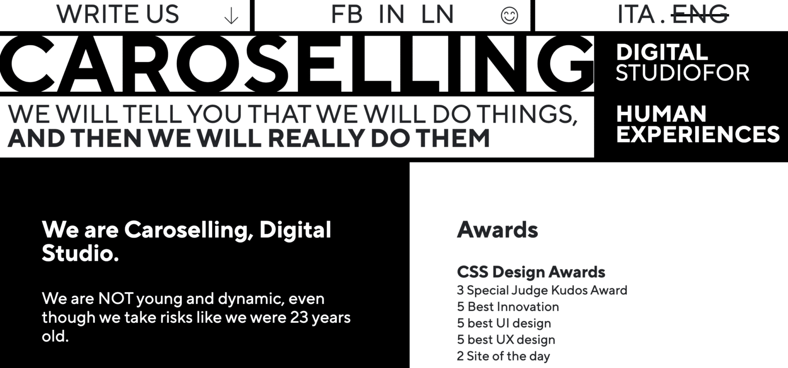

イタリアのクリエイティブ・エージェンシー、[カロセリング](https://www.caroselling.it/en/)のブランド・アイデンティティは、正直で率直であることです。現実的な期待値を設定し、戦略の影響を考え抜き、クライアントの時間的・予算的制約を尊重することを信条としています。ブルータリスティックなサイトは、飾り気のない代理店のパートナーとしての彼らのストーリーを表現するのに役立っています。

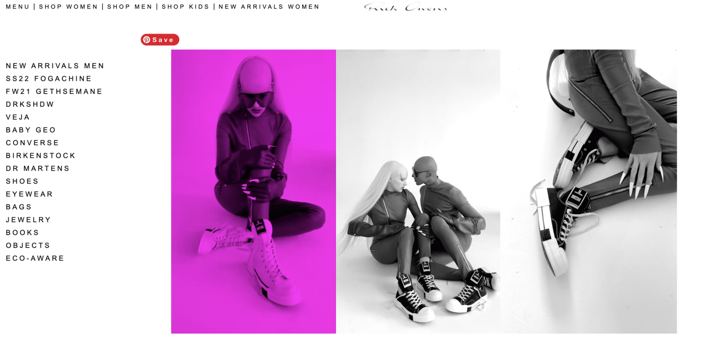

パリを拠点とするカリフォルニア生まれのデザイナー、リック・オウエンスは、かつて[自身の家具デザイン](https://amuse.vice.com/en_us/article/d3jpqj/interview-rick-owens)に対する哲学を "ブルータリズムの洞窟の中でブルータリズムの火のそばのブルータリズムの岩の上に立つ毛皮 "と表現したことがあります。彼の服やアクセサリーラインのウェブサイトには、家具はありませんが、イメージやレイアウトに明確なブルータリズムのインスピレーションを感じることができます。

## ガラスモルフィズム
[グラスモーフィズム](https://uxdesign.cc/glassmorphism-in-user-interfaces-1f39bb1308c9) とは、その名の通り、画面がガラスでできている、あるいはガラスで覆われているかのように見せる技術で、一般的にはユーザーインターフェイスの背景をぼかすために使用されます。2022年には、デザイナーがガラスのようなアニメーションオブジェクトやテキストを作成し、フロントエンドの境界を押し広げることで、このトレンドはさらに人気を集めると思われます。

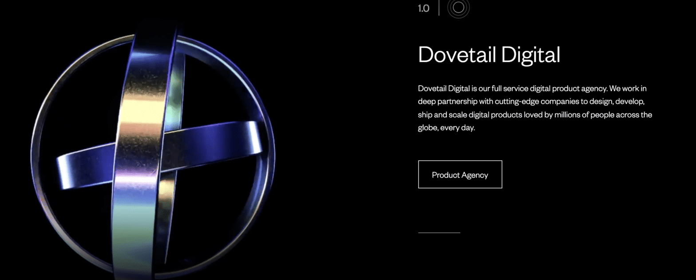

デジタル製品エージェンシーの [Dovetail Studios](https://dovetailstudios.com/) は、異なる角度で回転する入れ子のリングのGlassmorphicセットをアニメーション化しました。目を引くとともに、彼らの3Dモデリング能力の高さがうかがえます。サイト内の他のアイコンも、この効果を反映しています。

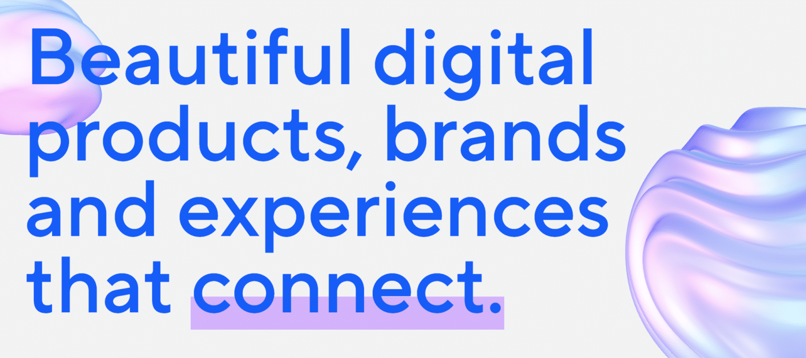

同じくデジタル・クリエイティブ・エージェンシーの[Lo and Behold Studios](https://loandbehold.studio/) も、ホームページでGlassmorphicのアニメーション・オブジェクトを使用しています。しかし、全体的に明るいテーマであるため、ユーザーがDovetailのサイトを見たときに感じる印象とはまったく異なるものとなっています。

## クリエイティブなスクロール効果
多くのデザイナーは、昨年の横スクロールのトレンドを発展させ、さらにスクロールの効果を試しています。水平、横、多方向のいずれであっても、ユーザーがサイト内を移動する方向を変えることは、全体としてよりダイナミックな体験をユーザーに与える簡単な方法です。

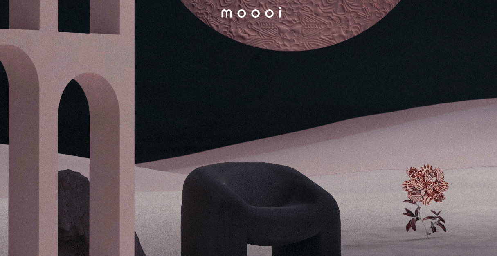

オランダの家具メーカー [Moooi](https://www.moooi.com/us/a-life-extraordinary) は、ユーザーがスクロールするにつれて、コレクションの奥深くに入り込んでいきます。同社のサイトでは、3つの体験ができます。美しく咲き、重力に逆らっていくまるで紙芝居のような体験です。それぞれ、画面を開くとコレクションが次々と現れ、スクロールするたびに新しいパターンや飾り模様に飛び込んでいきます。

写真家のKayla Fisherさんの [サイト](https://kaylafisherphotography.com/) では、サイドバイサイドスクロールで、メニューは画面の左側にべったりと配置されています。これによって、ユーザーにより深く入り込んでもらうための大きなボタンを見失うことなく、視覚的に魅力的な方法で彼女の作品を見ることができます。

## 特大のタイポグラフィ
ウェブサイトは、企業としてのあり方を大胆に表現するものであるべきです。多くの企業がこの考えを真摯に受け止め、見出しに特大のタイポグラフィを使用したり、ヒーロー画像（キャッチ画像）の代わりに使用したりしています。

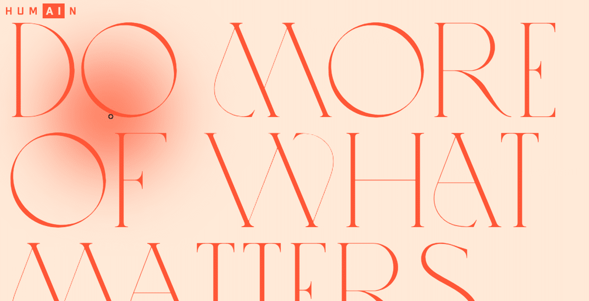

テクノロジー研究集団 [HUMAIN](https://www.humain.ai/) は、人間の体験と技術革新の間のギャップを埋めるために活動しています。クロノス・グループの支援を受け、オンラインと生活の両方で人間の経験を向上させるために新技術を使用する新しい方法を見つけることを目的としています。複雑なストーリーを持つこの企業は、ヒーロー画像の代わりにテキストを使用することで、サイトに入った瞬間からその使命を訴えています。

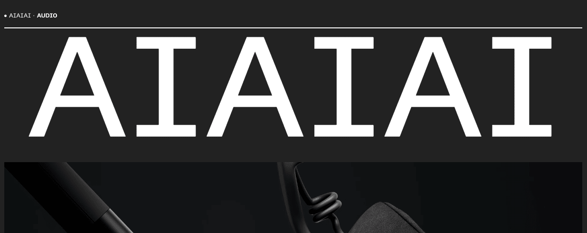

ヘッドホンといえば、視覚的なものと同じくらい聴覚的なアイデアが思い浮かびます。ヘッドホンメーカーの [AIAIAI](https://aiaiai.audio/) の社名は、名前と同じくらい感嘆詞で、サイトを訪れたユーザーに大胆な主張を叫んでいます。大きなテキストで会社を紹介した後、折り返しのすぐ下の小さなヒーローに隣接した動画が表示され、ヒーロー画像→テキストという従来のパターンを崩しているのです。

## 可視化された境界線
目に見えるボーダーは、デザインに構造を与え、コンテンツを通してユーザーの注意を引きつけます。シンプルな線だけで構成されるボーダーは、整然としたサイトを必要とするクライアント向けのデザインに役立ちます。一方、ファンキーでインタラクティブなボーダーは、大胆な色使いやインタラクティブな効果によって、オンライン訪問者にさらなる視覚的な興味を与えることができます。

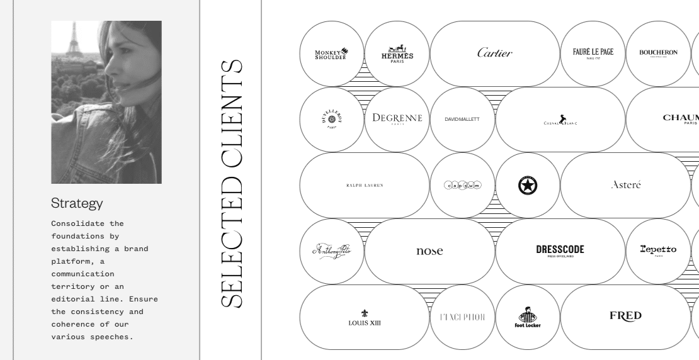

独立機関である [Bonjour Paris](https://bonjour.paris/en) は、可視化されたボーダーと水平スクロールを組み合わせることで、ミニマルでありながら興味をそそるサイトになっています。線状のボーダーは、サイト全体からプロジェクトセクションまで続き、曖昧で忙しい印象を与えることなく、新しい形を生み出しています。

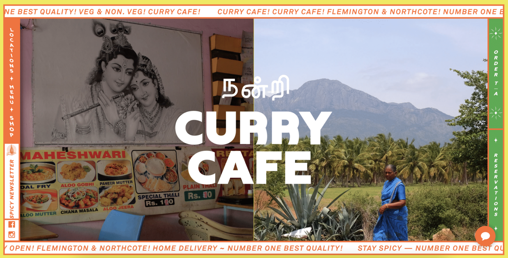

オーストラリアのレストラン「Curry Cafe」は2つの店舗を持ち、サイトのスクロールボーダーは、ユーザーがカラフルで魅力的な他のコンテンツを消費するための強固なフレームワークを提供します。

## 抽象的なビジュアルを持つコラージュ部品
ウェブが始まってから、私たちは長い道のりを歩んできました。あるデザイナーは構造化された美学を受け入れ、またあるデザイナーは逆の方向に進んでいます。大胆な色使い、重なり合う画像、複数のテクスチャーなど、それぞれの要素が丁寧にデザインされていれば、シームレスに融合することができるのです。

[Illuminating Radioactivity](https://illuminating-radioactivity.com/) は、 [スティムソンセンター](https://www.stimson.org/) 、 [Reinventing Civil Defenseプロジェクト](https://reinventingcivildefense.org/)  、 [Bombshelltoe Policy x Arts Collective]https://bombshelltoe.com/ が共同で作成した教育用ウェブサイトです。放射能」という言葉の歴史や意味、私たちの連想、そして放射能が科学、娯楽、医療などの分野でどのような役割を担ってきたのかが紹介されています。スクロールすると、歴史を物語る古い写真と、鮮やかで抽象的な形状の組み合わせが目に飛び込んできます。

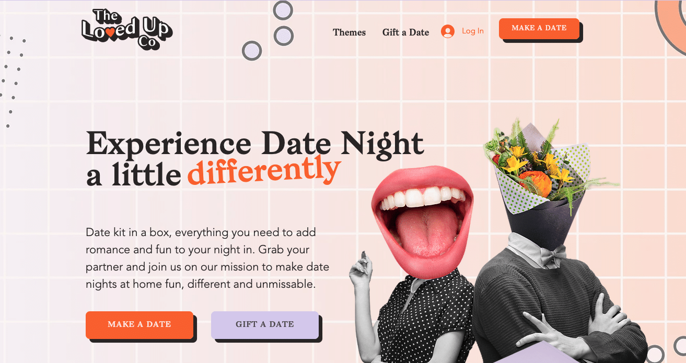

オーストラリアのThe Loved Up Coは、パートナーとの夜の生活に必要なものがすべて揃った便利なキットで、デートの夜を華やかにするお手伝いをしています。ホームページでは、白黒写真のボディに、笑顔の口元や花、カクテルを組み合わせたコラージュ風の人物を掲載。また、抽象的な形や円、ジグソーパズルを随所に配し、コンテンツの中で視線を動かし続けています。

## ウェブの未来をデザインする
これらのトレンドに注目し、気になるコンセプトを試してみてはいかがでしょうか。2022年のウェブデザインのトレンドは、昨年のトレンドの延長線上にあることにお気づきの方もいらっしゃるのではないでしょうか。

気に入ったものはありましたか？私たちが見逃しているものがあれば、教えてください。そして、残るスタイルも流行り廃りも、デザイナーが今年、クライアントと一緒に何を作るかにかかっていることを忘れないでください。

## 書籍の紹介
{{% amazon

title="UNIXという考え方―その設計思想と哲学 単行本 – 2001/2/23"
url="https://www.amazon.co.jp/UNIX%25E3%2581%25A8%25E3%2581%2584%25E3%2581%2586%25E8%2580%2583%25E3%2581%2588%25E6%2596%25B9%25E2%2580%2595%25E3%2581%259D%25E3%2581%25AE%25E8%25A8%25AD%25E8%25A8%2588%25E6%2580%259D%25E6%2583%25B3%25E3%2581%25A8%25E5%2593%25B2%25E5%25AD%25A6-Mike-Gancarz/dp/4274064069/ref=sr_1_1?keywords=unix%25E3%2581%25A8%25E3%2581%2584%25E3%2581%2586%25E8%2580%2583%25E3%2581%2588%25E6%2596%25B9&amp;qid=1667786898&amp;qu=eyJxc2MiOiIxLjEwIiwicXNhIjoiMC4zOSIsInFzcCI6IjAuMzEifQ%253D%253D&amp;sprefix=unix%25E3%2581%25A8%25E3%2581%2584%25E3%2581%2586%252Caps%252C257&amp;sr=8-1&_encoding=UTF8&tag=nlpqueens09-22&linkCode=ur2&linkId=0249eb4cab50d700fb6949eb9aeafef1&camp=247&creative=1211"
imageUrl="https://m.media-amazon.com/images/I/518ME653H3L._SX330_BO1,204,203,200_.jpg"
summary=`   UNIX系のOSは世界で広く使われている。UNIX、Linux、FreeBSD、Solarisなど、商用、非商用を問わず最も普及したOSのひとつであろう。そしてこのOSは30年にわたって使用され続けているものでもある。なぜこれほど長い間使われてきたのか？ その秘密はUNIXに込められた数々の哲学や思想が握っている。
   そもそもUNIXはMulticsという巨大なOSの開発から生まれたものだ。あまりに巨大なMulticsはその複雑さゆえに開発は遅々として進まず、その反省からケン・トンプソンが作ったのがUNIXの初めとされる。その後デニス・リッチーら多数の開発者が携わり、UNIXは発展した。本書はこのUNIXに込められた「思想と哲学」を抽出し、数々のエピソードとともにUNIXの特徴を浮き彫りにしていく。

   たとえば本書で述べられているUNIXの発想のひとつとして「過度の対話式インタフェースを避ける」というものがある。UNIXのシステムは初心者には「不親切」なつくり、つまり親切な対話式のインタフェースはほとんどなく、ユーザーがコマンドを実行しようとするときはオプションをつける形をとっている。この形式はオプションをいちいち覚えねばならず、初心者に決してやさしくない。しかしこれはプログラムを小さく単純なものにし、他のプログラムとの結合性を高くする。そして結果としてUNIXのスケーラビリティと移植性の高さを支えることになっているのだ。このような形式で本書では9つの定理と10の小定理を掲げ、UNIXが何を重視し、何を犠牲にしてきたのかを明快に解説している。

   最終章にはMS-DOSなどほかのOSの思想も紹介されている。UNIXの思想が他のOSとどう違うかをはっきり知ることになるだろう。UNIXの本質を理解するうえで、UNIX信者もUNIX初心者にとっても有用な1冊だ。（斎藤牧人）`
%}}

{{% amazon

title="詳解 シェルスクリプト 大型本  2006/1/16"

url="https://www.amazon.co.jp/gp/proteect/4873112672/ref=as_li_tl?ie=UTF8&camp=247&creative=1211&creativeASIN=4873112672&linkCode=as2&tag=nlpqueens09-22&linkId=ef087fd92d3628bb94e1eb10cb202d43"

summary=`Unixのプログラムは「ツール」と呼ばれます。
Unixは、処理を実現するために複数の道具(ツール)を組み合わせる「ソフトウェアツール」という思想の下に設計されているためです。
そしてこれらツールを「組み合わせる」ということこそがUnixの真髄です。
また、シェルスクリプトの作成には言語自体だけでなくそれぞれのツールに対する理解も求められます。
つまり、あるツールが何のためのものであり、それを単体あるいは他のプログラムと組み合わせて利用するにはどのようにすればよいかということを理解しなければなりません。
本書は、Unixシステムへの理解を深めながら、シェルスクリプトの基礎から応用までを幅広く解説します。
標準化されたシェルを通じてUnix(LinuxやFreeBSD、Mac OS XなどあらゆるUnix互換OSを含む)の各種ツールを組み合わせ、
目的の処理を実現するための方法を詳しく学ぶことができます。
`
imageUrl="https://m.media-amazon.com/images/I/51EAPCH56ML._SL250_.jpg"
%}}

{}

{{% amazon

title="[改訂第3版]シェルスクリプト基本リファレンス ──#!/bin/shで、ここまでできる (WEB+DB PRESS plus) 単行本（ソフトカバー）  2017/1/20"

url="https://www.amazon.co.jp/gp/proteect/4774186945/ref=as_li_tl?ie=UTF8&camp=247&creative=1211&creativeASIN=4774186945&linkCode=as2&tag=nlpqueens09-22&linkId=8ef3ff961c569212e910cf3d6e37dcb6"

summary=`定番の1冊『シェルスクリプト基本リファレンス』の改訂第3版。
シェルスクリプトの知識は、プログラマにとって長く役立つ知識です。
本書では、複数のプラットフォームに対応できる移植性の高いシェルスクリプト作成に主眼を置き、
基本から丁寧に解説。
第3版では最新のLinux/FreeBSD/Solarisに加え、組み込み分野等で注目度の高いBusyBoxもサポート。
合わせて、全収録スクリプトに関してWindowsおよびmacOS環境でのbashの動作確認も行い、さらなる移植性の高さを追求。
ますますパワーアップした改訂版をお届けします。`
imageUrl="https://m.media-amazon.com/images/I/41i956UyusL._SL250_.jpg"
%}}

{{% amazon

title="新しいシェルプログラミングの教科書 単行本"

url="https://www.amazon.co.jp/gp/proteect/4797393106/ref=as_li_tl?ie=UTF8&camp=247&creative=1211&creativeASIN=4797393106&linkCode=as2&tag=nlpqueens09-22&linkId=f514a6378c1c10e59ab16275745c2439"

summary=`エキスパートを目指せ!!

システム管理やソフトウェア開発など、
実際の業務では欠かせないシェルスクリプトの知識を徹底解説

ほとんどのディストリビューションでデフォルトとなっているbashに特化することで、
類書と差別化を図るとともに、より実践的なプログラミングを紹介します。
またプログラミング手法の理解に欠かせないLinuxの仕組みについてもできるかぎり解説しました。
イマドキのエンジニア必携の一冊。

▼目次
CHAPTER01 シェルってなんだろう
CHAPTER02 シェルスクリプトとは何か
CHAPTER03 シェルスクリプトの基本
CHAPTER04 変数
CHAPTER05 クォーティング
CHAPTER06 制御構造
CHAPTER07 リダイレクトとパイプ
CHAPTER08 関数
CHAPTER09 組み込みコマンド
CHAPTER10 正規表現と文字列
CHAPTER11 シェルスクリプトの実行方法
CHAPTER12 シェルスクリプトのサンプルで学ぼう
CHAPTER13 シェルスクリプトの実用例
CHAPTER14 テストとデバッグ
CHAPTER15 読みやすいシェルスクリプト
`
imageUrl="https://m.media-amazon.com/images/I/41d1D6rgDiL._SL250_.jpg"
%}}

