iPhoneやiPadなどのスマホ、タブレットは持ち運びに非常に便利です。パソコンよりも軽く、パソコンと同等の機能を備えてます。
そうした端末を使って記事が投稿できたら、スタバやドトールなどのカフェでコーヒーを飲みながら記事を書くことができてしまいます。

今回は、AmazonのEC2上にあるHugoのブログをiPadを使って更新して見たいと思います。

## iPhoneやiPadでターミナルを使う
iPhoneやiPadにも数多くの素晴らしいターミナルアプリがあります。
その中でも私が使っているのは[Termius: Terminal & SSH client](https://apps.apple.com/jp/app/termius-ssh-client/id549039908)というアプリです。

このアプリはターミナルの機能を持っており、SSHでのサーバ接続も可能です。もちろんログインの際にpemファイルなどを使用することも可能です。

基本的な機能は無料で使用できるので、まずはインストールをしてみましょう。

## 初期設定
起動すると、アカウントの登録が必要かと思いますが、必要ありません。

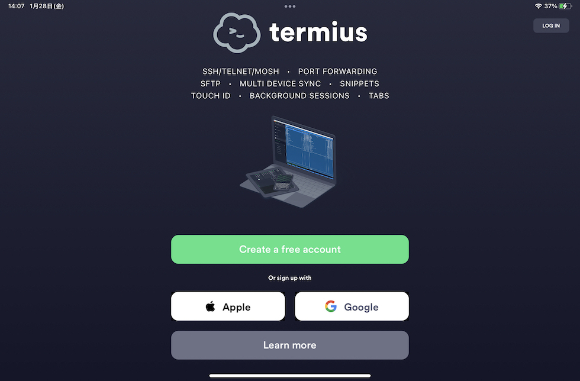

下にある「Learn more」を押して、「Continue without account」にてログイン無しで使えます。

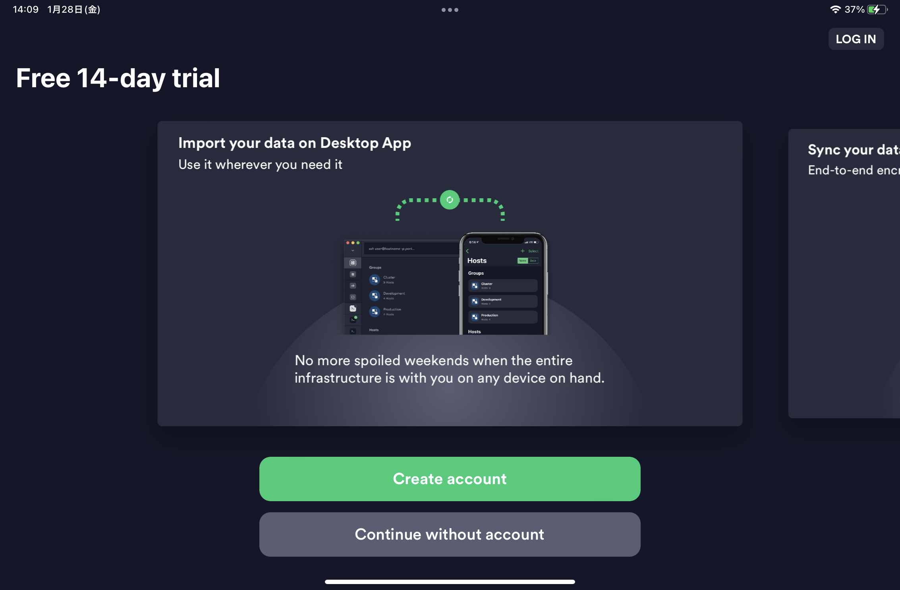

課金すると様々な機能を使えるようになるので、そういった機能でより便利に使いたい人は是非、課金してください。

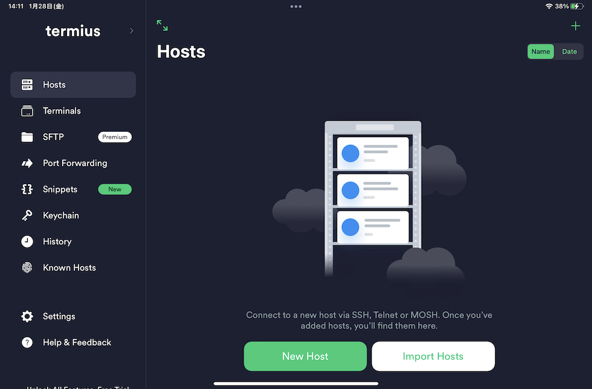

インストールが終わったら「New Hosts」をタプして、ログインしたいサーバを追加するか、「Hosts」メニューの右上にある「＋」ボタンを押してサーバを追加します。

Alias には自分がわかりやすい名前をつけます。
Hostname にはサーバのドメイン名やIPアドレスを入力します。
Port はSSHを使うときのポートです。
そして、ユーザー名とパスワードを使っている人はパスワードを入力します。
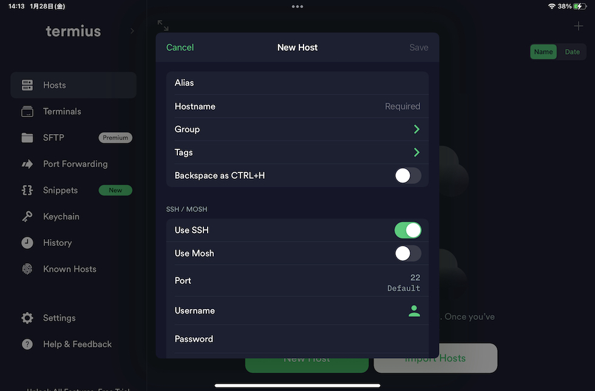

pemファイルを使っている人は、pemの内容をコピーして貼り付けるか、パソコンからpemを送信します。
送信はパソコンでiPadなどを接続して、ファイルタブから贈りたいpemファイルをドラッグ・アンド・ドロップします。
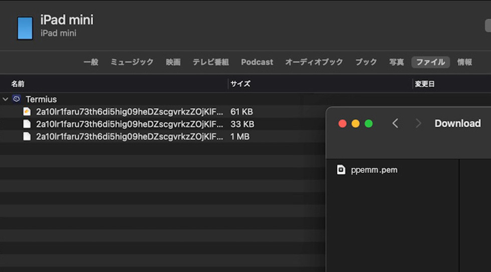

pemファイルをiPadに送り終わったら、Keyを押して、左上の「+」「Import Key」にて先程送ったファイルを選択します。
これでキーが設定されました。

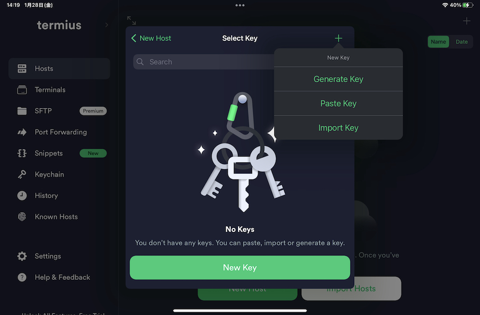

ここまで設定できたら、左上の「Save」にて保存しましょう。
以上でサーバに接続する準備ができました。

## サーバに接続
Alias に設定した名前でアイコンが作成されているかと思います。
そのアイコンを押すと、know hostsに登録するかどうか聞かれるので、「Continue」を押して追加します。
うまく設定できていたらサーバに接続できると思います。
できない場合は、アイコンを長押しして、「Edit」にて情報を正しいものに修正しましょう。

## Tabはどうするの？
SSHではtabコマンドで入力の補完を設定しているケースがあるともいます。
iPadにはタブというキーがありません。さて……どうしたものでしょうか。Termius はそこもよく考えられていて、通常であれば画面をタブルタップすると「Tab」と一瞬表示されてタブキーを押したときと同様のことが行なえます。

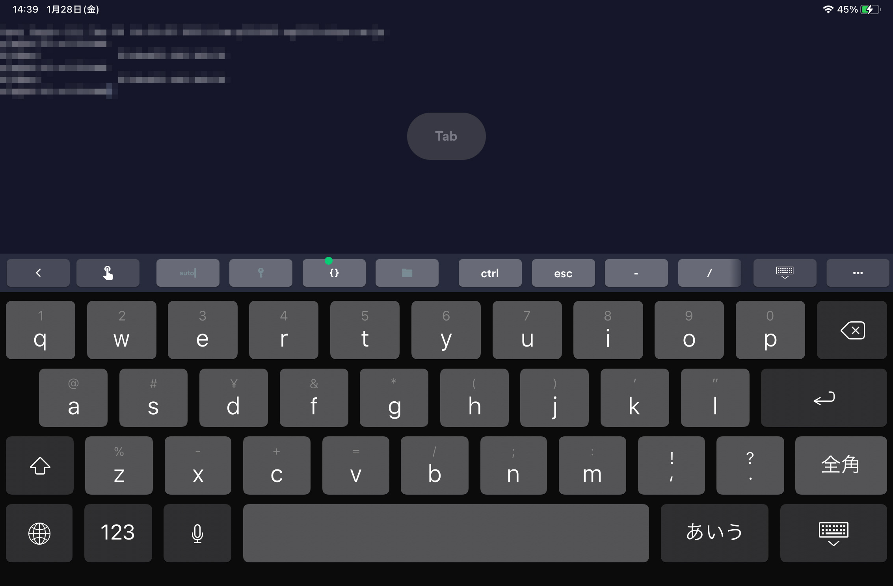


その他にも、キーボードの上にある「…」マークを押して、「ギアーアイコン」を押すと初期のキーボード上部のボタンを変更することが可能です。

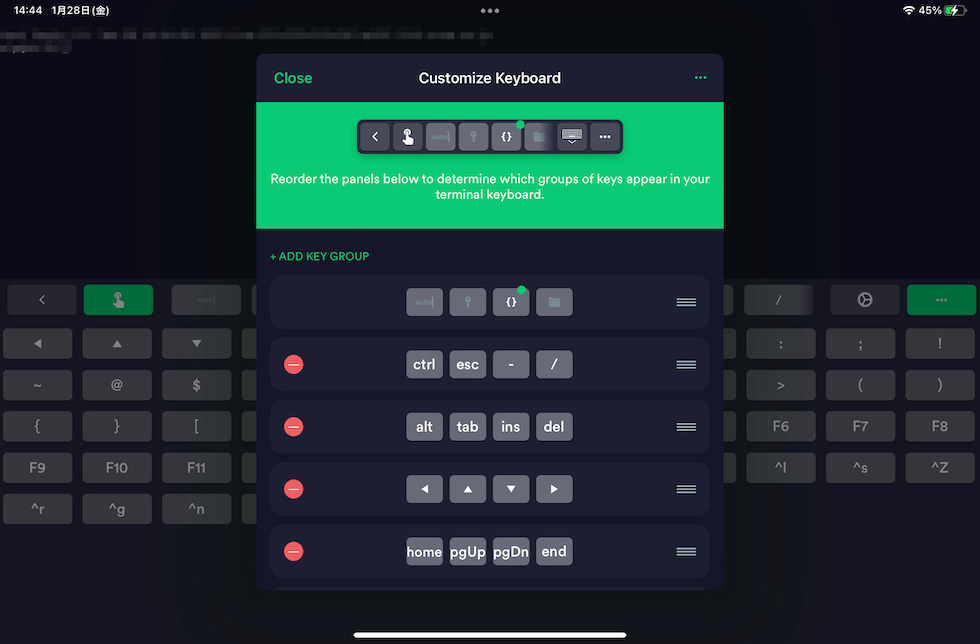


Tabキーやコントロールキーが使えるとiPadでも十分使えますね。

## hugoで記事を書いて確認する
hugoで記事を書くやり方は[デザイナーでもできる初めてのHUGO #01](http://localhost:1313/posts/2021-12-22-hugo-01-ywat/)を参照してください。

EC2で記事を書いて、確認しようとするとある疑問を持ってしまいます。それは確認用のサーバはどうしたら良いのかということです。
通常であれば「localhost:1313」などのURLで確認できます。しかし、EC2ではlocalhostとしてもEC2本体のアドレスではないので、確認できません。

hugoにはIPを指定してサーバを起動する機能があります。
```bash
hugo server --baseURL=[URL]
```
上記のコマンドでアクセスできるかというと、まだ駄目です。

最終的なコマンドは
```
$ hugo server --baseURL=http://[EC2のURL] --bind=0.0.0.0 --port=[ポート]
```
となります。

ここで重要なのが```--bind=0.0.0.0```になります。

ここまできたら、ほぼほぼ確認できるようになっています。

### EC2でファイヤーウォールを設定している場合
EC2を使用している場合、ALBやELBを設定していることが多いと思います。
先程指定したポートが空いているか確認して、空いていない場合は、EC2の設定で開けましょう。

EC2のインバウンドルールに開けたいポートを追加します。
セキュリティーグループを使用している場合は、「インバウンドのルールを編集」をクリックして追加します。

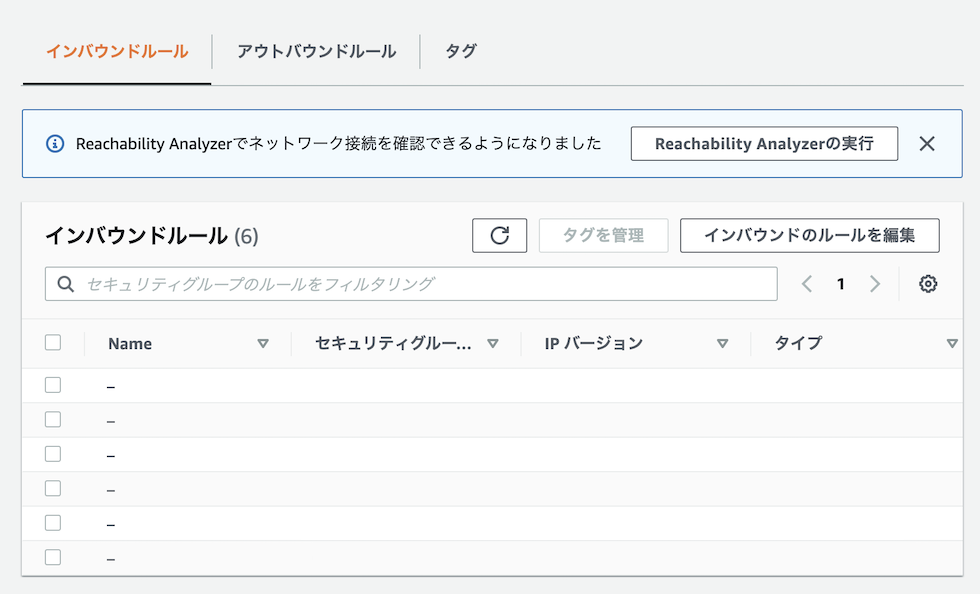


下にある「ルールを追加」を押して、「カスタムTCP」にします。
次に、ポート範囲に開けたいポートを入力して、CIDR ブロックにインターネットゲートウェイを指すすべての IPv4 トラフィック (0.0.0.0/0) のルートを追加します。
IPv6の場合も追加したいので、もう一度「ルールを追加」を押して、ポートを入力し、IPv6 トラフィック (::/0) のルートを入力します。
設定が終わったら、保存しましょう。
これでポートの設定が完了しました。

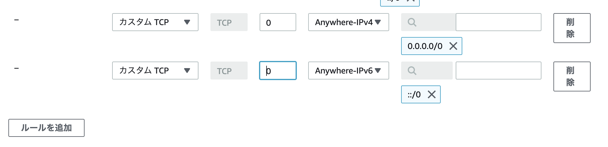


## iPadで確認しながら更新をする
サーバにログインして、先程の
```
$ hugo server --baseURL=http://[EC2のURL] --bind=0.0.0.0 --port=[ポート]
```
でサーバを立ち上げます。
このとき、下書きの記事を表示したいときは
```
$ hugo server --baseURL=http://[EC2のURL] --bind=0.0.0.0 --port=[ポート] -D
```
として下書きも表示するようにしましょう。

また、サーバのアドレスがわからない場合は
```
$ curl -s ifconfig.me
```
とすればIPアドレスがわかります。

iPadにはSplitビューがついているので、片方でブログを書きながら、　もう片方でSafariなどを立ち上げて立ち上げて記事を確認しながら記述することが可能です。
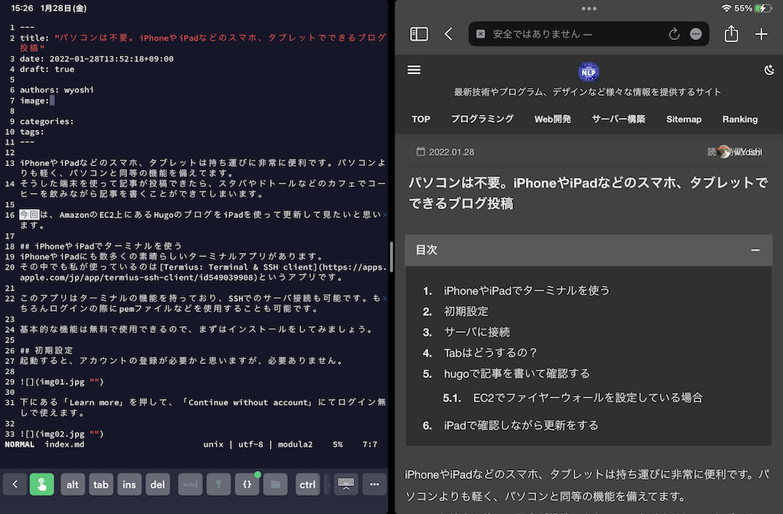

構築が終わったら[iPadに開発環境を構築してみるテスト](https://suzukiiichiro.github.io/posts/2022-01-28-01-suzuki/)を参考にして、EC2内での詳細な設定をしてみましょう。

## まとめ
iPadを使うとどこでも、重いパソコンを持たなくても簡単にブログを更新することができるようになります。是非オススメなので、みなさんも試してみてください。

## おすすめの書籍
{}

{}

