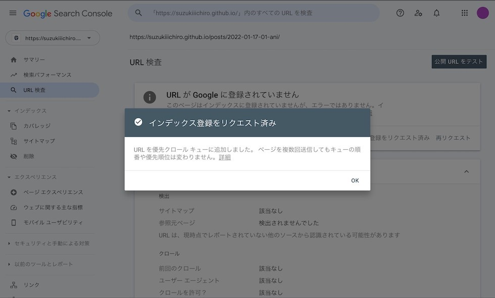
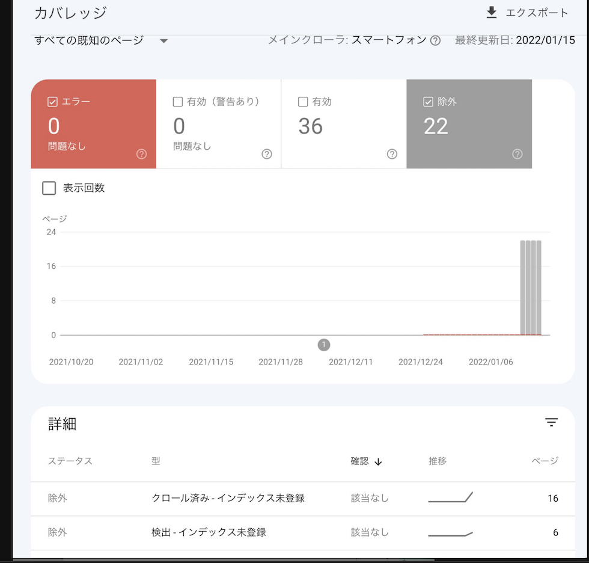

近年、ブログやWEBサイトを作って公開している人が増えてきました。
そうした中で、Googleにインデックスされるというのは非常に重大なことです。せっかく書いた記事もGoogleにインデックスされないと検索結果に表示されません。

Googleにインデックスされないとき、どうしたら良いのでしょうか？

## ブログを公開
まずはブログを公開する際に、GoogleアナリティクスやSearch Consoleの設定などを行いましょう。
これによって、どんな人が来ているのかなどを閲覧することができたり、実際にサーバを閲覧することなくGoogleクローラーの状況やインデックスの状況、SEO対策などの機能などが盛りだくさんです。

そして、Googleだけでなく Bingの方も登録しておくことをオススメします。Bingのクローラーはかなり早く、以前のGoogleのようにインデックスをしてくれます。


## サイトマップをつくる
サイトマップと呼ばれるXMLを作成しましょう。
小規模なサイトやページ同士がしっかりリンクしているサイトであれば不要かもしれませんが、サイトマップは作っているに限ります。
クローラーはそのサイトマップを見て、サイトの構造を把握していきます。
もちろん、ページ構成がしっかりしたサイトであればクローラーは内部リンクのみでサイトマップを構築することが可能です。
クローラーの手助けとなるために、内部リンクをしっかり作り、サイトマップも作っておけばクローラビリティが格段にアップするでしょう。


## サイト公開から半月
サイトを公開してから半月、クローラーが１回来て、サイトマップをのデータからクローラーを開始したようです。


Googleで検索しても表示されるようになりました。


## サイト公開から１ヶ月
クローラーはほぼ仕事をしなくなりました。
来ていないということはなく、来ても数ページクロールして去っていきます。
新しいページをクロールすることはありませんでした。


以前の作成したサイトと比較してもクローラーの活動頻度が激減していることは確かです。
数年前に作成して更新していないサイトのサイトマップのクロール頻度は１週間程度でした。新しく作成したサイトでは1ヶ月過ぎてもサイトマップへのクローラーがきませでした。


## 対応策を試す
### robots.txtを編集する
クロールの結果を見ると画像やcss、jsなどにアクセスしていたため、htmlへのクロールを促すために、これらをrobots.txtにて許可しない設定にしてみました。
理由としては、すべてクロールするようにしてますが、cssやjsなどのファイルもクロールされており、そこにリソースが使われてHTMLまでクロールされていないのではないかと考えたためです。
```
User-agent: Googlebot-Image
Allow: /*.jpg$
Allow: /*.png$
Allow: /*.gif$

User-agent: *
Disallow: /*.jpg$
Disallow: /*.png$
Disallow: /*.gif$
Disallow: /assets/
Disallow: /404.html
Disallow: /js/
Disallow: /ts/
Disallow: /images/
Disallow: /scss/
Disallow: /css/
Allow: /
```

後でわかったのですが、これは完全にNGです。
[Googleの記事](https://developers.google.com/search/blog/2014/10/updating-our-technical-webmaster)を呼んでいると、従来のテキストベースから実際のブラウザのように動作し、レンダリング速度なども考慮しているとのことでした。結果、現在は404のページ以外はフルオープンにしております。

```
User-agent: *
Disallow: /404.html
Allow: /
```

### 構造体データを追加
SEO効果があるということで、構造体データを追加してみました。構造化データの仕組みについては[こちら](https://developers.google.com/search/docs/advanced/structured-data/intro-structured-data?hl=ja)を確認してください。
効果があるかはまだわかりませんが、Search Consoleを見てみると、数ページは認識しているようです。
SEO効果があるかと言われると、重要ではないといった話もあるので余力のある方は実装といったことになるかと思います。

```html
<script type="application/ld+json">
[{
  "@context": "https://schema.org",
  "@type": "BlogPosting",
  "headline":"Googleにインデックスされないときの対応方法は？",
  "mainEntityOfPage":{
    "@type": "WebPage",
    "@id":"[$URL]"
  },
  "datePublished":"",
  "dateModified":"",
  "publisher": {
    "@type": "Organization",
    "name":"NLP - 最新技術やプログラム、デザインなど様々な情報を提供するサイト",
    "logo": {
      "@type": "ImageObject",
      "url":"[$URL]/images/logo.png"}
  },
  "author": {
    "@type": "Person",
    "name":"nlp",
    "url":["[$URL]/authors/wyoshi/"]
  }
},{
  "@context": "https://schema.org",
  "@type": "BreadcrumbList",
  "itemListElement": [{
    "@type": "ListItem",
    "position": 1,
    "name":"NLP - 最新技術やプログラム、デザインなど様々な情報を提供するサイト",
    "item":"[$URL]"
  }]
}]
</script>
````


### サイトマップを消す
サイトマップ自体へのアクセスが頻繁に行われていないので、サイトマップを消してみました。
クロールされないかと思いましたが、Bingで新しい記事をクロールして取得されてました。
しかし、記事のタイトルを変えてもなかなか変わらないのでやはりサイトマップは必要かもしれません。

### タイトルを変える
タイトルを変えて、ページに更新をかけてみましたが、クロールされませんでした。
Bingも同様にタイトルを変えただけではクロールされないようでした。

### サイトマップのHTMLを作成する
クローラーがクロールしやすいように[サイトマップのHTML](/sitemap/)を作成しました。
これによって、クローラーが内部リンクを通じて各ページにアクセスできるかなと思いますが、まだ効果の程はわかりません。


### ランキングを作成する
[ランキングページ](/ranking/)の作成も上記の「サイトマップのHTMLを作成する」のようにクローラビリティを上げるためになります。
あとは、自分たちでもどんな記事を読まれているのかといった指標をすぐ閲覧できるからです。

### SEO対策
#### 画像のサイズの最適化
画像のサイズが最適化できていなかったので、画像のサイズの最適化を行いました。
これによってSEOのスコアを上げることができました。サイトの速度もインデックスされるためには重要な指標になってくるので、きれいな画像を使用したいときは各デバイスに最適化された画像を用意して、サイトの速度を落とさないようにしましょう。

#### asideのdiv化
ページに直接関係ない部分をasideタグで書いていたのですが、内部リンクをたどってないのではないかと考えて、asideをdivに変更しました。
これによって、効果があるかはわかりませんが……。

#### 内部リンクを増やす
カテゴリーだけでなく、著者のページなどを作成して内部リンクするようにしました。
これは若干の効果があって、サイトマップ

#### h1タグの正規化
以前はロゴに当たる部分が h1 となっていたので、各ページでタイトルになる部分に h1 が当たるように変更しました。
ロゴに h1 を当てる人が多いかと思いますが、各ページのタイトル部分に当てたほうが、ページのタイトルとh1との整合性が取れます。

また、h1は1ページに1つとされていますが、あくまで原則で、何個出てきても大丈夫です。ただし、たくさん使うのはNGになるので注意してください。

#### パンくずを追加
孤立ページを出さないように、そして、ページごとの回遊率を上げるためにパンくずを設置しました。
パンくずはクローラーにとっても内部リンクをたどっていけるようになるのではないかと考えております。

## URL検査を行う

クローラーが活動をしていないので、サイトマップへ自動的にアクセスして追加してくれるという望みを諦めて、「URL検査」を使って、手動でクローラーを呼び寄せます。



これによって、以前は除外が22件あったものが2月1日では4件まで減りました。

そして、新しく作成したページも2件ほどGoogle検索に出るようになり、すでにインデックスされていたページは変更が検知され、タイトルの表記が変わりました。


**URL検査は非常に効果的**です。

しかし、記事ページへのアクセスはまだないので、これは再度原因を探る必要があります。
変更されたのは以前サイトマップに登録されていたページなので、クローラーがサイトマップでインデックスしたものを優先している可能性がありそうです。

## まとめ
Googleにインデックスされない問題はかなり多いようです。
Bingでの流入やSNSでの流入はもちろん大事ですが、Googleで検索している人が多い以上対応する必要があります。
まずは記事の品質を上げて、SEO対策し、そして「URL検査」を行う。そうして、Googleクローラーが来てインデックスされるのを待つほかいまのところありません。

また何か動きがあれば掲載してきたいと思います。

