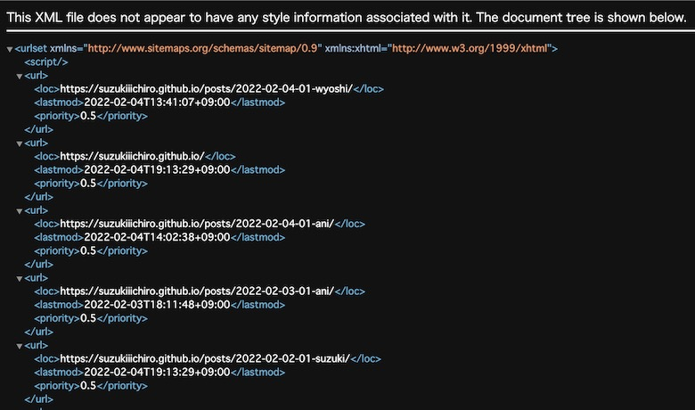

Hugoを使って記事を作成しているのですが、サイトマップをみてみるとlastmodの値がすべて同じになってました。その原因と解決策を今回は探っていこうと思います。

Hugoの導入や記事の投稿についての情報は[Hugoで記事の投稿の仕方]({})や[デザイナーでもできる初めてのHUGO #01]({})を確認してください。

## Gitから更新情報を取得するようにしている
Hugoは非常に強力な機能をたくさん持っています。その一つがGitにある情報にアクセスできるという点です。
この機能を使えば、Gitに登録した人を投稿者としたり、push した日付を更新日とすることができます。
つまり、自分で投稿者や更新日を記述する必要がないということになります。

このブログでもHugoとGitの連携を行っております。その連携自体は簡単です。
設定ファイルに
```yaml
enableGitInfo: true
```
と記述するだけで、Gitの情報にアクセスできます。

## frontmatterの記述
Hugoには日付を制御できる設定があります。Hugoがコンテンツ・ページに日付を割り当てる方法を設定することができます。これは、config に frontmatter セクションを追加することで行うことが可能です。
私の環境では下記のようになっておりました。

```yaml
frontmatter:
  lastmod:
    - :fileModTime
    - :git
    - lastmod
```
```:fileModTime```はコンテンツファイルの最終更新タイムスタンプから日付を取得します。
```:git```ではコンテンツファイルの最終リビジョンのGit作成日となります。
この設定を使うには、```--enableGitInfo``` が設定されているか、サイト構成で ```enableGitInfo = true ```が設定されている必要があります。つまり、先程の設定ファイルに記述した設定となります。
そして、```lastmod```です。

この設定は上から順に評価されていきます。

詳細は[Hugoのfrontmatter](https://gohugo.io/getting-started/configuration/#configure-front-matter)を確認してください。

## Git Actioinsで設定したXMLの更新日がすべて同じになった
今回は[XMLの作成]({})の際にGitのデータを使用するようにしていました。
ローカルで確認したところ、```hugo server```での動作も、```hugo```にて書き出したファイルも更新日である```lastmod```が正常に表示されていたので問題ないと判断して、Gitにアップしました。


しかし、Gitではローカルと動作が異なっており、すべて同じ日付となってしまいました。
一体なぜでしょうか？

### ランキングや最新記事の反映で日付が更新された可能性
このサイトでは最新記事やランキングを掲載しております。それらは時間や投稿のタイミングで変化します。そういた変化を検知してしまって日付が変わってしまった可能性が考えられます。
しかし、そうだとしたら、ローカルでも同様の問題になるかと思うので、この可能性は低そうです。

### GitHub Pagesで別ブランチで管理している
このサイトはGitHub Pagesを使って別ブランチで管理しています。つまり、公開ディレクトリにあたる public 部分は前の考察のランキングや最新記事によって全てのページが変更されています。
そして、別ブランチにアップする。つまり、すべてが書き換わるといったことが起こったのではないでしょうか。

## 解決策
解決策はすごくと簡単です。
Git と連携して lastmod の日付を自動で設定するために、```enableGitInfo: true``` としていました。そして、この設定と同時に、下記のような設定もHugoの設定ファイル（yaml形式）に記述していました。
```yaml
frontmatter:
  lastmod:
    - :fileModTime
    - :git
    - lastmod
```

ここの frontmatter の記述をすべてコメントアウトにします。
それか、優先度のファイルのタイムスタンプから```:git```に変更します。
```yaml
frontmatter:
  lastmod:
    - :git
    - :fileModTime
    - lastmod
```
これでlastmodが正しく表示されるようになりました。




## まとめ
lastmod はSEOとしてあまり必要とされていないといった声も聞かれますが、正しく表示しておくことでサイトとしての信頼性は格段に上がると思います。
HugoとGitの連携を行った際に、更新日など正しく反映されない箇所があった場合は設定などを見直してみましょう。
簡単なことで問題が解決するかもしれません。

## おすすめの書籍
{{% amazon title=" GitHub実践入門 ~Pull Requestによる開発の変革 (WEB+DB PRESS plus) " url="https://www.amazon.co.jp/GitHub実践入門-Pull-Requestによる開発の変革-PRESS-plus/dp/477416366X/?tag=nlpqueens09-22" summary=` GitHubの実践的な使い方を、実際に手を動かす形で解説する書籍です。初学者の方にもわかりやすいよう、基本的なGitやGitHubの使い方から、「ソーシャルコーディング」の目玉機能であるPull Requestの送り方・受け方まで解説します。また、外部ツールとの連携、GitHub FlowやGit Flowなど、GitHubを中心とした開発手法についてもしっかり解説しているので、中・上級者の方にも参考になるはずです。 目次 第1章:GitHubの世界へようこそ 第2章:Gitの導入 第3章:GitHubを利用するための準備 第4章:Gitを操作しながら学ぶ 第5章:GitHubの機能を徹底解説 第6章:はじめてのPull Request 第7章:Pull Requestが送られてきたら 第8章:GitHubと連携するツールとサービス 第9章:GitHubを利用した開発フロー 第10章:会社でGitHubを使おう Appendix A:GitHubをサポートするGUIクライアント Appendix B:Gistで手軽にコードを共有 続きを読む 。` imageUrl="https://images-fe.ssl-images-amazon.com/images/I/51PjpAUHZBL.jpg" %}}

{{% amazon title=" 改訂2版 わかばちゃんと学ぶ Git使い方入門〈GitHub、SourceTree、コマンド操作対応〉 " url="https://www.amazon.co.jp/改訂2版-わかばちゃんと学ぶ-Git使い方入門〈GitHub、SourceTree、コマンド操作対応〉-湊川-あい/dp/4863543433/?tag=nlpqueens09-22" summary=` マンガと実践で学ぶGitの入門書が最新情報に対応して改訂しました! Gitの概念はもちろん、GitHubについても丁寧に解説しています。これからGitを使い始める人にオススメの1冊です。 本書ではクリック操作でGitを使えるSourceTreeを中心に解説しているので、初心者でも安心です。 はじめにより抜粋 ■せっかく学ぶなら、やっぱり楽しい方がいい 「Gitって難しそう」 「勉強しようとは思っているけど、なかなか一歩が踏み出せない」 そんな方のために、楽しくGitを理解できる本を作りました。 ・個性的なキャラクターたちが登場するマンガ ・感覚的にわかる図解 ・丁寧な実践パート 上記3つの特長で、Gitを無理なく学べます。` imageUrl="https://images-fe.ssl-images-amazon.com/images/I/51ITQMzMG2L.jpg" %}}

