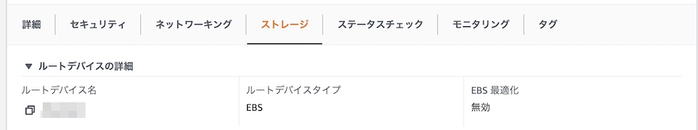

みなさんの中にもAWSのEC2を使った事がある人もいるかと思います。
そのAWSからある日、下記のようなメールが届きました。

> Hello,
>
> EC2 has detected degradation of the underlying hardware hosting your Amazon EC2 instance (instance-ID: [インスタンスのID]) associated with your AWS account (AWS Account ID: [ID]) in the [リージョンの場所] region.
> Due to this degradation your instance could already be unreachable.
> We will stop your instance after 日付 UTC.
> Please take appropriate action before this time.
>
> The affected instances are listed below:
>
> [インスタンスのID]

翻訳してみると、どうやらAWSの老朽化に伴うインスタンスの更新が必要なようです。

> こんにちは。
>
> EC2は、[リージョンの場所]リージョンにあるお客様のAWSアカウント（AWSアカウントID：[ID]）に関連するAmazon EC2インスタンス（インスタンスID：Instance-ID）をホストする基礎ハードウェアの劣化を検出しました。
> この劣化により、お客様のインスタンスはすでに到達不能になっている可能性があります。日付 UTC以降にお客様のインスタンスを停止します。
> それまでに適切な対処をお願いいたします。
>
> 影響を受けるインスタンスは以下の通りです。
> [インスタンスのID]

老朽化の通知をしてくれるのは非常にありがたいですが、EC2の適切な対処ってなんだ？と焦ってしまう方もいるかと思います。
今回は「Amazon EC2 Instance Retirement」というタイトルのメールが来た際の対処法について説明いたします。

## EC2のイベントを確認
まずはAWSにログインして、EC2の項目に移動します。
左袖に、「**イベント**」という項目があるので、クリックして内容を確認しましょう。

今回は「イベントステータス」部分に「Scheduled」と記述され、「イベントタイプ」が「instance-stop」となっている項目がありました。
リソースIDをAWSのメールと照らし合わせて、該当のインスタンスということがわかります。

「説明」の部分にも見切れていますが、「The instance is running on degraded hardware（インスタンスが劣化したハードウェアで動作している）」と記述されていました。
進行状況から14日以内にインスタンスが停止してしまうので、「Amazon EC2 Instance Retirement」というメールが来たら、早めにAWSへログインして状況を確認するようにしましょう。

## EC2のルートを確認
次に、該当のインスタンスの**ルートデバイスタイプ**を確認します。
前回のリソースID部分をクリックして、「インスタンスの概要」へ移動します。そして、「ストレージ」をクリックして「ルートデバイスタイプ」を確認しましょう。

この部分が「**EBS**」となっている場合は、対応が非常に簡単です。
その対応を方法は次のようになります。

## EC2を停止、そして起動
「Amazon EC2 Instance Retirement」の対応はルートデバイスがEBSの場合は、対象のインスタンスを一度「**インスタンスを停止**」させてから「**インスタンスを開始**」するだけで対応できてしまいます。

「インスタンスを停止」して「インスタンスを開始」だから、要するに「インスタンスを再起動」ってことでしょ？と考えてしまうかもしれません。
しかし、「インスタンスを再起動」の場合はEC2のハードウェアが変わらないため、今回のハードウェアのアップデートが行われません。
ですので、「インスタンスを停止」させてから「インスタンスを開始」するようにして、EC2を実行するハードウェアをAWS側が自動的に変更するようにしましょう。

{}
ルートデバイスタイプが「instant store」の場合
: ルートデバイスが「instant store」の場合はEBSと対応が変わります。
    1. まず、EC2インスタンスからイメージを作成します。
    2. 次に、さきほど作成したイメージを利用し、別のEC2インスタンスを立ち上げます。
    3. そして、元のEC2インスタンスを削除します
{}

## まとめ
「Amazon EC2 Instance Retirement」というメールが来た場合、焦らずに対応できるようにしておきましょう。
EBSの場合は「**インスタンスを停止**」させてから「**インスタンスを開始**」。
instant storeの場合は、イメージを作成して、立ち上げて該当インスタンスを削除。
これさえ覚えておけば、大丈夫です。

## おすすめの書籍
{}

{}

