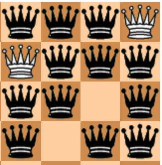
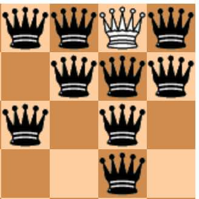
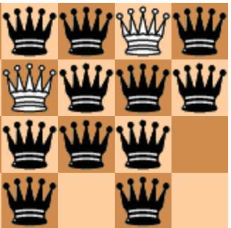
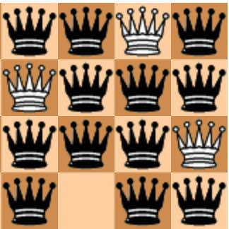
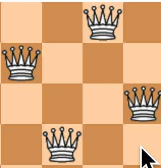

## バックトラック 
 今回も引き続きバックトラックを説明していきたいと思います。      
 前回はプログラムの概要を説明しましたが、今回はnqueenメソッドの再帰とバックトラックの動きについて図で示しながら説明していきたいとおもいます。    

プログラムソースは以下のURLにあります。  
https://github.com/suzukiiichiro/N-Queens/blob/master/03Python/py03_nqueen.py  

## おさらい
ブルートフォース、配置フラグからのおさらいとして次の点を押さえておきましょう。    
・448行目のABOARD[row]=i はクイーンを配置する動きです。    
・452行目のnqueen(row+1)は再帰でnqueenメソッドを動かしていますがこれは次の行に進む動きです。    
・444,445は最終行(4行目)までクイーンを置ききった後にTOTALに1加算しています。フラグチェックを通過して最終行まで到達すれば正解と判断して良いからです。  

再帰でnqueenメソッドを呼び出したときは、当然のことなのですがメソッドの先頭439行目に移動します。  
引数で渡されたrow、size以外のローカル変数はすべて初期化された状態になります。  

・再帰から抜ける部分は2箇所あります。  
一つ目は、444,445行目で最終行(4行目)までクイーンを置ききった後にTOTALを加算する時  

二つ目は、447行目のfor文がSIZE数の数(N=4だと3)だけ回りきったあとです。  

再帰から抜けたときは再帰を呼び出した452行目のすぐ後ろからスタートします。  
ローカル変数の状態は再帰を呼び出す直前の状態になります。  
1行前に戻るような動きとなります。  

ちなみに447行目のfor i in range(SIZE)は右端から左端に1個ずつクイーンを置こうとする動きです。  
左端までクイーンを置ききったらfor文を抜けるイメージです。  

450行目のif FA[i] == 0 and FB[row-i+(size-1)] == 0 and FC[row+i] == 0:でFA,FB,FCの配置フラグで利き筋をチェックしています。  
FAが上下の利き筋  
FBが左対角線上の利き筋  
FCが右対角線上の利き筋  
をチェックしています  

## nqueen メソッドの動き
467行目のnqueen(0,i)からスタートします。  
メソッドの先頭439行目に移動します。  
row=0なので446行目の else: に移動します。  
447行目のfor文に入りi=0からスタートします。  
448行目のABOARD[0]=0で1行目の右端にクイーンを設置します。  
 
1個目のクイーンなので当然配置フラグはどれもOの状態ですから450行目のif FA[0] == 0 FB[row-i+(size-1)] == 0 FC[row+i] == 0の条件を満たしてif文の中に入ります。  

451行目でフラグを立てますが以下のようになります。  
配列の個数は2*MAX-1 MAX=16なので31個ですが31個必要なのはN=16の時です。  
N=4のときは2*4-1で7個あれば足ります。  

row=0,i=0なので  
FA  
FA[0]=1で  
```
FA[0]=1
FA[1]=0
FA[2]=0
FA[3]=0
FA[4]=0
FA[5]=0
FA[6]=0
```
FB  
row-i+(size-1)   
0-0+(4-1)=3  
FB[3]=1  

```
FB[0]=0
FB[1]=0
FB[2]=0
FB[3]=1
FB[4]=0
FB[5]=0
FB[6]=0

```
FC  
row+i  
0+0=0  
FC[0]=1  

```
FC[0]=1
FC[1]=0
FC[2]=0
FC[3]=0
FC[4]=0
FC[5]=0
FC[6]=0

```
利き筋をビジュアルで表示すると以下の通りです。黒いクイーンの部分は置けません。  
 

452行目でnqueenを引数1を渡して呼び出して2行目に進みます。    

図だと2行目でクイーンを置けるのは3,4列目ですがプログラムの動きではどうなるのか見てみましょう。  

再帰呼び出しなのでrow=1の状態でメソッドの先頭439行目に移動します。  
row=1なので446行目の else: に移動します。  
447行目のfor文に入りi=0からスタートします。  
448行目のABOARD[1]=0で2行目の右端にクイーンを設置します。  
1行目で既に右端にクイーンを設置していますのでFA[0]は1になりますので450行目のif FA[i]==0の条件を満たしません。  

if文に入らずに次のfor文に進みます。  
この部分が配置フラグの制御になります。  
この処理のおかげで上下、左右対角線上の利き筋に引っかかる場合は次の行に移動するのをやめ探索を効率化することができます。  

447行目で次のfor文に進みi=1となります。  

448行目のABOARD[1]=1で2行目の右から2列目にクイーンを設置します。  

450行目でフラグをチェックします  

FAのフラグの状態は以下の通りです  
```
FA[0]=1
FA[1]=0
FA[2]=0
FA[3]=0
FA[4]=0
FA[5]=0
FA[6]=0
```
i=1  
FA[1]==0ですのでFAフラグは通過します。  

FBのフラグの状態は以下の通りです  
```
FA[0]=0
FB[1]=0
FB[2]=0
FB[3]=1
FB[4]=0
FB[5]=0
FB[6]=0
```
row=1,i=1  
row-i+(size-1)  
1-1+(4-1)=3  
FB[3]==1ですのでFBフラグは通過しません  
左対角線上の利き筋に引っかかることになります。  

447行目で次のfor文に進みi=2となります。  

448行目のABOARD[1]=2で2行目の右から3列目にクイーンを設置します。  

 

450行目でフラグをチェックします  
row=1,i=2  
FA[2]==0なのでFAのフラグは通過しますFB[row-i+(size-1)->FB[1-2+(4-1)]->FB[2]==0なのでFBフラグは通過します  
FC[row+i]->FC[1+2]->FC[3]==0なのでFCフラグも通過します  

if 文の中に入って451行目でフラグをたてます  

FA  
FA[2]=1で  
```
FA[0]=1
FA[1]=0
FA[2]=1
FA[3]=0
FA[4]=0
FA[5]=0
FA[6]=0
```
FB  
FB[2]=1  

```
FB[0]=0
FB[1]=0
FB[2]=1
FB[3]=1
FB[4]=0
FB[5]=0
FB[6]=0

```
FC  
FC[3]=1  

```
FC[0]=1
FC[1]=0
FC[2]=0
FC[3]=1
FC[4]=0
FC[5]=0
FC[6]=0

```
ビジュアルで利き筋をみてみると以下の通りです。  
 
3行目にクイーンを置ける場所はなさそうです。  

452行目でnqueenを引数2を渡して呼び出して3行目に進みます。    

row=2,for=0,1,2,3 で450行目のフラグを見てみましょう  

row=2,i=0  
FA[i]->FA[0]==1  
FAフラグに引っかかります  

row=2,i=1  
FA[i]->FA[1]==0  
FB[row-i+(size-1)]->FB[2-1+(4-1)]->FB[4]==0  
FC[row+i]->FC[2+1]->FC[3]==1  
FCフラグに引っかかります  

row=2,i=2  
FA[i]->FA[2]==1  
FAフラグに引っかかります  

row=2,i=3  
FA[i]->FA[3]==0  
FB[row-i+(size-1)]->FB[2-3+(4-1)]->FB[2]==0  
FBフラグに引っかかります  


i=3までだめなのでfor文を抜けます。  
for文を抜けると再帰を抜け2行目の処理(row=1)に戻ります。  
row=1,i=2  

453行目でフラグを落とします  
今の状態のフラグが以下の通りです。  

FA  
FA[2]=1 のフラグを0にします。  
```
FA[0]=1
FA[1]=0
FA[2]=1-->FA[2]=0
FA[3]=0
FA[4]=0
FA[5]=0
FA[6]=0
```
FB  
FB[2]=1 のフラグを0にします。  

```
FB[0]=0
FB[1]=0
FB[2]=1-->FB[2]=0
FB[3]=1
FB[4]=0
FB[5]=0
FB[6]=0

```
FC  
FC[3]=1 のフラグを0にします。  

```
FC[0]=1
FC[1]=0
FC[2]=0
FC[3]=1-->FC[3]=0
FC[4]=0
FC[5]=0
FC[6]=0

```

447行目で次のfor文に進みi=3となります。    

448行目のABOARD[1]=3で2行目の右から4列目にクイーンを設置します。  

 

450行目でフラグをチェックします  
row=1,i=3  
フラグをチェックしてみましょう。  
FA[i]->FA[3]==0  
FB[row-i+(size-1)]->FB[1-3+(4-1)]->FB[1]==0  
FC[row+i]->FC[1+3]->FC[4]==0  
FA,FB,FCいずれのフラグチェックもクリアしますので451行目のif文に入ります。  

451行目でフラグをたてると以下のようになります。  

FA  
FA[3]=1 のフラグを1にします。  
```
FA[0]=1
FA[1]=0
FA[2]=0
FA[3]=1
FA[4]=0
FA[5]=0
FA[6]=0
```
FB  
FB[1]=1 のフラグを1にします。  

```
FB[0]=0
FB[1]=1
FB[2]=0
FB[3]=1
FB[4]=0
FB[5]=0
FB[6]=0

```
FC  
FC[4]=1 のフラグを1にします。  

```
FC[0]=1
FC[1]=0
FC[2]=0
FC[3]=0
FC[4]=1
FC[5]=0
FC[6]=0

```

 


452行目でnqueenを引数2を渡して呼び出して3行目に進みます。    
再帰呼び出しなのでrow=2の状態でメソッドの先頭439行目に移動します。    
row=2なので446行目の else: に移動します。    
447行目のfor文に入りi=0からスタートします。    
448行目のABOARD[2]=0で3行目の右端にクイーンを設置します。    

450行目でフラグをチェックします  
row=2,i=0  
FA[i]->FA[0]==1  
FAフラグに引っかかります  

447行目で次のfor文に進みi=1となります。  

448行目のABOARD[2]=1で3行目の右から2列目にクイーンを設置します。  

 

450行目でフラグをチェックします  
row=2,i=1  
フラグをチェックしてみましょう。  
FA[i]->FA[1]==0  
FB[row-i+(size-1)]->FB[2-1+(4-1)]->FB[4]==0  
FC[row+i]->FC[2+1]->FC[3]==0    

FA,FB,FCいずれのフラグチェックもクリアしますので451行目のif文に入ります。  

451行目でフラグをたてると以下のようになります。  

FA  
FA[1]=1 のフラグを1にします。  
```
FA[0]=1
FA[1]=1
FA[2]=0
FA[3]=1
FA[4]=0
FA[5]=0
FA[6]=0
```
FB  
FB[4]=1 のフラグを1にします。  

```
FB[0]=0
FB[1]=1
FB[2]=0
FB[3]=1
FB[4]=1
FB[5]=0
FB[6]=0

```
FC  
FC[3]=1 のフラグを1にします。  

```
FC[0]=1
FC[1]=0
FC[2]=0
FC[3]=1
FC[4]=1
FC[5]=0
FC[6]=0

```

 
ビジュアル的にみると4行目にクイーンを置ける場所はなさそうですね。  
プログラムでの動きを見てみましょう  

452行目でnqueenを引数3を渡して呼び出して3行目に進みます。    

再帰呼び出しなのでrow=3の状態でメソッドの先頭439行目に移動します。    
row=2なので446行目の else: に移動します。  
447行目のfor文に入りi=0からスタートします。  
i=0,1,2,3での450行目のフラグ判定を見てみましょう  

row=3,i=0  
FA[i]->FA[0]==1  
FAフラグに引っかかります  

row=3,i=1  
FA[i]->FA[1]==1  
FAフラグに引っかかります  

row=3,i=2  
FA[i]->FA[2]==0  
FB[row-i+(size-1)]->FB[3-2+(4-1)]->FB[4]==1  
FBフラグに引っかかります  

row=2,i=3  
FA[i]->FA[3]==0  
FAフラグに引っかかります  

i=3までだめなのでfor文を抜けます。  
for文を抜けると再帰を抜け3行目の処理(row=2)に戻ります。  
row=2,i=1の状態で452行目の直後に移動します。  
453行目でフラグを落とします  
今の状態のフラグが以下の通りです。  

FA  
FA[1]=1 のフラグを0にします。  
```
FA[0]=1
FA[1]=0
FA[2]=0
FA[3]=1
FA[4]=0
FA[5]=0
FA[6]=0
```
FB  
FB[4]=1 のフラグを1にします。  

```
FB[0]=0
FB[1]=1
FB[2]=0
FB[3]=1
FB[4]=0
FB[5]=0
FB[6]=0

```
FC  
FC[3]=1 のフラグを1にします。  

```
FC[0]=1
FC[1]=0
FC[2]=0
FC[3]=0
FC[4]=1
FC[5]=0
FC[6]=0

```
フラグを落としたら447行目次のfor文にいきます。  
row=2,i=2  
row=2,i=3  
いずれも450行目のフラグに引っかかります。  
i=3までだめなのでfor文を抜けます。  
for文を抜けると再帰を抜け2行目の処理(row=1)に戻ります。  
row=1,i=3の状態で452行目の直後に移動します。  
すでにi=3の状態ですからそのままfor文をぬけ再帰を抜けて1行目の処理(row=0)に戻ります。  
row=0,i=0  
453行目でフラグを落としますが1行目ですのでまっさらな状態になります。  

447行目で次のfor文に移動します。  
row=0,i=1ですので448行目のABOARD[0]=1 で1行目の右から2列目にクイーンをおきます。  
 
1個目のクイーンなので当然配置フラグはどれもOの状態ですから450行目のif FA[0] == 0 FB[row-i+(size-1)] == 0 FC[row+i] == 0の条件を満たしてif文の中に入ります。  
451行目でフラグを立てます  
row=0,i=1なので  
FA  
FA[1]=1で  
```
FA[0]=0
FA[1]=1
FA[2]=0
FA[3]=0
FA[4]=0
FA[5]=0
FA[6]=0
```
FB  
row-i+(size-1)   
0-1+(4-1)=2  
FB[2]=1  

```
FB[0]=0
FB[1]=0
FB[2]=1
FB[3]=0
FB[4]=0
FB[5]=0
FB[6]=0

```
FC  
row+i  
0+1=0  
FC[1]=1  

```
FC[0]=0
FC[1]=1
FC[2]=0
FC[3]=0
FC[4]=0
FC[5]=0
FC[6]=0

```
利き筋をビジュアルで表示すると以下の通りです。黒いクイーンの部分は置けません。  
 

452行目でnqueenを引数1を渡して呼び出して2行目に進みます。    

図だと2行目でクイーンを置けるのは4列目だけです。  

 

447行目のfor文の中でrow=1 i=0,1,2の時にいずれも450行目の配置フラグの制御に引っかかって次のfor文に進みます。    

row=1,i=3の時に450行目の配置フラグを通り抜けられます。  

FA[i]->FA[3]==0  
FB[row-i+(size-1)]->FB[1-3+(4-1)]->FB[1]==0  
FC[row+i]->FC[1+3]->FC[4]==0  

451行目でフラグを立てると以下の図になります。  

 

row=1,i=3なので  
FA  
FA[3]=1で  
```
FA[0]=0
FA[1]=1
FA[2]=0
FA[3]=1
FA[4]=0
FA[5]=0
FA[6]=0
```
FB  
row-i+(size-1)   
1-3+(4-1)=1  
FB[1]=1  

```
FB[0]=0
FB[1]=1
FB[2]=1
FB[3]=0
FB[4]=0
FB[5]=0
FB[6]=0

```
FC  
row+i  
1+3=0  
FC[4]=1  

```
FC[0]=0
FC[1]=1
FC[2]=0
FC[3]=0
FC[4]=1
FC[5]=0
FC[6]=0

```
452行目でrow=2でnqueenを再帰で呼び出します。  
row=2の時はi=0の時にクイーンを置くことができます。  
 
451行目でフラグを立てると以下の図になります。  
row=2,i=0なので  
FA  
FA[0]=1で  
```
FA[0]=1
FA[1]=1
FA[2]=0
FA[3]=1
FA[4]=0
FA[5]=0
FA[6]=0
```
FB  
row-i+(size-1)   
2-0+(4-1)=5  
FB[5]=1  

```
FB[0]=0
FB[1]=1
FB[2]=1
FB[3]=0
FB[4]=0
FB[5]=1
FB[6]=0

```
FC  
row+i  
2+0=2  
FC[2]=1  

```
FC[0]=0
FC[1]=1
FC[2]=1
FC[3]=0
FC[4]=1
FC[5]=0
FC[6]=0

```
 
図で見ると最終行で右から3番目にクイーンが置けそうです。  

 
452行目でrow=3でnqueenを再帰で呼び出します。  
row=3,i=2でフラグをチェックしてみましょう。  

FA[i]->FA[2]==0  
FB[row-i+(size-1)]->FB[3-2+(4-1)]->FB[4]==0  
FC[row+i]->FC[3+2]->FC[5]==0  

450行目のフラグチェックと通過するので  
452行目でrow=4でnqueenを再帰で呼び出すことができます。  
row=4で再帰を呼び出すと  
if row== size : のif文に入り  
TOTAL +=1 で総数がカウントされます。  
 
445行目の処理が終わると再帰を抜けて上の行に戻ります。  

そんな感じで再帰呼び出し、再帰を抜けるを繰り返して総数を出します。  
