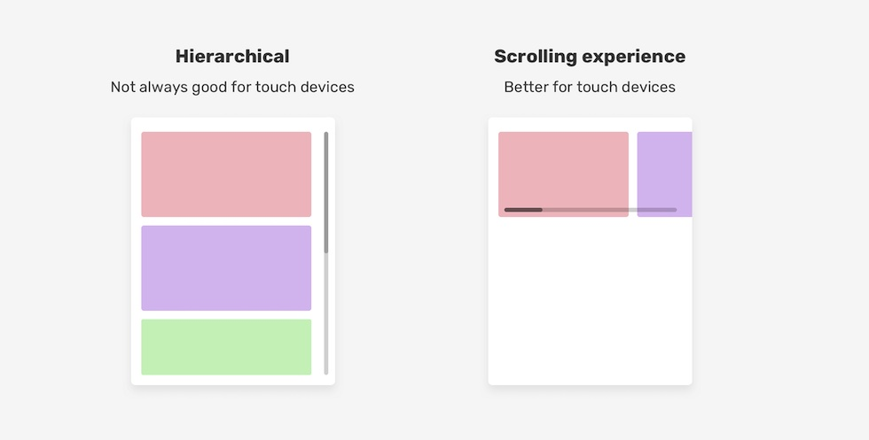
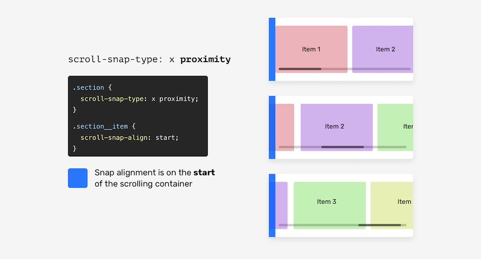
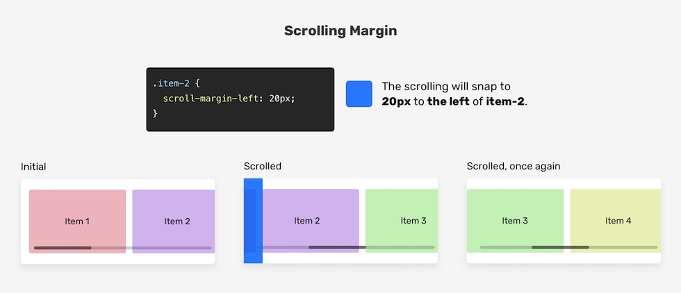
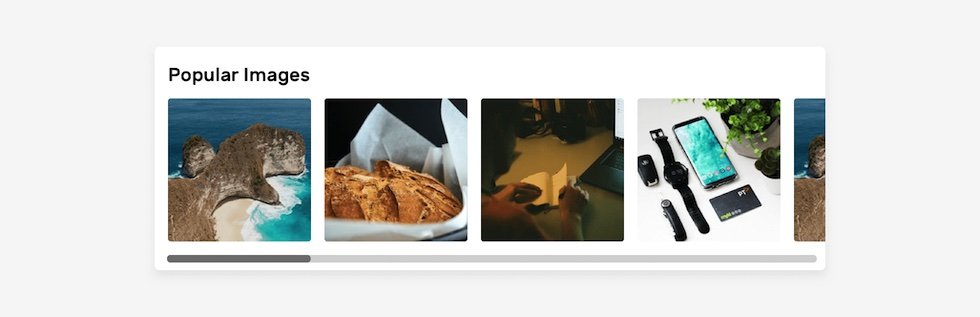
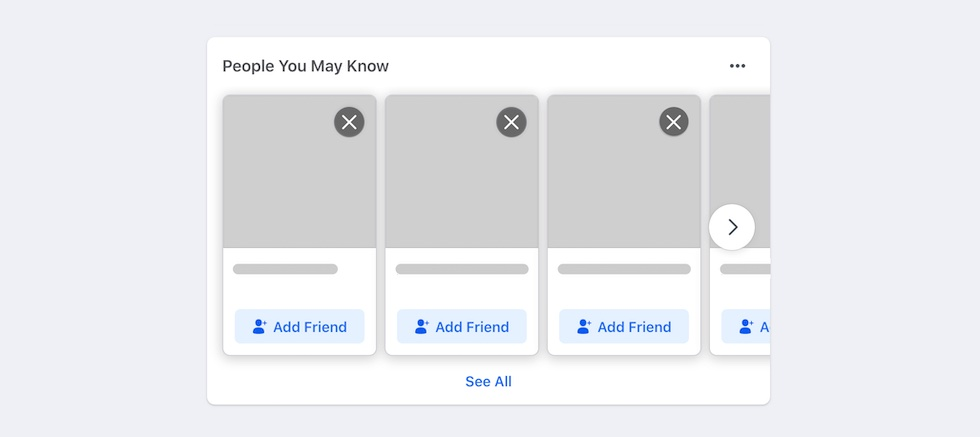

**出典元**：[ CSS Scroll Snap - Ahmad Shadeed ](https://ishadeed.com/article/css-scroll-snap/)

アプリなどで横スクロールしてコンテンツにスナップするといった動作をよく見かけると思いますが、CSSで横スクロールのUIを作成しようとすると、専用のjavascriptやライブラリを使用する必要があったりと実装が大変です。
しかし、CSSスクロールスナップは横スクロールしてスナップするといった動作を行うことができます。

この記事では、CSSスクロールスナップ（scroll-snap）の基本について説明します。

## scroll-snapを使用する理由
スマホやタブレットの普及で、タッチでスワイプできる画面を設計、構築する必要があるかと思います。
たとえば、ギャラリー風のデザインを考えてみましょう。ユーザーは、階層構造ではなく、左または右に簡単にスワイプして、より多くの画像を表示できます。



[CSSの仕様](https://drafts.csswg.org/css-scroll-snap-1/#intro)によると、CSSスクロールスナップを導入することでユーザーエクスペリエンスが向上し、スクロールの実装が容易になり、ユーザーと開発者、双方にメリットがあるということです。

## スクロールコンテナーの基本
スクロールコンテナーを作成するために必要な基本的なものは次のとおりです。

- overflowをvisible以外の値で使用
- 項目を隣同士（インライン）に表示す

例を見てみましょう。
```html
<div class="section">
  <div class="section__item">Item 1</div>
  <div class="section__item">Item 2</div>
  <div class="section__item">Item 3</div>
  <div class="section__item">Item 4</div>
  <div class="section__item">Item 5</div>
</div>
```
```css
.section {
  white-space: nowrap;
  overflow-x: auto;
}
```

以前までは`white-space: nowrap`を使用することで要素を横並びで表示するようにしていました。
近年では、この方法の代わりに`Flexbox`を使用することで表現可能です。
```css
.section {
  display: flex;
  overflow-x: auto;
}
```


これは、スクロールコンテナーを作成するための基本的な構成です。
しかし、これだけではスクロールコンテナーの機能としては不十分です。


## 従来の問題
従来の問題は、スワイプの仕組みと比較して、優れたUXが提供されないことです。タッチスクリーンでのスワイプジェスチャの主な利点は、1本の指で水平または垂直にスクロールできることです。
以前のソリューションでは、ただスクロールするだけです。文字通り、各アイテムをそれぞれの場所に移動する必要があります。これはスワイプではなく、ユーザーにとって非常にストレスを与える結果になってしまします。
CSSスクロールスナップを使用すると、ユーザーが水平方向または垂直方向にスクロールしやすくなるスナップポイントを定義するだけで、この問題を解決できます。

CSSスクロールスナップの使用方法を見てみましょう。

## CSSスクロールスナップの紹介
コンテナーでスクロールスナップを使用するには、その子アイテムをinlineで表示する必要があります。これは、上記で説明した方法の1つで実行できます。 CSSフレックスボックスを使用します。

```html
<div class="section">
  <div class="section__item">Item 1</div>
  <div class="section__item">Item 2</div>
  <div class="section__item">Item 3</div>
  <div class="section__item">Item 4</div>
  <div class="section__item">Item 5</div>
</div>
```
```css
.section {
  display: flex;
  overflow-x: auto;
}
```

さらに、スクロールスナップを機能させるために2つのプロパティを追加します。
まず、スクロールコンテナーに`scroll-snap-type`を追加します。この例では、これは`.section`要素です。
次に、子アイテム（`.section__item`）に`scroll-snap-align`を追加します。

```css
.section {
  display: flex;
  overflow-x: auto;
  scroll-snap-type: x mandatory;
}
.section__item {
 scroll-snap-align: start;
}
```
`x mandatory`と`start`の値についてはじめて見たと思われるかもしれませんが、この部分が今回の記事のメインになる部分です。

これらのプロパティにより、スクロールコンテナーの開始位置にスナップすることが可能になって、スクロールがより自然になりました。
それでは、スクロールスナップのプロパティについて詳しく見ていきましょう。


### scroll-snap-type
[CSSの仕様](https://drafts.csswg.org/css-scroll-snap-1/#@40@) によると、`scroll-snap-type`は、ある要素がスクロールスナップコンテナーであるかどうか、どの程度厳密にスナップするか、どの軸を考慮するかを指定するものです。

それを解析してみましょう。

#### スクロールスナップコンテナーの軸について
スクロールスナップコンテナーの軸は、スクロールの方向を表します。水平または垂直にできます。
xの値は水平方向のスクロールを、yの値は垂直方向のスクロールを表します。

```css
/* Horizontal */
.section {
  display: flex;
  overflow-x: auto;
  scroll-snap-type: x;
}
/* Vertical */
.section {
  height: 250px;
  overflow-y: auto;
  scroll-snap-type: y;
}
```


#### スクロールスナップコンテナーの精密さ
スクロールスナップの方向だけでなく、その精密さも定義できます。
これは、`scroll-snap-type`値に`mandatory | proximity`のいずれかの値を使用することで可能です。

`mandatory`は、ブラウザが各スクロールポイントにスナップする必要があることを意味します。`scroll-snap-align`プロパティの値が`start`であると仮定してみましょう。つまり、スクロールはスクロールコンテナーの開始点にスナップする必要があります。

下図では、ユーザーが右方向にスクロールするたび、ブラウザはコンテナーの開始点にアイテムをスナップさせます。

 


```css
.section {
  display: flex;
  overflow-x: auto;
  scroll-snap-type: x mandatory;
}
.section__item {
 scroll-snap-align: start;
}
```

下のデモで右方向にスクロールしてみてください。スクロールバーを右に移動させるか、スマートフォンやタブレットの場合はタッチ操作で行ってください。各アイテムがコンテナーの始まりにスナップする様子が感じられるはずです。

<script async src="//jsfiddle.net/wyoshi/uzo5ag2q/1/embed/result,html,css/"></script>

しかし、値が`proximity`の場合は、ブラウザが作業を行います。定義された点（この例では`start`）にスナップするかもしれません`。proximity`はデフォルトの値ですが、わかりやすくするために追加しておきます。



```css
.section {
  display: flex;
  overflow-x: auto;
  /* proximityはデフォルト値です。 */
  scroll-snap-type: x proximity;
}
```

### スクロールスナップの方向
スクロールコンテナーの子アイテムには、スナップできるアライメントポイントが必要です。
`start`、`center`、`end`のいずれかを使用します。


スクロールコンテナーに磁石があり、スナップポイントを制御するのに役立つと想像してみてください。
`scroll-snap-type`が垂直の場合、スナップの配置は垂直になります。次の図を参照してください。

 

 これをより明確にするため、 `start` 、`center`、および`end`の以下のアニメーションを参照してください。


#### スクロールコンテナーの `start`
<script async src="//jsfiddle.net/wyoshi/csnuyvg8/7/embed/result/"></script>

子アイテムは、水平スクロールコンテナーの先頭にスナップします。


#### スクロールコンテナーの `center`
<script async src="//jsfiddle.net/wyoshi/csnuyvg8/8/embed/result/"></script>

子アイテムは、スクロールコンテナーの中央にスナップします。


#### スクロールコンテナーの `end`
<script async src="//jsfiddle.net/wyoshi/csnuyvg8/9/embed/result/"></script>

子アイテムは、スクロールコンテナーの最後にスナップします。


## scroll-snap-stopを使う
ユーザーがあまりに速くスクロールするなど、スクロール中にユーザーが誤って重要な項目をスキップしてしまうのを防ぐ方法が必要な場合もあります。

```css
.section__item {
  scroll-snap-align: start;
  scroll-snap-stop: normal;
}
```

<script async src="//jsfiddle.net/wyoshi/csnuyvg8/11/embed/result/"></script>
スクロールのスピードが速すぎる（勢いよくスクロールする）と、3つも4つも項目が飛ばされることもあります。

`scroll-snap-stop` のデフォルト値は`normal`です。スクロールを強制的にすべての可能なポイントにスナップするには、`always`を使用する必要があります。 `scroll-snap-stop: always`を使用すると、ブラウザは各スナップポイントで停止します。

```css
.section__item {
  scroll-snap-align: start;
  scroll-snap-stop: always;
}
```

そうすれば、ユーザーは1つずつスナップポイントをスクロールしていくことができ、重要な項目をスキップすることを避けることができます。
各ストップポイントにストップサインがあることを想像してください。

<script async src="//jsfiddle.net/wyoshi/csnuyvg8/51/embed/result/"></script>

デモで下のスクロールを試して、オプションを切り替えてみてください。

<script async src="//jsfiddle.net/wyoshi/7b95e0xj/2/embed/result/"></script>

## スクロールスナップのpadding
`scroll-padding`短縮形プロパティは、`padding`プロパティの動作と同様に、すべての側面にスクロールパディングを設定します。
下図では、スクロールコンテナーの左側に50pxのパディングが設定されています。その結果、子要素は左端から50pxずれた位置にスナップします。


```css
.section {
  overflow-x: auto;
  scroll-snap-type: x mandatory;
  scroll-padding: 0 0 0 50px;
}
```


同じことが垂直スクロールでも機能します。以下の例を参照してください。


```css
.section {
  overflow-y: auto;
  scroll-snap-type: y mandatory;
  scroll-padding: 50px 0 0 0;
}
```


## スクロールスナップのmargin
`scroll-margin`ショートハンドプロパティは、スクロールコンテナーの子アイテム間の間隔を設定します。要素にマージンが追加されると、マージンに応じてスクロールがスナップします。下図を参照してください。



`.item-2`は`scroll-margin-left: 20px`となっています。その結果、スクロールコンテナーはそのアイテムの手前20pxにスナップします。ユーザーが再び右にスクロールしたとき、`.item-3`はスクロールコンテナーの開始位置にスナップすることに注意してください。つまり、マージンを持つ要素のみが影響を受けることになります。

## CSSスクロールスナップの使用例
### 画像リスト
CSSスクロールスナップの優れた使用例として、画像のリストが挙げられます。スクロールスナップを使用することで、より良いスクロール体験を提供します。




```css
.images-list {
  display: flex;
  overflow-x: auto;
  scroll-snap-type: x;
  gap: 1rem;
  -webkit-overflow-scrolling: touch; /* Important for iOS devices */
}
.images-list img {
 scroll-snap-align: start;
}
```

`scroll-snap-type`の値として`x`を使用したことに注意してください。スナップの厳密さは、デフォルトでは`proximity`になります。

<script async src="//jsfiddle.net/wyoshi/d3azwnjr/embed/result,html,css/"></script>

### 友達リスト

スクロールスナップのもう1つの優れた使用例として、友達のリストがあります。以下の例は、Facebookから引用したものです（実例）。




```css
.list {
  display: flex;
  overflow-x: auto;
  scroll-snap-type: x mandatory;
  gap: 1rem;
  scroll-padding: 48px;
  padding-bottom: 32px;
  -webkit-overflow-scrolling: touch;
}
.list-item {
 scroll-snap-align: start;
}
```
スクロールするコンテナーにはpadding-bottomがあることに注意してください。32pxです。この目的は、ボックスシャドウが期待どおりに表示されるように余分なスペースを提供することです。


### アバターリスト

今回の使用例では、子アイテムの`scroll-snap-align`の値として`center`を使用しています。

 


```css
.list {
  display: flex;
  overflow-x: auto;
  scroll-snap-type: x mandatory;
  -webkit-overflow-scrolling: touch;
}
.list-item {
 scroll-snap-align: center;
}
```

これはアバターのリストで、アバターがスクロールするコンテナーの中央にあることが重要な場合に便利です。

<script async src="//jsfiddle.net/wyoshi/d3azwnjr/2/embed/result,html,css/"></script>


### 全画面を覆うような要素

スクロールスナップの使用は、縦スクロールの場合にも有効です。この例として、フルハイトのセクションがあります。

 

```html
<main>
  <section class="section section-1"></section>
  <section class="section section-2"></section>
  <section class="section section-3"></section>
  <section class="section section-4"></section>
  <section class="section section-5"></section>
</main>
```
```css
main {
  height: 100vh;
  overflow-y: auto;
  scroll-snap-type: y mandatory;
  -webkit-overflow-scrolling: touch;
}
.section {
  height: 100vh;
  scroll-snap-align: start;
}
```
<script async src="//jsfiddle.net/wyoshi/d3azwnjr/4/embed/result,html,css/"></script>


## ブロックおよびインラインの値
特筆すべきは、`scroll-snap-type`に`inline`と`block`という論理値を使用できることです。以下の例を参照してください。

```css
main {
  scroll-snap-type: inline mandatory;
}
```

この例では、英語のような横書きモードでは、`inline`が横方向の寸法を表します。日本語のような言語では、`inline`は縦方向の寸法を表すことになります。
CSSの論理プロパティについてもっと知りたい方は、[Adrian Roselliの記事](https://adrianroselli.com/2019/11/css-logical-properties.html) をご覧ください。

## アクセシビリティ
CSSスクロールスナップを使用する際は、アクセシビリティを確保すること。ここでは、ユーザーがコンテンツを自由にスクロールして読むことを妨げる、スクロールスナップの悪い使い方を紹介します。

```css
.wrapper {
 scroll-snap-type: y mandatory;
}
h2 {
 scroll-snap-align: start;
}
```


デモのような実装は絶対にしないでください。

<script async src="//jsfiddle.net/wyoshi/d3azwnjr/6/embed/result/"></script>

## まとめ
以上が`scroll-snap`機能についてになります。今までスナップするスクロールを実装する場合はjsを使用していましたが、cssのみで実装可能となると簡単になりますね。

## オススメの書籍
{}

{{% amazon title=" HTML5＋CSS3の新しい教科書　改訂新版　基礎から覚える、深く理解できる。 " url="https://www.amazon.co.jp/HTML5＋CSS3の新しい教科書-改訂新版-基礎から覚える、深く理解できる。-赤間-公太郎-ebook/dp/B07GPH7R3Y/?tag=nlpqueens09-22" summary=` この商品は固定レイアウトで作成されており、タブレットなど大きいディスプレイを備えた端末で読むことに適しています。また、文字列のハイライトや検索、辞書の参照、引用などの機能が使用できません。 〈電子書籍版に関する注意事項〉 本書は固定レイアウト型の電子書籍です。リフロー型と異なりビューア機能が制限されるほか、端末によって見え方が異なりますので、ご購入前にお使いの端末にて「無料サンプル」をお試しください。 【技術の進化に左右されないWebサイトの作り方がわかる！】 Web制作のプロを目指す方に向けて、HTML5+CSS3を使ったWebサイトの作り方を解説した入門書の改訂版。` imageUrl="https://m.media-amazon.com/images/I/41eG3HJF4pL.jpg" %}}
