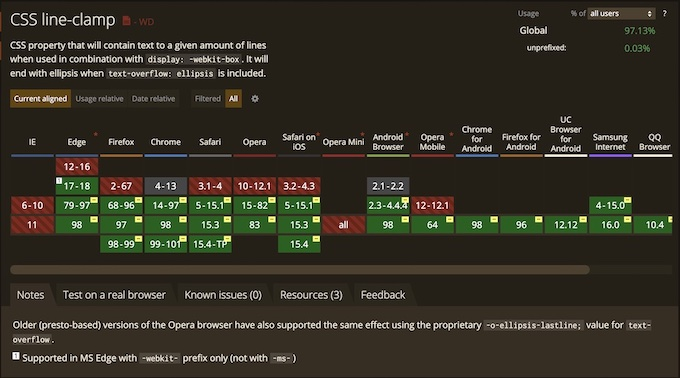

HTMLのレイアウトでは時には文字がはみ出した際に、3点リーダーと呼ばれる「…」をつける場合があります。
普通に記述してしまえば対応できますが、それだと文章を切ってしまったり、文が意味のわからないものになってしまい、SEOとしてはNGとなります。

また、文章の長さが可変の場合はレイアウトが大きく崩れてしまう原因にも繋がります。
今回はCSSを使って3点リーダーを付ける方法を紹介します。

この方法を知っていれば、1行でも複数行でも3点リーダーを表示させることができるようになり、レスポンシブルデザインのようなマルチデバイスでもレイアウトが崩れずに表示させることが可能です。

## 3点リーダーとは
3点リーダーとは「文章を省略する意味」と「文章に余韻を持たせたり沈黙を表現したりする意味」の2つがあります。
HTMLで使用する場合は前の「文章を省略する」という意味で使うことが大多数です。

## 1行の3点リーダーの場合
下記のようなHTMLがあり、幅をを10emとしておきましょう。
普通に記述すると、1emでどんどん改行されてすべての文字が表示されるかと思います。
```html
<div class="container">
  <p>Lorem ipsum dolor sit amet, consectetur adipisicing elit...</p>
</div>
```
```css
.container {
  background: #eee;
  overflow: hidden;
  width: 10em;
  padding: 10px;
}
```
上記のHTMLとCSSを実行した結果になります。10emで改行されているのがわかるかと思います。
これを基準にして、三点リーダーに対応していきましょう。
<script async src="//jsfiddle.net/wyoshi/xgoj82nr/3/embed/result,html,css/"></script>

### ダメなやり方 - 直接htmlを修正して文字を合わせる
まずはダメな3点リーダーのやり方を見てみましょう。
それはcssではなく、直接htmlを修正して文字を合わせるという方法です。
cssはさきほどのままで、htmlを修正して1行かつ、末尾に三点リーダーをつけてみます。
```html
<div class="container">
  <p>Lorem ipsum dolo...</p>
</div>
```
下記に、実行結果が表示されているかと思います。
<script async src="//jsfiddle.net/wyoshi/xgoj82nr/8/embed/result,html,css/"></script>
これでも対応できてるじゃんと思う方もいるかと思いますが、文字が変わったりした場合、どうするのでしょうか？
毎回数えて修正を加えるというのはかなり難しいことに気づくはずです。

### 1行にして3点リーダーを表示する
それでは、自動的に三点リーダーを付与してみましょう。
まずは1行の3点リーダーを作成する方法です。
```css
p {
  overflow: hidden;
  text-overflow: ellipsis;
  white-space: nowrap;
}
```
上記のCSSを実装した結果が下記になります。
<script async src="//jsfiddle.net/wyoshi/xgoj82nr/10/embed/result,html,css/"></script>
いかがでしょうか？ちゃんと1行で3点リーダーが表示されているかと思います。
これであればどんな文字が来たとしても、自動的に1行表示で3点リーダーを付与することが可能です。

ただし、1行の場合はこの記述で問題ないのですが2行、3行など行数が増えたときに厄介です。
お知らせの表示やレイアウトで2行にするというのはかなりよくあります。

### 複数行でも3点リーダーを表示する
そうした場合でも、問題ありません。
```-webkit-line-clamp```というCSSを使えば複数行でも3点リーダーを付与できます。
```-webkit-line-clamp```の使用には必須項目があるので注意してください。
{}
-webkit-line-clamp
: displayプロパティに-webkit-boxもしくは-webkit-inline-boxが設定されており、かつbox-orientプロパティにverticalが設定されている組み合わせのときのみ使用できます。
{}
上記のように、```-webkit-box```と```box-orient: vertical```の3点セットで実装可能になるということを覚えておいください。
それでは実際に複数行での3点リーダーを実装してみましょう。
```css
p {
  display: -webkit-box;
  -webkit-box-orient: vertical;
  -webkit-line-clamp: 2;
  overflow: hidden;
}
```
上記のCSSを実装した結果が下記になります。
<script async src="//jsfiddle.net/wyoshi/xgoj82nr/24/embed/result,html,css/"></script>
さきほどのcssでは1行でしたが、今回は2行の表示で3点リーダーがついていることが確認できるかと思います。

もちろん、3行、4行と数字を変更することで、行数を変えることもできます。
そして、```-webkit-line-clamp```を1とすることで、1行表示での三点リーダーも可能です。

## 対応端末
```-webkit-line-clamp```の対応端末は2022年時点でほぼすべてのブラウザで使用可能です。
IEに関してはサポートが終了するので今回は考えないことにします。



 
## まとめ
PCやスマホなどマルチデバイスなどに対応する際に、3点リーダーを使用する頻度はかなり多いです。
そうした場合に、文字を複数用意したり、人力で文字を削って対応するのはナンセンスです。
1行表示の場合は```text-overflow: ellipsis;```対応。1行の他に、複数行の場合は```-webkit-line-clamp```で対応して、より柔軟な設計を行いましょう。

## オススメの書籍
{}

{{% amazon title=" HTML5＋CSS3の新しい教科書　改訂新版　基礎から覚える、深く理解できる。 " url="https://www.amazon.co.jp/HTML5＋CSS3の新しい教科書-改訂新版-基礎から覚える、深く理解できる。-赤間-公太郎-ebook/dp/B07GPH7R3Y/?tag=nlpqueens09-22" summary=` この商品は固定レイアウトで作成されており、タブレットなど大きいディスプレイを備えた端末で読むことに適しています。また、文字列のハイライトや検索、辞書の参照、引用などの機能が使用できません。 〈電子書籍版に関する注意事項〉 本書は固定レイアウト型の電子書籍です。リフロー型と異なりビューア機能が制限されるほか、端末によって見え方が異なりますので、ご購入前にお使いの端末にて「無料サンプル」をお試しください。 【技術の進化に左右されないWebサイトの作り方がわかる！】 Web制作のプロを目指す方に向けて、HTML5+CSS3を使ったWebサイトの作り方を解説した入門書の改訂版。` imageUrl="https://m.media-amazon.com/images/I/41eG3HJF4pL.jpg" %}}
