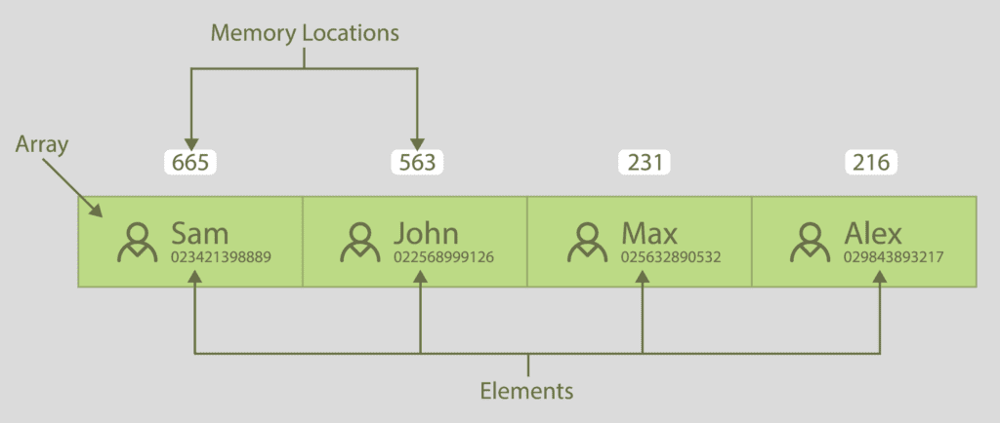
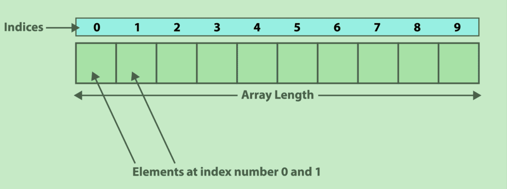

Bashスクリプト（シェルスクリプト） は５０年以上も前からUNIXプログラミングのエッセンスとして君臨し、現在もLinuxのコマンドの殆どを構築しています。

こうしたShellと言われるものはいくつか存在します。

Bourne Shell
Bourne Again Shell
C Shell
Korn Shell
TC Shell

Bourne Again Shell ( BASH ) は、多くのLinuxディストリビューションのデフォルトシェルです。

強力なコマンド編集機能
無制限のイベント履歴
エイリアスの導入
無制限のサイズの配列

Bashは、強力な編集機能や変更機能など、多くの高度な機能があり、信じられないほどユーザー フレンドリーになっています。


＜＜ばっさり省略＞＞


こうしたBashスクリプトでアルゴリズムを習得するシリーズを始めます。
まずは、Bashスクリプトの初歩、そしてデータ構造について、その後、ソートアルゴリズムやツリー、グラフなどへ進みます。

このページではBashスクリプトの配列について、重点的に習得します。


## Bashスクリプティング

Bashスクリプトを作成するには、テキストエディターを開き、冒頭１行目に「/usr/bin/bash」のPATHを 「#!」で参照します。この１行目を she-Bang（シェバン）といいます。

シェバンは１行目になければなりません。
２行目は空行である必要があります。

３行目に「Hello, world!」を出力するスクリプトを記述します。

```bash:hello.sh
#!/usr/bin/bash

echo "Hello, world!" ;

```

テキストエディタを保存しファイル名を「hello.sh」としてファイルを閉じます。
コンソール画面でhello.shを確認したら、bashコマンドで、先ほど作成したファイルを実行します。

```
local: $ bash hello.sh
Hello, world!
local: $
```

Bash スクリプトで変数を割り当てるのはとてもかんたんです。
ほかのプログラム言語にあるデータ型は不要です。
変数に代入される任意の文字、単語、数字は、Bashによって自動で判断され処理します。

コメント行は 「#」を行頭に挿入すると、「#」以降の文字列はコメントとして扱われます。
複数行のコメントは「 :'」で開始し、「'」で終わります。


```bash:comment.sh
#!/usr/bin/bash

# 変数への代入
:'
ここのブロックはコメントです
変数名 = [値]
'

var="Hello, world!";
echo "$var";
```


実行結果は以下のとおりです。
```
local: $ bash comment.sh
Hello, world!
local: $
```

一つの変数は、一つの値を保持することができます。
同じデータ型の複数の値を保持する場合は、配列を使用します。
配列は、インデックス番号で識別される要素のコレクションです。
データ構造の実装に関しては、配列が不可欠です。


## 配列とは

一つの変数は、一つの値を保持することができます。
同じデータ型の複数の値を保持する場合は、配列を使用します。
配列は、インデックス番号で識別される要素のコレクションです。
データ構造の実装に関しては、配列が不可欠です。

実際の例で配列を理解します。
以下の電話連絡帳は、人の名前や連絡先電話番号が、配列(Array)の要素(Elements)となります。人の名前や連絡先電話番号の追加や削除といった、配列の要素を操作することが簡単にできます。



配列は主にデータ構造の実装に使用します。
複数の変数を格納できる変数を「配列(Array)」と呼びます。
配列(Array)は複数の要素(Elements)で構成されています。
配列に複数の変数を割り当てる場合、構成される要素数の制限はありません。
配列要素は通常ゼロから始まり、「添え字」といわれるインデックス番号によって参照します。

以下の画像は、１０個の要素(Elements)で構成され、配列の長さは１０です。
最初の要素番号は０から始まり、最後の要素番号は９となります。
この要素番号をインデックスと言い、要素番号を「添え字」と言います。



{}
ヒント
: 配列を使用すると、複数の変数を一度に定義できます。これはプログラミングで同じ変数の型で同じ構造の変数を割り当てる効率的な方法です。
{}


## 配列の応用

配列は非常に強力なユーティリティであり、多くの科学計算で使用できます。

- 配列は、同じ名前の複数の変数を管理するために使用されます。
- 配列はベクトルで使用できます。ベクトルは通常、機械学習で広く使用される 1 次元配列です。
- 配列はスタックの実装にも使用され、スタックは実際の物理オブジェクトの山のように動作します。
- 配列は、キュー、デキュー、およびハッシュ テーブルにも実装されます。
- 要素の長方形配列である行列も、配列を使用して実装されます。
- 多くのプログラムのグラフは、配列の実装でもあるリストを使用して描画されます。
- CPU スケジューリング アルゴリズムや並べ替えアルゴリズムなどの多くのアルゴリズムは、配列を使用して実装されます。
- 配列は、プログラム内の動的メモリ割り当てでも使用されます。
- 配列は音声処理でも使用されます。
- ノイズ除去フィルターも配列を使用しています。

上記の配列の実装は、配列データ型の可能性を明確に示しています。


## Bashにおける配列の構文

Bashはインデックス付き配列（１次元配列）と、連想配列の療法をサポートしています。以下は、Bashで配列を割り当てる典型的な構文です。

```bash
#name_of_array[添え字]=値
 name_of_array[subscript]=value;
```

配列は要素の集まりであるため、配列内の要素番号は添え字（そえじ）と呼ばれます。
添え字は、配列内の要素の位置を示します。
配列内の５番目の要素に値を代入または変更するには、以下のようにします。
５番目なのにname_of_array[4]となる理由は、インデックスが０から始まっているからです。

```bash
# 0,1,2,3,4,5
name_of_array[4]=value;

```

declare キーワードで配列を宣言すると、まちがいの少ないソースコードを書くことができます。

```bash
# 変数(name_of_array) を 配列(-a)で宣言(declare)する。
declare -a name_of_array;

```

複数の値を代入する場合は以下の構文となります。

```bash
# 変数(name_of_array) を 配列(-a)で宣言(declare)する。
declare -a name_of_array;
name_of_array=(value1 value2 …);
```

一行にまとめて書くこともできます。

```bash
# 変数(name_of_array) を 配列(-a)で宣言(declare)する。
declare -a name_of_array=(value1 value2 …);
```


## Bashでの配列の割り当て
Bash スクリプトの配列は、さまざまな方法で割り当てることができます。
Bash スクリプトで配列を割り当てる最も簡単な方法は、丸括弧内にスペースを含む一連の値を、半角スペース区切りで値を代入することです。
`echo`行に見られる「@」は配列内のすべての要素を出力する場合に使います。


```bash:number.sh
#!/usr/bin/bash

declare -a my_array=(1 2 3 4);
echo ${my_array[@]};
```

```
bash-5.1$ bash number.sh
1 2 3 4 5
bash-5.1$ 
```

Bash スクリプトの配列には、さまざまなデータ型の要素を代入することができます。
データ型が文字列の要素を配列に割り当てるには以下のようにします。


```bash:month.sh
#!/usr/bin/bash

declare -a my_array=(jan feb mar apr);
echo ${my_array[@]};
```

```
bash-5.1$ bash month.sh
jan feb mar apr
bash-5.1$ 
```

配列に、要素を割り当てるには、角括弧 [要素番号]で要素番号を指定して、値を割り当てます。

```bash:month2.sh
declare -a my_array=([0]="jan" [1]="feb" [2]="mar" [3]="apr");
echo ${my_array[@]};
```

```
bash-5.1$ bash month2.sh
jan feb mar apr
bash-5.1$ 
```

要素を一つずつ書くと以下の通りとなります。

```bash
my_array[0]="jan";
my_array[1]="feb";
```

配列は、「declare」 キーワードで宣言することが理想です。
declareのオプション 「-a」 と 「-A」 はそれぞれ、配列と連想配列を宣言するために区別され使用されます。


一般的な配列
```bash
declare -a my_array; #配列
my_array[0]="jan";
my_array[1]="feb";
```

連想配列
```bash
declare -A my_array; #連想配列
my_array[first]="jan";
my_array[second]="feb";
```

連想配列は以下のように入力することもできます。


```bash
declare -A my_array=([first]="jan" [second]="feb" [third]="mar" [fourth]="apr");
```


以下のスクリプトは、１から６までの数値を配列に代入します。

```bash:seq.sh
declare -a my_array=$(seq 1 6);
echo ${my_array[@]};
```

実行結果は以下のとおりです。
```
bash-5.1$ bash seq.sh
1 2 3 4 5 6
bash-5.1$ 
```


## ループによる配列の代入

配列は、ループを介して割り当てることもできます。
以下は、month_arrayの内容をmy_arrayへコピーして出力しています。
このブロックは少し難しいかもしれません。
Bash固有の知識も必要なこともあり、アルゴリズムの習得には特に必要なことではないので、読み飛ばしていただいても結構です。

```bash:month_array.sh
#!/usr/bin/bash

declare -a month_array=("jan feb mar apr");
declare -i number=0; # 変数は数値型
declare -a my_array; # 変数は配列型

while read number;do
  my_array[$number]=${month_array[$number]};
  let number++;
done< <( seq 0 4)

echo ${my_array[@]};
```


## 文字列からの配列の代入

前の項のサンプルをもう少し簡単に配列を割り当てることができます。

修正前の前項のサンプル
```bash:month_array.sh
#!/usr/bin/bash

declare -a month_array=("jan feb mar apr");
declare -a my_array; # 変数は配列型

declare -i number=0; # 変数は数値型
while read number;do
  my_array[$number]=${month_array[$number]};
  let number++;
done< <( seq 0 4)

# 出力
echo ${my_array[@]};
```

修正したスクリプト。while read がまるごと不要となっていますね。

```bash:month_array2.sh
#!/usr/bin/bash

declare -a month_array=("jan feb mar apr");
declare -a my_array=(${month_array// / });

このブロックはまるごとコメントアウト
: '
declare -i number=0;
while read number;do
  my_array[$number]=${month_array[$number]};
  let number++;
done< <( seq 0 4)
'

# 出力
echo ${my_array[@]};

```


「- ハイフン」で区切りたい場合は以下のとおりです。

```bash
declare -a my_array=(${month_array//-/ });
```


## Bash ２種類の配列

配列を使用するには、多くの方法とアプローチがあります。Bashには２種類の配列があります。

- インデックス付き配列（一般的な配列）
- 連想配列


## インデックス付き配列

インデックス付き配列は、0から始まるインデックス番号で参照される要素を格納する配列の基本的な形式です。Bash スクリプトでのインデックス付き配列の例を以下に示します。

```bash
declare -a my_array=(a b c d);
```

前述の通り、配列はdeclareキーワードを使って宣言すると、間違いな少なくなります。
「my_array」は変数です。
「a、b、c、d」 は配列の要素です。
配列の長さは４です。
「a」の要素番号は０です。
要素番号は０から始まるので「d」の要素番号は３となります。
以下の例では、０番目の要素に"First Item"、１番目の要素に"Second Item"を代入しています。

```bash
declare -a my_array;
my_array[0]="First Item";
my_array[1]="Second Item";
```


## 連想配列

連想配列は、文字列をインデックスとして使用する配列です。つまり、連想配列の配列インデックスは名前付きの形式です。連想配列は、「declare」 キーワードを使用して Bash で宣言されます。

```bash:associativeArrays.sh
#!/usr/bin/bash

declare -A my_array
my_array[one]="First Item";
my_array[two]="Second Item";

echo "${my_array[@]}";
```

実行結果は以下の通りです。
```
bash-5.1$ bash associativeArrays.sh
First Item Second Item
bash-5.1$ 
```

連想配列の宣言には、任意の文字列、または文字セットが使用されます。

```bash:associativeArray2.sh
# 連想配列として宣言
declare -A my_array["this is a string"]="Hello Linux";
echo "${my_array[@]}";
```

実行結果は以下の通りです。
```
bash-5.1$ associativeArray2.sh
Hello Linux
bash-5.1$ 
```

上記のように、配列インデックス内の文字列にはスペースが含まれていることに注意することが重要です。
連想配列を初期化する別の方法を以下に示します。

```bash:associativeArrays3.sh
declare -A my_array=([month1]=jan [month2]=feb [month3]=mar);
echo "${my_array[@]}";
```

```
bash-5.1$ bash associativeArrays3.sh
mar feb jan
bash-5.1$ 
```


## Bashでの配列へのアクセス

他のすべてのプログラミング言語と同様に、Bash の配列もインデックス番号を介してアクセスされます。例を通してそれを理解しましょう：

```bash:arraysAccess.sh
declare -a my_array=(jan feb mar apr);
echo ${my_array[1]};
```

`echo`は、コマンドラインインターフェイスに標準出力を出力するBashコマンドです。
上記の例では、`echo`コマンドは、配列my_arrayの最初のインデックスに項目を出力しています。
febのインデックス番号は１であるため、標準出力にfebが出力されます。

```
bash-5.1$ bash arraysAccess.sh
feb
bash-5.1$ 
```


## 配列のすべての要素の表示

配列のすべての要素を表示するには、「@」を使います。

```bash
echo ${my_array[@]};
```

すべての要素を単一引用符文字列として表示するには、「＊」を使います。

```bash
echo ${my_array[*]};
```

## 配列の特定の要素の表示

配列の任意の要素を表示するには以下のようにします。
配列の3番目の要素を出力する

```bash
# ０から始まる要素番号の３番目は２です。
echo ${my_array[2]};
```

配列の最後の要素を添え字拡張メソッドで出力することができます。

```bash
echo ${my_array[@]: -1};
```

添え字構文を使用して最後の要素を出力するには、次を使用します。

```bash
echo ${my_array[-1]};
```

要素の範囲を出力するには、以下の構文を使用します。

```bash
echo ${my_array[@]:x:y};
```

ここで 、xは最初のインデックス番号で、yは最後のインデックス番号です。
例えば、インデックス0から2までの要素を表示するには、次を使用します。

```bash
echo ${my_array[@]:1:3};
```

ここまでのまとめを以下にまとめました。

```bash:arraysAccess.sh
#!/usr/bin/bash

declare -a my_array=( jan feb mar apr );

echo "配列のすべての要素:" ${my_array[@]};
echo "配列の 2 番目の要素:" ${my_array[1]}; #インデックスは0から始まる
echo "部分文字列展開による配列の最後の要素:" ${my_array[@]: -1};
echo "添字による配列の最後の要素:" ${my_array[-1]};
echo "インデックス 1 から 3 までの要素:" ${my_array[@]:1:3};
```

実行結果は以下のとおりです。
```bash
bash-5.1$ bash arraysAccess.sh
配列のすべての要素: jan feb mar apr
配列の 2 番目の要素: feb
部分文字列展開による配列の最後の要素: apr
添字による配列の最後の要素: apr
インデックス 1 から 3 までの要素: feb mar apr
bash-5.1$
```


## 配列の初期化されたインデックスへのアクセス

配列のインデックスは、プログラミング中の重要な要素です。
インデックス番号を取得するには、次を使用します。

```bash:indexAccess.sh
#!/usr/bin/bash

declare -a my_array;

my_array[3]="jan";
my_array[5]="feb";
my_array[9]="mar";
my_array[12]="mar";

echo "インデックスのリスト:" ${!my_array[@]};
```

```bash
bash-5.1$ bash indexAccess.sh
インデックスのリスト: 3 5 9 12
bash-5.1$ 
```

## Bashでの配列の変更
### 要素の更新
配列内の特定の要素を更新するには、次の構文に従います。

my_array [ < index_number > ] =値

```bash:replaceArrays.sh
#!/usr/bin/bash

declare -a my_array;

my_array=(jan feb mar apr);
echo "現在の要素  :" ${my_array[@]};

my_array[2]="may";
echo "更新した要素:" ${my_array[@]}
```

実行結果は以下のとおりです。
```bash
bash-5.1$ bash replaceArrays.sh
現在の要素  : jan feb mar apr
更新した要素: jan feb may apr
bash-5.1$ 
```
上記の例では、2番目のインデックスの要素である "mar"が"may"に置き換えられています。

### 要素の追加

```bash
my_array+=(jun Jul);
```

```bash
my_array=('dec' ${my_array[@]});
```

```bash:addArrays.sh
#!/usr/bin/bash

declare -a my_array=(jan feb mar apr);

my_array+=(jun jul);
echo "配列の末尾に要素を追加: "${my_array[@]};

my_array=("dec" ${my_array[@]});
echo "配列の先頭に要素を追加: "${my_array[@]};
```

```bash
bash-5.1$ bash addArrays.sh
配列の末尾に要素を追加:jan feb mar apr jun jul
配列の先頭に要素を追加:dec jan feb mar apr jun jul
bash-5.1$ 
```

## 要素の挿入

特定のインデックスに要素を挿入するには、次のようにします。
```bash:insertArrays.sh
#!/usr/bin/bash

declare -a my_array=(jan feb mar apr);
echo ${my_array[@]};

i=2;
my_array=("${my_array[@]:0:$i}" "aug" "${my_array[@]:$i}");
echo ${my_array[@]};
```

上記の例では、配列(my_array)の2番目のインデックスに要素augを挿入し、次の要素を次のインデックスにシフトしています。
要素marとaprは、それぞれインデックス３と４にシフトされます。

実行結果は以下のとおりです。
```bash
bash-5.1$ bash insertArrays.sh
jan feb mar apr
jan feb aug mar apr
bash-5.1$ 
```


## 要素の削除

Bash 配列では、「unset」コマンドを使用して要素を削除できます。
配列のすべての要素を削除するには、次のようにします。

```bash
declare -a my_array=(jan feb mar apr)
unset my_array # 配列を削除
```

「unset」は、宣言された変数を削除するための組み込みコマンドです。
配列内の特定の要素の設定を解除するには、次のようにします。

```bash:deleteArrays.sh
#!/usr/bin/bash

declare -a my_array=(jan feb mar apr);
unset my_array[2]; #３番目の要素を削除
echo "3番目の要素を削除したあとの配列:"${my_array[@]}
```

実行結果は以下のとおりです。
```bash
bash-5.1$ bash deleteArrays.sh
3番目の要素を削除したあとの配列:jan feb apr
bash-5.1$ 
```

### パターンコマンドで削除する

patternコマンドを使用して要素を削除することもできます。

```bash
# ju で始まる要素を配列から削除します。
my_pattern(${my_array[@]/ju*/})
```

次のスクリプトは「ju」で始まる要素を配列から削除します。
```bash:patternDel.sh
#!/usr/bin/bash

declare -a my_array=(jan feb mar apr jun jul);
echo "現在の配列" ${my_array[@]};

declare -a my_pattern=(${my_array[@]/ju*/});
echo "juから始まる要素は配列から削除しました:" ${my_pattern[@]};
```

実行結果は以下のとおりです。
```
bash-5.1$ bash test 
現在の配列 jan feb mar apr jun jul
juから始まる要素は配列から削除しました: jan feb mar apr
bash-5.1$ 
```


### 配列のマージ

2 つの配列をマージするには、次を使用します。

```bash
# 二つの配列をマージ（結合）します
my_array=(${my_array1[@]} ${my_array2[@]});
```

```bash:mergeArrays.sh
#!/usr/bin/bash

declare -a my_array1=(jan feb mar apr);
echo "my_array1: " ${my_array1[@]};
declare -a my_array2=(may jun jul aug);
echo "my_array2: " ${my_array2[@]};

#マージ
declare -a my_array=(${my_array1[@]} ${my_array2[@]});
echo "マージした配列:"${my_array[@]};
```

実行結果は以下のとおりです。
```bash
bash-5.1$ bash mergeArrays.sh
my_array1:  jan feb mar apr
my_array2:  may jun jul aug
マージした配列:jan feb mar apr may jun jul aug
bash-5.1$ 
```

{}
注意
: うーん、マージというか結合ですね。
{}


### 配列要素のギャップの削除

```bash:gapArrays.sh
#!/usr/bin/bash

declare -a my_array1=(jan feb   mar apr)
echo "不要な要素を含む配列:" ${my_array1[@]}

my_array2=(${my_array1[@]})
echo "不要な要素を削除した配列:" ${my_array2[@]}
```

実行結果は以下のとおりです。
```bash
bash-5.1$ bash gapArrays.sh
不要な要素を含む配列: jan feb mar apr
不要な要素を削除した配列: jan feb mar apr
bash-5.1$ 
```

{}
注意
: my_array[@]で出力する段階で、余分なスペースが連続していたとしても除去され空白は一つになります。
{}


## Bashで配列の長さを求める

配列の長さを求めるには「#」を使います。

```bash:countArrays.sh
declare -a my_array=(jan feb mar apr);
echo ${#my_array[@]};
```

実行結果は以下のとおりです。
```bash
bash-5.1$ bash countArrays.sh
4
bash-5.1$ 
```

## Bashでループを使用して配列を反復処理する

配列にアクセスするにはさまざまな方法があります。
すべての要素を入力して明示的にアクセスするか、配列の要素をループすることができます。

一般的なforループで配列を出力
```bash:forArrays.sh
#!/usr/bin/bash

declare -a my_array=( e1 e2 e3 e4 e5 e6 );
for i in ${my_array[@]};do
  echo $i;
done
```

実行結果は以下のとおりです。
```bash
bash-5.1$ bash forArrays.sh
e1
e2
e3
e4
e5
e6
bash-5.1$ 
```

CやJavaのような書き方もできます。
「-lt」の代わりに、 小なり記号 「<」 も使用できます。
上記の ループは次のようにも記述できます。

```bash:smartForArray.sh
#!/usr/bin/bash
echo "スマートな書き方";
for((i=0;i<${#my_array[@]};i++));do
  echo ${my_array[i]};
done
```

forに限定ですが、実はdoやdoneを中括弧に置き換えることもできます。
```bash:moreSmartForArray.sh
#!/usr/bin/bash
echo "もっとスマートな書き方";
for((i=0;i<${#my_array[@]};i++)){
  echo ${my_array[i]};
}
```

whileループも同様です。
「-lt」の代わりに、 小なり記号 「<」 も使用できます。

```bash:while.sh
#!/usr/bin/bash

declare -a my_array=( e1 e2 e3 e4 e5 e6 );
declare -i i=0;

echo "一般的な書き方";
while [ $i -lt ${#my_array[@]} ];do
  echo my_array[$i];
  i=$((i+1));
done

echo "スマートな書き方";
i=0;
while(($i<${#my_array[@]}));do
  echo my_array[$i];
  ((i++)); # インクリメント
done
```


## Bashの多次元配列

多次元配列は、Bashプログラミング言語の正式な部分ではありませんが、多次元配列をサポートしています。多次元配列は、forループを使用して簡単にシミュレートできます。

```bash:multidimensionalArrays.sh
#!/usr/bin/bash

declare -a my_array

echo "行数を入力してください。"
read rows
echo "列数を入力してください。"
read cols

for((x=0;x<rows;x++)){
  for((y=0;y<cols;y++)){
    my_array[${x},${y}]=$RANDOM; #乱数の割当
  }
}
for((i=0;i<rows;i++)){
  for((y=0;y<cols;y++)){
    echo -ne "${my_array[${x},${y}]}\t";
  }
  echo;
}
```

実行結果は以下のとおりです。

```bash
bash-5.1$ bash multidimensionalArrays.sh
行数を入力してください。
5
列数を入力してください。
5
30450   17441   17878   21194   17382
30450   17441   17878   21194   17382
30450   17441   17878   21194   17382
30450   17441   17878   21194   17382
30450   17441   17878   21194   17382
bash-5.1$
```

上記のコードは、ユーザーからの入力として行と列を受け取り、0～32767の疑似乱数を生成します 。


## Bashでのバブルソート

ソートはデータの管理に使用され、検索アルゴリズムなどのアルゴリズム機能をより効率的にするプログラミングのよく知られた手法のひとつです。
バブルソーティングは、シンキングソーティングとも呼ばれ、わかりやすいソーティング手法の1つです。
バブルソートは、提供された配列リストをステップ実行し、配列要素を比較し、一時変数の要素を交換し、配列が整うまでタスクを繰り返します。
以下に、bashでのバブルソートの例を示します。

```bash:bubbleSort.sh
#! /bin/bash

declare -a my_array=(2 3 1 5 4);
echo "未ソートの配列 :" ${my_array[*]};

for ((x=0; x<5; x++)){
  for ((y=0; y<5-i-1; y++)){
    if [ ${my_array[y]} -gt ${my_array[$((y+1))]} ]; then
      temp=${my_array[y]};
      my_array[$y]=${my_array[$((y+1))]};
      my_array[$((y+1))]=$temp;
    fi
  }
}
echo "ソート済みの配列" ${my_array[*]};
```

```bash
bash-5.1$ bash bubbleSort.sh
未ソートの配列 : 2 3 1 5 4
ソート済みの配列 1 2 3 4 5
bash-5.1$ 
```

{}
ヒント
: ソートアルゴリズムについては、次回の「ざっくりわかるシェルスクリプト７」で詳しく説明します。
{}


## 「ざっくり」シリーズのご紹介
【アルゴリズム 配列編】ざっくりわかるシェルスクリプト６
https://suzukiiichiro.github.io/posts/2022-09-27-01-array-suzuki/
【grep/sed/awkも】ざっくりわかるシェルスクリプト５
https://suzukiiichiro.github.io/posts/2022-02-02-01-suzuki/
【grep特集】ざっくりわかるシェルスクリプト４
https://suzukiiichiro.github.io/posts/2022-01-24-01-suzuki/
【はじめから】ざっくりわかるシェルスクリプト３
https://suzukiiichiro.github.io/posts/2022-01-13-01-suzuki/
【はじめから】ざっくりわかるシェルスクリプト２
https://suzukiiichiro.github.io/posts/2022-01-12-01-suzuki/
【はじめから】ざっくりわかるシェルスクリプト１
https://suzukiiichiro.github.io/posts/2022-01-07-01-suzuki/

【TIPS】ざっくりわかるシェルスクリプト
https://suzukiiichiro.github.io/posts/2022-09-26-01-tips-suzuki/


<!--
{}
ヒント
{}

{}
注意
{}
-->


## 「ざっくり」シリーズのご紹介
【アルゴリズム 再帰】ざっくりわかるシェルスクリプト１５
https://suzukiiichiro.github.io/posts/2022-10-07-01-algorithm-recursion-suzuki/
【アルゴリズム キュー】ざっくりわかるシェルスクリプト１４
https://suzukiiichiro.github.io/posts/2022-10-06-01-algorithm-queue-suzuki/
【アルゴリズム スタック】ざっくりわかるシェルスクリプト１３
https://suzukiiichiro.github.io/posts/2022-10-06-01-algorithm-stack-suzuki/
【アルゴリズム 挿入ソート】ざっくりわかるシェルスクリプト１２
https://suzukiiichiro.github.io/posts/2022-10-05-01-algorithm-insertionsort-suzuki/
【アルゴリズム 選択ソート】ざっくりわかるシェルスクリプト１１
https://suzukiiichiro.github.io/posts/2022-10-05-01-algorithm-selectionsort-suzuki/
【アルゴリズム バブルソート】ざっくりわかるシェルスクリプト１０
https://suzukiiichiro.github.io/posts/2022-10-05-01-algorithm-bubblesort-suzuki/
【アルゴリズム ビッグオー】ざっくりわかるシェルスクリプト９
https://suzukiiichiro.github.io/posts/2022-10-04-01-algorithm-bigo-suzuki/
【アルゴリズム ２次元配列編】ざっくりわかるシェルスクリプト８
https://suzukiiichiro.github.io/posts/2022-10-03-01-algorithm-eval-array-suzuki/
【アルゴリズム 配列準備編】ざっくりわかるシェルスクリプト７
https://suzukiiichiro.github.io/posts/2022-10-03-01-algorithm-array-suzuki/ 
【アルゴリズム 配列編】ざっくりわかるシェルスクリプト６
https://suzukiiichiro.github.io/posts/2022-09-27-01-array-suzuki/
【grep/sed/awkも】ざっくりわかるシェルスクリプト５
https://suzukiiichiro.github.io/posts/2022-02-02-01-suzuki/
【grep特集】ざっくりわかるシェルスクリプト４
https://suzukiiichiro.github.io/posts/2022-01-24-01-suzuki/
【はじめから】ざっくりわかるシェルスクリプト３
https://suzukiiichiro.github.io/posts/2022-01-13-01-suzuki/
【はじめから】ざっくりわかるシェルスクリプト２
https://suzukiiichiro.github.io/posts/2022-01-12-01-suzuki/
【はじめから】ざっくりわかるシェルスクリプト１
https://suzukiiichiro.github.io/posts/2022-01-07-01-suzuki/

【TIPS】ざっくりわかるシェルスクリプト
https://suzukiiichiro.github.io/posts/2022-09-26-01-tips-suzuki/


## 書籍の紹介

{{% amazon

title="詳解 シェルスクリプト 大型本  2006/1/16"

url="https://www.amazon.co.jp/gp/proteect/4873112672/ref=as_li_tl?ie=UTF8&camp=247&creative=1211&creativeASIN=4873112672&linkCode=as2&tag=nlpqueens09-22&linkId=ef087fd92d3628bb94e1eb10cb202d43"

summary=`Unixのプログラムは「ツール」と呼ばれます。
Unixは、処理を実現するために複数の道具(ツール)を組み合わせる「ソフトウェアツール」という思想の下に設計されているためです。
そしてこれらツールを「組み合わせる」ということこそがUnixの真髄です。
また、シェルスクリプトの作成には言語自体だけでなくそれぞれのツールに対する理解も求められます。
つまり、あるツールが何のためのものであり、それを単体あるいは他のプログラムと組み合わせて利用するにはどのようにすればよいかということを理解しなければなりません。
本書は、Unixシステムへの理解を深めながら、シェルスクリプトの基礎から応用までを幅広く解説します。
標準化されたシェルを通じてUnix(LinuxやFreeBSD、Mac OS XなどあらゆるUnix互換OSを含む)の各種ツールを組み合わせ、
目的の処理を実現するための方法を詳しく学ぶことができます。
`
imageUrl="https://m.media-amazon.com/images/I/51EAPCH56ML._SL250_.jpg"
%}}

{}


{{% amazon

title="[改訂第3版]シェルスクリプト基本リファレンス ──#!/bin/shで、ここまでできる (WEB+DB PRESS plus) 単行本（ソフトカバー）  2017/1/20"

url="https://www.amazon.co.jp/gp/proteect/4774186945/ref=as_li_tl?ie=UTF8&camp=247&creative=1211&creativeASIN=4774186945&linkCode=as2&tag=nlpqueens09-22&linkId=8ef3ff961c569212e910cf3d6e37dcb6"

summary=`定番の1冊『シェルスクリプト基本リファレンス』の改訂第3版。
シェルスクリプトの知識は、プログラマにとって長く役立つ知識です。
本書では、複数のプラットフォームに対応できる移植性の高いシェルスクリプト作成に主眼を置き、
基本から丁寧に解説。
第3版では最新のLinux/FreeBSD/Solarisに加え、組み込み分野等で注目度の高いBusyBoxもサポート。
合わせて、全収録スクリプトに関してWindowsおよびmacOS環境でのbashの動作確認も行い、さらなる移植性の高さを追求。
ますますパワーアップした改訂版をお届けします。`
imageUrl="https://m.media-amazon.com/images/I/41i956UyusL._SL250_.jpg"
%}}

{{% amazon

title="新しいシェルプログラミングの教科書 単行本"

url="https://www.amazon.co.jp/gp/proteect/4797393106/ref=as_li_tl?ie=UTF8&camp=247&creative=1211&creativeASIN=4797393106&linkCode=as2&tag=nlpqueens09-22&linkId=f514a6378c1c10e59ab16275745c2439"

summary=`エキスパートを目指せ!!

システム管理やソフトウェア開発など、
実際の業務では欠かせないシェルスクリプトの知識を徹底解説

ほとんどのディストリビューションでデフォルトとなっているbashに特化することで、
類書と差別化を図るとともに、より実践的なプログラミングを紹介します。
またプログラミング手法の理解に欠かせないLinuxの仕組みについてもできるかぎり解説しました。
イマドキのエンジニア必携の一冊。

▼目次
CHAPTER01 シェルってなんだろう
CHAPTER02 シェルスクリプトとは何か
CHAPTER03 シェルスクリプトの基本
CHAPTER04 変数
CHAPTER05 クォーティング
CHAPTER06 制御構造
CHAPTER07 リダイレクトとパイプ
CHAPTER08 関数
CHAPTER09 組み込みコマンド
CHAPTER10 正規表現と文字列
CHAPTER11 シェルスクリプトの実行方法
CHAPTER12 シェルスクリプトのサンプルで学ぼう
CHAPTER13 シェルスクリプトの実用例
CHAPTER14 テストとデバッグ
CHAPTER15 読みやすいシェルスクリプト
`
imageUrl="https://m.media-amazon.com/images/I/41d1D6rgDiL._SL250_.jpg"
%}}


