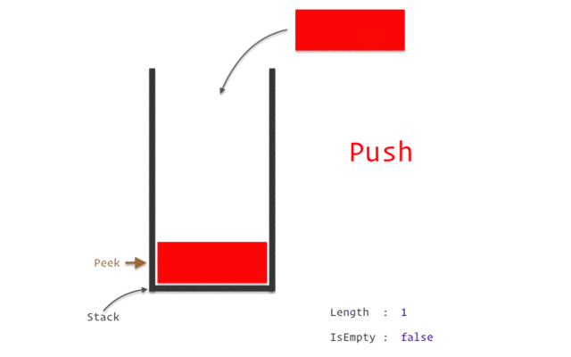

## スタック

スタックはデータ構造の一つです。
スタックの仕組みは、ものを縦に積み上げる事を考えるとイメージしやすいです。
積み上げられた山からものを取り出す場合、上から順番に取り出す事になります。
自分の机の上の郵便が、古いものが下、新しい郵便は上に重ねて置かれ、封筒を開けるのは上の郵便から開ける仕草に似ています。
スタックにデータを追加する場合、データは一番最後に追加されます。
スタックにデータを追加する操作をpushと呼びます。
スタックからデータを取り出す場合、最も新しく追加されたデータから取り出されます。
スタックからデータを取り出す操作をpopと呼びます。
このような、後から入れたものを先に出す「後入れ先出し」の仕組みを「Last In First Out 」を略してLIFOと呼びます。





## プログラムソース
この章で使っているプログラムソースは以下にあります。
[03_1Stack.sh 一般的な配列のスタック](https://github.com/suzukiiichiro/Algorithms-And-Data-Structures/tree/master/Bash)
[03_2Eval_Stack.sh 擬似的な２次元配列で実装したスタック](https://github.com/suzukiiichiro/Algorithms-And-Data-Structures/tree/master/Bash)


## スタックの処理アルゴリズム

では実行処理を書きます。
execStack という実行関数にして、配列を１０用意することにします。

```bash
##
# 実行
execStack 10;
exit;
```

では、execStack()関数を書きます。
execStack()関数の中身として、１０個の配列にランダムな値を一つ一つ代入して配列を完成させる処理。
その後、スタックのPOPポップ、PUSHプッシュ、そして今の段階の配列の状態を確認するdisplay()関数の呼び出しを一連で書き連ねたstack()関数の呼び出しを書きます。


```bash
##
# <>execStack()
# スタックの実行
function execStack(){
 setArray "$1";
 stack;
}
##
# 実行
execStack 10;
exit;
```

では setArray() を見ていきます。
execStack()で呼び出しているのは、

``` 
  set Array "$1";
```
ですが、"$1"というのは、 

```
execStack 10;
```

の、１０です。
setArray()では、受け取った１０が入った変数は$1として受け取ります。forループの条件式の中で$1が見えますね。
このsetArray()は、これまでの配列、バブルソート、選択ソート、挿入ソートでもでてきた同じものです。
inset()されるたびに、peekがインクリメントして、新しい要素にランダムに生成された値を代入します。


```bash
##
# <>insert()
# 配列に値を挿入
function insert(){
  array[$((peek++))]="$1";
}
##
# <>setArray()
# 配列にランダムな値を要素として挿入
function setArray(){
  peek=0;
  for((i=0;i<$1;i++));do
    insert $(echo "$RANDOM");
  done
}

```
次にstack()関数を見ていきます。
stack()関数を追記したソースは以下のとおりです。
上から順番に、display で、まずは入れ全体の状態を見ます。
次に stackPop で、配列から一つPOP(抜き出す）します。
次に stackPush で、配列の末尾にランダムな値を一つ追加します。

```bash
##
# <>stack()
# スタック（表示とポップとプッシュ）の実行
function stack(){
  display;  #表示
  stackPop; 
  stackPush;
  stackPush;
  display;  #表示
  stackPop;
  stackPop;
  stackPop;
  stackPop;
  display;  #表示
  stackPop;
  stackPop;
  stackPop;
  display;  #表示
  stackPop;
  stackPop;
  stackPop;
  display;  #表示
  stackPop;
  stackPop; # Empty
}
##
# <>execStack()
# スタックの実行
function execStack(){
 setArray "$1";
 stack;
}
##
# 実行
execStack 10;
exit;
```


さて、スタックを知るために必要なのは以下の３つの関数です。
プッシュ、ポップはイメージでわかると思います。
図を見ていただければ直感的に理解できると思います。
ピークというのは、これも図のpeekを見てもらうとわかりやすいです。これまでのアルゴリズムの中で`nElems`という変数で使われていたものが、スタックの中ではpeekと名前を変えています（アルゴリズムの世界でそうされています）
stackPeek()という関数は、プッシュ、ポップをするたびに呼び出される関数で、今何をプッシュしたか、今何をポップしたかを表示する関数です。
プッシュ、ポップするたびに、peekは上がったり下がったりします。


```bash
##
# <>stackPeek()
# ピーク
function stackPeek(){
  echo "$1 : $peek:"${array[$peek]}"";
}
##
# <>stackPush()
# プッシュ
function stackPush(){
  array[$((peek))]=$(echo "$RANDOM");
  stackPeek "push";
  ((peek++));
}
##
# <>stackPop()
# ポップ
function stackPop(){
  if (($peek!=0));then
    ((peek--));
    stackPeek "pop";
  else
    echo "Stack is empty";
  fi
}
```


## bash/シェルスクリプトによる疑似２次元配列の実装

```bash:03_1Eval_Stack.sh
#######################################
# 03_1Stack.shを、少しだけオブジェクティブに
# aRray[0].getValue() で値を取得できるように改変した
# 配列にIDと値を入れるだけのbashスクリプト
#######################################
##
# グローバル変数
declare -i nElems=0;
#
# <>display()  
# 配列を表示
function display(){
  for((i=0;i<nElems;i++)){
    echo -n "aRray[$i]  \
    ID: " $( aRray[$i].getID ) " \
    Value:" $( aRray[$i].getValue ) ; 
    echo "";
  }
}
##
# <>setValue() 
# セッター
function setValue() {
  #今後挿入や置き換えに備えてnElemsとは別の変数を用意しておく
  local Elem="$1";      
  local value="$2";
	eval "aRray[$Elem].getValue()      { echo "$value"; }"
}
##
# <>setID()
# セッター
function setID(){
  #今後挿入や置き換えに備えてnElemsとは別の変数を用意しておく
  local Elem="$1";      
  local ID="$2";
	eval "aRray[$Elem].getID()         { echo "$ID"; }"
}
##
# stackPeek()
# ピーク
function stackPeek(){
  echo "$1 : $((nElems-1)):$(aRray[$((nElems-1))].getValue)";
}
##
# stackPush()
# プッシュ
function stackPush(){
  local value=$( echo $RANDOM );
  local ID=$(aRray[$((nElems-1))].getID)
  insert $((ID++)) $value;
  stackPeek "push";
}
##
# <>stackPop()
# ポップ
function stackPop(){
  if(($nElems!=0));then
    stackPeek "pop";
    ((nElems--));
  else
    echo "Stack is empty";
  fi 
}
##
# <>stack()
# スタックの処理を明示的に手続き型で書いています。
function stack(){
  display;
  stackPop;
  stackPush;
  stackPush;
  display;
  stackPop;
  stackPop;
  stackPop;
  stackPop;
  display;
  stackPop;
  stackPop;
  stackPop;
  display; 
  stackPop;
  stackPop;
  stackPop;
  display; 
  stackPop;
  stackPop;# Empty
}
##
# <> insert
# 配列の要素に値を代入
function insert(){
  local ID=$1;          #100からの連番
  local value=$2;       #配列に代入される要素の値
  setID     "$nElems"    "$ID";      #IDをセット
  setValue  "$nElems"    "$value";   #Valueをセット
  ((nElems++));
}
##
# <> set Array
# 配列を作成
function setArray(){
  local N=$1;           #すべての要素数
  local ID=100;         #100からの連番
  local value;          #配列に代入される要素の値
  for((i=0;i<N;i++)){
    value=$( echo $RANDOM );
    insert $((ID++)) $value;
  }
}
##
#
# メインルーチン
function execStack(){
  local N=$1; #配列をセット
  setArray "$N";
  stack;
}
##
# 実行
execStack 10;
exit;
```


## 実行結果

```
aRray[0]      ID:  100      Value: 27417
aRray[1]      ID:  101      Value: 2106
aRray[2]      ID:  102      Value: 12360
aRray[3]      ID:  103      Value: 10391
aRray[4]      ID:  104      Value: 20982
aRray[5]      ID:  105      Value: 4280
aRray[6]      ID:  106      Value: 8584
aRray[7]      ID:  107      Value: 30998
aRray[8]      ID:  108      Value: 363
aRray[9]      ID:  109      Value: 29461
pop : 9:29461
push : 9:30571
push : 10:9219
aRray[0]      ID:  100      Value: 27417
aRray[1]      ID:  101      Value: 2106
aRray[2]      ID:  102      Value: 12360
aRray[3]      ID:  103      Value: 10391
aRray[4]      ID:  104      Value: 20982
aRray[5]      ID:  105      Value: 4280
aRray[6]      ID:  106      Value: 8584
aRray[7]      ID:  107      Value: 30998
aRray[8]      ID:  108      Value: 363
aRray[9]      ID:  108      Value: 30571
aRray[10]      ID:  108      Value: 9219
pop : 10:9219
pop : 9:30571
pop : 8:363
pop : 7:30998
aRray[0]      ID:  100      Value: 27417
aRray[1]      ID:  101      Value: 2106
aRray[2]      ID:  102      Value: 12360
aRray[3]      ID:  103      Value: 10391
aRray[4]      ID:  104      Value: 20982
aRray[5]      ID:  105      Value: 4280
aRray[6]      ID:  106      Value: 8584
pop : 6:8584
pop : 5:4280
pop : 4:20982
aRray[0]      ID:  100      Value: 27417
aRray[1]      ID:  101      Value: 2106
aRray[2]      ID:  102      Value: 12360
aRray[3]      ID:  103      Value: 10391
pop : 3:10391
pop : 2:12360
pop : 1:2106
aRray[0]      ID:  100      Value: 27417
pop : 0:27417
Stack is empty
```


## 「ざっくり」シリーズのご紹介
【アルゴリズム 再帰】ざっくりわかるシェルスクリプト１５
https://suzukiiichiro.github.io/posts/2022-10-07-01-algorithm-recursion-suzuki/
【アルゴリズム キュー】ざっくりわかるシェルスクリプト１４
https://suzukiiichiro.github.io/posts/2022-10-06-01-algorithm-queue-suzuki/
【アルゴリズム スタック】ざっくりわかるシェルスクリプト１３
https://suzukiiichiro.github.io/posts/2022-10-06-01-algorithm-stack-suzuki/
【アルゴリズム 挿入ソート】ざっくりわかるシェルスクリプト１２
https://suzukiiichiro.github.io/posts/2022-10-05-01-algorithm-insertionsort-suzuki/
【アルゴリズム 選択ソート】ざっくりわかるシェルスクリプト１１
https://suzukiiichiro.github.io/posts/2022-10-05-01-algorithm-selectionsort-suzuki/
【アルゴリズム バブルソート】ざっくりわかるシェルスクリプト１０
https://suzukiiichiro.github.io/posts/2022-10-05-01-algorithm-bubblesort-suzuki/
【アルゴリズム ビッグオー】ざっくりわかるシェルスクリプト９
https://suzukiiichiro.github.io/posts/2022-10-04-01-algorithm-bigo-suzuki/
【アルゴリズム ２次元配列編】ざっくりわかるシェルスクリプト８
https://suzukiiichiro.github.io/posts/2022-10-03-01-algorithm-eval-array-suzuki/
【アルゴリズム 配列準備編】ざっくりわかるシェルスクリプト７
https://suzukiiichiro.github.io/posts/2022-10-03-01-algorithm-array-suzuki/ 
【アルゴリズム 配列編】ざっくりわかるシェルスクリプト６
https://suzukiiichiro.github.io/posts/2022-09-27-01-array-suzuki/
【grep/sed/awkも】ざっくりわかるシェルスクリプト５
https://suzukiiichiro.github.io/posts/2022-02-02-01-suzuki/
【grep特集】ざっくりわかるシェルスクリプト４
https://suzukiiichiro.github.io/posts/2022-01-24-01-suzuki/
【はじめから】ざっくりわかるシェルスクリプト３
https://suzukiiichiro.github.io/posts/2022-01-13-01-suzuki/
【はじめから】ざっくりわかるシェルスクリプト２
https://suzukiiichiro.github.io/posts/2022-01-12-01-suzuki/
【はじめから】ざっくりわかるシェルスクリプト１
https://suzukiiichiro.github.io/posts/2022-01-07-01-suzuki/

【TIPS】ざっくりわかるシェルスクリプト
https://suzukiiichiro.github.io/posts/2022-09-26-01-tips-suzuki/


<!--
{}
ヒント
{}

{}
注意
{}
-->


## 書籍の紹介

{{% amazon

title="詳解 シェルスクリプト 大型本  2006/1/16"

url="https://www.amazon.co.jp/gp/proteect/4873112672/ref=as_li_tl?ie=UTF8&camp=247&creative=1211&creativeASIN=4873112672&linkCode=as2&tag=nlpqueens09-22&linkId=ef087fd92d3628bb94e1eb10cb202d43"

summary=`Unixのプログラムは「ツール」と呼ばれます。
Unixは、処理を実現するために複数の道具(ツール)を組み合わせる「ソフトウェアツール」という思想の下に設計されているためです。
そしてこれらツールを「組み合わせる」ということこそがUnixの真髄です。
また、シェルスクリプトの作成には言語自体だけでなくそれぞれのツールに対する理解も求められます。
つまり、あるツールが何のためのものであり、それを単体あるいは他のプログラムと組み合わせて利用するにはどのようにすればよいかということを理解しなければなりません。
本書は、Unixシステムへの理解を深めながら、シェルスクリプトの基礎から応用までを幅広く解説します。
標準化されたシェルを通じてUnix(LinuxやFreeBSD、Mac OS XなどあらゆるUnix互換OSを含む)の各種ツールを組み合わせ、
目的の処理を実現するための方法を詳しく学ぶことができます。
`
imageUrl="https://m.media-amazon.com/images/I/51EAPCH56ML._SL250_.jpg"
%}}

{}


{{% amazon

title="[改訂第3版]シェルスクリプト基本リファレンス ──#!/bin/shで、ここまでできる (WEB+DB PRESS plus) 単行本（ソフトカバー）  2017/1/20"

url="https://www.amazon.co.jp/gp/proteect/4774186945/ref=as_li_tl?ie=UTF8&camp=247&creative=1211&creativeASIN=4774186945&linkCode=as2&tag=nlpqueens09-22&linkId=8ef3ff961c569212e910cf3d6e37dcb6"

summary=`定番の1冊『シェルスクリプト基本リファレンス』の改訂第3版。
シェルスクリプトの知識は、プログラマにとって長く役立つ知識です。
本書では、複数のプラットフォームに対応できる移植性の高いシェルスクリプト作成に主眼を置き、
基本から丁寧に解説。
第3版では最新のLinux/FreeBSD/Solarisに加え、組み込み分野等で注目度の高いBusyBoxもサポート。
合わせて、全収録スクリプトに関してWindowsおよびmacOS環境でのbashの動作確認も行い、さらなる移植性の高さを追求。
ますますパワーアップした改訂版をお届けします。`
imageUrl="https://m.media-amazon.com/images/I/41i956UyusL._SL250_.jpg"
%}}

{{% amazon

title="新しいシェルプログラミングの教科書 単行本"

url="https://www.amazon.co.jp/gp/proteect/4797393106/ref=as_li_tl?ie=UTF8&camp=247&creative=1211&creativeASIN=4797393106&linkCode=as2&tag=nlpqueens09-22&linkId=f514a6378c1c10e59ab16275745c2439"

summary=`エキスパートを目指せ!!

システム管理やソフトウェア開発など、
実際の業務では欠かせないシェルスクリプトの知識を徹底解説

ほとんどのディストリビューションでデフォルトとなっているbashに特化することで、
類書と差別化を図るとともに、より実践的なプログラミングを紹介します。
またプログラミング手法の理解に欠かせないLinuxの仕組みについてもできるかぎり解説しました。
イマドキのエンジニア必携の一冊。

▼目次
CHAPTER01 シェルってなんだろう
CHAPTER02 シェルスクリプトとは何か
CHAPTER03 シェルスクリプトの基本
CHAPTER04 変数
CHAPTER05 クォーティング
CHAPTER06 制御構造
CHAPTER07 リダイレクトとパイプ
CHAPTER08 関数
CHAPTER09 組み込みコマンド
CHAPTER10 正規表現と文字列
CHAPTER11 シェルスクリプトの実行方法
CHAPTER12 シェルスクリプトのサンプルで学ぼう
CHAPTER13 シェルスクリプトの実用例
CHAPTER14 テストとデバッグ
CHAPTER15 読みやすいシェルスクリプト
`
imageUrl="https://m.media-amazon.com/images/I/41d1D6rgDiL._SL250_.jpg"
%}}


