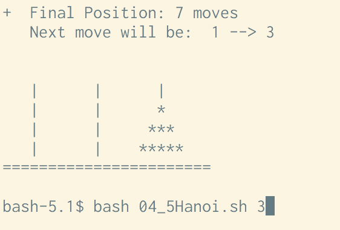

## 再帰

実行している関数自身の関数の処理内で、自分自身である関数を呼び出し実行することです。
再帰は必ず基底条件を明示する必要があります。
（基底条件については以降説明します）

プログラマの９割は再帰呼び出しを苦手としているそうです。
裏を返せば、残りの１割がトップコーダーであるわけで、トップコーダーとなる必須条件が「再帰」なのです。

恐れることはありません。
代表される再帰の事例を３つ用意しました。

「再帰」・・。自分で自分を呼び出す。
そんな馬鹿なこと・・・。
そりゃそうです。
でもプログラムではできるんです。


## プログラムソース
この章で使っているプログラムソースは以下にあります。
[04_1Factorial.sh 再帰-階乗](https://github.com/suzukiiichiro/Algorithms-And-Data-Structures/tree/master/Bash)
[04_2Euclid.sh 再帰-ユークリッドの互除法](https://github.com/suzukiiichiro/Algorithms-And-Data-Structures/tree/master/Bash)
[4_3Trianglar.sh.sh 再帰-三角数](https://github.com/suzukiiichiro/Algorithms-And-Data-Structures/tree/master/Bash)
[04_4Hanoi.sh 再帰-ハノイの塔](https://github.com/suzukiiichiro/Algorithms-And-Data-Structures/tree/master/Bash)
[04_5Hanoi.sh 再帰-ハノイの塔CUI版](https://github.com/suzukiiichiro/Algorithms-And-Data-Structures/tree/master/Bash)


## 階乗
３人います。
３人をA、B、Cとします。
３人が並ぶ順序の種類を算出する方法は、
以下の方法で求められます。

３！＝１＊２＊３＝６通り

５人の順序の種類は
５！＝１＊２＊３＊４＊５＝１２０通り

５の階乗は ５！ と表現します。

10の階乗を求める場合は？

１０！＝１＊２＊３＊４＊５＊６＊７＊８＊９＊１０
＝何通り？

大変ですよね。

こうした「階乗（ｆａｃｔｏｒｉａｌ）」を求めるメソッドfactorial()は、関数の中で自分自身であるfactorial()を呼び出すことで簡単に解を求めることができます。
自分で自分を呼び出すこのような関数呼び出しを「再帰呼び出し」と言います。

階乗をもとめるBash/シェルスクリプト
```bash:04_1Factorial.sh
#!/usr/bin/bash

##
# <>factorial()
# 階乗（再帰）
function factorial(){
  local param=$1;
  # 基底条件
  if((param==1));then   
    echo "1" ;
  else
    # 再帰
    echo $(( param * $(factorial $((param-1))) )) ;
  fi
}
##
# メイン
factorial 10 ;
exit ;
#
```

実行結果は以下のとおりです。
```
bash-5.1$ bash 04_1Factorial.sh
3628800
bash-5.1$
```


## ユークリッドの互除法（最大公約数）

 二つの整数値の最大公約数は、再帰で簡単に求める事が出来ます。
 整数値を長方形の二辺の長さと考えます。

 以下の長方形（８ｘ２２）を、あまりが出ないように「正方形」で埋め尽くしてください。
 そのようにして作られる正方形の辺の長さを求めたいです。

まずとりあえず８ｘ２２の長方形があります。
```
                  22
  +--------------------------------+
  |                                |
  |                                |
 8|                                |
  |                                |
  |                                |
  +--------------------------------+
```

この長方形の中にできるだけ大きな正方形を作ればよいわけです。
高さが８ですので正方形の辺の最大値は８ですね。
ではまずは８ｘ８の正方形を２つ作ることができますね。
```
        8           8         6
  +--------------------------------+
  |           |           |        |
  |           |           |        |
 8|           |           |        |
  |           |           |        |
  |           |           |        |
  +--------------------------------+
```

右側に高さ８横６のスペースがありますね。
となるとさらに６ｘ６の正方形をつくることができますね。
```
        8           8         6
  +--------------------------------+
  |           |           |        |
  |           |           |6       |
 8|           |           |        |
  |           |           |--------|
  |           |           |        |
  +--------------------------------+
```

右下にちょっとしたスペースが残っています。
８−６＝２ですので、２ｘ２の正方形を３つ作ることができます。
```
        8           8         6
  +--------------------------------+
  |           |           |        |
  |           |           |6       |
 8|           |           |        |
  |           |           |--------|
  |           |           | 2| 2| 2|
  +--------------------------------+
                            2  2  2
```


このことから「２２と８の最大公約数」は「２」であることがわかりました。
そりゃ図で書けば出ますよね。


実際にやってみてこんなことが言えそうです。

 - 二つの整数値が与えられたとき、大きいほうの値を小さい方の値で割ってみて、割り切れれば小さい方の値が最大公約数
 - 割り切れない場合は、小さい方の値と得られた余剰に対して、同じ手続きを割り切れるまで再帰的に繰り返す。
 - いずれが０であれば基底として折り返す。


ソースは以下のとおりです。
```bash:04_2Euclid.sh
# <> gcd()
# ユークリッドの互除法（再帰）
function gcd(){
  local x=$1;
  local y=$2;
  # 基底条件
  if(($2==0));then
    echo "$x";
  else
    # 再帰
    echo $(gcd $y $(($x % $y)) ); 
  fi
}
#
gcd 22 8 ; # 22x8の四角形
exit ;
#
```

実行結果は以下のとおりです。

```
bash-5.1$ bash 04_2Euclid.sh
2
bash-5.1$
```


## 三角数
 
これは僕が初めて再帰を勉強したときの問題です。
とても良い問題でせす。興味深く見てください。

  まず、小さな四角の箱がならび三角計が作られています。
  三角形の底辺の数をNとします。
  以下の三角形の底辺は、箱が２つならんでいるのでNは２ですね。
  Nが２の時の三角形全体の箱の数の合計は３です。

```
  □   
  □□ 
  N:2=3
```

  N（底辺の箱の数）が３の時の三角形全体の箱の数の合計は６です。

```
  □    
  □□  
  □□□
  N:3=6 
```


  以下のようになりますね。

```
  □
  N:1=1

  □
  □□
  N:2=3

  □
  □□
  □□□
  N:3=6

  □
  □□
  □□□
  □□□□
  N:4=10

  □
  □□
  □□□
  □□□□
  □□□□□
  N:5=15

  □
  □□
  □□□
  □□□□
  □□□□□
  □□□□□□
  N:6=21

  □
  □□
  □□□
  □□□□
  □□□□□
  □□□□□□
  □□□□□□□
  N:7=28
```

 
  問題）
  N（底辺の箱の数）が６４個ある場合の三角形全体の数は？
  Nが７の場合は２８ありました。
  Nが６４あると・・・。
  かぞえるのも紙に書くのもちょっとむずかしいですね。  
  こういったときに再帰を使います。

  Nが７時の三角形全体の箱の数を求めたいと思います。
  「答えは２８」と言わずに、ちょっと聞いてください。

  先に行ってしまうと。
  一つ手前のN6の箱の数に自分のNを足せば答えが出ます。
  N:6=21ですから、２１＋７＝２８です。

  １．まず自分の場所はN:7である。答えはまだわかっていない。
  ２．一つ前のN６に答えを聞いてみる。
  ３．でもN６もわからないわけです。
  ４．N６を求めるためにN５の合計を聞きに行きます。
  ５．N５の合計を求めるためにN４に答えを聞きに行きます。
  ６．N４を求めるためにN３の合計を聞きに行きます。
  ７．N３の合計を求めるためにN２に答えを聞きに行きます。
  ８．N３を求めるためにN２の合計を聞きに行きます。
  ９．N２の合計を求めるためにN１に答えを聞きに行きます。

  N：１＝１
  この１を「基底数」と言います。すごく重要です。
  再帰は、「規定数にたどり着いたら、そこで折り返す」というルルールです。

  １０．折返し、N１が１とわかったので、N２に「N１は１」と教える
  １１．N:１＝１とわかったので、１と自分自身のN:2を足し合わせて３であることをN３に伝える。
  １２．N:２＝３とわかったので、３と自分自身のN:3を足し合わせて６であることをN４に伝える。
  １３．N５はN４が１０なので、１０＋５＝１５
  １４．N６はN５が１５なので、１５＋６＝２１
  １５．N７はN６が２１なので、２１＋７＝２８
  ：
  ：
  ＜くりかえし＞


　Nが６４までは大変ですが、まあプログラムではわけがありません。
こうなります。

```bash:04_3Trianglar.sh
##
# <>triangle
# 三角数（再帰）
function triangle(){
  local param=$1;
  # 基底条件
  if(($param==1));then
    echo "1";
  else
    # 再帰
    echo $(( param + $(triangle $(($param-1))) ));
  fi
}
##
# メイン
triangle 64;
exit ;

```

実行結果は以下のとおりです。

```
bash-5.1$ bash 04_3Trianglar.sh
2080
bash-5.1$
```

恐ろしく簡単ですね。
triangle()関数の中で、triangle()関数を呼び出しています。
`$param -1` が肝です。
ひとつ減っているのは、Nが一つ小さな箱の合計数を訪ねに行っているのです。
  
あまり深く考えずに、まずはつぎの事例も見てみましょう。

{}
ヒント
: 計算式一発で解を得る場合（最初に言えと言わないで）
: N番目の三角数＝(N^2+N)/2
:
: N=28の場合
: （２８＊２８＋２８）/ ２ ＝２０８０
:
: きゃーー！
{}


## 「ハノイの塔」

 古代インドの神話では、遠い秘境のお寺で僧侶達が毎日毎晩、６４枚の黄金の円盤をダイヤモンドをちりばめた３つの塔の間で移し替え作業をしているそうです。
 その移し替え作業が完了したら世界の終末が訪れるのだそうです。

 多くの有用なアルゴリズムは再帰的な構造をもっています。
 与えられた問題を、その問題に関連した幾つかの部分問題として解くこのようなアルゴリズムを「分割統治法」と呼びます。(問題は、サイズが小さいほうが簡単に解けることが多いことに注意。)
 再帰による（二分探索）バイナリサーチは、分割統治方式の典型です。
 大きな問題を、２つの小さな問題に分割して、それぞれを別々に解くことで、問題を解決するという考え方です。
 そのそれぞれの小さな問題の解き方がまたむずかしい場合。
それもやはり同じで、つまりもっと小さな２つの問題に分割して、そのそれぞれを解けばよいわけです。
こうした小さな問題に分割する「分割課程」が、基底条件に達するまで続けます。
基底条件に達したら、問題はそれ以上分割する必要がなくなり、問題は容易に解決できるというアルゴリズムです。


分割統治法は次の3ステップからなります。

- (分割 Divide) 与えられた大きなサイズの問題を、幾つかの部分問題に分割する。
- (統治 Conquer) これらの部分問題のそれぞれを再帰的に解く。
- (結合 Combine) 求められた部分問題の解から、元の問題の解を求める。

 分割統治方式を実装する再帰メソッドには、通常、自分自身を呼び出す再帰呼び出しが２つあります。
 それぞれ問題の上半分と下半分に対して自分を呼び出すのです。
 
n枚の円盤すべてを移動させるには最低 2^n - 1 回の手数がかかります。
 ６４枚の円盤すべてを移動させるには、最低でも（264-1）回 = 18,446,744,073,709,551,615（1844京6744兆737億955万1615）回かかり、１枚移動させるのに1秒かかったとすると、最低でも約5,845億年かかります（なお、ビッグバンは今から約137億年前に発生したとされている）。

ハノイの塔の問題に対する再帰的な分割統治アルゴリズムによって得られる解は、２のｎ乗-1回の移動となります。

 n^2-1
 n=3
 2x2x2-1=7

 wiki pediaに詳しく書いてあります。
 https://ja.wikipedia.org/wiki/ハノイの塔


## 「ハノイの塔」ルール

・一度に1枚だけ円盤を移動する。
・小さい円盤の上に大きな円盤を載せてはいけない。
・棒A、棒B、棒C以外の場所に円盤を置いてはならない。


## 「ハノイの塔」動き方

見ていてもプログラムが浮かびませんね（笑）


ここをみてください。とても詳しく書かれています。
http://www13.plala.or.jp/kymats/study/C++/Hanoi/Hanoi.html


重要なのは、上記サイトの以下の部分です。
```
ここで重要なのは「3回」の時です。
移動させるべき3枚の円盤の中から
2枚の円盤を棒Aから棒Bに移動させた状態ですね。

同様に「5回」の時は……
移動させるべき2枚の円盤の中から
1枚の円盤を棒Bから棒Aに移動させた状態ですね。

つまり……
「移動させる円盤が n 枚ならば、
まずは n-1 枚を棒Aから棒Bに移動しておかなければならない。」
という法則が成り立つのです。

そこに至るまでの過程は無視して下さい。
```

３枚の円盤の動きを一枚一枚追っていくのではなく、
一枚と、２枚（n-1）重なった円盤の組み合わせの動きに着目することです。（上記サイトの３回目にあたります）


さらにこのサイトで、考えかたとして重要なことは以下であると書かれています。

```
もう一度まとめてみると以下の繰り返しであることがわかります。

１．一番下の円盤を棒Cへ移動させたい。
２．その為に上に載っている全ての円盤を空いている棒(A or B)に移動させる。
３．一番下の円盤を棒Cへ移動させる。
```

http://www13.plala.or.jp/kymats/study/C++/Hanoi/Hanoi.html

上記サイトの動きをBash/シェルスクリプトで作ると以下の通りとなります。


```bash:04_4Hanoi.sh
##########################
# ハノイの塔
# Bash/シェルスクリプト版
##########################
declare -i Moves=0;
##
# <>Hanoi()
# ハノイの塔の再帰処理部分
function Hanoi() {
  local n="$1";
  local from="$2";
  local work="$3";
  local dest="$4";
  if((n==1));then
    echo "move $from->$dest";         
  else
    Hanoi "$((n-1))" $from $dest $work; 
    echo "move $from->$dest";         
    Hanoi "$((n-1))" $work $from $dest; 
  fi
  ((Moves++));
}
##
# <>execHanoi()
# ハノイの塔の実行呼び出し
function execHanoi(){
  #第二引数から第四引数へ n 枚の円盤を移動
  Hanoi $1 "A" "B" "C";
  echo "Total moves = $Moves";
}
##
# メイン
execHanoi 3 ;
exit;
#
```


実行結果は以下のとおりです。

```
bash-5.1$ bash 04_4Hanoi.sh
move A->C
move A->B
move C->B
move A->C
move B->A
move B->C
move A->C
Total moves = 7
bash-5.1$
```

## ハノイの塔の実稼働が見えるCUI版

```bash:04_5Hanoi.sh
#!/bin/bash

# 起動方法  ./ファイル名 円盤の数
# ./Hanoni.sh 5 
#
# グローバル変数
declare -i DISKS=$1;
declare -i E_NOPARAM=86;
declare -i E_BADPARAM=87;   
declare -i E_NOEXIT=88;
declare -i Moves=0;
declare -i MWIDTH=7;
declare -i MARGIN=2;
declare -a Rod1; # 軸１
declare -a Rod2; # 軸２
declare -a Rod3; # 軸３
#
DELAY=0.3    # ディレクをかける
#
##
# <>repeat()
#
function repeat(){  
  for((i=0;i<$2;i++)){
    echo -n "$1";
  }
}
##
# <>FromRod()
#
function FromRod  {
  local rod summit weight sequence
  while true; do
    rod=$1;
    test ${rod/[^123]/} || continue;
    sequence=$(echo $(seq 0 $disks1 | tail -r ));
    for summit in $sequence; do
      eval weight=\${Rod${rod}[$summit]};
      test $weight -ne 0 &&
           { echo "$rod $summit $weight"; return; }
    done
  done
}
##
# <>ToRod()
#
function ToRod  { 
  local rod firstfree weight sequence
  while true; do
    rod=$2;
    test ${rod/[^123]} || continue;
    sequence=$(echo $(seq 0 $disks1 | tail -r));
    for firstfree in $sequence; do
      eval weight=\${Rod${rod}[$firstfree]};
      test $weight -gt 0 && { (( firstfree++ )); break; };
    done
    test $weight -gt $1 -o $firstfree = 0 &&
         { echo "$rod $firstfree"; return; }
  done
}
##
# <>PrintRods()
#
function PrintRods  {
  local disk rod empty fill sp sequence;
  tput cup 5 0;
  repeat " " $spaces1;
  echo -n "|";
  repeat " " $spaces2;
  echo -n "|";
  repeat " " $spaces2;
  echo "|";
  sequence=$(echo $(seq 0 $disks1 | tail -r));
  for disk in $sequence;do
    for rod in {1..3};do
      eval empty=$(( $DISKS - (Rod${rod}[$disk] / 2) ));
      eval fill=\${Rod${rod}[$disk]};
      repeat " " $empty;
      test $fill -gt 0 && repeat "*" $fill || echo -n "|";
      repeat " " $empty;
    done
    echo;
  done
  repeat "=" $basewidth   ;
  echo
}
##
# <>display()
#
function display(){
  echo;
  PrintRods;
  first=( `FromRod $1` );
  eval Rod${first[0]}[${first[1]}]=0;
  second=( `ToRod ${first[2]} $2` );
  eval Rod${second[0]}[${second[1]}]=${first[2]};
  if [ "${Rod3[lastmove_t]}" = 1 ];then   
    tput cup 0 0;
    echo; echo "+  Final Position: $Moves moves";
    PrintRods;
  fi
  sleep $DELAY;
}
##
# <>dohanoi()
#
function dohanoi() {   
  case $1 in
  0)
  ;;
  *)
    dohanoi "$(($1-1))" $2 $4 $3
    if [ "$Moves" -ne 0 ];then
      tput cup 0 0;
      echo; echo "+  Position after move $Moves";
    fi
    ((Moves++));
    echo -n "   Next move will be:  ";
    echo $2 "-->" $3;
    display $2 $3;
    dohanoi "$(($1-1))" $4 $3 $2;
  ;;
  esac
}
##
# setup_arrays()
#
function setup_arrays(){
  local dim n elem;
  let "dim1 = $1 - 1";
  elem=$dim1;
  for n in $(seq 0 $dim1);do
    let "Rod1[$elem] = 2 * $n + 1";
    Rod2[$n]=0;
    Rod3[$n]=0;
    ((elem--));
  done
}
##
# メイン
#
let "basewidth = $MWIDTH * $DISKS + $MARGIN" 
let "disks1 = $DISKS - 1"
let "spaces1 = $DISKS" 
let "spaces2 = 2 * $DISKS" 
let "lastmove_t = $DISKS - 1"                
trap "tput cnorm" 0
tput civis;
clear;                # 画面のクリア
setup_arrays $DISKS;  # 配列の作成
tput cup 0 0;
echo; echo "+  Start Position";
case $# in 
  1) 
    case $(($1>0)) in     
      1)
        disks=$1;
        dohanoi $1 1 3 2;
        echo;
        exit 0;
      ;;
      *)
        echo "$0: Illegal value for number of disks";
        exit $E_BADPARAM;
      ;;
    esac
  ;;
  *)
    echo "実行方法: $0 N";
    echo "       Where \"N\" is the number of disks.";
    exit $E_NOPARAM;
  ;;
esac
exit $E_NOEXIT;  
```

## 実行結果

```
bash-5.1$ bash 04_5Hanoi.sh 3
```

ソースの内容はともかくこういったものもBash/シェルスクリプトで作成できるって面白いですね。（それでよいです）

[04_5Hanoi.sh 再帰-ハノイの塔CUI版](https://github.com/suzukiiichiro/Algorithms-And-Data-Structures/tree/master/Bash)


## 「ざっくり」シリーズのご紹介
【アルゴリズム 再帰】ざっくりわかるシェルスクリプト１５
https://suzukiiichiro.github.io/posts/2022-10-07-01-algorithm-recursion-suzuki/
【アルゴリズム キュー】ざっくりわかるシェルスクリプト１４
https://suzukiiichiro.github.io/posts/2022-10-06-01-algorithm-queue-suzuki/
【アルゴリズム スタック】ざっくりわかるシェルスクリプト１３
https://suzukiiichiro.github.io/posts/2022-10-06-01-algorithm-stack-suzuki/
【アルゴリズム 挿入ソート】ざっくりわかるシェルスクリプト１２
https://suzukiiichiro.github.io/posts/2022-10-05-01-algorithm-insertionsort-suzuki/
【アルゴリズム 選択ソート】ざっくりわかるシェルスクリプト１１
https://suzukiiichiro.github.io/posts/2022-10-05-01-algorithm-selectionsort-suzuki/
【アルゴリズム バブルソート】ざっくりわかるシェルスクリプト１０
https://suzukiiichiro.github.io/posts/2022-10-05-01-algorithm-bubblesort-suzuki/
【アルゴリズム ビッグオー】ざっくりわかるシェルスクリプト９
https://suzukiiichiro.github.io/posts/2022-10-04-01-algorithm-bigo-suzuki/
【アルゴリズム ２次元配列編】ざっくりわかるシェルスクリプト８
https://suzukiiichiro.github.io/posts/2022-10-03-01-algorithm-eval-array-suzuki/
【アルゴリズム 配列準備編】ざっくりわかるシェルスクリプト７
https://suzukiiichiro.github.io/posts/2022-10-03-01-algorithm-array-suzuki/ 
【アルゴリズム 配列編】ざっくりわかるシェルスクリプト６
https://suzukiiichiro.github.io/posts/2022-09-27-01-array-suzuki/
【grep/sed/awkも】ざっくりわかるシェルスクリプト５
https://suzukiiichiro.github.io/posts/2022-02-02-01-suzuki/
【grep特集】ざっくりわかるシェルスクリプト４
https://suzukiiichiro.github.io/posts/2022-01-24-01-suzuki/
【はじめから】ざっくりわかるシェルスクリプト３
https://suzukiiichiro.github.io/posts/2022-01-13-01-suzuki/
【はじめから】ざっくりわかるシェルスクリプト２
https://suzukiiichiro.github.io/posts/2022-01-12-01-suzuki/
【はじめから】ざっくりわかるシェルスクリプト１
https://suzukiiichiro.github.io/posts/2022-01-07-01-suzuki/

【TIPS】ざっくりわかるシェルスクリプト
https://suzukiiichiro.github.io/posts/2022-09-26-01-tips-suzuki/


<!--
{}
ヒント
{}

{}
注意
{}
-->


## 書籍の紹介

{{% amazon

title="詳解 シェルスクリプト 大型本  2006/1/16"

url="https://www.amazon.co.jp/gp/proteect/4873112672/ref=as_li_tl?ie=UTF8&camp=247&creative=1211&creativeASIN=4873112672&linkCode=as2&tag=nlpqueens-22&linkId=ef087fd92d3628bb94e1eb10cb202d43"

summary=`Unixのプログラムは「ツール」と呼ばれます。
Unixは、処理を実現するために複数の道具(ツール)を組み合わせる「ソフトウェアツール」という思想の下に設計されているためです。
そしてこれらツールを「組み合わせる」ということこそがUnixの真髄です。
また、シェルスクリプトの作成には言語自体だけでなくそれぞれのツールに対する理解も求められます。
つまり、あるツールが何のためのものであり、それを単体あるいは他のプログラムと組み合わせて利用するにはどのようにすればよいかということを理解しなければなりません。
本書は、Unixシステムへの理解を深めながら、シェルスクリプトの基礎から応用までを幅広く解説します。
標準化されたシェルを通じてUnix(LinuxやFreeBSD、Mac OS XなどあらゆるUnix互換OSを含む)の各種ツールを組み合わせ、
目的の処理を実現するための方法を詳しく学ぶことができます。
`
imageUrl="https://m.media-amazon.com/images/I/51EAPCH56ML._SL250_.jpg"
%}}

{}


{{% amazon

title="[改訂第3版]シェルスクリプト基本リファレンス ──#!/bin/shで、ここまでできる (WEB+DB PRESS plus) 単行本（ソフトカバー）  2017/1/20"

url="https://www.amazon.co.jp/gp/proteect/4774186945/ref=as_li_tl?ie=UTF8&camp=247&creative=1211&creativeASIN=4774186945&linkCode=as2&tag=nlpqueens-22&linkId=8ef3ff961c569212e910cf3d6e37dcb6"

summary=`定番の1冊『シェルスクリプト基本リファレンス』の改訂第3版。
シェルスクリプトの知識は、プログラマにとって長く役立つ知識です。
本書では、複数のプラットフォームに対応できる移植性の高いシェルスクリプト作成に主眼を置き、
基本から丁寧に解説。
第3版では最新のLinux/FreeBSD/Solarisに加え、組み込み分野等で注目度の高いBusyBoxもサポート。
合わせて、全収録スクリプトに関してWindowsおよびmacOS環境でのbashの動作確認も行い、さらなる移植性の高さを追求。
ますますパワーアップした改訂版をお届けします。`
imageUrl="https://m.media-amazon.com/images/I/41i956UyusL._SL250_.jpg"
%}}

{{% amazon

title="新しいシェルプログラミングの教科書 単行本"

url="https://www.amazon.co.jp/gp/proteect/4797393106/ref=as_li_tl?ie=UTF8&camp=247&creative=1211&creativeASIN=4797393106&linkCode=as2&tag=nlpqueens-22&linkId=f514a6378c1c10e59ab16275745c2439"

summary=`エキスパートを目指せ!!

システム管理やソフトウェア開発など、
実際の業務では欠かせないシェルスクリプトの知識を徹底解説

ほとんどのディストリビューションでデフォルトとなっているbashに特化することで、
類書と差別化を図るとともに、より実践的なプログラミングを紹介します。
またプログラミング手法の理解に欠かせないLinuxの仕組みについてもできるかぎり解説しました。
イマドキのエンジニア必携の一冊。

▼目次
CHAPTER01 シェルってなんだろう
CHAPTER02 シェルスクリプトとは何か
CHAPTER03 シェルスクリプトの基本
CHAPTER04 変数
CHAPTER05 クォーティング
CHAPTER06 制御構造
CHAPTER07 リダイレクトとパイプ
CHAPTER08 関数
CHAPTER09 組み込みコマンド
CHAPTER10 正規表現と文字列
CHAPTER11 シェルスクリプトの実行方法
CHAPTER12 シェルスクリプトのサンプルで学ぼう
CHAPTER13 シェルスクリプトの実用例
CHAPTER14 テストとデバッグ
CHAPTER15 読みやすいシェルスクリプト
`
imageUrl="https://m.media-amazon.com/images/I/41d1D6rgDiL._SL250_.jpg"
%}}


