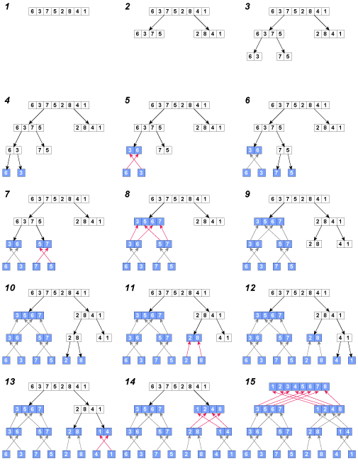
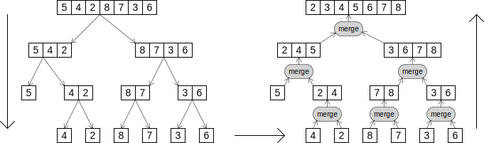

## マージソート
マージソートは、これまで紹介した「バブルソート」「挿入ソート」「選択ソート」と比べると、少なくともスピードの点ではずっと高速で効率的です。


## マージソートの効率
「バブルソート」「挿入ソート」「選択ソート」がO(N^2)の時間を要するのに対し、マージソートはO(N＊log(N))です。
例えば、N(ソートする項目の数）が１０，０００の場合、N^2 は１００，０００，０００ですが、N＊log(N)は４０，０００です。
別の言い方をすると、マージソートで４０秒を要するソートは、挿入ソートでは約２８時間かかります。
プログラムの構成は、今後出てくるクイックソートやシェルソートよりもわかりやすく、構築が容易です。

ソートの比較


## マージソートの欠点
マージソートの欠点は、ソートする配列と同じサイズの配列をもう一つ必要とすることです。
元の配列がかろうじてメモリ内に収まるという大きさだったら、マージソートは使えません。
しかし、メモリに余裕がある場合は、マージソートは良い選択です。


## マージソートのアルゴリズム
マージソートのアルゴリズムの中心は、未ソート配列を要素の数が２以下になるまで分解を繰り返し、１つないし２つの要素を比較、並べ替えを行いながらマージ（併合）を繰り返します。


## 要素列を均等に分割できる場合のマージソート
要素列の要素数が偶数個ある場合は分割は真ん中で行われます。
要素列の要素数がが奇数個の場合、たとえば要素列の要素数が７つの場合、２で割った部分（３ですね）と残り（４）というふうに分割します。
ここでは、要素列の要素数が偶数個の場合を考えていきます。




分割後左側の「分解」処理
１．並べ替える前の未ソート列があります。これをこれからマージソートで並べ替えます。
２．まずは未ソート列を２つに分割します。
３．分割した２つの未ソート列を要素の数が２以下になるまで分割を繰り返します。（ここではあっというまに２以下となりました）
４．分割した要素を比較するため６と３に分解しました。

分割後左側の「マージ」処理
５．６と３を比較して並べ替えと同時にマージ（併合）します。これにより（３，６）となりました。
６．７と５も比較するために７と５に分解します。
７．７と５に分解した要素を比較して並べ替えます。ここでは並べ替える必要はないようでした。
８．（３，６）と（５，７）の４つの要素を比較して並べ替えながらマージ（併合）します。

分割後右側の「分解」処理
９．右側（２，８，４，１）を分解して（２，８）と（４，１）に分解します。
１０．２と８を更に分解し、比較できるように分解します。
１１．２と８を比較して（２，８）とマージしました。ここでは並び順に変更はないようでした。
１２．４と１も比較できるように分解します。

分割後右側の「マージ」処理
１３．分解した４と１を比較して並べ替えを行いつつ（１，４）とマージします。
１４．（２，８）と（１，４）の４つの要素を比較しながらマージします。
１５．（３，５，６，７）と（１，２，４，８）を比較しながらマージします。


{}
ヒント
: 分割段階では要素の数が２以下となるまで分割を繰り返し、マージは、最初は１つ、次は２つの要素を組み合わせて４つとし、次は４つの要素をもつ２つのソート済み列をマージして８つの要素をもつソート済み列を組み上げていきます。
{}


## 要素列を均等に分割できない場合のマージソート
要素列の要素数が偶数個ある場合は分割は真ん中で行われます。
要素列の要素数がが奇数個の場合、たとえば要素列の要素数が７つの場合、２で割った部分（３ですね）と残り（４）というふうに分割します。
ここでは、要素列の要素数が奇数個の場合を考えていきます。



この図では、動作を左右２つに分けて表しています。
左側は分割、右側はマージ（併合）です。
まずは、左側から説明します。

前半の左側の説明
７つの要素があります。
７つの要素は真ん中で半分に分けることができません。
そのため３つ（５，４，２）と４つ（８，７，３，６）に分割しています。
２つに分けたら、（５，４，２）をさらに２つに分けます。
先程同様、３つの要素は真ん中で半分に分けることができません。
ですので、（５）と（４，２）で２つに分けます。
ここが重要なのですが、分解した要素の数が２以下になるまでこれらの動作を繰り返します。
そこで、左側の一番下の図の通り、要素の大小が比較できる直前までを行い準備を完了とします。

後半の右側の説明
後半右側の図は下から処理を進めていきます。
マージソートは、マージ（併合）するたびに並べ替えを行います。
右側一番下の段から二段目に上がる段階で、それぞれの大小を比較して並べ替えを行いマージ（併合）します。
４と２を比較して（２，４）と並べ替えてマージ。
８と７を比較して（７，８）と並べ替えてマージ。
３と６を比較して（３，６）と並べ替えて・・・というかそのままマージします。

右側下から２段目から下から３段目の説明ですが、
５と（２，４）を並べ替えてマージします。
これまでは２つの要素を比較してマージしましたが、ここからの比較・マージの対象となる要素は少しずつ増えます。
（７，８）と（３，６）の４つの要素を比較して小さな要素から順番に並べ替えながらマージします。
右側下から３段目の様子になったら、（２，４，５）と（３，６，７，８）の７つの要素を比較して小さな要素から順番に並べ替えてマージします。

{}
ヒント
: 左側上から２段目の未ソートの要素を並べ替えるよりも、右側下から３段目（上から２段め）の要素列を並べ替えるほうが断然効率的なのです。 
: 理由は、２つの未ソート配列を並べ替えるのと、２つのソート済み配列をマージ（併合）する処理の違いは、要素の比較や交換・移動が、未ソート配列をマージするよりも少なくてすむからです。
: ２つのソート済み配列をマージ（併合）する場合は、２つのソート済み配列先頭の大小を比較しながらマージすれば良いからなのですね。
: マージソートの唯一の欠点は、もとの配列と同じサイズの配列をもう一つ用意する必要があることで、メモリ使用領域が２倍必要ということです。
{}


## プログラムソース
この章で使っているプログラムソースは以下にあります。
[05_1MergeSort.sh マージソート](https://github.com/suzukiiichiro/Algorithms-And-Data-Structures/tree/master/Bash/05_1MergeSort.sh)


## マージソートのアルゴリズム
マージソートのプログラムは、
- mergeSort() 
- merge() 

の２つの部分から構成されています。
まず、配列全体を指定した mergeSort() を呼び出します。
mergeSort()は配列を要素の数が２以下になるまで分割を繰り返すので再帰関数となります。
その後、merge()により２つの済み配列の比較・並べかえを行いながら「マージ(併合)」を繰り返し、１つのソート済み配列を作ります。

配列の 𝑙 番目から 𝑟 番目までをソートする merge_sort(arr[], l, r) のアルゴリズムは以下のようになります。

𝑚𝑖𝑑=(𝑙+𝑟)/2 とする
merge_sort(𝑎𝑟𝑟[],𝑙,𝑚𝑖𝑑) で 𝑙 番目から 𝑚𝑖𝑑 番目までソート
merge_sort(𝑎𝑟𝑟[],𝑚𝑖𝑑+1,𝑟) で 𝑚𝑖𝑑+1 番目から 𝑟 番目までソート
merge(𝑎𝑟𝑟[],𝑙,𝑚𝑖𝑑,𝑟) で先程ソートした配列をマージしながらソート


``` bash:05_1MergeSort.sh
mergeSort(){
  local lowerBound="$1" ;
  local upperBound="$2" ;
  #範囲が１なら再帰呼び出しの終了 基底条件
  if [ "$lowerBound" -eq "$upperBound" ]; then
    #ソートは不要
    :
  else
    #列を２つに分割する中間点を見つける
    local mid=$(( ($lowerBound+$upperBound) / 2 ));
    #前半分をソート
    mergeSort "$lowerBound" "$mid" ;
    #後半分をソート
    mergeSort "$(($mid+1))" "$upperBound"
    #両者をマージ
    mergeSortLogic "$lowerBound" "$(($mid+1))" "$upperBound" ;
  fi
}
```

merge() を実行する時点で、mergeSort( 部分配列の前半 ) と mergeSort( 部分配列の後半 ) の処理はすでに終了しています。
merge はすでにソートされている部分配列の前半と後半に対して実行されます。
言い換えれば、merge の役割は、すでにソートされている２つの部分配列を１つのソートされた部分配列にすることです。


``` bash:05_1MergeSort.sh
merge(){
  #作業スペースのインデクス
  local j=0; 
  #下半分の部分配列が始まる位置
  local lowPtr="$1" ;
  #上半分の部分配列が始まる位置
  local highPtr="$2" ;
  #上半分の配列の上限位置
  local _upperBound="$3" ;
  #下半分の配列の上限位置
  local _lowerBound="$lowPtr" ;
  local _mid="$(($highPtr-1))" ;
  #項目の数
  local n="$(($_upperBound-$_lowerBound+1))" ;

  #マージする列が２つある場合
  while (("$lowPtr" <= "$_mid" && "$highPtr" <= "$_upperBound" ));do
    #小さい値をコピー
    if [ "${array[$lowPtr]}" -lt "${array[$highPtr]}" ]; then
      workArray[$j]="${array[((lowPtr++))]}" ;
      ((j++)) ;
    else
      workArray[$j]="${array[((highPtr++))]}" ;
      ((j++)) ;
    fi
  done
  #前半分のリスト
  while (( "$lowPtr" <= "$_mid" )); do
    #前半分の要素をそのまま作業用配列にコピー
    workArray[$j]="${array[((lowPtr++))]}" ;
    ((j++)) ;
  done
  #後半分のリスト
  while (( "$highPtr" <= "$_upperBound" )) ; do
    #後半分の要素を逆順に作業用配列にコピー
    workArray[$j]="${array[((highPtr++))]}" ;
    ((j++)) ;
  done
  #昇順に整列するよう１つのリストにまとめる
  #作業用配列の両端から取り出したデータをマージして配列に入れる
  for((j=0; j<$n; j++)); do
    array[$(($_lowerBound+$j))]="${workArray[$j]}" ;
  done
}
```

## マージ（併合）のロジック


上の図は、merge()のメカニズムをカードの操作で表します。
左右にカードの束があり、各束のカードは小さい順に整列されているものとします。
merge()の処理は、各カードの山の一番上にあるカードの値を比較し、小さい方を選択して順番に並べます。


## 要素１６のマージソート
要素が増えてもマージソートのロジックは全く変わりません。
複数の要素を真ん中で２つに分け分解を繰り返し、その後併合も繰り返します。
こうしたアルゴリズムを「分割統治法」といいます。


## 要素が大量の場合のマージソート
要素の数が大きくなった場合も分割統治法により、怯える必要がないのです。
分割を再帰により繰り返し、併合を繰り返します。


## マージソートの計算量
- 時間計算量(time complexity)
最悪・平均・最善の計算時間は O(N＊ log(N))となります。これはO(N2)と比べると非常に高速です。

- 領域計算量 (space complexity)
merge() 関数は、配列の長さ Nのオーダーで新しいメモリが必要となってしまいます。
これにより消費メモリはO(N)となります。

## マージソートの効率
では、これまでどおり、ソートの効率をグラフにプロットしたものです。参考にしてください。


## 各ソート比較
こちらのほうがわかりやすいかもしれませんね。


## bash/シェルスクリプトによる疑似２次元配列の実装
``` bash:05_1Eval_MergeSort.sh
#!/bin/bash

#######################################
# 05_1MergeSort.shを、少しだけオブジェクティブに
# aRray[0].getValue() で値を取得できるように改変した
# 配列にIDと値を入れるだけのbashスクリプト
#######################################
##
# グローバル変数
declare -i nElems=0;
declare -i wElems=0;
#
# <>display()  
# 配列を表示
function display(){
  for((i=0;i<nElems;i++)){
    echo -n "aRray[$i]  \
      ID: " $( aRray[$i].getID ) " \
      Value:" $( aRray[$i].getValue ) ; 
    echo "";
  }
}
##
# <>setWvalue() 
# セッター
function setWvalue() {
  #今後挿入や置き換えに備えてnElemsとは別の変数を用意しておく
  local Welem="$1";      
  local wvalue="$2";
  eval "wRray[$Welem].getWvalue()      { echo "$wvalue"; }"
}
##
# <>setWiD()
# セッター
function setWID(){
  #今後挿入や置き換えに備えてnElemsとは別の変数を用意しておく
  local Welem="$1";      
  local wid="$2";
  eval "wRray[$Welem].getWID()         { echo "$wid"; }"
}
##
# <>setValue() 
# セッター
function setValue() {
  #今後挿入や置き換えに備えてnElemsとは別の変数を用意しておく
  local Elem="$1";      
  local value="$2";
  eval "aRray[$Elem].getValue()      { echo "$value"; }"
}
##
# <>setID()
# セッター
function setID(){
  #今後挿入や置き換えに備えてnElemsとは別の変数を用意しておく
  local Elem="$1";      
  local ID="$2";
  eval "aRray[$Elem].getID()         { echo "$ID"; }"
}
##
# <> insert
# 配列の要素に値を代入
function insert(){
  local ID=$1;          #100からの連番
  local value=$2;       #配列に代入される要素の値
  setID     "$nElems"    "$ID";      #IDをセット
  setValue  "$nElems"    "$value";   #Valueをセット
  ((nElems++));
}
##
# <> set Array
# 配列を作成
function setArray(){
  local N=$1;           #すべての要素数
  local ID=100;         #100からの連番
  local value;          #配列に代入される要素の値
  for((i=0;i<N;i++)){
    value=$( echo $RANDOM );
    insert $((ID++)) $value;
  }
}
##
# <>bubbleSort() 
# バブルソート
# URL:https://www.youtube.com/watch?v=xli_FI7CuzA
function bubbleSort(){
  local tmp_id;
  local tmp_value;
  for((i=nElems;i>0;i--)){
    for((j=0;j<i-1;j++)){
      if(($(aRray[$j].getValue)>$(aRray[$((j+1))].getValue)));then
        # 交換
        tmp_id=$(aRray[$j].getID);
        tmp_value=$(aRray[$j].getValue);
        setID     "$j"    $(aRray[$((j+1))].getID);      #IDをセット
        setValue  "$j"    $(aRray[$((j+1))].getValue);   #Valueをセット
        setID     $((j+1))    $tmp_id;      #IDをセット
        setValue  $((j+1))    $tmp_value;   #Valueをセット
        # 交換
      fi 
    } 
  }  
}
## <>selectionSort()
# 選択ソート
# URL:https://www.youtube.com/watch?v=g-PGLbMth_g
function selectionSort(){
  local tmp_id;
  local tmp_value;
  for((i=0;i<nElems;i++)){
    min=$i;
    for((j=i+1;j<nElems;j++)){
      if(($(aRray[$min].getValue)>$(aRray[$j].getValue)));then
        min=$j;
      fi
    }
    # 交換
    tmp_id=$(aRray[$min].getID);
    tmp_value=$(aRray[$min].getValue);
    setID     "$min"    $(aRray[$i].getID);      #IDをセット
    setValue  "$min"    $(aRray[$i].getValue);   #Valueをセット
    setID     $i    $tmp_id;      #IDをセット
    setValue  $i    $tmp_value;   #Valueをセット
    # 交換
  }
}
##
## <>insertionSort()
# 挿入ソート
# URL:https://www.youtube.com/watch?v=DFG-XuyPYUQ
function insertionSort(){
  local tmp_id;
  local tmp_value;
  for((out=1;out<nElems;out++)){
    tmp_id=$(aRray[$out].getID);
    tmp_value=$(aRray[$out].getValue);
    in=$out;
    while (( in > 0 ))&&(( $(aRray[$((in-1))].getValue) > tmp_value ));do
      setID     "$in"    $(aRray[$((in-1))].getID);      #IDをセット
      setValue  "$in"    $(aRray[$((in-1))].getValue);   #Valueをセット
      in=$((in-1));
    done 
    setID     "$in"    $tmp_id;      #IDをセット
    setValue  "$in"    $tmp_value;   #Valueをセット
  } 
}
##
# merge()
# マージソートのマージ（併合）部分メソッド
merge(){
  #作業スペースのインデクス
  local j=0; 
  #下半分の部分配列が始まる位置
  local lowPtr="$1" ;
  #上半分の部分配列が始まる位置
  local highPtr="$2" ;
  #上半分の配列の上限位置
  local _upperBound="$3" ;
  #下半分の配列の上限位置
  local _lowerBound="$lowPtr" ;
  local _mid="$(($highPtr-1))" ;
  #項目の数
  local n="$((_upperBound-_lowerBound+1))" ;
  #マージする列が２つある場合
  while (("$lowPtr" <= "$_mid" && "$highPtr" <= "$_upperBound" ));do
    #小さい値をコピー
    if (($(aRray[$lowPtr].getValue)<$(aRray[$highPtr].getValue)));then
      setWID     "$j"    $(aRray[$lowPtr].getID);      #IDをセット
      setWvalue  "$j"    $(aRray[$lowPtr].getValue);   #Valueをセット
      ((lowPtr++));
      ((j++)) ;
    else
      setWID     "$j"    $(aRray[$highPtr].getID);      #IDをセット
      setWvalue  "$j"    $(aRray[$highPtr].getValue);   #Valueをセット
      ((highPtr++));
      ((j++)) ;
    fi
  done
  #前半分のリスト
  while (( "$lowPtr" <= "$_mid" )); do
    #前半分の要素をそのまま作業用配列にコピー
    setWID     "$j"    $(aRray[$lowPtr].getID);      #IDをセット
    setWvalue  "$j"    $(aRray[$lowPtr].getValue);   #Valueをセット
    ((lowPtr++));
    ((j++)) ;
  done
  #後半分のリスト
  while (( "$highPtr" <= "$_upperBound" )) ; do
    #後半分の要素を逆順に作業用配列にコピー
    setWID     "$j"    $(aRray[$highPtr].getID);      #IDをセット
    setWvalue  "$j"    $(aRray[$highPtr].getValue);   #Valueをセット
    ((highPtr++));
    ((j++)) ;
  done
  #昇順に整列するよう１つのリストにまとめる
  #作業用配列の両端から取り出したデータをマージして配列に入れる
  for((j=0; j<$n; j++)); do
    setID     $((_lowerBound+j))    $(wRray[$j].getWID);      #IDをセット
    setValue  $((_lowerBound+j))    $(wRray[$j].getWvalue);   #Valueをセット
  done
}
## <>mergeSort()
# マージソート
# URL:https://www.youtube.com/watch?v=4VqmGXwpLqc
mergeSort(){
  local lowerBound="$1" ;
  local upperBound="$2" ;
  #範囲が１なら再帰呼び出しの終了 基底条件
  if [ "$lowerBound" -eq "$upperBound" ]; then
    #ソートは不要
    :
  else
    #列を２つに分割する中間点を見つける
    local mid=$(( $((lowerBound+upperBound)) / 2 ));
    #前半分をソート
    mergeSort "$lowerBound" "$mid" ;
    #後半分をソート
    mergeSort "$((mid+1))" "$upperBound"
    #両者をマージ
    merge "$lowerBound" "$((mid+1))" "$upperBound" ;
  fi
}
# <>execSort()
# メインルーチン
function execSort(){
  local N=$1;
  setArray $N;    #配列をセット
  echo "修正前"
  display;
  #bubbleSort;     #バブルソート
  #selectionSort;  #選択ソート
  #insertionSort;   #挿入ソート
  mergeSort 0 "$(($nElems-1))" ;  #マージソート
  echo "修正後"
  display;
}
##
# 実行
time execSort 10;
exit;
```

## 実行結果

```
bash-5.1$ bash 05_1Eval_MergeSort.sh
修正前
aRray[0]        ID:  100        Value: 3114
aRray[1]        ID:  101        Value: 16112
aRray[2]        ID:  102        Value: 28827
aRray[3]        ID:  103        Value: 32104
aRray[4]        ID:  104        Value: 11076
aRray[5]        ID:  105        Value: 7824
aRray[6]        ID:  106        Value: 450
aRray[7]        ID:  107        Value: 21013
aRray[8]        ID:  108        Value: 28555
aRray[9]        ID:  109        Value: 3675
修正後
aRray[0]        ID:  106        Value: 450
aRray[1]        ID:  100        Value: 3114
aRray[2]        ID:  109        Value: 3675
aRray[3]        ID:  105        Value: 7824
aRray[4]        ID:  104        Value: 11076
aRray[5]        ID:  101        Value: 16112
aRray[6]        ID:  107        Value: 21013
aRray[7]        ID:  108        Value: 28555
aRray[8]        ID:  102        Value: 28827
aRray[9]        ID:  103        Value: 32104

real	0m0.287s
user	0m0.123s
sys	0m0.163s
bash-5.1$
```

## 「ざっくり」シリーズのご紹介
【アルゴリズム リスト】ざっくりわかるシェルスクリプト１６
https://suzukiiichiro.github.io/posts/2022-10-18-01-list-suzuki/
【アルゴリズム 再帰】ざっくりわかるシェルスクリプト１５
https://suzukiiichiro.github.io/posts/2022-10-07-01-algorithm-recursion-suzuki/
【アルゴリズム キュー】ざっくりわかるシェルスクリプト１４
https://suzukiiichiro.github.io/posts/2022-10-06-01-algorithm-queue-suzuki/
【アルゴリズム スタック】ざっくりわかるシェルスクリプト１３
https://suzukiiichiro.github.io/posts/2022-10-06-01-algorithm-stack-suzuki/
【アルゴリズム 挿入ソート】ざっくりわかるシェルスクリプト１２
https://suzukiiichiro.github.io/posts/2022-10-05-01-algorithm-insertionsort-suzuki/
【アルゴリズム 選択ソート】ざっくりわかるシェルスクリプト１１
https://suzukiiichiro.github.io/posts/2022-10-05-01-algorithm-selectionsort-suzuki/
【アルゴリズム バブルソート】ざっくりわかるシェルスクリプト１０
https://suzukiiichiro.github.io/posts/2022-10-05-01-algorithm-bubblesort-suzuki/
【アルゴリズム ビッグオー】ざっくりわかるシェルスクリプト９
https://suzukiiichiro.github.io/posts/2022-10-04-01-algorithm-bigo-suzuki/
【アルゴリズム ２次元配列編】ざっくりわかるシェルスクリプト８
https://suzukiiichiro.github.io/posts/2022-10-03-01-algorithm-eval-array-suzuki/
【アルゴリズム 配列準備編】ざっくりわかるシェルスクリプト７
https://suzukiiichiro.github.io/posts/2022-10-03-01-algorithm-array-suzuki/ 
【アルゴリズム 配列編】ざっくりわかるシェルスクリプト６
https://suzukiiichiro.github.io/posts/2022-09-27-01-array-suzuki/
【grep/sed/awkも】ざっくりわかるシェルスクリプト５
https://suzukiiichiro.github.io/posts/2022-02-02-01-suzuki/
【grep特集】ざっくりわかるシェルスクリプト４
https://suzukiiichiro.github.io/posts/2022-01-24-01-suzuki/
【はじめから】ざっくりわかるシェルスクリプト３
https://suzukiiichiro.github.io/posts/2022-01-13-01-suzuki/
【はじめから】ざっくりわかるシェルスクリプト２
https://suzukiiichiro.github.io/posts/2022-01-12-01-suzuki/
【はじめから】ざっくりわかるシェルスクリプト１
https://suzukiiichiro.github.io/posts/2022-01-07-01-suzuki/

【TIPS】ざっくりわかるシェルスクリプト
https://suzukiiichiro.github.io/posts/2022-09-26-01-tips-suzuki/


<!--
{}
ヒント
{}

{}
注意
{}
-->


## 書籍の紹介

{{% amazon

title="詳解 シェルスクリプト 大型本  2006/1/16"

url="https://www.amazon.co.jp/gp/proteect/4873112672/ref=as_li_tl?ie=UTF8&camp=247&creative=1211&creativeASIN=4873112672&linkCode=as2&tag=nlpqueens-22&linkId=ef087fd92d3628bb94e1eb10cb202d43"

summary=`Unixのプログラムは「ツール」と呼ばれます。
Unixは、処理を実現するために複数の道具(ツール)を組み合わせる「ソフトウェアツール」という思想の下に設計されているためです。
そしてこれらツールを「組み合わせる」ということこそがUnixの真髄です。
また、シェルスクリプトの作成には言語自体だけでなくそれぞれのツールに対する理解も求められます。
つまり、あるツールが何のためのものであり、それを単体あるいは他のプログラムと組み合わせて利用するにはどのようにすればよいかということを理解しなければなりません。
本書は、Unixシステムへの理解を深めながら、シェルスクリプトの基礎から応用までを幅広く解説します。
標準化されたシェルを通じてUnix(LinuxやFreeBSD、Mac OS XなどあらゆるUnix互換OSを含む)の各種ツールを組み合わせ、
目的の処理を実現するための方法を詳しく学ぶことができます。
`
imageUrl="https://m.media-amazon.com/images/I/51EAPCH56ML._SL250_.jpg"
%}}

{}


{{% amazon

title="[改訂第3版]シェルスクリプト基本リファレンス ──#!/bin/shで、ここまでできる (WEB+DB PRESS plus) 単行本（ソフトカバー）  2017/1/20"

url="https://www.amazon.co.jp/gp/proteect/4774186945/ref=as_li_tl?ie=UTF8&camp=247&creative=1211&creativeASIN=4774186945&linkCode=as2&tag=nlpqueens-22&linkId=8ef3ff961c569212e910cf3d6e37dcb6"

summary=`定番の1冊『シェルスクリプト基本リファレンス』の改訂第3版。
シェルスクリプトの知識は、プログラマにとって長く役立つ知識です。
本書では、複数のプラットフォームに対応できる移植性の高いシェルスクリプト作成に主眼を置き、
基本から丁寧に解説。
第3版では最新のLinux/FreeBSD/Solarisに加え、組み込み分野等で注目度の高いBusyBoxもサポート。
合わせて、全収録スクリプトに関してWindowsおよびmacOS環境でのbashの動作確認も行い、さらなる移植性の高さを追求。
ますますパワーアップした改訂版をお届けします。`
imageUrl="https://m.media-amazon.com/images/I/41i956UyusL._SL250_.jpg"
%}}

{{% amazon

title="新しいシェルプログラミングの教科書 単行本"

url="https://www.amazon.co.jp/gp/proteect/4797393106/ref=as_li_tl?ie=UTF8&camp=247&creative=1211&creativeASIN=4797393106&linkCode=as2&tag=nlpqueens-22&linkId=f514a6378c1c10e59ab16275745c2439"

summary=`エキスパートを目指せ!!

システム管理やソフトウェア開発など、
実際の業務では欠かせないシェルスクリプトの知識を徹底解説

ほとんどのディストリビューションでデフォルトとなっているbashに特化することで、
類書と差別化を図るとともに、より実践的なプログラミングを紹介します。
またプログラミング手法の理解に欠かせないLinuxの仕組みについてもできるかぎり解説しました。
イマドキのエンジニア必携の一冊。

▼目次
CHAPTER01 シェルってなんだろう
CHAPTER02 シェルスクリプトとは何か
CHAPTER03 シェルスクリプトの基本
CHAPTER04 変数
CHAPTER05 クォーティング
CHAPTER06 制御構造
CHAPTER07 リダイレクトとパイプ
CHAPTER08 関数
CHAPTER09 組み込みコマンド
CHAPTER10 正規表現と文字列
CHAPTER11 シェルスクリプトの実行方法
CHAPTER12 シェルスクリプトのサンプルで学ぼう
CHAPTER13 シェルスクリプトの実用例
CHAPTER14 テストとデバッグ
CHAPTER15 読みやすいシェルスクリプト
`
imageUrl="https://m.media-amazon.com/images/I/41d1D6rgDiL._SL250_.jpg"
%}}


