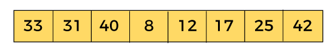
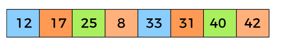
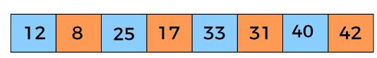

## シェルソート
シェルソートは、挿入ソートの欠点を補う形で考案されたソートアルゴリズムです。


シェル＝貝殻　というのは「がせ情報」で、じつはドナルド・シェルという人が考えたことから「シェルソート」と言われています。

{}
ヒント
: 余談ですが、ヒープソートは「メモリ領域」とは全く無関係で、２分ヒープ木を用いて行うソートアルゴリズムです。
{}


挿入ソートは、特定の要素を１つだけ取り出し、整列済み配列の適切な場所に挿入することで並べ替えを行います。
これにより、挿入ソートの欠点は、特定の要素を遠く離れた位置に移動するために、挿入する場所を確保し、その右側に整列されていた多くの要素を移動する必要がありました。
シェルソートは、インターバルと呼ばれる要素間の「間隔」を上手に使って、挿入ソートの欠点であった「挿入のための要素の移動」を最小限に留めることができます。


## 挿入ソートを振り返る

まず、挿入ソートを思い出してみます。


まず、上記の図では、一番左にある８が整列済みとしてスタートします。
そして左から２番めの５を比較対象（ターゲット）とします。
比較対象の５と、整列済みの適切な位置に挿入します。
整列済み配列は８だけですから、５と８の比較となります。
５は８の手前に挿入します。

これにより、整列済み配列は、５，８の２つとなり、比較対象は右に１つずれて３となります。

比較対象の３を整列済み配列５，８の適切な位置に挿入します。
３，５，８と並ぶように、５と８を右に一つずつずらし、３を挿入する空きスペースを確保してから、３を５の左に挿入します。

挿入するための空きスペースを確保するために、整列済み配列を右に１つずつずらす必要があることが、とても大変です。


## シェルソートのアルゴリズム

シェルソートのアルゴリズムを見てみます。
シェルソートのアルゴリズムは、動くGIFよりも動かない静止画で見たほうがわかりやすいです。
まず、整列前の配列を以下に示します。



シェルソートは「インターバル」という概念が導入されています。
ここでは簡単なインターバルを設定してみます。

配列の要素数を「N」とします。
インターバルは
N/２ N/４ N/8の３つとします。

Nが８ですから、
N/２は４
N/４は２
N/８は１となります。


では最初にN/２（４）をインターバルにして処理を開始します。
インターバルが４ですから、

３３と１２
３１と１７
４０と２５
　８と４２

の要素が交換対象です。
図で示すと以下のようになります。


３３と１２　を並べ替えます。
３１と１７　を並べ替えます。
４０と２５　を並べ替えます。
　８と４２　を並べ替えます。

交換する必要がない場合はそのままの位置においたまま次の処理に進みます。


インターバルがN/２（４）の場合の交換後のイメージは以下の図のようになります。




まだまだソートが完了していないことがわかります。
そこで、次のインターバルで処理を行います。

次のインターバルは N/４＝２ です。
さきほどは、２つの要素の交換でしたが、今回はインターバルが小さいので４つの要素の交換を同時に行います。

図で示すと以下の通りとなります。


１２，２５，３３，４０を並べ替えます。
その後、
１７，８，３１，４２を並べ替えます。

色分けされている、
青の要素のグループを並べ替え、
オレンジの要素のグループを並べ替えます。

青とオレンジそれぞれの並べ替えが完了すると以下の図のようになります。



いまいち、並べ替えた感じにはなっていませんね。
では３つ目のインターバル「N/８＝１」で処理を行います。

シェルソートの感じの良いところは、この「N/８＝１」の場合のソートアルゴリズムに、挿入ソートを使っているところです。
では、上記の要素を挿入ソートで並べ替えてみます。

上から順を追って見てください。


一番左端の１２を整列済みとして、その隣の８を比較対象とします。
８は１２の手前に挿入されます。
比較対象は２５となり、並べ替えの必要がないため、となりの１７に比較対象をずらします。
１７は２５の手前に挿入されます。
次の比較対象は３３です。ここでも並べ替えの必要がないためとなりの３１に比較対象をずらします。
比較対象３１は３３の手前に挿入されます。
次の比較対象は４０です。４０も並べ替えの必要がないためそのままとし、次の比較対象を４２にずらします。
４２も並べ替えが必要ではありませんので、そのままにしてソートが完了します。

## シェルソートについて２

シェルソートは、N/2、N/４、N/８とインターバルを細かくしていくことで、要素の移動を最小化することができることがわかったと思います。
比較対象は並べ替える必要がない場合も多いのです。
シェルソートの肝は「インターバル」です。
この「インターバル」は、要素の数によって適切に行うことで、より高速なソートが可能となります。（なるらしいです）

## インターバルの決め方

そうした「適切なインターバル」の計算式は色々あります。

[Sell Sort Algorithm](https://www.programiz.com/dsa/shell-sort)

別にシェルソートが一番高速であるわけでもないので、N/２、N/４、N/８で良いと思います。（よいとしましょう）

でもせっかくですからご紹介します。
アルゴリズムの大家Knuth（クヌース）は、最良のインターバル数列を求める公式を以下の通り編み出しました。


{}
ヒント
: インターバルは１をのぞき３倍して＋１する。
{}


シェルソートではインターバル（間隔）の決め方が重要とされています。
これまでの説明では h＝４，２，１としてきました。
これが良くない理由として挙げられるのは、ソートの対象として同じ位置の要素ばかりが選択されてしまい、配列延滞をまんべんなくソートすることにはならないからです。

＜＜ざっくり省略＞＞

要素数 / ９を超えないように h（インターバル）を選ぶ方針が良いとされています。（諸説あります）

|ステップ|計算式|ｈ（インターバル）|
|--|----------------|-----|
|０|３＊　　０＋１＝|　　１|
|１|３＊　　１＋１＝|　　４|
|２|３＊　　４＋１＝|　１３|
|３|３＊　１３＋１＝|　４０|
|４|３＊　４０＋１＝|１２１|
|５|３＊１２１＋１＝|３６４|

たとえば、要素数 200 の配列に対しては、h の値を 121, 40, 13, 4, 1 の順番で狭めていきます。

下の方で紹介するbash/シェルスクリプトによるシェルソートの実装でもこのインターバルの手法を使っています。


## シェルソートのざっくり説明おさらい
- シェルソートは挿入ソートの改良版です。
- インターバル１はまさに挿入ソートです。

- 挿入ソートの手順おさらい
挿入ソートの途中段階で、比較対象の左側（要するに整列済み配列）はソートされていて、比較対象のの右側はまだ手つかずです。
アルゴリズムは、比較対象項目を取り、一時変数に保存します。
空になったセルの左隣から、ソート済みの項目を次々と右へ移動していき（つまり空のセルに整列済み配列を次々と右へ移動して）、一時変数に保存した項目が順序正しく挿入できる場所を確保します。

- 問題点
最大の要素がおさまるべき最も右端に「最も小さな要素」があったらどうなるでしょうか？
その小さな項目を、左側の正しい場所に納めるためには、それより大きい全ての項目をいちいち右へ移動しなければなりません。
これは、極端な場合にはほとんどＮ回のコピーになります。
たった１個の項目のためにＮ回ですよ。
もちろん全ての項目がＮ回のコピーを必要とするわけではありませんから、平均すると１項目につきN/2回のコピー、それに項目数Ｎをかけますと、N^2/2回のコピーとなります。
従って挿入ソートの実効性能はＯ（Ｎ＾２）です。

- そこで
小さな項目を左へ移すとき、挿入ソートのようにその間の項目を全て右へシフトするのではなくて、
その小さな項目だけを一挙に左に移す方法があれば、
ソートの実効性能はかなり良くなるのではないでしょうか。

- シェルソート
シェルソートは大きなインターバルで飛び飛びに「挿入ソート」をすることによって、このような一挙移動を実現します。
大きなインターバルによるソートが終わったら、今度はその最初のインターバルの間に並んでいる項目を、より狭いインターバルでソートが出来ます。
配列をインターバル４でソートしたら、今度はそれをインターバル１でソートします。
つまり通常の挿入ソートをします。
このインターバル４とインターバル１の組み合わせは、最初からインターバル１だけでソートを行う通常の挿入ソートに比べると相当に早いのです。

- 最適なインターバル
インターバルが１の場合を除きｈを３倍して＋１する
らしい。

## 挿入ソートとの比較


|データ件数|挿入ソート|シェルソート|
|--:|--:|--:|
|1000個 |0.001秒 |0秒|
|10000個 |0.093秒 |0.002秒|
|100000個 |9.329秒 |0.027秒|
|1000000個 |895.205秒 |0.335秒|

## プログラムソース
この章で使っているプログラムソースは以下にあります。
[05_2ShellSort.sh シェルソート](https://github.com/suzukiiichiro/Algorithms-And-Data-Structures/tree/master/Bash/)


## bash/シェルスクリプトによるシェルソート
いちおう、Knuth(クヌース）が編み出した、最良のインターバル数列で実装しています。

``` bash:05_2ShellSort.sh
#!/usr/bin/bash
#
#シェルソート
#https://www.youtube.com/watch?v=M9YCh-ZeC7Y
#　平均計算時間が O(ｎ^1.25)
#　安定ソートではない
#　挿入ソート改造版
#　３倍して１を足すという処理を要素を超えるまで行う
#
##
# display()
# 表示
function display(){
  for((i=0; i<"$nElems"; i++));do
    echo "$i" "${array["$i"]}";
  done
  echo "------" ;
}
##
# insert()
# 配列を作成
function insert(){
  array[((nElems++))]=$1
}
##
# setArray()
# 配列をセット
function setArray(){
  nElems=0;
  for((i=0; i<"$1"; i++));do
    insert `echo "$RANDOM"` ;
  done
}
##
# shellSort()
# シェルソート
function shellSort(){
  #hの初期値
  interval=1 ;
  while (( "$interval" <= "$(($nElems/3))" )); do
    interval=$(($interval*3+1)) ; # (1,4,13,40,121.....)
  done
  #h=1になるまでhを減らす
  while (( "$interval">0 )); do
    #hでソート
    for(( outer="$interval"; outer<"$nElems" ; outer++ )); do
      tmp="${array[$outer]}" ;
      inner="$outer" ;
      #１つの部分的パス(0,4,8)
      while (( "$inner" > "$(($interval-1))" && "${array[$(($inner-$interval))]}" >= "$tmp" )); do
        array[$inner]="${array[$(($inner-$interval))]}" ;
        inner=$(($inner-$interval)) ;
      done
      array["$inner"]="$tmp" ;
    done
    interval=$(( ($interval-1)/3 )) ;
  done
}
##
# shellSort()
# シェルソートの実行
function execSort(){
  setArray "$1" ;
  display ;
  shellSort ;
  display ;
}
## 
# メイン
time execSort 100 ;
exit ;
#
```

## 実行結果

```
bash-5.1$ bash 05_2ShellSort.sh
0 28180
1 4836
2 9945
3 21276
4 32033
5 18456
6 11925
7 5197
8 7127
9 20353
10 18712
11 25395
12 1495
13 19716
14 32750
15 14660
16 14831
17 22983
18 27578
19 20774
20 21965
21 9252
22 30295
23 29146
24 4113
25 4811
26 28346
27 31461
28 29323
29 26609
30 4747
31 20171
32 15706
33 18532
34 31060
35 13983
36 2191
37 9145
38 30505
39 1638
40 28539
41 25193
42 15163
43 28219
44 9181
45 1016
46 5625
47 17060
48 3392
49 13482
50 29383
51 22114
52 14464
53 29466
54 9077
55 7359
56 904
57 31061
58 7134
59 20839
60 28148
61 10356
62 2156
63 6153
64 22757
65 29293
66 28869
67 24978
68 15014
69 23105
70 300
71 27492
72 23677
73 13103
74 7941
75 8817
76 13248
77 16966
78 1570
79 22098
80 31877
81 2981
82 26875
83 13033
84 10921
85 7062
86 11045
87 15871
88 26290
89 28571
90 31032
91 25600
92 28519
93 13570
94 11491
95 982
96 25872
97 22438
98 15530
99 21171
------
0 300
1 904
2 982
3 1016
4 1495
5 1570
6 1638
7 2156
8 2191
9 2981
10 3392
11 4113
12 4747
13 4811
14 4836
15 5197
16 5625
17 6153
18 7062
19 7127
20 7134
21 7359
22 7941
23 8817
24 9077
25 9145
26 9181
27 9252
28 9945
29 10356
30 10921
31 11045
32 11491
33 11925
34 13033
35 13103
36 13248
37 13482
38 13570
39 13983
40 14464
41 14660
42 14831
43 15014
44 15163
45 15530
46 15706
47 15871
48 16966
49 17060
50 18456
51 18532
52 18712
53 19716
54 20171
55 20353
56 20774
57 20839
58 21171
59 21276
60 21965
61 22098
62 22114
63 22438
64 22757
65 22983
66 23105
67 23677
68 24978
69 25193
70 25395
71 25600
72 25872
73 26290
74 26609
75 26875
76 27492
77 27578
78 28148
79 28180
80 28219
81 28346
82 28519
83 28539
84 28571
85 28869
86 29146
87 29293
88 29323
89 29383
90 29466
91 30295
92 30505
93 31032
94 31060
95 31061
96 31461
97 31877
98 32033
99 32750
------
real	0m0.124s
user	0m0.070s
sys	0m0.052s
bash-5.1$
```


## シェルソートの効率


## 「ざっくり」シリーズのご紹介
【アルゴリズム シェルソート】ざっくりわかるシェルスクリプト１８
https://suzukiiichiro.github.io/2022-10-27-01-shellsort-suzuki/
【アルゴリズム マージソート】ざっくりわかるシェルスクリプト１７
https://suzukiiichiro.github.io/2022-10-19-01-mergesort-suzuki/
【アルゴリズム 連結リスト】ざっくりわかるシェルスクリプト１６
https://suzukiiichiro.github.io/posts/2022-10-18-01-list-suzuki/
【アルゴリズム 再帰】ざっくりわかるシェルスクリプト１５
https://suzukiiichiro.github.io/posts/2022-10-07-01-algorithm-recursion-suzuki/
【アルゴリズム キュー】ざっくりわかるシェルスクリプト１４
https://suzukiiichiro.github.io/posts/2022-10-06-01-algorithm-queue-suzuki/
【アルゴリズム スタック】ざっくりわかるシェルスクリプト１３
https://suzukiiichiro.github.io/posts/2022-10-06-01-algorithm-stack-suzuki/
【アルゴリズム 挿入ソート】ざっくりわかるシェルスクリプト１２
https://suzukiiichiro.github.io/posts/2022-10-05-01-algorithm-insertionsort-suzuki/
【アルゴリズム 選択ソート】ざっくりわかるシェルスクリプト１１
https://suzukiiichiro.github.io/posts/2022-10-05-01-algorithm-selectionsort-suzuki/
【アルゴリズム バブルソート】ざっくりわかるシェルスクリプト１０
https://suzukiiichiro.github.io/posts/2022-10-05-01-algorithm-bubblesort-suzuki/
【アルゴリズム ビッグオー】ざっくりわかるシェルスクリプト９
https://suzukiiichiro.github.io/posts/2022-10-04-01-algorithm-bigo-suzuki/
【アルゴリズム ２次元配列編】ざっくりわかるシェルスクリプト８
https://suzukiiichiro.github.io/posts/2022-10-03-01-algorithm-eval-array-suzuki/
【アルゴリズム 配列準備編】ざっくりわかるシェルスクリプト７
https://suzukiiichiro.github.io/posts/2022-10-03-01-algorithm-array-suzuki/ 
【アルゴリズム 配列編】ざっくりわかるシェルスクリプト６
https://suzukiiichiro.github.io/posts/2022-09-27-01-array-suzuki/
【grep/sed/awkも】ざっくりわかるシェルスクリプト５
https://suzukiiichiro.github.io/posts/2022-02-02-01-suzuki/
【grep特集】ざっくりわかるシェルスクリプト４
https://suzukiiichiro.github.io/posts/2022-01-24-01-suzuki/
【はじめから】ざっくりわかるシェルスクリプト３
https://suzukiiichiro.github.io/posts/2022-01-13-01-suzuki/
【はじめから】ざっくりわかるシェルスクリプト２
https://suzukiiichiro.github.io/posts/2022-01-12-01-suzuki/
【はじめから】ざっくりわかるシェルスクリプト１
https://suzukiiichiro.github.io/posts/2022-01-07-01-suzuki/

【TIPS】ざっくりわかるシェルスクリプト
https://suzukiiichiro.github.io/posts/2022-09-26-01-tips-suzuki/


<!--
{}
ヒント
{}

{}
注意
{}
-->


## 書籍の紹介

{{% amazon

title="詳解 シェルスクリプト 大型本  2006/1/16"

url="https://www.amazon.co.jp/gp/proteect/4873112672/ref=as_li_tl?ie=UTF8&camp=247&creative=1211&creativeASIN=4873112672&linkCode=as2&tag=nlpqueens-22&linkId=ef087fd92d3628bb94e1eb10cb202d43"

summary=`Unixのプログラムは「ツール」と呼ばれます。
Unixは、処理を実現するために複数の道具(ツール)を組み合わせる「ソフトウェアツール」という思想の下に設計されているためです。
そしてこれらツールを「組み合わせる」ということこそがUnixの真髄です。
また、シェルスクリプトの作成には言語自体だけでなくそれぞれのツールに対する理解も求められます。
つまり、あるツールが何のためのものであり、それを単体あるいは他のプログラムと組み合わせて利用するにはどのようにすればよいかということを理解しなければなりません。
本書は、Unixシステムへの理解を深めながら、シェルスクリプトの基礎から応用までを幅広く解説します。
標準化されたシェルを通じてUnix(LinuxやFreeBSD、Mac OS XなどあらゆるUnix互換OSを含む)の各種ツールを組み合わせ、
目的の処理を実現するための方法を詳しく学ぶことができます。
`
imageUrl="https://m.media-amazon.com/images/I/51EAPCH56ML._SL250_.jpg"
%}}

{}


{{% amazon

title="[改訂第3版]シェルスクリプト基本リファレンス ──#!/bin/shで、ここまでできる (WEB+DB PRESS plus) 単行本（ソフトカバー）  2017/1/20"

url="https://www.amazon.co.jp/gp/proteect/4774186945/ref=as_li_tl?ie=UTF8&camp=247&creative=1211&creativeASIN=4774186945&linkCode=as2&tag=nlpqueens-22&linkId=8ef3ff961c569212e910cf3d6e37dcb6"

summary=`定番の1冊『シェルスクリプト基本リファレンス』の改訂第3版。
シェルスクリプトの知識は、プログラマにとって長く役立つ知識です。
本書では、複数のプラットフォームに対応できる移植性の高いシェルスクリプト作成に主眼を置き、
基本から丁寧に解説。
第3版では最新のLinux/FreeBSD/Solarisに加え、組み込み分野等で注目度の高いBusyBoxもサポート。
合わせて、全収録スクリプトに関してWindowsおよびmacOS環境でのbashの動作確認も行い、さらなる移植性の高さを追求。
ますますパワーアップした改訂版をお届けします。`
imageUrl="https://m.media-amazon.com/images/I/41i956UyusL._SL250_.jpg"
%}}

{{% amazon

title="新しいシェルプログラミングの教科書 単行本"

url="https://www.amazon.co.jp/gp/proteect/4797393106/ref=as_li_tl?ie=UTF8&camp=247&creative=1211&creativeASIN=4797393106&linkCode=as2&tag=nlpqueens-22&linkId=f514a6378c1c10e59ab16275745c2439"

summary=`エキスパートを目指せ!!

システム管理やソフトウェア開発など、
実際の業務では欠かせないシェルスクリプトの知識を徹底解説

ほとんどのディストリビューションでデフォルトとなっているbashに特化することで、
類書と差別化を図るとともに、より実践的なプログラミングを紹介します。
またプログラミング手法の理解に欠かせないLinuxの仕組みについてもできるかぎり解説しました。
イマドキのエンジニア必携の一冊。

▼目次
CHAPTER01 シェルってなんだろう
CHAPTER02 シェルスクリプトとは何か
CHAPTER03 シェルスクリプトの基本
CHAPTER04 変数
CHAPTER05 クォーティング
CHAPTER06 制御構造
CHAPTER07 リダイレクトとパイプ
CHAPTER08 関数
CHAPTER09 組み込みコマンド
CHAPTER10 正規表現と文字列
CHAPTER11 シェルスクリプトの実行方法
CHAPTER12 シェルスクリプトのサンプルで学ぼう
CHAPTER13 シェルスクリプトの実用例
CHAPTER14 テストとデバッグ
CHAPTER15 読みやすいシェルスクリプト
`
imageUrl="https://m.media-amazon.com/images/I/41d1D6rgDiL._SL250_.jpg"
%}}


