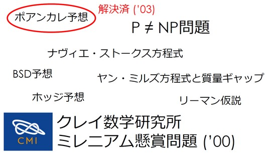

[【参考リンク】Ｎクイーン問題 過去記事一覧はこちらから](https://suzukiiichiro.github.io/search/?keyword=Ｎクイーン問題)

## Ｎクイーン問題とは
　Ｎクイーン問題とは、「８列×８行のチェスボードに８個のクイーンを、互いに効きが当たらないように並べよ」というエイトクイーン問題のクイーンの数を `Ｎ` として、どこまで大きなＮまで解を求めることができるかという問題で、「Ｎクイーン問題」とも言う。

　Ｎクイーン問題は、１８４８年から存在し、ガウスなど著名な科学者が研究した工学研究の頂点となる研究である。

　名前の通り８つのクイーンの解を求めるというパズルであり、Ｎクイーンは、エイトクイーンの拡張版で、Nの値は８、９、１０，１１，１２･･･と言った風に増え続け、そのNの値であるボードの解を求めるものである。

　クイーンとは、チェスで使われているクイーンを指し、チェス盤の中で、縦、横、斜めにどこまでも進むことができる駒で、日本の将棋でいう「飛車と角」を合わせた動きとなる。

　８列×８行で構成される一般的なチェスボードにおける８クイーン問題の解は、解の総数は９２個である。

　比較的単純な問題なので、大学の学部レベル演習問題として取り上げられることが多い。

　８クイーン問題程度であれば、人力またはプログラムによる「力まかせ探索」でも解を求めることができるが、

Ｎが大きくなると解が一気に爆発し、実用的な時間では解けなくなる。

## そもそものエイトクイーン問題の歴史について
　「エイト・クイーン」は1848年にチェスプレイヤーのマックス・ベッツェルによって提案されたパズル。

　8×8マスのチェス盤の上に、縦横と斜め方向にどこまででも進めるという駒・クイーンを8個並べるというもの。

「どの駒も他の駒に取られるような位置に置いてはいけない」というルールが設定されている。

　このルールに従った場合、いくつの正解が存在するのか、長らくの間にわたって謎とされていた。

　考案から１００年以上が経過した１８７４年、Guntherが行列式を用いて解く方法を提案し、イギリスのグレイシャー(Glaisher)によってＮが８の場合の全解(基本解)が「１２個」であることを確認した。

　この問題は、チェス盤の一辺のマスの数とクイーンの数を同一にしたＮクイーン問題とも呼ばれており、Ｎの数が増えるに連れて飛躍的にその解数が増大することが知られている。

## すべての解が判明！？
　全ての解が判明しているのは、2009年にドレスデン工科大学で計算された「26クイーン」で、その基本解は2789兆7124億6651万289個、転回形などのバリエーション解を含めると、その数は2京2317兆6996億1636万4044個にもなることがわかっています。

　その後、同、ドレスデン工科大学は、2016年に「27クイーン」を解決した。

　セント・アンドルーズ大学のコンピューターサイエンティストであるIan Gent博士らによる研究チームは、この「Ｎクイーン問題」から派生する「Ｎクイーン穴埋め問題」(n-Queens Completion)パズルの複雑性に関する(PDF http://jair.org/media/5512/live-5512-10126-jair.pdf)論文を作成しています。

Complexity of n-Queens Completion
https://www-users.york.ac.uk/~pwn503/n-queens-jair.pdf

## 解決方法
　基本的にこの問題を解決するためにはバックトラック法と呼ばれる、いわば「総当たり法」が用いられる。

　全ての選択肢を試すためには、膨大な時間を必要とし、マス（N）が大きくなるに従って増えるクイーンの数によって、その時間は指数関数的に一気に増加する。

　Gent氏によると、この「Ｎクイーン穴埋め問題」を素早く解決できるコンピューターやアルゴリズムの開発が進むことで、我々が日々抱えている問題を解決する技術の進化が期待できるとのこと。

　先述のように、現代の科学でも解決できているＮクイーン問題は、２７×２７マスの「２７クイーン」にとどまっている。

　穴埋め問題であっても、そこから先へと進むためには、現在はまだ存在していない新しい技術を開発することが必須となっている。 

## Ｐ対ＮＰ問題
　この問題は、2000年にアメリカのクレイ数学研究所が100万ドル(約1億1000万円)の賞金とともに設定したミレニアム懸賞問題の一つに数えられる「P対NP問題」の証明につなが るものとされています。

ＮＰ問題
「答えを見つけるのは難しいかもしれないが、答えがあっているかどうかは素早くチェックできる問題」

Ｐ問題
「簡単に素早く解ける問題」

「簡単に素早く解けるＰ問題の答えが合っているかを素早く確認できるＮＰ問題である」ことは証明されている。
その逆、つまり
「答えを素早く確認できるＮＰ問題はすべて素早く解くことができるか？」という問題を証明するというもの。

　これを解くためには膨大な量の計算を素早く行うことが必要になり、現代のコンピューター技術でも解決までには数万年の時間が必要になると考えられています。

## 現在すべての解が判明しているもの
Jeff Somers氏が巧みなビット演算による高速化,上下反転の解を考慮し、探索を半分に削減でＮ＝２３

２００４年にIntel Pentium 4 Xeon 2.8GHzのプロセッサを68個搭載するPCクラスタで、20日間をかけてn=24を解決した電気通信大学がＮ＝２４

２００５年にニッツァ大学で      Ｎ＝２５
２００９年にドレスデン工科大学でＮ＝２６
２０１６年にドレスデン工科大学でＮ＝２７

の解を求めることに成功している。

wikipedia: エイト・クイーン問題
https://ja.wikipedia.org/wiki/エイト・クイーン

|N   |達成日時|組織名|参考情報|
|:--:|:--:|:--:|--|
|N22||JSomers|巧みなビット演算による高速化,上下反転の解を考慮し、探索を半分に削減。Jeff Somers氏がN=23の解を求めるときに使用した解法|
|N23||takaken|JSomers版を高橋謙一郎氏が改良。対称性に着目して代表解のみを探索。再帰呼び出しによるプログラム解毒性の向上。|
|N24|２００４年４月１１日|電気通信大学|2004年4月 68CPU x 22日(1,496 CPU日 N24) JSomers版を改良し、７〜２４％の性能向上。電通大でN=24を求めるときに使用した解法|
|N25|２００５年６月１１日|ProActive   |2005年5月 185 days 4 hours 54 minutes 52 seconds 854 Java grid computation by INRIA, France Real >6 Months Sequential >53 Years http://www-sop.inria.fr/oasis/ProActive2/apps/nqueens25.html|
|N26|２００９年７月１１日| tu-dresden |    FPGA ( *1 : 8*22 2.5 GHz-QuadCore systemsに相当（約176 * 4CPU = 704 CPU))  x ２４０日(168,960 CPU日 N26) 9-month cpmputation of FPGAs completing July 1,2009.  Result confirmed by Russian MC# super computing project on August 30,2009.|
|N27|２０１６年　月　　日| tu-dresden |https://github.com/preusser/q27|

## 歴史的未解決問題に懸賞金
　１０００年を超える歴史を持つボードゲーム「チェス」には単なるゲームの勝敗ではなく、そのルールに即したさまざまなパズルの課題「チェス・プロブレム」が存在している。

　エイト・クイーンはチェスの駒のうち、8個のクイーンだけを使うパズルなのですが、その規模を大きく拡大して行くと、現代数学における未解決問題となり、1億円の賞金がかかる「P対NP問題」の解明につながるものと考えられている。

歴史あるチェスのパズル問題が現代数学における未解決問題の解明につながる可能性
http://gigazine.net/news/20170905-million-dollar-chess-problem/

Ｎクイーンは今のコンピュータでは絶対解けない。解けたら1億円もらえるよ
https://www.gizmodo.jp/2017/10/eight-queens-puzzle.html

解けたら賞金1億円！ 数学の7つの未解決問題のひとつ「P≠NP」問題へのアプローチがもたらすもの
https://logmi.jp/tech/articles/45330

2017 | “Simple” chess puzzle holds key to $1m prize | University of St Andrews
https://www.st-andrews.ac.uk/news/archive/2017/title,1539813,en.php

Can You Solve the Million-Dollar, Unsolvable Chess Problem? - Atlas Obscura
http://www.atlasobscura.com/articles/queens-puzzle-chess-problem-solution-software

## その他の参考リンク
GooleなどWebを探索すると無数のページがあることがわかる。その中でも充実したサイトを紹介したい。

おおよそ以下のサイトをかみしめて読み解けば情報は９０％網羅されている。

N-Queens 問題(Nobuhide Tsudaさん)
http://vivi.dyndns.org/tech/puzzle/NQueen.html
Puzzle DE Programming(M.Hiroiさん）
バックトラックとビット演算による高速化
http://www.geocities.jp/m_hiroi/puzzle/nqueens.html
takakenさん（高橋謙一郎さん）のページ
http://www.ic-net.or.jp/home/takaken/nt/queen/index.html
の、みなさんが掲示板で議論している模様(貴重ですね）
http://www2.ic-net.or.jp/~takaken/auto/guest/bbs62.html
ptimal Queens
英語だが、上記の全てがJavaで書かれていて群を抜いている
http://penguin.ewu.edu/~trolfe/Queens/OptQueen.html

その他のリンク
https://rosettacode.org/wiki/N-queens_problem
http://www.cc.kyoto-su.ac.jp/~yamada/ap/backtrack.html
http://yucchi.jp/java/java_tip/n_queens_problem/n_queens_problem.html
http://www.shido.info/py/queen_py3.html
http://toraneko75.sakura.ne.jp/wp/?p=223
http://yoshiiz.blog129.fc2.com/blog-entry-380.html
http://nw.tsuda.ac.jp/class/algoB/c6.html
http://www.kawa.net/works/js/8queens/nqueens.html
http://www.yasugi.ai.kyutech.ac.jp/2012/4/nq.html
http://www.neuro.sfc.keio.ac.jp/~masato/jv/nqueen/MPneuron.java
http://fujimura2.fiw-web.net/java/lang/page-20-3.html
https://github.com/pankajmore/DPP/blob/master/EPI/src/puzzles/NQueens.java
http://www.kanadas.com/ccm/queens-sort/index-j.html
http://chiiji.s10.xrea.com/nn/nqueen/nqueenn.shtml
http://www.neuro.sfc.keio.ac.jp/~masato/jv/nqueen/nqueenDemo.htm

## さらに参考リンク
N=22発見 JeffSomers
  ビットマップを N-Queens に最初に応用したのは Jeff Somers 氏のようだ。 
  参照：The N Queens Problem
  http://www.jsomers.com/nqueen_demo/nqueens.html(リンク切れのようだ）
N=24発見 電気通信大学
  2004年、電気通信大学の研究グループが、処理を並列化し
  N=24 の解の個数を世界で初めて発見。 
  http://www.arch.cs.titech.ac.jp/~kise/nq/
  プレスリリース
  http://www.arch.cs.titech.ac.jp/~kise/nq/press-2004-10-05.txt
  電通大が「N-queens」問題の世界記録達成
  http://www.itmedia.co.jp/news/articles/0410/06/news079.html
  University of North Texas
  http://larc.unt.edu/ian/24queens/

  NQueens問題 ＱＪＨの基本構想は、”部分解から全体解を構成するというアプローチ”（部分解合成法：Ｐａｒts Assembly Approach)です。
  http://deepgreen.game.coocan.jp/NQueens/nqueen_index.htm

  N Queens World records
  http://www.nqueens.de/sub/WorldRecord.en.html

  N=21-23 computed by Sylvain PION (Sylvain.Pion(AT)sophia.inria.fr) and Joel-Yann FOURRE (Joel-Yann.Fourre(AT)ens.fr).
  N=24 from Kenji KISE (kis(AT)is.uec.ac.jp), Sep 01 2004
  N=25 from Objectweb ProActive INRIA Team (proactive(AT)objectweb.org), Jun 11 2005 [Communicated by Alexandre Di Costanzo (Alexandre.Di_Costanzo(AT)sophia.inria.fr)]. This calculation took about 53 years of CPU time.N=25 has been confirmed by the NTU 25Queen Project at National Taiwan University and Ming Chuan University, led by Yuh-Pyng (Arping) Shieh, Jul 26 2005. This computation took 26613 days CPU time.
  N=26 as calculated by Queens(AT)TUD [http://queens.inf.tu-dresden.de/]. - Thomas B. Preußer, Jul 11 2009
  N=27 as calculated by the Q27 Project [https://github.com/preusser/q27]. - Thomas B. Preußer, Sep 23 2016

次回は、シェルスクリプトでエイト・クイーンを解決・解説していきたいと思います。

## リンクと過去記事
N-Queens問題：Ｎクイーン問題（１２）第二章　まとめ
https://suzukiiichiro.github.io/posts/2023-03-17-02-n-queens-suzuki/
N-Queens問題：Ｎクイーン問題（１１）第二章　配置フラグの再帰・非再帰
https://suzukiiichiro.github.io/posts/2023-03-17-01-n-queens-suzuki/
N-Queens問題：Ｎクイーン問題（１０）第二章　バックトラックの再帰・非再帰
https://suzukiiichiro.github.io/posts/2023-03-16-01-n-queens-suzuki/
N-Queens問題：Ｎクイーン問題（９）第二章　ブルートフォースの再帰・非再帰
https://suzukiiichiro.github.io/posts/2023-03-14-01-n-queens-suzuki/
N-Queens問題：Ｎクイーン問題（８）第一章　まとめ
https://suzukiiichiro.github.io/posts/2023-03-09-01-n-queens-suzuki/
N-Queens問題：Ｎクイーン問題（７）第一章　ブルートフォース再び
https://suzukiiichiro.github.io/posts/2023-03-08-01-n-queens-suzuki/
N-Queens問題：Ｎクイーン問題（６）第一章　配置フラグ
https://suzukiiichiro.github.io/posts/2023-03-07-01-n-queens-suzuki/
N-Queens問題：Ｎクイーン問題（５）第一章　進捗表示テーブルの作成
https://suzukiiichiro.github.io/posts/2023-03-06-01-n-queens-suzuki/
N-Queens問題：Ｎクイーン問題（４）第一章　バックトラック
https://suzukiiichiro.github.io/posts/2023-02-21-01-n-queens-suzuki/
N-Queens問題：Ｎクイーン問題（３）第一章　バックトラック準備編
https://suzukiiichiro.github.io/posts/2023-02-14-03-n-queens-suzuki/
N-Queens問題：Ｎクイーン問題（２）第一章　ブルートフォース
https://suzukiiichiro.github.io/posts/2023-02-14-02-n-queens-suzuki/
N-Queens問題：Ｎクイーン問題（１）第一章　エイトクイーンについて
https://suzukiiichiro.github.io/posts/2023-02-14-01-n-queens-suzuki/

エイト・クイーンのソース置き場 BashもJavaもPythonも！
https://github.com/suzukiiichiro/N-Queens

## 書籍の紹介
{{% amazon

title="詳解 シェルスクリプト 大型本  2006/1/16"

url="https://www.amazon.co.jp/gp/proteect/4873112672/ref=as_li_tl?ie=UTF8&camp=247&creative=1211&creativeASIN=4873112672&linkCode=as2&tag=nlpqueens09-22&linkId=ef087fd92d3628bb94e1eb10cb202d43"

summary=`Unixのプログラムは「ツール」と呼ばれます。
Unixは、処理を実現するために複数の道具(ツール)を組み合わせる「ソフトウェアツール」という思想の下に設計されているためです。
そしてこれらツールを「組み合わせる」ということこそがUnixの真髄です。
また、シェルスクリプトの作成には言語自体だけでなくそれぞれのツールに対する理解も求められます。
つまり、あるツールが何のためのものであり、それを単体あるいは他のプログラムと組み合わせて利用するにはどのようにすればよいかということを理解しなければなりません。
本書は、Unixシステムへの理解を深めながら、シェルスクリプトの基礎から応用までを幅広く解説します。
標準化されたシェルを通じてUnix(LinuxやFreeBSD、Mac OS XなどあらゆるUnix互換OSを含む)の各種ツールを組み合わせ、
目的の処理を実現するための方法を詳しく学ぶことができます。
`
imageUrl="https://m.media-amazon.com/images/I/51EAPCH56ML._SL250_.jpg"
%}}

{}

{{% amazon

title="[改訂第3版]シェルスクリプト基本リファレンス ──#!/bin/shで、ここまでできる (WEB+DB PRESS plus) 単行本（ソフトカバー）  2017/1/20"

url="https://www.amazon.co.jp/gp/proteect/4774186945/ref=as_li_tl?ie=UTF8&camp=247&creative=1211&creativeASIN=4774186945&linkCode=as2&tag=nlpqueens09-22&linkId=8ef3ff961c569212e910cf3d6e37dcb6"

summary=`定番の1冊『シェルスクリプト基本リファレンス』の改訂第3版。
シェルスクリプトの知識は、プログラマにとって長く役立つ知識です。
本書では、複数のプラットフォームに対応できる移植性の高いシェルスクリプト作成に主眼を置き、
基本から丁寧に解説。
第3版では最新のLinux/FreeBSD/Solarisに加え、組み込み分野等で注目度の高いBusyBoxもサポート。
合わせて、全収録スクリプトに関してWindowsおよびmacOS環境でのbashの動作確認も行い、さらなる移植性の高さを追求。
ますますパワーアップした改訂版をお届けします。`
imageUrl="https://m.media-amazon.com/images/I/41i956UyusL._SL250_.jpg"
%}}

{{% amazon

title="新しいシェルプログラミングの教科書 単行本"

url="https://www.amazon.co.jp/gp/proteect/4797393106/ref=as_li_tl?ie=UTF8&camp=247&creative=1211&creativeASIN=4797393106&linkCode=as2&tag=nlpqueens09-22&linkId=f514a6378c1c10e59ab16275745c2439"

summary=`エキスパートを目指せ!!

システム管理やソフトウェア開発など、
実際の業務では欠かせないシェルスクリプトの知識を徹底解説

ほとんどのディストリビューションでデフォルトとなっているbashに特化することで、
類書と差別化を図るとともに、より実践的なプログラミングを紹介します。
またプログラミング手法の理解に欠かせないLinuxの仕組みについてもできるかぎり解説しました。
イマドキのエンジニア必携の一冊。

▼目次
CHAPTER01 シェルってなんだろう
CHAPTER02 シェルスクリプトとは何か
CHAPTER03 シェルスクリプトの基本
CHAPTER04 変数
CHAPTER05 クォーティング
CHAPTER06 制御構造
CHAPTER07 リダイレクトとパイプ
CHAPTER08 関数
CHAPTER09 組み込みコマンド
CHAPTER10 正規表現と文字列
CHAPTER11 シェルスクリプトの実行方法
CHAPTER12 シェルスクリプトのサンプルで学ぼう
CHAPTER13 シェルスクリプトの実用例
CHAPTER14 テストとデバッグ
CHAPTER15 読みやすいシェルスクリプト
`
imageUrl="https://m.media-amazon.com/images/I/41d1D6rgDiL._SL250_.jpg"
%}}

