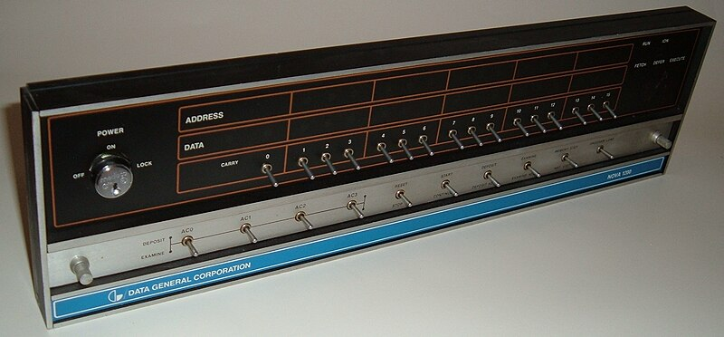
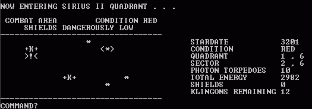

## はじめに
以下のサイトはとても勉強になります。

World records for the n queens problem
http://www.nqueens.de/sub/WorldRecord.en.html

しかし興味があっても日本語でないために「苦手・・」と、どうしても距離をおいてしまう人が多いと思います。
素晴らしいコンテンツですので、和訳してご紹介します。
訳語がちょいちょいおかしなところもありますが、気は心でお許しください。
ではエイトクイーンの歴史を楽しんでください。


## エイト・クイーンノスタルジー
エイト・クイーン問題...そしてラガンワルドの意外なノスタルジー
先日、『The Annotated Alice』のSesquicentennial Editionを注文しました。
お決まりのように、アマゾンの連携フィルターが他にも興味のありそうな本を表示してくれて、『結び目とボロメアの輪』『レップタイル』『エイトクイーン』を見つけた：Martin Gardner's Unexpected Hanging」です。
私は思わず声を上げそうになった。私がゼロから書いた最も初期のコンピュータプログラムのひとつ、エイト・クイーンのパズルの解を探すプログラムの記憶を味わいながら。

## プレリュード1972 - 1977
この前置きは、ノスタルジーに長く、プログラミングに短いものです。もし興味がなければ、そのままエイト・クイーンのパズルの説明まで読み飛ばしてください。
1970年代、私はトロントの図書館で多くの時間を過ごした。お気に入りの場所は、リトル・イタリーの自宅近くにあったサンダーソン分館と、セント・ジョージ＆カレッジ・ストリート分館にあった、ジュディス・メリルが寄贈したSFとファンタジーの非循環コレクション「スペース・アウト・ライブラリー」である。

特に『サイエンティフィック・アメリカン』のバックナンバーを読むのが好きで、多くの人と同じようにマーティン・ガードナーの「数学的ゲーム」のコラムに魅了されました。母が私を英才教育のデイキャンプに送り込んだことがありましたが、そこは大学のように組織化されていました。生徒たちは自分で選択科目を選び、私は「ホワイダニット」という科目を選びました。半日かけてパズルとゲームの練習をするのですが、私はそれに夢中になりました。
ハイパーキューブで三目並べをすることを、他にどこで学べばいいのだろう。あるいは、嘘つきと真実の語り手について？あるいは、たまたまマーティン・ガードナーについて？この教材はすべて、彼のコラム集から引用されたものだと思いますが、私にはそれがぴったりでした。

ある日、私たちは、サンフォード・フレミング・ビルディング2 にあるトロント大学の高速ジョブストリームに見学に行きました。ここは大きな部屋で、片側にはラインプリンター、もう片側にはパンチカードリーダー、そして自分のカードを打ち込むためのステーションがたくさんありました。
ジョブを実行するには、1枚のカードに1行ずつプログラムを入力し、バッチジョブに使用するインタープリタやコンパイラの種類を示すヘッダを前面に貼り付けます。そのカードは色鮮やかで、WATFIVやSNOBOLといった文字が大きく印刷されていた。

ヘッダープラスプログラムを奥のホッパーに入れて待ち、読み取り機から出てきたところでパンチカードを回収して、大きくてうるさいラインプリンターに向かう。IBM 360が実際に作業を行うと、結果をプリントしてくれる。そして、テーブルに向かって出力を確認し、誤字やバグを見つけてプログラムを更新し、また最初からやり直す。

このような設備は、どこのコンピュータ博物館でも見ることができるので、これ以上詳しく説明することはない。それに、プログラムをバッチジョブとして実行する仕組みは、「高速ジョブストリーム」の面白さではありません。高速ジョブストリームが面白かったのは、ジョブの実行に何の制約もなかったことです。アカウントもパスワードも必要ない。アカウントもパスワードも不要で、玄関先で「学部生であることの証明は？
だから、夏の日にあそこに行って、ソフトを書いたり、時にはパズルを解くプログラムを書いてみたりしていたんですよ。

## 1976年の秋 学校にて
1976年の秋、私は荷物をまとめて、全寮制の「セント・アンドリューズ・カレッジ」に行きました。SACのすごいところは、キャンパスに実際のミニコンピュータがあったことだ。当時としては、前代未聞のことでした。
.jpg)
オンタリオ州の公立学校でも、プログラミングの授業は受けられるのですが、ほぼすべて、鉛筆で「バブルカード」を埋めてプログラムを書き、一晩で仕事を提出するものでした。

SACには、Nova1220というミニコンピュータがあり、その部屋には4台の古いテレタイプ機がシリアルポートで接続されていました。5MBのリムーバブル・ハードディスク（12インチのプラッターを大きな保護プラスチックのシェルで包んだもの）をセットして、フロントパネルにあるブートストラップ命令をトグルしてマシンを再起動すると、さまざまな動作モードが得られるようになっていたのです。
学生用に用意されたモードは、4ユーザー用のBASICインタプリタでした。16KBのRAMを搭載し、シンプルなモデルで、各ユーザーが4KBずつ使えるようにメモリを分割していた。テレタイプにプログラムを打ち込むと、その出力がロールペーパーに印刷される。
プログラムをディスクに保存することは許されませんでした。テレタイプの側面には紙テープのインターフェイスがあり、プログラムを保存するには、紙テープをつけたままソースをLISTすると、テープにASCIIやEBDICのコードを打ち込むことができました。それを引きちぎって持ち運ぶのです。その後、プログラムを再読み込みするために、テープをテレタイプに送り込むと、あたかもプログラムを新たに入力したかのように動作するのです。

CODE-CARD CORNER
https://rtty.com/CODECARD/codecrd1.htm

簡単なバブルソートを書くような課題には4KBで十分でしたが、この頃にはDavid Ahlを発見していましたし、『Super Star Trek』のようなプログラムは4KBでは収まりません。16KBのシングルユーザーディスクが、生徒の成績を集計するプログラムと一緒にキャビネットに収められていた。


規制を無視し、遅刻して戸棚の鍵を開け、目的のディスクを取り出し、シングルユーザーモードで起動させるのだ。スーパースター・トレックのカスタマイズをしたり、パズルを解くプログラムを書いたりした。不思議なことに、学生の記録を改ざんしたことはない。その頃の私は、道徳的に空っぽの器でした。こういうことに道徳心があったなんて言うつもりはありません。本当は、点数なんてどうでもいいと思っていたんだと思います。


## エイト・クイーンのパズル

学校で取り組んだことのひとつに、新しいゲームを書くということがありました。マハラジャとセポイのプログラムを作ったのですが、私が標準的なチェスの駒をプレイしている間、マハラジャをプレイしてくれるんです。このプログラムは私を打ち負かすことができ、私の目的には十分なAIでした。

マーティン・ガードナーの本で読んだ「エイト・クイーン・パズル」について考えてみたのです。ウィキペディアによると、「8クイーンパズルとは、8×8のチェスボードに8つのチェスのクイーンを、2つのクイーンがお互いを脅かすことがないように配置する問題である。したがって、解答には、2つのクイーンが同じ行、列、対角線を共有しないことが必要である。"

このころには、「生成とテスト」のアルゴリズムの書き方を少し知っていましたし、「マハラジャとセポイ」のような、基本的なミニマックス探索を行うゲームを作っていたので、深さ優先探索についても少しは知っていました。そこで私は、解を探索するBASICプログラムを書くことにした。計算の複雑さや実行時間についての正式な理解はなかったが、もしプログラムを書いて一晩中動かしっぱなしにしたらどうだろう？

最重要アプローチは次のようなものです（BASICにはfor...next構成がありますが、それに近いものです）：

## 原点ともなるエイト・クイーン初期型ソース
``` js
for (let i0 = 0; i0 <= 7; ++i0) {
  for (let j0 = 0; j0 <= 7; ++j0) {
    for (let i1 = 0; i1 <= 7; ++i1) {
      for (let j1 = 0; j1 <= 7; ++j1) {

        // ...lots of loops elided...

          for (let i7 = 0; i7 <= 7; ++i7) {
            inner: for (let j7 = 0; j7 <= 7; ++j7) {
              const board = [
                [".", ".", ".", ".", ".", ".", ".", "."],
                [".", ".", ".", ".", ".", ".", ".", "."],
                [".", ".", ".", ".", ".", ".", ".", "."],
                [".", ".", ".", ".", ".", ".", ".", "."],
                [".", ".", ".", ".", ".", ".", ".", "."],
                [".", ".", ".", ".", ".", ".", ".", "."],
                [".", ".", ".", ".", ".", ".", ".", "."],
                [".", ".", ".", ".", ".", ".", ".", "."]
              ];

              const queens = [
                [i0, j0],
                [i1, j1],
                [i2, j2],
                [i3, j3],
                [i4, j4],
                [i5, j5],
                [i6, j6],
                [i7, j7]
              ];

              for (const [i, j] of queens) {
                if (board[i][j] != '.') {
                  // square is occupied or threatened
                  continue inner;
                }

                for (let k = 0; k <= 7; ++k) {
                  // fill row and column
                  board[i][k] = board[k][j] = "x";

                  const vOffset = k - i;
                  const hDiagonal1 = j - vOffset;
                  const hDiagonal2 = j + vOffset;

                  // fill diagonals
                  if (hDiagonal1 >= 0 && hDiagonal1 <= 7) {
                    board[k][hDiagonal1] = "x";
                  }

                  if (hDiagonal2 >= 0 && hDiagonal2 <= 7) {
                    board[k][hDiagonal2] = "x";
                  }
                }
              }

              console.log(diagramOf(queens));
            }
          }

        // ...lots of loops elided...

      }
    }
  }
}

function diagramOf (queens) {
  const board = [
    [".", ".", ".", ".", ".", ".", ".", "."],
    [".", ".", ".", ".", ".", ".", ".", "."],
    [".", ".", ".", ".", ".", ".", ".", "."],
    [".", ".", ".", ".", ".", ".", ".", "."],
    [".", ".", ".", ".", ".", ".", ".", "."],
    [".", ".", ".", ".", ".", ".", ".", "."],
    [".", ".", ".", ".", ".", ".", ".", "."],
    [".", ".", ".", ".", ".", ".", ".", "."]
  ];

  for (const [i, j] of queens) {
    board[i][j] = "Q";
  }

  return board.map(row => row.join('')).join("\n");
}
```

確か、それを試して、一晩プログラムを走らせておいて、翌朝、学校に行く前に来たら、まだ動いていた。8^16（正確には64^8）個の解の候補を検索していたのだから、281,474,976,710,656回のループになる。そのミニコンピュータのスピードからすると、このプログラムは今でも動いているのではないだろうか。

これは今日、とても当たり前のことに思えるでしょうが、このような問題を解くためのアルゴリズムを大別すると、解を探すというものがあります。これだけではないのですが、当時私が試したもので、今日注目するのはこれです。検索問題が発生したとき、より早く解決する方法は2つあります：より速く検索すること、そしてより小さな問題空間を検索することです。
そのような言葉は使いませんでしたが、私は、より小さな空間を探すことを第一に考えていることを把握しました。それで少し考えてみたんです。すると、ある種の閃きがあった：盤面を一次元のマスの並びだと思えば、次のように考えることができる。一番左のクイーンのためにマスを選ぶと、他のすべてのクイーンはそのクイーンの右側に来なければならない。
帰納法により、3番目以降のすべてのクイーンもそうなります。これは、最悪の場合のブルートフォースアルゴリズムとは異なります：最初のクイーンのためにマスを選んだ後、他の各クイーンはその前後のどの位置にもなりえます。しかし、最初のクイーンを置くことができるすべての位置を反復するのであれば、最初のクイーンより前にクイーンがいるすべての位置をすでに反復していることになるのである。
つまり、この方法であれば、検討すべき重複するポジションがなくなるということですね。
その考えをきちんと表現できる教養はなかったが、私が探したいのは、64個の可能性から8個の正方形を選ぶという数の組み合わせの空間だと推論していた。そうすると、探索空間は64^8から4,426,165,368の候補位置にまで縮小される。63,593倍も小さくなるんだ、大したもんだよ。
組み合わせ」のアプローチを実装したコードに入る前に、当時の不器用なコードを使って自分の推測をテストしたらどうなったかを紹介します...。


## 余談：災難に見舞われる
上記のように、私は解を見つけたときにプログラムを停止させないことにしていました。おそらく、すべての解を表示したかったのでしょう。たまたま、私のテストコードにバグがあったのですが、それが顕在化したのは、プログラムが探索を深めてからで、私の「最適化」によって、より早く失敗ケースに到達することができました。
しかし、私はそれを知らなかったので、更新されたプログラムを一晩中起動したままにしておき、もう一度、朝食前に戻って、何か解決策が見つかったかどうかを確認しました。部屋に入ると、ひどい臭いと耳をつんざくようなカチャカチャという音がしていた。テスト機能がいつの間にか故障しており、数千のポジションを高速でパスしていたのだ。
テレタイプの紙巻きが夜中に詰まって進まなくなったが、テレタイプは紙を打ち抜き、後ろのローラーを叩いている。ロール紙が機械から出てきて、周囲に山積みにされていた。火花が紙やその粉に引火しなかったのは、実に幸運だったと思う。
私はすべてをシャットダウンして、できる限りクリーンアップし、それからバグを見つけることに取りかかりました。その後、「物理的なクラッシュ」を起こすことはありませんでしたが、解決策を見出すところまでプログラムを改善するまでに、何日も（あるいは何週間か、よく覚えていませんし、当時は他のこともやっていました）かかりました。


## リライトの前にリファクタリング
さて、最適なアプローチではなく、組み合わせに基づく改良されたアルゴリズムの書き出しに戻ります。
私たちがプログラムを修正する際によく使う手法のひとつに、まず変更したい部分を自分の責任でリファクタリングすることを確認し、それからひとつの部分にだけ変更を加えるというものがあります。上のコードでは、生成ループとテストコードが混在しています。そのため、生成やテストを独立して変更するのは厄介です。
まず、コードをジェネレータとコンシューマのパターンにリファクタリングすることから始めましょう。ジェネレーターは探索空間をゆったりと列挙し、コンシューマーはそれをフィルタリングして解決策を選択する：3

``` js
function * mostPessimumGenerator () {
  for (let i0 = 0; i0 <= 7; ++i0) {
    for (let j0 = 0; j0 <= 7; ++j0) {
      for (let i1 = 0; i1 <= 7; ++i1) {
        for (let j1 = 0; j1 <= 7; ++j1) {

          // ...lots of loops elided...

            for (let i7 = 0; i7 <= 7; ++i7) {
              for (let j7 = 0; j7 <= 7; ++j7) {
                const queens = [
                  [i0, j0],
                  [i1, j1],
                  [i2, j2],
                  [i3, j3],
                  [i4, j4],
                  [i5, j5],
                  [i6, j6],
                  [i7, j7]
                ];

                yield queens;
              }
            }

          // ...lots of loops elided...

        }
      }
    }
  }
}

function test (queens) {
  const board = [
    [".", ".", ".", ".", ".", ".", ".", "."],
    [".", ".", ".", ".", ".", ".", ".", "."],
    [".", ".", ".", ".", ".", ".", ".", "."],
    [".", ".", ".", ".", ".", ".", ".", "."],
    [".", ".", ".", ".", ".", ".", ".", "."],
    [".", ".", ".", ".", ".", ".", ".", "."],
    [".", ".", ".", ".", ".", ".", ".", "."],
    [".", ".", ".", ".", ".", ".", ".", "."]
  ];

  for (const [i, j] of queens) {
    if (board[i][j] != '.') {
      // square is occupied or threatened
      return false;
    }

    for (let k = 0; k <= 7; ++k) {
      // fill row and column
      board[i][k] = board[k][j] = "x";

      const vOffset = k-i;
      const hDiagonal1 = j - vOffset;
      const hDiagonal2 = j + vOffset;

      // fill diagonals
      if (hDiagonal1 >= 0 && hDiagonal1 <= 7) {
        board[k][hDiagonal1] = "x";
      }

      if (hDiagonal2 >= 0 && hDiagonal2 <= 7) {
        board[k][hDiagonal2] = "x";
      }

      board[i][j] = "Q";
    }
  }

  return true;
}

function * filterWith (predicateFunction, iterable) {
  for (const element of iterable) {
    if (predicateFunction(element)) {
      yield element;
    }
  }
}

function first (iterable) {
  const [value] = iterable;

  return value;
}

const solutionsToEightQueens = filterWith(test, mostPessimumGenerator());

diagramOf(first(solutionsToEightQueens))
  //=> ...go to bed and catch some 💤...
```


これがあれば、より高速な「組み合わせ」生成器を作ることができますし、他のコードに手を入れる必要もありません。


## 組み合わせアルゴリズム
正方形の組み合わせを選択する簡単な方法は、インデックスのペアではなく、0から63までの数字で作業することです。ここに、私たちが望むものをそのまま実現するジェネレータがあります：
``` js
function * mostPessimumGenerator () {
  for (let i0 = 0; i0 <= 7; ++i0) {
    for (let j0 = 0; j0 <= 7; ++j0) {
      for (let i1 = 0; i1 <= 7; ++i1) {
        for (let j1 = 0; j1 <= 7; ++j1) {

          // ...lots of loops elided...

            for (let i7 = 0; i7 <= 7; ++i7) {
              for (let j7 = 0; j7 <= 7; ++j7) {
                const queens = [
                  [i0, j0],
                  [i1, j1],
                  [i2, j2],
                  [i3, j3],
                  [i4, j4],
                  [i5, j5],
                  [i6, j6],
                  [i7, j7]
                ];

                yield queens;
              }
            }

          // ...lots of loops elided...

        }
      }
    }
  }
}

function test (queens) {
  const board = [
    [".", ".", ".", ".", ".", ".", ".", "."],
    [".", ".", ".", ".", ".", ".", ".", "."],
    [".", ".", ".", ".", ".", ".", ".", "."],
    [".", ".", ".", ".", ".", ".", ".", "."],
    [".", ".", ".", ".", ".", ".", ".", "."],
    [".", ".", ".", ".", ".", ".", ".", "."],
    [".", ".", ".", ".", ".", ".", ".", "."],
    [".", ".", ".", ".", ".", ".", ".", "."]
  ];

  for (const [i, j] of queens) {
    if (board[i][j] != '.') {
      // square is occupied or threatened
      return false;
    }

    for (let k = 0; k <= 7; ++k) {
      // fill row and column
      board[i][k] = board[k][j] = "x";

      const vOffset = k-i;
      const hDiagonal1 = j - vOffset;
      const hDiagonal2 = j + vOffset;

      // fill diagonals
      if (hDiagonal1 >= 0 && hDiagonal1 <= 7) {
        board[k][hDiagonal1] = "x";
      }

      if (hDiagonal2 >= 0 && hDiagonal2 <= 7) {
        board[k][hDiagonal2] = "x";
      }

      board[i][j] = "Q";
    }
  }

  return true;
}

function * filterWith (predicateFunction, iterable) {
  for (const element of iterable) {
    if (predicateFunction(element)) {
      yield element;
    }
  }
}

function first (iterable) {
  const [value] = iterable;

  return value;
}

const solutionsToEightQueens = filterWith(test, mostPessimumGenerator());

diagramOf(first(solutionsToEightQueens))
  //=> ...go to bed and catch some 💤...
With this in hand, we can make a faster “combinations” generator, and we won’t have to work around any of the other code.

Choose your colour ©2014 jaros

the “combinations” algorithm
An easy way to implement choosing combinations of squares is to work with numbers from 0 to 63 instead of pairs of indices. Here’s a generator that does the exact thing we want:

function * mapWith (mapFunction, iterable) {
  for (const element of iterable) {
    yield mapFunction(element);
  }
}

function * choose (n, k, offset = 0) {
  if (k === 1) {
    for (let i = 0; i <= (n - k); ++i) {
      yield [i + offset];
    }
  } else if (k > 1) {
    for (let i = 0; i <= (n - k); ++i) {
      const remaining = n - i - 1;
      const otherChoices = choose(remaining, k - 1, i + offset + 1);

      yield * mapWith(x => [i + offset].concat(x), otherChoices);
    }
  }
}

choose(5, 3)
  //=>
    [0, 1, 2]
    [0, 1, 3]
    [0, 1, 4]
    [0, 2, 3]
    [0, 2, 4]
    [0, 3, 4]
    [1, 2, 3]
    [1, 2, 4]
    [1, 3, 4]
    [2, 3, 4]
```
これで、8つの正方形を選ぶすべての方法を得るためにchoose(64, 8)、0から63までの数を0から7までのインデックスの組に変換するために[Math.floor(n/8), n % 8]と書くことができました：
``` js
const numberToPosition = n => [Math.floor(n/8), n % 8];
const numbersToPositions = queenNumbers => queenNumbers.map(numberToPosition);

const combinationCandidates = mapWith(numbersToPositions, choose(64, 8));

const solutionsToEightQueens = filterWith(test, combinationCandidates);

diagramOf(first(solutionsToEightQueens))
  //=> ...go to bed and catch some 💤...
```
4,426,165,368個の解の候補を検索するのは、やはり途方もない大きさの空間である。私の1977年のハードウェアでは到底無理な話でした。
でも、もっと早くできるはずです。候補をリストアップしてみると、すぐに問題のいくつかが見えてきます。例えば、一番最初にテストしたい組み合わせは、[[0, 0], [0, 1], [0, 2], [0, 3], [0, 4], [0, 5], [0, 6], [0, 7]] です。クイーンはすべて同じ列に並んでいます！
これには簡単な修正方法があり、おまけに解決までがとても早いのです。


## 木探索
1977年に私が開発したBASICプログラムでは、盤面を作りながら、「脅威」となるマスに印を付けていきました。しかし、可能なすべてのクイーンの位置を反復するのではなく、ボードにクイーンを追加するときに、すべてのオープンポジションを反復しました。だから、最初のクイーンを最初の空いたスペースに置いた後、私のボードは概念的に次のようになった：
```
Qxxxxxxx
xx......
x.x.....
x..x....
x...x...
x....x..
x.....x.
x......x
```

次に試すクイーンは、このように最初の「オープン」なマスにします：
```
Qxxxxxxx
xxQxxxxx
xxxx....
x.xxx...
x.x.xx..
x.x..xx.
x.x...xx
x.x....x
```
こうして、クイーンが8個になるか、空きスペースがなくなるまで続けるんだ。もし失敗したら、後戻りをして、最後のクイーンの位置を変えてみる。最後のクイーンの位置がなくなったら、最後から2番目のクイーンの位置を変えてみる、といった具合です。これにより、[0,0]を置いてしまうと、[1,2]まで次のクイーンをどのマスにも置くことができないため、[0,1]、[0,2]、[0,3]、[0,4]、[0,5]、[0,6]、[0,7]という候補解が試せなくなったという問題があった。
言葉は知らなかったが、ポジションの「木」を深さ優先で検索していたのである。8つのクイーンの深さを持つパスを見つけようとしていたのだ。そして、そのためにボードを更新していた。
この方法は、再帰的思考に適した「帰納的」な方法であり、興味深いものです。まず、クイーンがゼロで、盤面が空の場合の解を求めます。次に、すでにあるクイーンにもう1つクイーンを加える方法を順次探し、使えるスペースがなくなったら引き返します。
例えば、最後に置いたクイーンより前のマスはチェックしないので、置くクイーンより後のマスにだけマークをつければいいのです。ここでは、1977年のアプローチに似た実装を、クラスとして実装することで、すべてに関数を使うことに固執していないことを証明します：
``` js
Qxxxxxxx
xxQxxxxx
xxxx....
x.xxx...
x.x.xx..
x.x..xx.
x.x...xx
x.x....x
I’d continue like this until there were eight queens, or I ran out of empty spaces. If I failed, I’d backtrack and try a different position for the last queen. If I ran out of different positions for the last queen, I’d try a different position for the second-to-last queen, and so on. This eliminated the problem of testing candidate solutions like [[0, 0], [0, 1], [0, 2], [0, 3], [0, 4], [0, 5], [0, 6], [0, 7]], because having placed [0,0], the next queen could not be placed on any square until [1, 2].

I did not know the words for it, but I was performing a depth-first search of a “tree” of positions. I was trying to find a path that was eight queens deep. And I was keeping the board updated to do so.

This method is interesting, because it is an “inductive” method that lends itself to recursive thinking. We begin with the solution for zero queens, and empty board. Then we successively search for ways to add one more queen to whatever we already have, backtracking if we run out of available spaces.

We can be clever in some ways. for example, we need only ever mark squares that come after the queen we are placing, as we never check any square earlier than the last queen we placed. Here’s an implementation similar to my 1977 approach, implemented as a class just to prove that we aren’t dogmatic about using functions for everything:

const OCCUPATION_HELPER = Symbol("occupationHelper");

class Board {
  constructor () {
    this.threats = [
       0,  0,  0,  0,  0,  0,  0,  0,
       0,  0,  0,  0,  0,  0,  0,  0,
       0,  0,  0,  0,  0,  0,  0,  0,
       0,  0,  0,  0,  0,  0,  0,  0,
       0,  0,  0,  0,  0,  0,  0,  0,
       0,  0,  0,  0,  0,  0,  0,  0,
       0,  0,  0,  0,  0,  0,  0,  0,
       0,  0,  0,  0,  0,  0,  0,  0
    ];
    this.queenIndices = [];
  }

  isValid (index) {
    return index >= 0 && index <= 63;
  }

  isAvailable (index) {
    return this.threats[index] === 0;
  }

  isEmpty () {
    return this.queenIndices.length === 0;
  }

  isOccupiable (index) {
    if (this.isEmpty()) {
      return this.isValid(index);
    } else {
      return this.isValid(index) && index > this.lastQueen() && this.isAvailable(index);
    }
  }

  numberOfQueens () {
    return this.queenIndices.length
  }

  hasQueens () {
    return this.numberOfQueens() > 0;
  }

  queens () {
    return this.queenIndices.map(index => [Math.floor(index / 8), index % 8]);
  }

  lastQueen () {
    if (this.queenIndices.length > 0) {
      return this.queenIndices[this.queenIndices.length - 1];
    }
  }

  * availableIndices () {
    for (let index = (this.isEmpty() ? 0 : this.lastQueen() + 1); index <= 63; ++index) {
      if (this.isAvailable(index)) {
        yield index;
      }
    }
  }

  [OCCUPATION_HELPER] (index, action) {
    const [row, col] = [Math.floor(index / 8), index % 8];

    // the rest of the row
    const endOfTheRow = row * 8 + 7;
    for (let iThreatened = index + 1; iThreatened <= endOfTheRow; ++iThreatened) {
      action(iThreatened);
    }

    // the rest of the column
    const endOfTheColumn = 56 + col;
    for (let iThreatened = index + 8; iThreatened <= endOfTheColumn; iThreatened += 8) {
      action(iThreatened);
    }

    // diagonals to the left
    const lengthOfLeftDiagonal = Math.min(col, 7 - row);
    for (let i = 1; i <= lengthOfLeftDiagonal; ++i) {
      const [rowThreatened, colThreatened] = [row + i, col - i];
      const iThreatened = rowThreatened * 8 + colThreatened;

      action(iThreatened);
    }

    // diagonals to the right
    const lengthOfRightDiagonal = Math.min(7 - col, 7 - row);
    for (let i = 1; i <= lengthOfRightDiagonal; ++i) {
      const [rowThreatened, colThreatened] = [row + i, col + i];
      const iThreatened = rowThreatened * 8 + colThreatened;

      action(iThreatened);
    }

    return this;
  }

  occupy (index) {
    const occupyAction = index => {
      ++this.threats[index];
    };

    if (this.isOccupiable(index)) {
      this.queenIndices.push(index);
      return this[OCCUPATION_HELPER](index, occupyAction);
    }
  }

  unoccupy () {
    const unoccupyAction = index => {
      --this.threats[index];
    };

    if (this.hasQueens()) {
      const index = this.queenIndices.pop();

      return this[OCCUPATION_HELPER](index, unoccupyAction);
    }
  }
}
```
Boardクラスは、ほぼすべての作業を行います。しかし、ここに解答を見つける関数があります：
``` js
function * inductive (board = new Board()) {
  if (board.numberOfQueens() === 8) {
    yield board.queens();
  } else {
    for (const index of board.availableIndices()) {
      board.occupy(index);
      yield * inductive(board);
      board.unoccupy();
    }
  }
}
```
非常にシンプルで、物事の仕組みを高いレベルで正確に示しています。この帰納的アプローチは、組み合わせよりも大きく前進しています：これ以上の改良や刈り込みを行わず、118,968個のクイーン配置を試すことができ、組み合わせアプローチの4,426,165,368個の候補に対して4万倍の改善となりました。しかし、それでも少し無駄があります。例えば、42,000以上の配置は、最初のクイーンをインデックス8以降に配置するもので、1列目は空っぽであり、どれもうまくいかないことになる。92個の配置をすべて見つけたところで、空回りしているだけなのです。
また、私たちの真のgenerate-and-testアプローチとは異なり、部分的な生成とテストを織り交ぜているので、それを2つに分けることはできません。もっと微妙な問題はこれです：ポジションを「選択」したり、ポジションの「順列」を探そうとしている場所を特定することで、単一の責任を抽出し、名前をつけて明示することができました。
また、イミュータブルなデータ構造を扱うのではなく、1枚の基板をその場で変異させるため、より複雑なものとなっています。
しかし、それでも118,968個の配置をチェックすることは、1977年のハードウェアでも十分に達成可能です。理論から脱却し、実践に移ったのです。でも、もっと速くできるはずです！


## rooks "アルゴリズム
ここで、もっと簡単な問題を考えてみよう。チェス盤に8枚のルークを配置し、互いを脅かさないようにするには、どのような方法があるか？
当然ながら、2つのルークが同じ列や行に存在することはない。つまり、「あ！」と思ったのは、列と行が一意である8つの位置の組み合わせがすべて欲しいということです。
まず、ユニークな行から見ていきましょう。ルークのセットを生成するたびに、1つは0行目に、1つは1行目に、1つは2行目に、といった具合に配置されることになる。つまり、解答候補は常に次のように並べることができる：
```
[
  [0, ?], [1, ?], [2, ?], [3, ?], [4, ?], [5, ?], [6, ?], [7, ?]
]
```
さて、列についてはどうでしょうか。2つのルークが同じ列を共有することはできないので、解答候補はすべて0から7までの数字のユニークな順列を持つ必要があります、次のような感じです：
```
[
  [?, 3], [?, 1], [?, 5], [?, 6], [?, 4], [?, 2], [?, 0], [?, 7]
]
```
0から7までの列番号の順列を生成し、0から7までの行に順番に割り当てることができるようにする必要があります。そうすれば、各候補は次のようになります：
```
[
  [0, 3], [1, 1], [2, 5], [3, 6], [4, 4], [5, 2], [6, 0], [7, 7]
]
```
配列の継ぎ足しや組み替えを気にしなければ、4 、任意の順列を生成することはかなり簡単です：
``` js
function * permutations (arr, prefix = []) {
  if (arr.length === 1) {
    yield prefix.concat(arr);
  } else if (arr.length > 1) {
    for (let i = 0; i < arr.length; ++i) {
      const chosen = arr[i];
      const remainder = arr.slice(0, i).concat(arr.slice(i+1, arr.length))

      yield * permutations(remainder, prefix.concat([chosen]));
    }
  }
}

permutations([1, 2, 3])
//=> [1, 2, 3], [1, 3, 2], [2, 1, 3], [2, 3, 1], [3, 1, 2], [3, 2, 1]
```
そして、順列生成器を応用して、ルーク問題の解の候補を生成することができるようになりました：
``` js
const solutionsToEightRooks = mapWith(
  ii => ii.map((i, j) => [i, j]),
  permutations([0, 1, 2, 3, 4, 5, 6, 7])
);

Array.from(solutionsToEightRooks).length
  //=> 40320
```
これをエイト・クイーンの問題の解答に応用するにはどうすればよいのでしょうか。さて、エイト・クイーン問題の全解の集合は、8つのルーク問題を解くための全解の集合の部分集合であるから、8つのルーク問題の全解の集合を検索して、検索空間を118,968から40,320に縮小しよう！
``` js
const solutionsToEightQueens = filterWith(test, solutionsToEightRooks);

diagramOf(first(solutionsToEightQueens))
//=>
  Q.......
  ......Q.
  ....Q...
  .......Q
  .Q......
  ...Q....
  .....Q..
  ..Q.....

```
これはすごいことです！探索空間」を狭めるだけで、大幅な性能向上を実現したのです。ユニークな行と列のクイーンの順列を8つまで減らし、40,320通りの順列を試すだけでいいのです。


## プログラミングの余談：テストの高速化
確かに、テストに出す候補者をより賢くすることで、スピードアップを図りました。しかし、テストそのものはどうでしょうか。チェス盤のマスを埋めていくアルゴリズムは、私たちが精神的に行う方法と非常によくマッチしていますが、かなり時間がかかります。どうすればもっと速くできるのでしょうか？
まず、「8人のルーク」という問題に対する解答を提出するだけだとわかっていれば、クイーン同士が行と列で威嚇し合うかどうかをテストする必要はないのです。そのため、テストにかかる負担は半分程度になります！
しかし、斜めからの攻撃はどうでしょうか？観察してください：
```
 0	 1	 2	 3	 4	 5	 6	 7
 1	 2	 3	 4	 5	 6	 7	 8
 2	 3	 4	 5	 6	 7	 8	 9
 3	 4	 5	 6	 7	 8	 9	10
 4	 5	 6	 7	 8	 9	10	11
 5	 6	 7	 8	 9	10	11	12
 6	 7	 8	 9	10	11	12	13
 7	 8	 9	10	11	12	13	14
```
行と列の数を合計すると（row + col）、クイーンの対角線の1つの位置を表す数字が得られます。したがって、次のように使うことができる：
```
 0	 1	 2	 3	 4	 5	 7	 7	 8	 9	10	11	12	13	14
```
チェスボード全体の代わりに各クイーンの対角線番号を計算し、この一次元配列に「x」を入れるだけでいいのです。対角線のすべてのマスに'x'を入れるよりずっと速いです。
もう一方の対角線はどうでしょう。
```
 7	 6	 5	 4	 3	 2	 1	 0
 8	 7	 6	 5	 4	 3	 2	 1
 9	 8	 7	 6	 5	 4	 3	 2
10	 9	 8	 7	 6	 5	 4	 3
11	10	 9	 8	 7	 6	 5	 4
12	11	10	 9	 8	 7	 6	 5
13	12	11	10	 9	 8	 7	 6
14	13	12	11	10	 9	 8	 7
```
あ！列番号の逆数で行を合計すればいいんだ！（行＋7-col）。この1次元配列を2つ使えば、チェス盤のマスに印をつけるよりもずっと早く、両方の対角線攻撃を確認することができる。このように
``` js
function testDiagonals (queens) {
  const nesw = [".", ".", ".", ".", ".", ".", ".", ".", ".", ".", ".", ".", ".", ".", "."];
  const nwse = [".", ".", ".", ".", ".", ".", ".", ".", ".", ".", ".", ".", ".", ".", "."];

  if (queens.length < 2) return true;

  for (const [i, j] of queens) {
    if (nwse[i + j] !== '.' || nesw[i + 7 - j] !== '.') return false;

    nwse[i + j] = 'x';
    nesw[i + 7 - j] = 'x';
  }

  return true;
}

const solutionsToEightQueens = filterWith(testDiagonals, solutionsToEightRooks);

diagramOf(first(solutionsToEightQueens))
//=>
  Q.......
  ......Q.
  ....Q...
  .......Q
  .Q......
  ...Q....
  .....Q..
  ..Q.....

```


四角を埋めずに対角線をチェックするのは、もちろん特殊な最適化です。5これで、テストと生成アルゴリズムが結合されました。大規模なソフトウェアプロジェクトでは、異なる場所で異なる方法で使用できるように、物事を切り離すことがあります。
しかし、このようなものを最適化しようとすると、カップリングによってコンポーネントの再利用が難しくなり、プログラムを変更するのが難しくなります。幸いなことに、これは大規模なソフトウェアプロジェクトの書き方についてのエッセイではありません。


## ルーク問題に対する木探索の解
ルーク問題の解を生成するために書いたコードは、共通の行や列を持たない8つの正方形の順列をすべて列挙する。しかし、その多くは、もちろん対角線を共有している。例えば、最初に生成される8つの解は以下の通りです：
```
[[0, 0], [1, 1], [2, 2], [3, 3], [4, 4], [5, 5], [6, 6], [7, 7]]
[[0, 0], [1, 1], [2, 2], [3, 3], [4, 4], [5, 5], [7, 6], [6, 7]]
[[0, 0], [1, 1], [2, 2], [3, 3], [4, 4], [6, 5], [5, 6], [7, 7]]
[[0, 0], [1, 1], [2, 2], [3, 3], [4, 4], [6, 5], [7, 6], [5, 7]]
[[0, 0], [1, 1], [2, 2], [3, 3], [4, 4], [7, 5], [5, 6], [6, 7]]
[[0, 0], [1, 1], [2, 2], [3, 3], [4, 4], [7, 5], [6, 6], [5, 7]]
[[0, 0], [1, 1], [2, 2], [3, 3], [5, 4], [4, 5], [6, 6], [7, 7]]
[[0, 0], [1, 1], [2, 2], [3, 3], [5, 4], [4, 5], [7, 6], [6, 7]]
```
[0,0]、[1,1]で始まる解はすべてうまくいかないことが一目でわかるのに、なぜ最初に確認しただけで失格となる無数の候補をわざわざすべて生成するのか？
ルークスのコードを、平坦なリストではなく、候補となる位置の木を生成すると考えれば、部分解をチェックしながら進め、うまくいかない可能性のある部分木全体を刈り取ることで、8クイーン問題に適応することができます。要するに、私が元々持っていた木探索と、私が知らなかったrooksの解法を組み合わせているのです。
このアルゴリズムは、一度に1行ずつ解を構築し、開いている列を繰り返し、対角線上の攻撃がないかチェックします。もし何もなければ、再帰的に自分自身を呼び出して別の行を追加します。8行に達すると、解が得られる。わずか5,508個のポジション（うち8個は、1列目にクイーンが1つしかない退化したケース）を検索することで、92個の解をすべて見つけることができました：
``` js
const without = (array, element) =>
	array.filter(x => x !== element);

function * inductiveRooks (
  queens = [],
  candidateColumns = [0, 1, 2, 3, 4, 5, 6, 7]
) {
  if (queens.length === 8) {
    yield queens;
  } else {
    for (const chosenColumn of candidateColumns) {
      const candidateQueens = queens.concat([[queens.length, chosenColumn]]);
      const remainingColumns = without(candidateColumns, chosenColumn);

      if (testDiagonals(candidateQueens)) {
        yield * inductiveRooks(candidateQueens, remainingColumns);
      }
    }
  }
}
```
これは、「ルークス」最適化と、サブツリーを刈り取る「帰納的」アプローチの両方の長所を生かしたものである。また、純粋なパイプラインではありませんが、生成とテストが分離されています。つまり、より高速なだけでなく、よりシンプルなのです。
1977年にこの方法を考えておけばよかったと思います！


## ボーナス：対称性を利用する
探索する木の大きさを小さくすることを考えると、もう一つ思い当たることがあります。クイーンメイクには対称性があり、その結果、見つけたポジションには回転対称性があり、さらに横軸、縦軸のどちらかに反射対称性があるのです。
これを利用する一つの方法として、すべての有効な配置は、垂直方向の反射で対称となる別の有効な配置を持つことに注目することから始まります：
```
Q.......  .......Q
......Q.  .Q......
....Q...  ...Q....
.......Q  Q.......
.Q......  ......Q.
...Q....  ....Q...
.....Q..  ..Q.....
..Q.....  .....Q..
```
このように、有効な配置を発見するたびに、その垂直方向の鏡像を作ることができるのです。その鏡像の配置を生成してテストする手間を省くことができれば、作業効率が上がります。
つまり、64,000ドルの質問は、"両方の立場とその鏡像を生成する作業を避けることができるのか "ということです。
以下の番号の位置に注意してください：
```
1234....
........
........
........
........
........
........
........
```
帰納的アプローチは、1の位置にクイーンがある可能性のある配置をすべて計算してから、2の位置にクイーンがある配置、3の位置にクイーンがある配置、4の位置にクイーンがある配置を計算するものである。そうすることで、可能な配置の半分を計算したことになる。しかし、上で述べたように、見つかった解の鏡像コピーを作ればよいので、可能な鏡像配置をすべて探索する必要はない。
したがって、1位から4位にクイーンがいる配置をすべて検索した時点で、実質的にこれらの配置もすべて検索済みとなります：
```
....4321
........
........
........
........
........
........
........
```
こうして、最初の4マスのいずれかにクイーンがある解と、最初の4マスのいずれにもクイーンがない解の可能性をすべて知ることができた。これがすべての可能性であり、これ以上計算する必要はない。したがって、半分の作業だけを行い、解を反映させるだけで、探索を半分にすることができるのである：
``` js
function * halfInductive () {
  for (const candidateQueens of [[[0, 0]], [[0, 1]], [[0, 2]], [[0, 3]]]) {
    yield * inductive(candidateQueens);
  }
}

function verticalReflection (queens) {
  return queens.map(
    ([row, col]) => [row, 7 - col]
  );
}

function * flatMapWith (fn, iterable) {
  for (const element of iterable) {
    yield * fn(element);
  }
}

const withReflections = flatMapWith(
  queens => [queens, verticalReflection(queens)], halfInductive());

Array.from(withReflections).length
  //=> 92
```
2,750個の候補を評価すればよいのです。これは、最悪の場合、最大の場合、281,474,976,710,656個のテストよりもずっとずっと少ない数です。どのくらい小さいか？1,000億分の1です！
しかし、より公正な比較は、4,426,165,368回のテストを必要とする組み合わせアプローチとの比較であることに留意してください。2,750の候補ポジションのツリーは、150万倍以上小さくなります。私たちはそれを受け入れることにします！6


## 基礎解法
さて、垂直方向の対称性を利用することで、より少ない作業で、反射や回転を含むすべての可能な解を生成することを見てきましたが、逆の場合はどうでしょうか。
ウィキペディアの説明によると、「盤面の回転と反射という対称性の操作だけで異なる解を1つと数えると、パズルは12個の解を持つ。これを基本解と呼ぶ。"
基本的な解だけが欲しい場合は、生成した解を、反射や回転を含む集合に対してテストすることでフィルタリングすることができます。もちろん、実際に反射や回転を出力するわけではなく、結果をフィルタリングするために使用しているだけです：
``` js
function * halfInductive () {
  for (const candidateQueens of [[[0, 0]], [[0, 1]], [[0, 2]], [[0, 3]]]) {
    yield * inductive(candidateQueens);
  }
}

function verticalReflection (queens) {
  return queens.map(
    ([row, col]) => [row, 7 - col]
  );
}

function * flatMapWith (fn, iterable) {
  for (const element of iterable) {
    yield * fn(element);
  }
}

const withReflections = flatMapWith(
  queens => [queens, verticalReflection(queens)], halfInductive());

Array.from(withReflections).length
  //=> 92
Now we’re really getting lazy: We only have to evaluate 2,750 candidate positions, a far, far smaller number than the original worst-case, most-pessimum, 281,474,976,710,656 tests. How much smaller? One hundred billion times smaller!

Mind you, a fairer comparison is to the combinations approach, which required 4,426,165,368 tests. A tree of 2,750 candidate positions is more than 1.5 million times smaller. We’ll take it!6

©2009 Matteo

obtaining fundamental solutions
Now that we’ve had a look at exploiting vertical symmetry to do less work but still generate all of the possible solutions, including those that are reflections and rotations of each other, what about going the other way?

As Wikipedia explain, “If solutions that differ only by the symmetry operations of rotation and reflection of the board are counted as one, the puzzle has 12 solutions. These are called fundamental solutions.”

If we only want the fundamental solutions, we can filter the solutions we generate by testing them against a set that includes reflections and rotations. We obviously won’t actually output reflections and rotations, we’re just using them to filter the results:

const sortQueens = queens =>
  queens.reduce(
    (acc, [row, col]) => (acc[row] = [row, col], acc),
    [null, null, null, null, null, null, null, null]
  );

const rotateRight = queens =>
  sortQueens( queens.map(([row, col]) => [col, 7 - row]) );

const rotations = solution => {
  const rotations = [null, null, null];
  let temp = rotateRight(solution);

  rotations[0] = temp;
  temp = rotateRight(temp);
  rotations[1] = temp;
  temp = rotateRight(temp);
  rotations[2] = temp;

  return rotations;
}

const indexQueens = queens => queens.map(([row, col]) => `${row},${col}`).join(' ');

function * fundamentals (solutions) {
  const solutionsSoFar = new Set();

  for (const solution of solutions) {
    const iSolution = indexQueens(solution);

    if (solutionsSoFar.has(iSolution)) continue;

    solutionsSoFar.add(iSolution);
    const rSolutions = rotations(solution);
    const irSolutions = rSolutions.map(indexQueens);
    for (let irSolution of irSolutions) {
      solutionsSoFar.add(irSolution);
    }

    const vSolution = verticalReflection(solution);

    const rvSolutions = rotations(vSolution);
    const irvSolutions = rvSolutions.map(indexQueens);

    for (let irvSolution of irvSolutions) {
      solutionsSoFar.add(irvSolution);
    }

    yield solution;
  }
}

function niceDiagramOf (queens) {
  const board = [
    ["⬜️", "⬛️", "⬜️", "⬛️", "⬜️", "⬛️", "⬜️", "⬛️"],
    ["⬛️", "⬜️", "⬛️", "⬜️", "⬛️", "⬜️", "⬛️", "⬜️"],
    ["⬜️", "⬛️", "⬜️", "⬛️", "⬜️", "⬛️", "⬜️", "⬛️"],
    ["⬛️", "⬜️", "⬛️", "⬜️", "⬛️", "⬜️", "⬛️", "⬜️"],
    ["⬜️", "⬛️", "⬜️", "⬛️", "⬜️", "⬛️", "⬜️", "⬛️"],
    ["⬛️", "⬜️", "⬛️", "⬜️", "⬛️", "⬜️", "⬛️", "⬜️"],
    ["⬜️", "⬛️", "⬜️", "⬛️", "⬜️", "⬛️", "⬜️", "⬛️"],
    ["⬛️", "⬜️", "⬛️", "⬜️", "⬛️", "⬜️", "⬛️", "⬜️"]
  ];

  for (const [row, col] of queens) {
    board[7 - row][col] = "👸🏾";
  }

  return board.map(row => row.join('')).join("\n");
}

mapWith(niceDiagramOf, fundamentals(halfInductive()))
```
成功です!Wikipediaに掲載されている基本解と照らし合わせると、このような順番で出力されます（Wikipediaに表示されている解の回転や反射があるものもあります）：
```
 3	 2	 1	 4
 5	 6	 7	 8
 9	12	10	11
```


## そして、ベッドへ...。
マーティン・ガードナーのエイトクイーン問題に関するコラムを再訪し、特に40年後にこれらのアルゴリズムを書き直すのは、とても楽しいことでした。281,474,976,710,656個の候補を探すことから、4,426,165,368個、40,320個、5508個、そして最終的には2,750個まで、新鮮な目でもう一度すべてを見ることができたのは、とてもよかったですね。
この投稿は、プログラム設計について深い洞察があるわけではないので、まとめるべき大きなポイントはないのですが。娯楽的な数学があり得るように、娯楽的なプログラミングもあり得る。そして、それはとても立派な楽しみ方なのです。
ありがとうございます、そしておやすみなさい！

## すべてのソースコード
### eight-queens-0-fundamental.js
``` js:eight-queens-0-fundamental.js
// Computes the twelve "fundamental" solutions to the eight queens problem
// by filtering the results of the "half-inductive" algorithm.
//
// see http://raganwald.com/2018/08/03/eight-queens.html
//
// search space: 2,750 candidate positions

function testDiagonals (queens) {
  const nesw = [".", ".", ".", ".", ".", ".", ".", ".", ".", ".", ".", ".", ".", ".", "."];
  const nwse = [".", ".", ".", ".", ".", ".", ".", ".", ".", ".", ".", ".", ".", ".", "."];

  if (queens.length < 2) return true;

  for (const [i, j] of queens) {
    if (nwse[i + j] !== '.' || nesw[i + 7 - j] !== '.') return false;

    nwse[i + j] = 'x';
    nesw[i + 7 - j] = 'x';
  }

  return true;
}

const without = (array, element) =>
	array.filter(x => x !== element);

function * inductive (
	queens = [],
  candidateColumns = [0, 1, 2, 3, 4, 5, 6, 7]
) {
  if (queens.length === 8) {
    yield queens;
  } else {
    for (const chosenColumn of candidateColumns) {
      const candidateQueens = queens.concat([[queens.length, chosenColumn]]);
      const remainingColumns = without(candidateColumns, chosenColumn);

      if (testDiagonals(candidateQueens)) {
        yield * inductive(candidateQueens, remainingColumns);
      }
    }
  }
}

const allColumns = [0, 1, 2, 3, 4, 5, 6, 7];

function * halfInductive () {
  for (const column of [0, 1, 2, 3]) {
    const candidateQueens = [[0, column]];
    const remainingColumns = without(allColumns, column);
    yield * inductive(candidateQueens, remainingColumns);
  }
}

function verticalReflection (queens) {
  return queens.map(
    ([row, col]) => [row, 7 - col]
  );
}

const sortQueens = queens =>
  queens.reduce(
    (acc, [row, col]) => (acc[row] = [row, col], acc),
    [null, null, null, null, null, null, null, null]
  );

const rotateRight = queens =>
  sortQueens( queens.map(([row, col]) => [col, 7 - row]) );

const rotations = solution => {
  const rotations = [null, null, null];
  let temp = rotateRight(solution);

  rotations[0] = temp;
  temp = rotateRight(temp);
  rotations[1] = temp;
  temp = rotateRight(temp);
  rotations[2] = temp;

  return rotations;
}

const indexQueens = queens => queens.map(([row, col]) => `${row},${col}`).join(' ');

function * fundamentals (solutions) {
  const solutionsSoFar = new Set();

  for (const solution of solutions) {
    const iSolution = indexQueens(solution);

    if (solutionsSoFar.has(iSolution)) continue;

    solutionsSoFar.add(iSolution);
    const rSolutions = rotations(solution);
    const irSolutions = rSolutions.map(indexQueens);
    for (let irSolution of irSolutions) {
      solutionsSoFar.add(irSolution);
    }

    const vSolution = verticalReflection(solution);

    const rvSolutions = rotations(vSolution);
    const irvSolutions = rvSolutions.map(indexQueens);

    for (let irvSolution of irvSolutions) {
      solutionsSoFar.add(irvSolution);
    }

    yield solution;
  }
}

function * mapWith (mapFunction, iterable) {
  for (const element of iterable) {
    yield mapFunction(element);
  }
}

function niceDiagramOf (queens) {
  const board = [
    ["⬜️", "⬛️", "⬜️", "⬛️", "⬜️", "⬛️", "⬜️", "⬛️"],
    ["⬛️", "⬜️", "⬛️", "⬜️", "⬛️", "⬜️", "⬛️", "⬜️"],
    ["⬜️", "⬛️", "⬜️", "⬛️", "⬜️", "⬛️", "⬜️", "⬛️"],
    ["⬛️", "⬜️", "⬛️", "⬜️", "⬛️", "⬜️", "⬛️", "⬜️"],
    ["⬜️", "⬛️", "⬜️", "⬛️", "⬜️", "⬛️", "⬜️", "⬛️"],
    ["⬛️", "⬜️", "⬛️", "⬜️", "⬛️", "⬜️", "⬛️", "⬜️"],
    ["⬜️", "⬛️", "⬜️", "⬛️", "⬜️", "⬛️", "⬜️", "⬛️"],
    ["⬛️", "⬜️", "⬛️", "⬜️", "⬛️", "⬜️", "⬛️", "⬜️"]
  ];

  for (const [row, col] of queens) {
    board[7 - row][col] = "👸🏾";
  }

  return board.map(row => row.join('')).join("\n");
}

mapWith(niceDiagramOf, fundamentals(halfInductive()))
```

### eight-queens-1-half-inductive.js
``` js:eight-queens-1-half-inductive.js
// Computes the all 92 solutions to the eight queens problem
// by computing half of the results of the inductive solution 
// and then adding their vertical reflections.
//
// see http://raganwald.com/2018/08/03/eight-queens.html
//
// search space: 2,750 candidate positions

function testDiagonals (queens) {
  const nesw = [".", ".", ".", ".", ".", ".", ".", ".", ".", ".", ".", ".", ".", ".", "."];
  const nwse = [".", ".", ".", ".", ".", ".", ".", ".", ".", ".", ".", ".", ".", ".", "."];

  if (queens.length < 2) return true;

  for (const [i, j] of queens) {
    if (nwse[i + j] !== '.' || nesw[i + 7 - j] !== '.') return false;

    nwse[i + j] = 'x';
    nesw[i + 7 - j] = 'x';
  }

  return true;
}

const without = (array, element) =>
	array.filter(x => x !== element);

function * inductive (
	queens = [],
  candidateColumns = [0, 1, 2, 3, 4, 5, 6, 7]
) {
  if (queens.length === 8) {
    yield queens;
  } else {
    for (const chosenColumn of candidateColumns) {
      const candidateQueens = queens.concat([[queens.length, chosenColumn]]);
      const remainingColumns = without(candidateColumns, chosenColumn);

      if (testDiagonals(candidateQueens)) {
        yield * inductive(candidateQueens, remainingColumns);
      }
    }
  }
}

const allColumns = [0, 1, 2, 3, 4, 5, 6, 7];

function * halfInductive () {
  for (const column of [0, 1, 2, 3]) {
    const candidateQueens = [[0, column]];
    const remainingColumns = without(allColumns, column);
    yield * inductive(candidateQueens, remainingColumns);
  }
}

function verticalReflection (queens) {
  return queens.map(
    ([row, col]) => [row, 7 - col]
  );
}

function * flatMapWith (fn, iterable) {
  for (const element of iterable) {
    yield * fn(element);
  }
}

const withReflections = flatMapWith(
  queens => [queens, verticalReflection(queens)], halfInductive());

Array.from(withReflections).length
  //=> 92
```

### eight-queens-2-inductive.js
``` js:eight-queens-2-inductive.js
// Computes the all 92 solutions to the eight queens problem
// by testing partial solutions to the "rooks" algorithm
// as they are created, thus pruning subtrees when possible.
//
// see http://raganwald.com/2018/08/03/eight-queens.html
//
// search space: 5,508 candidate positions

function testDiagonals (queens) {
  const nesw = [".", ".", ".", ".", ".", ".", ".", ".", ".", ".", ".", ".", ".", ".", "."];
  const nwse = [".", ".", ".", ".", ".", ".", ".", ".", ".", ".", ".", ".", ".", ".", "."];

  if (queens.length < 2) return true;

  for (const [i, j] of queens) {
    if (nwse[i + j] !== '.' || nesw[i + 7 - j] !== '.') return false;

    nwse[i + j] = 'x';
    nesw[i + 7 - j] = 'x';
  }

  return true;
}

const without = (array, element) =>
	array.filter(x => x !== element);

function * inductive (
	queens = [],
  candidateColumns = [0, 1, 2, 3, 4, 5, 6, 7]
) {
  if (queens.length === 8) {
    yield queens;
  } else {
    for (const chosenColumn of candidateColumns) {
      const candidateQueens = queens.concat([[queens.length, chosenColumn]]);
      const remainingColumns = without(candidateColumns, chosenColumn);

      if (testDiagonals(candidateQueens)) {
        yield * inductive(candidateQueens, remainingColumns);
      }
    }
  }
}

Array.from(inductive()).length
  //=> 92
```


### eight-queens-3-rooks.js
``` js:eight-queens-3-rooks.js
// Computes the all 92 solutions to the eight queens problem
// by generating all of the solutions to the eight rooks
// problem using permutations, and then filtering them
// by testing for diagonal attacks.
//
// see http://raganwald.com/2018/08/03/eight-queens.html
//
// search space: 40,320 candidate positions

function diagramOf (queens) {
  const board = [
    [".", ".", ".", ".", ".", ".", ".", "."],
    [".", ".", ".", ".", ".", ".", ".", "."],
    [".", ".", ".", ".", ".", ".", ".", "."],
    [".", ".", ".", ".", ".", ".", ".", "."],
    [".", ".", ".", ".", ".", ".", ".", "."],
    [".", ".", ".", ".", ".", ".", ".", "."],
    [".", ".", ".", ".", ".", ".", ".", "."],
    [".", ".", ".", ".", ".", ".", ".", "."]
  ];

  for (const [i, j] of queens) {
    board[i][j] = "Q";
  }

  return board.map(row => row.join('')).join("\n");
}

function test (queens) {
  const board = [
    [".", ".", ".", ".", ".", ".", ".", "."],
    [".", ".", ".", ".", ".", ".", ".", "."],
    [".", ".", ".", ".", ".", ".", ".", "."],
    [".", ".", ".", ".", ".", ".", ".", "."],
    [".", ".", ".", ".", ".", ".", ".", "."],
    [".", ".", ".", ".", ".", ".", ".", "."],
    [".", ".", ".", ".", ".", ".", ".", "."],
    [".", ".", ".", ".", ".", ".", ".", "."]
  ];

  for (const [i, j] of queens) {
    if (board[i][j] != '.') {
      // square is occupied or threatened
      return false;
    }

    for (let k = 0; k <= 7; ++k) {
      // fill row and column
      board[i][k] = board[k][j] = "x";

      const vOffset = k-i;
      const hDiagonal1 = j - vOffset;
      const hDiagonal2 = j + vOffset;

      // fill diagonals
      if (hDiagonal1 >= 0 && hDiagonal1 <= 7) {
        board[k][hDiagonal1] = "x";
      }

      if (hDiagonal2 >= 0 && hDiagonal2 <= 7) {
        board[k][hDiagonal2] = "x";
      }

      board[i][j] = "Q";
    }
  }

  return true;
}

function * filterWith (predicateFunction, iterable) {
  for (const element of iterable) {
    if (predicateFunction(element)) {
      yield element;
    }
  }
}

function first (iterable) {
  const [value] = iterable;

  return value;
}

function * mapWith (mapFunction, iterable) {
  for (const element of iterable) {
    yield mapFunction(element);
  }
}

function * permutations (arr, prefix = []) {
  if (arr.length === 1) {
    yield prefix.concat(arr);
  } else if (arr.length > 1) {
    for (let i = 0; i < arr.length; ++i) {
      const chosen = arr[i];
      const remainder = arr.slice(0, i).concat(arr.slice(i+1, arr.length))

      yield * permutations(remainder, prefix.concat([chosen]));
    }
  }
}

const solutionsToEightRooks = mapWith(
  ii => ii.map((i, j) => [i, j]),
  permutations([0, 1, 2, 3, 4, 5, 6, 7])
);

const solutionsToEightQueens = filterWith(test, solutionsToEightRooks);

diagramOf(first(solutionsToEightQueens))
```


### eight-queens-4-combinations.js
``` js:eight-queens-4-combinations.js
// Computes the all 92 solutions to the eight queens problem
// by computing all of the ways eight queens can be arranged
// on the board using 64 choose 8, then filtering them
// for horizontal, vertical, and diagonal attacks.
//
// see http://raganwald.com/2018/08/03/eight-queens.html
//
// search space: 4,426,165,368 candidate positions

function diagramOf (queens) {
  const board = [
    [".", ".", ".", ".", ".", ".", ".", "."],
    [".", ".", ".", ".", ".", ".", ".", "."],
    [".", ".", ".", ".", ".", ".", ".", "."],
    [".", ".", ".", ".", ".", ".", ".", "."],
    [".", ".", ".", ".", ".", ".", ".", "."],
    [".", ".", ".", ".", ".", ".", ".", "."],
    [".", ".", ".", ".", ".", ".", ".", "."],
    [".", ".", ".", ".", ".", ".", ".", "."]
  ];

  for (const [i, j] of queens) {
    board[i][j] = "Q";
  }

  return board.map(row => row.join('')).join("\n");
}

function test (queens) {
  const board = [
    [".", ".", ".", ".", ".", ".", ".", "."],
    [".", ".", ".", ".", ".", ".", ".", "."],
    [".", ".", ".", ".", ".", ".", ".", "."],
    [".", ".", ".", ".", ".", ".", ".", "."],
    [".", ".", ".", ".", ".", ".", ".", "."],
    [".", ".", ".", ".", ".", ".", ".", "."],
    [".", ".", ".", ".", ".", ".", ".", "."],
    [".", ".", ".", ".", ".", ".", ".", "."]
  ];

  for (const [i, j] of queens) {
    if (board[i][j] != '.') {
      // square is occupied or threatened
      return false;
    }

    for (let k = 0; k <= 7; ++k) {
      // fill row and column
      board[i][k] = board[k][j] = "x";

      const vOffset = k-i;
      const hDiagonal1 = j - vOffset;
      const hDiagonal2 = j + vOffset;

      // fill diagonals
      if (hDiagonal1 >= 0 && hDiagonal1 <= 7) {
        board[k][hDiagonal1] = "x";
      }

      if (hDiagonal2 >= 0 && hDiagonal2 <= 7) {
        board[k][hDiagonal2] = "x";
      }

      board[i][j] = "Q";
    }
  }

  return true;
}

function * filterWith (predicateFunction, iterable) {
  for (const element of iterable) {
    if (predicateFunction(element)) {
      yield element;
    }
  }
}

function first (iterable) {
  const [value] = iterable;

  return value;
}

function * mapWith (mapFunction, iterable) {
  for (const element of iterable) {
    yield mapFunction(element);
  }
}

function * choose (n, k, offset = 0) {
  if (k === 1) {
    for (let i = 0; i <= (n - k); ++i) {
      yield [i + offset];
    }
  } else if (k > 1) {
    for (let i = 0; i <= (n - k); ++i) {
      const remaining = n - i - 1;
      const otherChoices = choose(remaining, k - 1, i + offset + 1);

      yield * mapWith(x => [i + offset].concat(x), otherChoices);
    }
  }
}

const numberToPosition = n => [Math.floor(n/8), n % 8];
const numbersToPositions = queenNumbers => queenNumbers.map(numberToPosition);

const combinationCandidates = mapWith(numbersToPositions, choose(64, 8));

const solutionsToEightQueens = filterWith(test, combinationCandidates);

diagramOf(first(solutionsToEightQueens))
```

### eight-queens-5-generater.js
``` js:eight-queens-5-generater.js
// Computes the all 92 solutions to the eight queens problem
// by computing all of the possible arrangements of eight
// chess squares (64^8), then filtering them
// for horizontal, vertical, and diagonal attacks.
//
// see http://raganwald.com/2018/08/03/eight-queens.html
//
// search space: 281,474,976,710,656 candidate positions

function diagramOf (queens) {
  const board = [
    [".", ".", ".", ".", ".", ".", ".", "."],
    [".", ".", ".", ".", ".", ".", ".", "."],
    [".", ".", ".", ".", ".", ".", ".", "."],
    [".", ".", ".", ".", ".", ".", ".", "."],
    [".", ".", ".", ".", ".", ".", ".", "."],
    [".", ".", ".", ".", ".", ".", ".", "."],
    [".", ".", ".", ".", ".", ".", ".", "."],
    [".", ".", ".", ".", ".", ".", ".", "."]
  ];

  for (const [i, j] of queens) {
    board[i][j] = "Q";
  }

  return board.map(row => row.join('')).join("\n");
}

function * mostPessimumGenerator () {
  for (let i0 = 0; i0 <= 7; ++i0) {
    for (let j0 = 0; j0 <= 7; ++j0) {
      for (let i1 = 0; i1 <= 7; ++i1) {
        for (let j1 = 0; j1 <= 7; ++j1) {
          for (let i2 = 0; i2 <= 7; ++i2) {
            for (let j2 = 0; j2 <= 7; ++j2) {
              for (let i3 = 0; i3 <= 7; ++i3) {
                for (let j3 = 0; j3 <= 7; ++j3) {
                  for (let i4 = 0; i4 <= 7; ++i4) {
                    for (let j4 = 0; j4 <= 7; ++j4) {
                      for (let i5 = 0; i5 <= 7; ++i5) {
                        for (let j5 = 0; j5 <= 7; ++j5) {
                          for (let i6 = 0; i6 <= 7; ++i6) {
                            for (let j6 = 0; j6 <= 7; ++j6) {
                              for (let i7 = 0; i7 <= 7; ++i7) {
                                for (let j7 = 0; j7 <= 7; ++j7) {
                                  const queens = [
                                    [i0, j0],
                                    [i1, j1],
                                    [i2, j2],
                                    [i3, j3],
                                    [i4, j4],
                                    [i5, j5],
                                    [i6, j6],
                                    [i7, j7]
                                  ];

                                  yield queens;
                                }
                              }
                            }
                          }
                        }
                      }
                    }
                  }
                }
              }
            }
          }
        }
      }
    }
  }
}

function test (queens) {
  const board = [
    [".", ".", ".", ".", ".", ".", ".", "."],
    [".", ".", ".", ".", ".", ".", ".", "."],
    [".", ".", ".", ".", ".", ".", ".", "."],
    [".", ".", ".", ".", ".", ".", ".", "."],
    [".", ".", ".", ".", ".", ".", ".", "."],
    [".", ".", ".", ".", ".", ".", ".", "."],
    [".", ".", ".", ".", ".", ".", ".", "."],
    [".", ".", ".", ".", ".", ".", ".", "."]
  ];

  for (const [i, j] of queens) {
    if (board[i][j] != '.') {
      // square is occupied or threatened
      return false;
    }

    for (let k = 0; k <= 7; ++k) {
      // fill row and column
      board[i][k] = board[k][j] = "x";

      const vOffset = k-i;
      const hDiagonal1 = j - vOffset;
      const hDiagonal2 = j + vOffset;

      // fill diagonals
      if (hDiagonal1 >= 0 && hDiagonal1 <= 7) {
        board[k][hDiagonal1] = "x";
      }

      if (hDiagonal2 >= 0 && hDiagonal2 <= 7) {
        board[k][hDiagonal2] = "x";
      }

      board[i][j] = "Q";
    }
  }

  return true;
}

function * filterWith (predicateFunction, iterable) {
  for (const element of iterable) {
    if (predicateFunction(element)) {
      yield element;
    }
  }
}

function first (iterable) {
  const [value] = iterable;

  return value;
}

const solutionsToEightQueens = filterWith(test, mostPessimumGenerator());

diagramOf(first(solutionsToEightQueens))
```

### eight-queens-6-pure-tree.js
``` js:eight-queens-6-pure-tree.js
const OCCUPATION_HELPER = Symbol("occupationHelper");

class Board {
  constructor () {
    this.threats = [
       0,  0,  0,  0,  0,  0,  0,  0,
       0,  0,  0,  0,  0,  0,  0,  0,
       0,  0,  0,  0,  0,  0,  0,  0,
       0,  0,  0,  0,  0,  0,  0,  0,
       0,  0,  0,  0,  0,  0,  0,  0,
       0,  0,  0,  0,  0,  0,  0,  0,
       0,  0,  0,  0,  0,  0,  0,  0,
       0,  0,  0,  0,  0,  0,  0,  0
    ];
    this.queenIndices = [];
  }
  
  isValid (index) {
    return index >= 0 && index <= 63;
  }
  
  isAvailable (index) {
    return this.threats[index] === 0;
  }
  
  isEmpty () {
    return this.queenIndices.length === 0;
  }
  
  isOccupiable (index) {
    if (this.isEmpty()) {
      return this.isValid(index);
    } else {
      return this.isValid(index) && index > this.lastQueen() && this.isAvailable(index);
    }
  }
  
  numberOfQueens () {
    return this.queenIndices.length
  }
  
  hasQueens () {
    return this.numberOfQueens() > 0;
  }
  
  queens () {
    return this.queenIndices.map(index => [Math.floor(index / 8), index % 8]);
  }

  lastQueen () {
    if (this.queenIndices.length > 0) {
      return this.queenIndices[this.queenIndices.length - 1];
    }
  }

  * availableIndices () {
    for (let index = (this.isEmpty() ? 0 : this.lastQueen() + 1); index <= 63; ++index) {
      if (this.isAvailable(index)) {
        yield index;
      }
    }
  }
  
  [OCCUPATION_HELPER] (index, action) {
    const [row, col] = [Math.floor(index / 8), index % 8];
    
    // the rest of the row
    const endOfTheRow = row * 8 + 7;
    for (let iThreatened = index + 1; iThreatened <= endOfTheRow; ++iThreatened) {
      action(iThreatened);
    }
    
    // the rest of the column
    const endOfTheColumn = 56 + col;
    for (let iThreatened = index + 8; iThreatened <= endOfTheColumn; iThreatened += 8) {
      action(iThreatened);
    }
    
    // diagonals to the left
    const lengthOfLeftDiagonal = Math.min(col, 7 - row);
    for (let i = 1; i <= lengthOfLeftDiagonal; ++i) {
      const [rowThreatened, colThreatened] = [row + i, col - i];
      const iThreatened = rowThreatened * 8 + colThreatened;

      action(iThreatened);
    }
    
    // diagonals to the right
    const lengthOfRightDiagonal = Math.min(7 - col, 7 - row);
    for (let i = 1; i <= lengthOfRightDiagonal; ++i) {
      const [rowThreatened, colThreatened] = [row + i, col + i];
      const iThreatened = rowThreatened * 8 + colThreatened;

      action(iThreatened);
    }
    
    return this;
  }
  
  occupy (index) {
    const occupyAction = index => {
      ++this.threats[index];
    };
    
    if (this.isOccupiable(index)) {
      this.queenIndices.push(index);
      return this[OCCUPATION_HELPER](index, occupyAction);
    }
  }
  
  unoccupy () {
    const unoccupyAction = index => {
      --this.threats[index];
    };
    
    if (this.hasQueens()) {
      const index = this.queenIndices.pop();
      
      return this[OCCUPATION_HELPER](index, unoccupyAction);
    }
  }
}

function * inductive (board = new Board()) {
  if (board.numberOfQueens() === 8) {
    yield board.queens();
  } else {
    for (const index of board.availableIndices()) {
      board.occupy(index);
      yield * inductive(board);
      board.unoccupy();
    }
  }
}
```


## 備考
特に興味深かったのは、Spaced Out LibraryにSFをテーマにしたウォーゲームのコレクションがあることでした。当時、これらのゲームはかなり高価で、ほとんど私の手の届かないところにありました。近所の気の合う友人たちと図書館に行き、『バトルフリート マーズ』や『スターフォース』といったゲームで遊んだのを覚えています：また、ルールを読みながら、ゲームに描かれている宇宙を空想していた。
 
サンフォード・フレミング・ビルの歴史はSkulepediaに掲載されています。1977年春にビルを包んだ悪名高い火災についての記述もあります。
 
数学やコンピュータサイエンスにある程度触れていることのメリットのひとつがこれです：あるものが形式的な概念であることを認識していれば、それを抽出し、よく理解されている「術語」にちなんだ名前をつけることができます。そのような経験がなければ、コンセプトを再発明することはできても、それを独自に抽出することを知る可能性は低く、おそらく誰もが一目で分かるような名前を付けることはできないでしょう。このように、chooseやpermutationsのような明示的な機能を作ることができ、それは全く同じ機能をコードの中で暗黙的に実行させるよりも優れています。
 
しかし、唯一の最適化とは言い難い！クイーンについて興味深いのはその行と列の数であり、さらにそのNESWとNWSEの対角線の数という概念が加われば、クイーンの位置をビットとして符号化するのはごく当たり前のことです。これにより、配列から読み書きする代わりに、非常に高速なビット演算を使用できるようになります。以下に、ビット演算と帰納的探索を利用したJavaScriptの例を示します：Javascriptによるn-Queens問題のビット演算による解法。
 

他にも、水平対称性や回転対称性を利用して、探索空間を縮小する最適化がいくつかあります。たとえば、見つけた解の水平方向の反射も生成するようなアプローチを考えてみましょう。この場合、[0, 0]の位置にクイーンを含むすべての可能な解を完了した後、[7, 0]の位置にクイーンを持つ解を試すことを排除することができます。しかし、これは葉なので、サブツリー全体を刈り込むことはできませんし、コードの複雑さと利益の比率はわずかです。私は、この試みはエレガントではないと思いました。水平対称性と回転対称性を利用して探索空間を縮小するエレガントな方法があるように、さまざまな方法で探索することを試してみてはいかがでしょうか。
 


## 僕が何年もかけて発見したエイト・クイーン関連おすすめリンク
### 上に比べれば若造、過去というかもはや最近の偉人たち
[N23]The N Queens Problem a study in optimization
http://users.rcn.com/liusomers/nqueen_demo/nqueens.html
[N24]
N-queensの世界記録樹立，6年分の計算を並列処理により22日に短縮
http://www.arch.cs.titech.ac.jp/~kise/nq/press-2004-10-05.txt
[N24]電通大が「N-queens」問題の世界記録達成
https://www.itmedia.co.jp/news/articles/0410/06/news079.html
[N24] Solving the 24-queens Problem using MPI on a PC Cluster
http://www.arch.cs.titech.ac.jp/~kise/doc/paper/uec-is-2004-06.pdf
[N25]nQueens -- World Record -- 
http://www-sop.inria.fr/oasis/ProActive2/apps/nqueens25.html
[N27]水準を上げる - FPGA での 27 クイーン パズルの探索による新しい世界記録
https://tu-dresden.de/ing/informatik/die-fakultaet/news/neuer-weltrekord-fuer-queens-tud-team?set_language=en
[N27]The Q27 Project
https://github.com/preusser/q27


### 解説としてとても優れているサイト・研究者
Ｎクイーン問題（解の個数を求める）
http://www.ic-net.or.jp/home/takaken/nt/queen/
N-Queens 問題 Nobuhide Tsuda 26-May-2013
http://vivi.dyndns.org/tech/puzzle/NQueen.html
Puzzle DE Programming N Queens Problem
http://www.nct9.ne.jp/m_hiroi/puzzle/nqueens.html
Nクイーン【前編】
https://tech.pjin.jp/blog/2020/06/12/nqueen-1
nクィーンの比較です
http://nojiriko.asia/prolog/queens.html
N-クイーン問題 をD-Waveマシンで解く
https://qard.is.tohoku.ac.jp/T-Wave/n-%e3%82%af%e3%82%a4%e3%83%bc%e3%83%b3%e5%95%8f%e9%a1%8c-%e3%82%92d-wave%e3%83%9e%e3%82%b7%e3%83%b3%e3%81%a7%e8%a7%a3%e3%81%8f/
n女王問題(n-queens problem)
http://www.yasugi.ai.kyutech.ac.jp/2012/4/nq.html


### 研究者にとって感謝でしかない参考ソース公開サイト
月刊アスキー12月号(2004年)で、N-Queens問題を見かけました。
10年以上前にCASL(情報処理試験専用のアセンブラ)で書いたことがあるのを思い出し、引っぱり出してきました。
http://kwhr0.g2.xrea.com/queen/index.html
初心者課題：８クイーン｜Ｎクイーン
http://www.pro.or.jp/~fuji/puzzlestudy/8queen.html
Ｎクイーン解法プログラム
http://www5.airnet.ne.jp/tomy/cpro/etc21.htm
NQueens問題
http://deepgreen.game.coocan.jp/NQueens/nqueen_index.htm
20.3　エイト・クィーンの問題
http://fujimura2.fiw-web.net/java/lang/page-20-3.html


### アルゴリズム関連
Github: mollerhoj/N-Queens-problem-with-BDD
https://github.com/mollerhoj/N-Queens-problem-with-BDD
Algorithms Analysing of Eight Queens Problem
https://www.aspires.cc/algorithms-analysing-of-eight-queens-problem/
Solving the 5-Queens Problem Using Genetic Algorithm
https://towardsai.net/p/computer-science/solving-the-5-queens-problem-using-genetic-algorithm
Constraint Propagation
http://ktiml.mff.cuni.cz/~bartak/constraints/propagation.html
バックトラック法
http://www.cc.kyoto-su.ac.jp/~yamada/ap/backtrack.html


### without recursion （非再帰）関連
N-Queens without recursion (but with one goto)
https://codereview.stackexchange.com/questions/255003/n-queens-without-recursion-but-with-one-goto
BASH Script to Solve 8 Queen Problem
https://helloacm.com/bash-script-to-solve-8-queen-problem/
Less than n loops for solving the 'n queens' with no use of recursion?
https://stackoverflow.com/questions/50379511/less-than-n-loops-for-solving-the-n-queens-with-no-use-of-recursion
Python Program to Solve n-Queen Problem without Recursion
https://www.sanfoundry.com/python-program-solve-n-queen-problem-without-recursion/
Eight Queens Problem without Recursion
http://www.pittnuts.com/2015/06/eight-queens-problem-without-recursion/


### Bitwise operators （ビット）関連
Github chenIshi/8queens
https://github.com/chenIshi/8queens
Solving N-queens with Bitwise Operators
https://medium.com/@shelldog42/solving-n-queens-with-bitwise-operators-6c5130d0c9c7
Backtracking Algorithms in MCPL using Bit Patterns and Recursion
https://citeseerx.ist.psu.edu/viewdoc/download?doi=10.1.1.51.7113&rep=rep1&type=pdf
Using Bitwise Operations on Bitfields as a Primitive SIMD
https://www.codeproject.com/Articles/5328556/Using-Bitwise-Operations-on-Bitfields-as-a-Primiti#MulDiv
Using Symmetry to Optimize an N-Queens Counting Algorithm
https://liujoycec.github.io/2015/09/20/n_queens_symmetry/
A BITWISE SOLUTION TO THE N QUEENS PROBLEM IN JAVASCRIPT
http://gregtrowbridge.com/a-bitwise-solution-to-the-n-queens-problem-in-javascript/
Bitwise Optimization of N-Queens
http://bpochily.github.io/bitwise-optimization-of-n-queens/


### symmetry （対象解除）関連
N-Queens Symmetry Breaking Google OR Tools
https://stackoverflow.com/questions/41131644/n-queens-symmetry-breaking-google-or-tools
Github carlgira/n-queen-problem.py
https://gist.github.com/carlgira/7a4e6cf0f7b7412762171015917bccb4


### 並列処理
Github taylorc1009/Parallel-N-Queens
https://github.com/taylorc1009/Parallel-N-Queens
コマンドの並列化を行える『GNU parallel』の個人的使い方まとめ
https://orebibou.com/ja/home/201707/20170707_001/
Durango Bill's The N-Queens Problem
http://www.durangobill.com/N_Queens.html
グリッドツールキット
http://p9.nyx.link/9grid/gtk.html
並列プログラミング版 N Queens の解説/
https://github.com/tatsuya6502/nikkei-linux-fp/blob/master/erlang/dist_qu/README.md
Kawa.netxp [JavaScript] Nクイーン問題（ノンプリエンプティブマルチタスク風）
http://www.kawa.net/works/js/8queens/nqueens.html


### GPU/CUDA 関連
GeForce搭載の旧モデルMacBook ProでCUDAをセットアップする手順のメモ
https://hnakamur.github.io/blog/2015/07/25/setup_cuda_on_macbook_pro_with_geforce/


### ボードＣＵＩ・ＧＵＩ関連
Github Durfan/N-Queens
https://github.com/Durfan/N-Queens
N Queen (Python 3.0 版 )
https://www.shido.info/py/queen_py3.html


### 懸賞とか
Nクイーンは今のコンピュータでは絶対解けない。解けたら1億円もらえるよ
https://www.gizmodo.jp/2017/10/eight-queens-puzzle.html
歴史あるチェスのパズル問題が現代数学における未解決問題の解明につながる可能性
https://gigazine.net/news/20170905-million-dollar-chess-problem/


## リンクと過去記事
Ｎクイーン問題（１８）第四章　偉人のソースを読む「エイトクイーンノスタルジー」
https://suzukiiichiro.github.io/posts/2023-04-18-01-n-queens-suzuki/
Ｎクイーン問題（１７）第四章　偉人のソースを読む「Ｎ２４を発見 Ｊｅｆｆ Ｓｏｍｅｒｓ」
https://suzukiiichiro.github.io/posts/2023-04-21-01-n-queens-suzuki/
Ｎクイーン問題（１６）第三章　対象解除法 ソース解説
https://suzukiiichiro.github.io/posts/2023-04-18-01-n-queens-suzuki/
Ｎクイーン問題（１５）第三章　対象解除法 ロジック解説
https://suzukiiichiro.github.io/posts/2023-04-13-02-nqueens-suzuki/
Ｎクイーン問題（１４）第三章　ミラー
https://suzukiiichiro.github.io/posts/2023-04-13-01-nqueens-suzuki/
Ｎクイーン問題（１３）第三章　ビットマップ
https://suzukiiichiro.github.io/posts/2023-04-05-01-nqueens-suzuki/
Ｎクイーン問題（１２）第二章　まとめ
https://suzukiiichiro.github.io/posts/2023-03-17-02-n-queens-suzuki/
Ｎクイーン問題（１１）第二章　配置フラグの再帰・非再帰
https://suzukiiichiro.github.io/posts/2023-03-17-01-n-queens-suzuki/
Ｎクイーン問題（１０）第二章　バックトラックの再帰・非再帰
https://suzukiiichiro.github.io/posts/2023-03-16-01-n-queens-suzuki/
Ｎクイーン問題（９）第二章　ブルートフォースの再帰・非再帰
https://suzukiiichiro.github.io/posts/2023-03-14-01-n-queens-suzuki/
Ｎクイーン問題（８）第一章　まとめ
https://suzukiiichiro.github.io/posts/2023-03-09-01-n-queens-suzuki/
Ｎクイーン問題（７）第一章　ブルートフォース再び
https://suzukiiichiro.github.io/posts/2023-03-08-01-n-queens-suzuki/
Ｎクイーン問題（６）第一章　配置フラグ
https://suzukiiichiro.github.io/posts/2023-03-07-01-n-queens-suzuki/
Ｎクイーン問題（５）第一章　進捗表示テーブルの作成
https://suzukiiichiro.github.io/posts/2023-03-06-01-n-queens-suzuki/
Ｎクイーン問題（４）第一章　バックトラック
https://suzukiiichiro.github.io/posts/2023-02-21-01-n-queens-suzuki/
Ｎクイーン問題（３）第一章　バックトラック準備編
https://suzukiiichiro.github.io/posts/2023-02-14-03-n-queens-suzuki/
Ｎクイーン問題（２）第一章　ブルートフォース
https://suzukiiichiro.github.io/posts/2023-02-14-02-n-queens-suzuki/
Ｎクイーン問題（１）第一章　エイトクイーンについて
https://suzukiiichiro.github.io/posts/2023-02-14-01-n-queens-suzuki/

エイト・クイーンのソース置き場 BashもJavaもPythonも！
https://github.com/suzukiiichiro/N-Queens


## 書籍の紹介
{{% amazon

title="詳解 シェルスクリプト 大型本  2006/1/16"

url="https://www.amazon.co.jp/gp/proteect/4873112672/ref=as_li_tl?ie=UTF8&camp=247&creative=1211&creativeASIN=4873112672&linkCode=as2&tag=nlpqueens09-22&linkId=ef087fd92d3628bb94e1eb10cb202d43"

summary=`Unixのプログラムは「ツール」と呼ばれます。
Unixは、処理を実現するために複数の道具(ツール)を組み合わせる「ソフトウェアツール」という思想の下に設計されているためです。
そしてこれらツールを「組み合わせる」ということこそがUnixの真髄です。
また、シェルスクリプトの作成には言語自体だけでなくそれぞれのツールに対する理解も求められます。
つまり、あるツールが何のためのものであり、それを単体あるいは他のプログラムと組み合わせて利用するにはどのようにすればよいかということを理解しなければなりません。
本書は、Unixシステムへの理解を深めながら、シェルスクリプトの基礎から応用までを幅広く解説します。
標準化されたシェルを通じてUnix(LinuxやFreeBSD、Mac OS XなどあらゆるUnix互換OSを含む)の各種ツールを組み合わせ、
目的の処理を実現するための方法を詳しく学ぶことができます。
`
imageUrl="https://m.media-amazon.com/images/I/51EAPCH56ML._SL250_.jpg"
%}}

{}


{{% amazon

title="[改訂第3版]シェルスクリプト基本リファレンス ──#!/bin/shで、ここまでできる (WEB+DB PRESS plus) 単行本（ソフトカバー）  2017/1/20"

url="https://www.amazon.co.jp/gp/proteect/4774186945/ref=as_li_tl?ie=UTF8&camp=247&creative=1211&creativeASIN=4774186945&linkCode=as2&tag=nlpqueens09-22&linkId=8ef3ff961c569212e910cf3d6e37dcb6"

summary=`定番の1冊『シェルスクリプト基本リファレンス』の改訂第3版。
シェルスクリプトの知識は、プログラマにとって長く役立つ知識です。
本書では、複数のプラットフォームに対応できる移植性の高いシェルスクリプト作成に主眼を置き、
基本から丁寧に解説。
第3版では最新のLinux/FreeBSD/Solarisに加え、組み込み分野等で注目度の高いBusyBoxもサポート。
合わせて、全収録スクリプトに関してWindowsおよびmacOS環境でのbashの動作確認も行い、さらなる移植性の高さを追求。
ますますパワーアップした改訂版をお届けします。`
imageUrl="https://m.media-amazon.com/images/I/41i956UyusL._SL250_.jpg"
%}}

{{% amazon

title="新しいシェルプログラミングの教科書 単行本"

url="https://www.amazon.co.jp/gp/proteect/4797393106/ref=as_li_tl?ie=UTF8&camp=247&creative=1211&creativeASIN=4797393106&linkCode=as2&tag=nlpqueens09-22&linkId=f514a6378c1c10e59ab16275745c2439"

summary=`エキスパートを目指せ!!

システム管理やソフトウェア開発など、
実際の業務では欠かせないシェルスクリプトの知識を徹底解説

ほとんどのディストリビューションでデフォルトとなっているbashに特化することで、
類書と差別化を図るとともに、より実践的なプログラミングを紹介します。
またプログラミング手法の理解に欠かせないLinuxの仕組みについてもできるかぎり解説しました。
イマドキのエンジニア必携の一冊。

▼目次
CHAPTER01 シェルってなんだろう
CHAPTER02 シェルスクリプトとは何か
CHAPTER03 シェルスクリプトの基本
CHAPTER04 変数
CHAPTER05 クォーティング
CHAPTER06 制御構造
CHAPTER07 リダイレクトとパイプ
CHAPTER08 関数
CHAPTER09 組み込みコマンド
CHAPTER10 正規表現と文字列
CHAPTER11 シェルスクリプトの実行方法
CHAPTER12 シェルスクリプトのサンプルで学ぼう
CHAPTER13 シェルスクリプトの実用例
CHAPTER14 テストとデバッグ
CHAPTER15 読みやすいシェルスクリプト
`
imageUrl="https://m.media-amazon.com/images/I/41d1D6rgDiL._SL250_.jpg"
%}}


