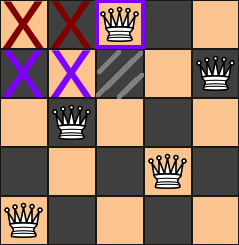

[【参考リンク】Ｎクイーン問題 過去記事一覧はこちらから](https://suzukiiichiro.github.io/search/?keyword=Ｎクイーン問題)

## ミラー
ミラー（鏡像）を用いてどのように改善できるのか
Ｎ５＝１０、Ｎ８＝９２といった、N-Queensの解が成立している場合、その鏡像（ミラー）も当然成立していることになります。

左右対称の鏡像の場合 この場合は、解がそれぞれ一つずつある。

```
+-+-+-+-+     +-+-+-+-+  
| | |Q| |     | |Q| | |
+-+-+-+-+     +-+-+-+-+
|Q| | | |     | | | |Q|
+-+-+-+-+     +-+-+-+-+
| | | |Q|     |Q| | | |
+-+-+-+-+     +-+-+-+-+
| |Q| | |     | | |Q| |
+-+-+-+-+     +-+-+-+-+
```


右の盤面は、左の盤面を左右対称にひっくり返しただけなのに、左盤面の解とは別の解として探索されカウントされます。

左のパターンが発見され１カウントできたら同時に、左右反転させて１カウントすればわざわざ探す必要がなくなります。


左右対称（鏡像）をつかって探索を効率的に進めるにはどうしましょう。


## 奇数と偶数
Ｎが偶数の場合は、最初の行の右半分、または左半分を除外（無視）すればよいのです。

`row0` いわゆる最初の行の左半分には置かない、
言い換えれば、一行目の右半分だけを使って解を探索する。一行目だけですからね！
```
+-+-+-+-+
|x|x| | |  左側を使わない
+-+-+-+-+
| | | | |
+-+-+-+-+
| | | | |
+-+-+-+-+
| | | | |
+-+-+-+-+
```
```
+-+-+-+-+
|x|x| |Q|  右半分を使う
+-+-+-+-+  解があればカウントし、最後にカウントを倍にする。
| | | | |
+-+-+-+-+
| | | | |
+-+-+-+-+
| | | | |
+-+-+-+-+
```
または
```
+-+-+-+-+
|x|x|Q| |  右半分を使う
+-+-+-+-+  解があればカウントし、最後にカウントを倍にする。 
| | | | |
+-+-+-+-+
| | | | |
+-+-+-+-+
| | | | |
+-+-+-+-+
```

Ｎが奇数の場合は、row0（最初の行）の奇数マスを2で割ることができないので、row0（最初の行）のクイーンが真ん中のマスにいない解はすべて、その半分を見つけて2をかければよいのです。

```
+-+-+-+-+-+        +-+-+-+-+-+  
|x|x| | |Q|        |x|x| |Q| | 中央を除く右側を使う。
+-+-+-+-+-+        +-+-+-+-+-+ 解があればカウントし、最後にカウントを倍にする
| | | | | |        | | | | | |
+-+-+-+-+-+        +-+-+-+-+-+
| | | | | |        | | | | | |
+-+-+-+-+-+        +-+-+-+-+-+
| | | | | |        | | | | | |
+-+-+-+-+-+        +-+-+-+-+-+
| | | | | |        | | | | | |
+-+-+-+-+-+        +-+-+-+-+-+
```


row0（最初の行）の真ん中のマスにクイーンがあるときも同じことができることが判明しました。
```
+-+-+-+-+-+
| | |Q| | |  
+-+-+-+-+-+
| | | | | |
+-+-+-+-+-+
| | | | | |
+-+-+-+-+-+
| | | | | |
+-+-+-+-+-+
| | | | | |
+-+-+-+-+-+
```
row0（最初の行）の真ん中のマスにクイーンがある場合、row1（２行目）の真ん中のマスにクイーンがあることはありえません。
```
+-+-+-+-+-+
| | |Q| | |  
+-+-+-+-+-+
| | |Q| | |
+-+-+-+-+-+
| | | | | |
+-+-+-+-+-+
| | | | | |
+-+-+-+-+-+
| | | | | |
+-+-+-+-+-+
```


これで、row1（２行目）のマスのうち、まだ空いているマスは偶数個になりました！
ですので、row1（２行目）の残りのマスの半分を除外すればよいのです。
```
+-+-+-+-+-+
| | |Q| | |  
+-+-+-+-+-+
|x|x|x| | |
+-+-+-+-+-+
| | | | | |
+-+-+-+-+-+
| | | | | |
+-+-+-+-+-+
| | | | | |
+-+-+-+-+-+
```

これで最初のクイーンが真ん中にある解のちょうど半分を見つけることができます。
これを、最初のクイーンが真ん中にない解の半分と足すと、全解のちょうど半分になり、これを2倍すると、出来上がりです！


## 図解すると
盤面が偶数の場合は、row0（最初の行）の半分だけを使って、解を倍にする。簡単！
盤面が奇数の場合は、以下を再確認。


row0（１行目）の左半分を除外
奇数Nの場合、これは真ん中のマスまでという意味であり、真ん中のマスは含まれない。このフィルターにより、今回のような解を見つけることができなくなります：


でも大丈夫、その鏡像を求めて、カウントを2倍するのですから：


しかし、これでは、１行目のクイーンが中央のマスにある解をダブルカウントしてしまうことになります。
次の解とその鏡像の解の両方がカウントされることになりますね。
また、1列目の真ん中のマスを除外してしまうと、どちらもカウントされません。
どちらか一方だけをカウントするようにしたいですね。


そこで、２行目の左半分を除外する条件付きフィルタを追加し、このフィルタは１行目のクイーンが真ん中のマスにいるときだけ適用されるようにします。
２行目の真ん中のマスは、最初のクイーンと競合しているので、配置されることを気にする必要はありません。i
最初の行の真ん中にクイーンがある場合は、２行目の中央を除く右半分を使って解の探索し、解があれば２倍すればよいのです。




## 奇数・偶数共通通過ブロック解説

以下の部分は奇数・偶数に関わらず、いつでも通過するブロックです。
ですので、forの条件は size/2 ということで、盤の半分だけを探索対象とします。
```python
  for i in range(size//2):  # 奇数でも偶数でも通過
    bit=1<<i
    board[0]=bit            # １行目にＱを配置
    mirror_solver(size,1,bit<<1,bit,bit>>1)
```

## 奇数ブロック解説
```python
  if size%2:                # 奇数で通過
    # Pythonでの割り算の切り捨ては`//`です
    bit=1<<(size-1)//2
    board[0]=1<<(size-1)//2 # １行目の中央にＱを配置
    left=bit<<1
    down=bit
    right=bit>>1
    for i in range(limit):
      bit=1<<i
      mirror_solver(size,2,(left|bit)<<1,down|bit,(right|bit)>>1)
```

これは、、、なんでしょう。
```python
  limit=size%2 if size/2-1 else size/2
```

普通のif文に直すと以下のようになります。
```python
  if size%2 :
    limit=size//2-1
  else:
    limit=size//2
```

割り算の余りを切り捨てる「除算」は `//` ダブルスラッシュで行います。

`size%2` は？
ターミナルで実行して確認してみます。

```bash
bash $ echo $(( 5 % 2 )) 
     $ 1
```
```bash
bash $ echo $(( 6 % 2 )) 
     $ 0
```

１はtrueで０はfalseなので、奇数であるかどうか？ということになりますね。
ですので、

奇数だったら　limitに size/2-1 を代入
そうでなかったら limitに size/2 を代入　ということになります。


お、ここはなんでしょう。そうです。倍にしているところです。
`<<<1` というところがなんだかよくわかりませんが、coolですね。
数を倍にしたいときは、まよわず `<<1`を使って、難読化していきましょう。

```python
  TOTAL=COUNT2<<1          # 倍にする
```


ミラー　メインメソッド
```python
#
# ミラー
def Mirror(size):
  global COUNT2
  mask=(1<<size)-1
  bit=0
  """
  if size%2 :
    limit=size//2-1
  else:
    limit=size//2
  """
  limit=size%2 if size/2-1 else size/2
  # pythonでは割り算の切り捨ては`//`です
  for i in range(size//2):  # 奇数でも偶数でも通過
    bit=1<<i
    board[0]=bit            # １行目にＱを配置
    mirror_solver(size,1,bit<<1,bit,bit>>1)
  if size%2:                # 奇数で通過
    # Pythonでの割り算の切り捨ては`//`です
    bit=1<<(size-1)//2
    board[0]=1<<(size-1)//2 # １行目の中央にＱを配置
    left=bit<<1
    down=bit
    right=bit>>1
    for i in range(limit):
      bit=1<<i
      mirror_solver(size,2,(left|bit)<<1,down|bit,(right|bit)>>1)
  TOTAL=COUNT2<<1          # 倍にする
  print("size:",size,"TOTAL:",TOTAL,"COUNT2:",COUNT2)
```

## ロジック部分解説
実は、ロジック部分は、これまでのビットマップの再帰ソースと同じなのです。
結局、ミラーは偶数であるか、奇数であるかの判別を行っているに過ぎません。
偶数であれば、半分、奇数であれば、中央を除く半分、中央に置かれた場合は、２段めの中央を除く半分を配置可能エリアとして、解があれば２倍にします。

```python
#
# ミラーソルバー
def mirror_solver(size,row,left,down,right):
  global COUNT2
  global TOTAL
  mask=(1<<size)-1
  bit=0
  bitmap=0
  if row==size:
    COUNT2+=1
    TOTAL=TOTAL+1 # ボードレイアウト出力用
    printRecord_bitmap(size,1)
  else:
    # Ｑが配置可能な位置を表す
    bitmap=mask&~(left|down|right)
    while bitmap:
      bit=-bitmap&bitmap  # 一番右のビットを取り出す
      bitmap=bitmap^bit   # 配置可能なパターンが一つずつ取り出される
      board[row]=bit      # Ｑを配置
      mirror_solver(size,row+1,(left|bit)<<1,down|bit,(right|bit)>>1)
```

## ミラー版ソースコード
ソース下部で再帰・非再帰を切換えて実行してください。
```python:05Python_mirror.py
#!/usr/bin/env python3

# -*- coding: utf-8 -*-

"""
ミラー版 Ｎクイーン

詳細はこちら。
【参考リンク】Ｎクイーン問題 過去記事一覧はこちらから
https://suzukiiichiro.github.io/search/?keyword=Ｎクイーン問題

エイト・クイーンのプログラムアーカイブ
Bash、Lua、C、Java、Python、CUDAまで！
https://github.com/suzukiiichiro/N-Queens

# 実行 
$ python <filename.py>

# 実行結果
1
 0 2 4 1 3
+-+-+-+-+-+
|O| | | | |
+-+-+-+-+-+
| | |O| | |
+-+-+-+-+-+
| | | | |O|
+-+-+-+-+-+
| |O| | | |
+-+-+-+-+-+
| | | |O| |
+-+-+-+-+-+

2
 0 3 1 4 2
+-+-+-+-+-+
|O| | | | |
+-+-+-+-+-+
| | | |O| |
+-+-+-+-+-+
| |O| | | |
+-+-+-+-+-+
| | | | |O|
+-+-+-+-+-+
| | |O| | |
+-+-+-+-+-+

3
 1 3 0 2 4
+-+-+-+-+-+
| |O| | | |
+-+-+-+-+-+
| | | |O| |
+-+-+-+-+-+
|O| | | | |
+-+-+-+-+-+
| | |O| | |
+-+-+-+-+-+
| | | | |O|
+-+-+-+-+-+

4
 1 4 2 0 3
+-+-+-+-+-+
| |O| | | |
+-+-+-+-+-+
| | | | |O|
+-+-+-+-+-+
| | |O| | |
+-+-+-+-+-+
|O| | | | |
+-+-+-+-+-+
| | | |O| |
+-+-+-+-+-+

5
 2 4 3 1 4
+-+-+-+-+-+
| | |O| | |
+-+-+-+-+-+
| | | | |O|
+-+-+-+-+-+
| | | |O| |
+-+-+-+-+-+
| |O| | | |
+-+-+-+-+-+
| | | | |O|
+-+-+-+-+-+

size: 5 TOTAL: 10 COUNT2: 5

"""

#
# グローバル変数
MAX=21                          # ボードサイズ最大値
TOTAL=0                         # 解
COUNT2=0                        # ミラー
board=[0 for i in range(MAX)]   # ボード配列格納用
down=[0 for i in range(MAX)]    # 効き筋チェック
left=[0 for i in range(MAX)]    # 効き筋チェック
right=[0 for i in range(MAX)]   # 効き筋チェック
#
# ビットマップ版ボードレイアウト出力
def printRecord_bitmap(size,flag):
  global TOTAL
  global board
  print(TOTAL)
  sEcho=""
  """
  ビットマップ版
     ビットマップ版からは、左から数えます
     上下反転左右対称なので、これまでの上から数える手法と
     rowを下にたどって左から数える方法と解の数に変わりはありません。
     0 2 4 1 3 
    +-+-+-+-+-+
    |O| | | | | 0
    +-+-+-+-+-+
    | | |O| | | 2
    +-+-+-+-+-+
    | | | | |O| 4
    +-+-+-+-+-+
    | |O| | | | 1
    +-+-+-+-+-+
    | | | |O| | 3
    +-+-+-+-+-+
  """
  if flag:
    for i in range(size):
      for j in range(size):
        if board[i]&1<<j:
          sEcho+=" " + str(j)
  else:
    """
    ビットマップ版以外
    (ブルートフォース、バックトラック、配置フラグ)
    上から数えます
       0 2 4 1 3 
      +-+-+-+-+-+
      |O| | | | |
      +-+-+-+-+-+
      | | | |O| |
      +-+-+-+-+-+
      | |O| | | |
      +-+-+-+-+-+
      | | | | |O|
      +-+-+-+-+-+
      | | |O| | |
      +-+-+-+-+-+
    """
    for i in range(size):
      sEcho+=" " + str(board[i])
  print(sEcho)

  print ("+",end="")
  for i in range(size):
    print("-",end="")
    if i<(size-1):
      print("+",end="")
  print("+")
  for i in range(size):
    print("|",end="")
    for j in range(size):
      if flag:
        if board[i]&1<<j:
          print("O",end="")
        else:
          print(" ",end="")
      else:
        if i==board[j]:
          print("O",end="")
        else:
          print(" ",end="")
      if j<(size-1):
        print("|",end="")
    print("|")
    if i in range(size-1):
      print("+",end="")
      for j in range(size):
        print("-",end="")
        if j<(size-1):
          print("+",end="")
      print("+")
  print("+",end="")
  for i in range(size):
    print("-",end="")
    if i<(size-1):
      print("+",end="")
  print("+")
  print("")
# 
# ボードレイアウト出力
def printRecord(size):
  global TOTAL
  global board
  print(TOTAL)
  sEcho=""
  for i in range(size):
    sEcho+=" " + str(board[i])
  print(sEcho)
  print ("+",end="")
  for i in range(size):
    print("-",end="")
    if i<(size-1):
      print("+",end="")
  print("+")
  for i in range(size):
    print("|",end="")
    for j in range(size):
      if i==board[j]:
        print("O",end="")
      else:
        print(" ",end="")
      if j<(size-1):
        print("|",end="")
    print("|")
    if i in range(size-1):
      print("+",end="")
      for j in range(size):
        print("-",end="")
        if j<(size-1):
          print("+",end="")
      print("+")
  print("+",end="")
  for i in range(size):
    print("-",end="")
    if i<(size-1):
      print("+",end="")
  print("+")
  print("")
#
# バックトラック版効き筋をチェック
def check_backTracking(row):
  global board
  for i in range(row):
    if board[i]>=board[row]:
      val=board[i]-board[row]
    else:
      val=board[row]-board[i]
    if board[i]==board[row] or val==(row-i):
      return 0
  return 1
#
# ブルートフォース版効き筋チェック
def check_bluteForce(size):
  global board
  for r in range(1,size,1):
    for i in range(r):
      if board[i]>=board[r]:
        val=board[i]-board[r]
      else:
        val=board[r]-board[i]
      if board[i]==board[r] or val==(r-i):
        return 0
  return 1
#
# ミラーソルバー
def mirror_solver(size,row,left,down,right):
  global COUNT2
  global TOTAL
  mask=(1<<size)-1
  bit=0
  bitmap=0
  if row==size:
    COUNT2+=1
    TOTAL=TOTAL+1 # ボードレイアウト出力用
    printRecord_bitmap(size,1)
  else:
    # Ｑが配置可能な位置を表す
    bitmap=mask&~(left|down|right)
    while bitmap:
      bit=-bitmap&bitmap  # 一番右のビットを取り出す
      bitmap=bitmap^bit   # 配置可能なパターンが一つずつ取り出される
      board[row]=bit      # Ｑを配置
      mirror_solver(size,row+1,(left|bit)<<1,down|bit,(right|bit)>>1)
#
# ミラー
def Mirror(size):
  global COUNT2
  mask=(1<<size)-1
  bit=0
  """
  if size%2 :
    limit=size//2-1
  else:
    limit=size//2
  """
  limit=size%2 if size/2-1 else size/2
  # pythonでは割り算の切り捨ては`//`です
  for i in range(size//2):  # 奇数でも偶数でも通過
    bit=1<<i
    board[0]=bit            # １行目にＱを配置
    mirror_solver(size,1,bit<<1,bit,bit>>1)
  if size%2:                # 奇数で通過
    # Pythonでの割り算の切り捨ては`//`です
    bit=1<<(size-1)//2
    board[0]=1<<(size-1)//2 # １行目の中央にＱを配置
    left=bit<<1
    down=bit
    right=bit>>1
    for i in range(limit):
      bit=1<<i
      mirror_solver(size,2,(left|bit)<<1,down|bit,(right|bit)>>1)
  TOTAL=COUNT2<<1          # 倍にする
  print("size:",size,"TOTAL:",TOTAL,"COUNT2:",COUNT2)
#
# ビットマップ
def Bitmap(size,row,left,down,right):
  global TOTAL
  bitmap=0
  bit=0
  col=0
  mask=(1<<size)-1
  if row==size:
    TOTAL=TOTAL+1
    printRecord_bitmap(size,1) # 1:bitmap版 0: それ以外
  else:
    bitmap=mask&~(left|down|right)
    while bitmap:
      bit=-bitmap&bitmap
      bitmap=bitmap&~bit
      board[row]=bit
      Bitmap(size,row+1,(left|bit)<<1, (down|bit),(right|bit)>>1)
#
# ポストフラグ
def postFlag(row,size):
  global TOTAL
  col=0
  if row==size:
    TOTAL=TOTAL+1
    printRecord(size)
  else:
    for col in range(size):
      board[row]=col
      if(down[col]==0 and 
          right[row-col+size-1]==0 and
          left[row+col]==0):
        down[col]=1
        right[row-col+(size-1)]=1
        left[row+col]=1
        postFlag(row+1,size)
        down[col]=0
        right[row-col+(size-1)]=0
        left[row+col]=0;
#
# バックトラック
def backTracking(row,size):
  global TOTAL
  col=0
  if row==size:
    TOTAL=TOTAL+1
    printRecord(size)
  else:
    for col in range(size):
      board[row]=col
      if check_backTracking(row)==1:
        backTracking(row+1,size)
#
# ブルートフォース
def bluteForce(row,size):
  col=0
  global TOTAL
  global board
  if row==size:
    if check_bluteForce(size)==1:
      TOTAL=TOTAL+1
      printRecord(size)
  else:
    for col in range(size):
      board[row]=col
      bluteForce(row+1,size)
#
# 実行
# bluteForce(0,5)   # １．ブルートフォース
# backTracking(0,5) # ２．バックトラッキング
# postFlag(0,5)     # ３．ポストフラグ
# Bitmap(5,0,0,0,0) # ４．ビットマップ
Mirror(5)         # ５．ミラー
#
```


## 参考リンク
以下の詳細説明を参考にしてください。
[【参考リンク】Ｎクイーン問題 過去記事一覧](https://suzukiiichiro.github.io/search/?keyword=Ｎクイーン問題)
[【Github】エイト・クイーンのソース置き場 BashもJavaもPythonも！](https://github.com/suzukiiichiro/N-Queens)

Ｎクイーン問題（５０）第七章 マルチプロセス Python編
https://suzukiiichiro.github.io/posts/2023-06-21-04-n-queens-suzuki/
Ｎクイーン問題（４９）第七章 マルチスレッド Python編
https://suzukiiichiro.github.io/posts/2023-06-21-03-n-queens-suzuki/
Ｎクイーン問題（４８）第七章 シングルスレッド Python編
https://suzukiiichiro.github.io/posts/2023-06-21-02-n-queens-suzuki/
Ｎクイーン問題（４７）第七章 クラス Python編
https://suzukiiichiro.github.io/posts/2023-06-21-01-n-queens-suzuki/
Ｎクイーン問題（４６）第七章 ステップＮの実装 Python編
https://suzukiiichiro.github.io/posts/2023-06-16-02-n-queens-suzuki/
Ｎクイーン問題（４５）第七章 キャリーチェーン Python編
https://suzukiiichiro.github.io/posts/2023-06-16-01-n-queens-suzuki/
Ｎクイーン問題（４４）第七章　対象解除法 Python編
https://suzukiiichiro.github.io/posts/2023-06-14-02-n-queens-suzuki/
Ｎクイーン問題（４３）第七章　ミラー Python編
https://suzukiiichiro.github.io/posts/2023-06-14-01-n-queens-suzuki/
Ｎクイーン問題（４２）第七章　ビットマップ Python編
https://suzukiiichiro.github.io/posts/2023-06-13-05-n-queens-suzuki/
Ｎクイーン問題（４１）第七章　配置フラグ Python編
https://suzukiiichiro.github.io/posts/2023-06-13-04-n-queens-suzuki/
Ｎクイーン問題（４０）第七章　バックトラック Python編
https://suzukiiichiro.github.io/posts/2023-06-13-03-n-queens-suzuki/
Ｎクイーン問題（３９）第七章　バックトラック準備編 Python編
https://suzukiiichiro.github.io/posts/2023-06-13-02-n-queens-suzuki/
Ｎクイーン問題（３８）第七章　ブルートフォース Python編
https://suzukiiichiro.github.io/posts/2023-06-13-01-n-queens-suzuki/
Ｎクイーン問題（３７）第六章 C言語移植 その１７ pthread並列処理完成
https://suzukiiichiro.github.io/posts/2023-05-30-17-n-queens-suzuki/
Ｎクイーン問題（３６）第六章 C言語移植 その１６ pthreadの実装
https://suzukiiichiro.github.io/posts/2023-05-30-16-n-queens-suzuki/
Ｎクイーン問題（３５）第六章 C言語移植 その１５ pthread実装直前版完成
https://suzukiiichiro.github.io/posts/2023-05-30-15-n-queens-suzuki/
Ｎクイーン問題（３４）第六章 C言語移植 その１４
https://suzukiiichiro.github.io/posts/2023-05-30-14-n-queens-suzuki/
Ｎクイーン問題（３３）第六章 C言語移植 その１３
https://suzukiiichiro.github.io/posts/2023-05-30-13-n-queens-suzuki/
Ｎクイーン問題（３２）第六章 C言語移植 その１２
https://suzukiiichiro.github.io/posts/2023-05-30-12-n-queens-suzuki/
Ｎクイーン問題（３１）第六章 C言語移植 その１１
https://suzukiiichiro.github.io/posts/2023-05-30-11-n-queens-suzuki/
Ｎクイーン問題（３０）第六章 C言語移植 その１０
https://suzukiiichiro.github.io/posts/2023-05-30-10-n-queens-suzuki/
Ｎクイーン問題（２９）第六章 C言語移植 その９
https://suzukiiichiro.github.io/posts/2023-05-30-09-n-queens-suzuki/
Ｎクイーン問題（２８）第六章 C言語移植 その８
https://suzukiiichiro.github.io/posts/2023-05-30-08-n-queens-suzuki/
Ｎクイーン問題（２７）第六章 C言語移植 その７
https://suzukiiichiro.github.io/posts/2023-05-30-07-n-queens-suzuki/
Ｎクイーン問題（２６）第六章 C言語移植 その６
https://suzukiiichiro.github.io/posts/2023-05-30-06-n-queens-suzuki/
Ｎクイーン問題（２５）第六章 C言語移植 その５
https://suzukiiichiro.github.io/posts/2023-05-30-05-n-queens-suzuki/
Ｎクイーン問題（２４）第六章 C言語移植 その４
https://suzukiiichiro.github.io/posts/2023-05-30-04-n-queens-suzuki/
Ｎクイーン問題（２３）第六章 C言語移植 その３
https://suzukiiichiro.github.io/posts/2023-05-30-03-n-queens-suzuki/
Ｎクイーン問題（２２）第六章 C言語移植 その２
https://suzukiiichiro.github.io/posts/2023-05-30-02-n-queens-suzuki/
Ｎクイーン問題（２１）第六章 C言語移植 その１
N-Queens問://suzukiiichiro.github.io/posts/2023-05-30-01-n-queens-suzuki/
Ｎクイーン問題（２０）第五章 並列処理
https://suzukiiichiro.github.io/posts/2023-05-23-02-n-queens-suzuki/
Ｎクイーン問題（１９）第五章 キャリーチェーン
https://suzukiiichiro.github.io/posts/2023-05-23-01-n-queens-suzuki/
Ｎクイーン問題（１８）第四章 エイト・クイーンノスタルジー
https://suzukiiichiro.github.io/posts/2023-04-25-01-n-queens-suzuki/
Ｎクイーン問題（１７）第四章　偉人のソースを読む「Ｎ２４を発見 Ｊｅｆｆ Ｓｏｍｅｒｓ」
https://suzukiiichiro.github.io/posts/2023-04-21-01-n-queens-suzuki/
Ｎクイーン問題（１６）第三章　対象解除法 ソース解説
https://suzukiiichiro.github.io/posts/2023-04-18-01-n-queens-suzuki/
Ｎクイーン問題（１５）第三章　対象解除法 ロジック解説
https://suzukiiichiro.github.io/posts/2023-04-13-02-nqueens-suzuki/
Ｎクイーン問題（１４）第三章　ミラー
https://suzukiiichiro.github.io/posts/2023-04-13-01-nqueens-suzuki/
Ｎクイーン問題（１３）第三章　ビットマップ
https://suzukiiichiro.github.io/posts/2023-04-05-01-nqueens-suzuki/
Ｎクイーン問題（１２）第二章　まとめ
https://suzukiiichiro.github.io/posts/2023-03-17-02-n-queens-suzuki/
Ｎクイーン問題（１１）第二章　配置フラグの再帰・非再帰
https://suzukiiichiro.github.io/posts/2023-03-17-01-n-queens-suzuki/
Ｎクイーン問題（１０）第二章　バックトラックの再帰・非再帰
https://suzukiiichiro.github.io/posts/2023-03-16-01-n-queens-suzuki/
Ｎクイーン問題（９）第二章　ブルートフォースの再帰・非再帰
https://suzukiiichiro.github.io/posts/2023-03-14-01-n-queens-suzuki/
Ｎクイーン問題（８）第一章　まとめ
https://suzukiiichiro.github.io/posts/2023-03-09-01-n-queens-suzuki/
Ｎクイーン問題（７）第一章　ブルートフォース再び
https://suzukiiichiro.github.io/posts/2023-03-08-01-n-queens-suzuki/
Ｎクイーン問題（６）第一章　配置フラグ
https://suzukiiichiro.github.io/posts/2023-03-07-01-n-queens-suzuki/
Ｎクイーン問題（５）第一章　進捗表示テーブルの作成
https://suzukiiichiro.github.io/posts/2023-03-06-01-n-queens-suzuki/
Ｎクイーン問題（４）第一章　バックトラック
https://suzukiiichiro.github.io/posts/2023-02-21-01-n-queens-suzuki/
Ｎクイーン問題（３）第一章　バックトラック準備編
https://suzukiiichiro.github.io/posts/2023-02-14-03-n-queens-suzuki/
Ｎクイーン問題（２）第一章　ブルートフォース
https://suzukiiichiro.github.io/posts/2023-02-14-02-n-queens-suzuki/
Ｎクイーン問題（１）第一章　エイトクイーンについて
https://suzukiiichiro.github.io/posts/2023-02-14-01-n-queens-suzuki/


## 書籍の紹介
{{% amazon

title="詳解 シェルスクリプト 大型本  2006/1/16"

url="https://www.amazon.co.jp/gp/proteect/4873112672/ref=as_li_tl?ie=UTF8&camp=247&creative=1211&creativeASIN=4873112672&linkCode=as2&tag=nlpqueens09-22&linkId=ef087fd92d3628bb94e1eb10cb202d43"

summary=`Unixのプログラムは「ツール」と呼ばれます。
Unixは、処理を実現するために複数の道具(ツール)を組み合わせる「ソフトウェアツール」という思想の下に設計されているためです。
そしてこれらツールを「組み合わせる」ということこそがUnixの真髄です。
また、シェルスクリプトの作成には言語自体だけでなくそれぞれのツールに対する理解も求められます。
つまり、あるツールが何のためのものであり、それを単体あるいは他のプログラムと組み合わせて利用するにはどのようにすればよいかということを理解しなければなりません。
本書は、Unixシステムへの理解を深めながら、シェルスクリプトの基礎から応用までを幅広く解説します。
標準化されたシェルを通じてUnix(LinuxやFreeBSD、Mac OS XなどあらゆるUnix互換OSを含む)の各種ツールを組み合わせ、
目的の処理を実現するための方法を詳しく学ぶことができます。
`
imageUrl="https://m.media-amazon.com/images/I/51EAPCH56ML._SL250_.jpg"
%}}

{}


{{% amazon

title="[改訂第3版]シェルスクリプト基本リファレンス ──#!/bin/shで、ここまでできる (WEB+DB PRESS plus) 単行本（ソフトカバー）  2017/1/20"

url="https://www.amazon.co.jp/gp/proteect/4774186945/ref=as_li_tl?ie=UTF8&camp=247&creative=1211&creativeASIN=4774186945&linkCode=as2&tag=nlpqueens09-22&linkId=8ef3ff961c569212e910cf3d6e37dcb6"

summary=`定番の1冊『シェルスクリプト基本リファレンス』の改訂第3版。
シェルスクリプトの知識は、プログラマにとって長く役立つ知識です。
本書では、複数のプラットフォームに対応できる移植性の高いシェルスクリプト作成に主眼を置き、
基本から丁寧に解説。
第3版では最新のLinux/FreeBSD/Solarisに加え、組み込み分野等で注目度の高いBusyBoxもサポート。
合わせて、全収録スクリプトに関してWindowsおよびmacOS環境でのbashの動作確認も行い、さらなる移植性の高さを追求。
ますますパワーアップした改訂版をお届けします。`
imageUrl="https://m.media-amazon.com/images/I/41i956UyusL._SL250_.jpg"
%}}

{{% amazon

title="新しいシェルプログラミングの教科書 単行本"

url="https://www.amazon.co.jp/gp/proteect/4797393106/ref=as_li_tl?ie=UTF8&camp=247&creative=1211&creativeASIN=4797393106&linkCode=as2&tag=nlpqueens09-22&linkId=f514a6378c1c10e59ab16275745c2439"

summary=`エキスパートを目指せ!!

システム管理やソフトウェア開発など、
実際の業務では欠かせないシェルスクリプトの知識を徹底解説

ほとんどのディストリビューションでデフォルトとなっているbashに特化することで、
類書と差別化を図るとともに、より実践的なプログラミングを紹介します。
またプログラミング手法の理解に欠かせないLinuxの仕組みについてもできるかぎり解説しました。
イマドキのエンジニア必携の一冊。

▼目次
CHAPTER01 シェルってなんだろう
CHAPTER02 シェルスクリプトとは何か
CHAPTER03 シェルスクリプトの基本
CHAPTER04 変数
CHAPTER05 クォーティング
CHAPTER06 制御構造
CHAPTER07 リダイレクトとパイプ
CHAPTER08 関数
CHAPTER09 組み込みコマンド
CHAPTER10 正規表現と文字列
CHAPTER11 シェルスクリプトの実行方法
CHAPTER12 シェルスクリプトのサンプルで学ぼう
CHAPTER13 シェルスクリプトの実用例
CHAPTER14 テストとデバッグ
CHAPTER15 読みやすいシェルスクリプト
`
imageUrl="https://m.media-amazon.com/images/I/41d1D6rgDiL._SL250_.jpg"
%}}


