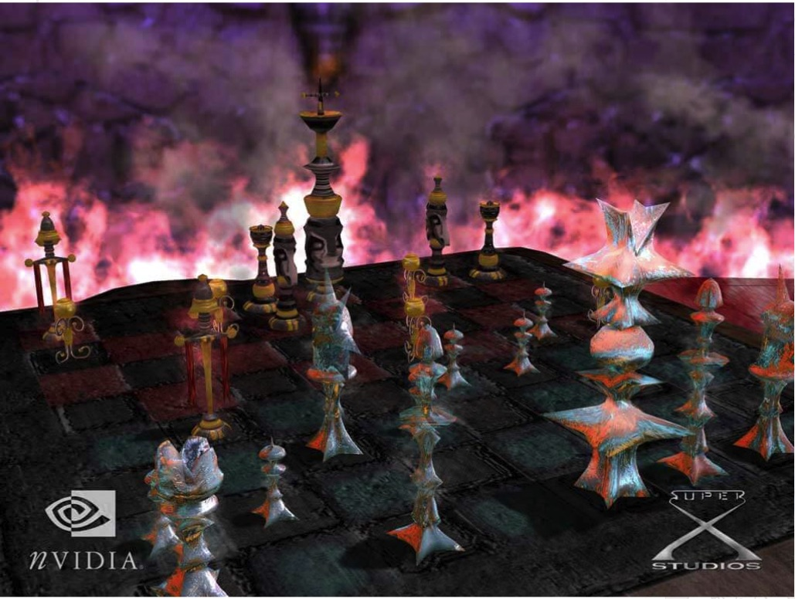

## ソースコード
今回の連載 python/pypy/codonのソースコードディレクトリはこちら
https://github.com/suzukiiichiro/N-Queens/tree/master/10Bit_Python

## インストールなどの構築はこちら
Ｎクイーン問題（６６） Python-codonで高速化
https://suzukiiichiro.github.io/posts/2025-03-05-01-n-queens-suzuki/

## carryChain（キャリーチェーン）について
キャリーチェーンはＮ２７の解を発見したドレスデン大学の研究者が編み出したアルゴリズムです。

Jeffサマーズがミラーとビットマップの組み合わせでＮ２３を発見し、電気通信大学がサマーズのアルゴリズムを並列処理しＮ２４を発見、プロアクティブが対称解除法でＮ２５を発見し、Ｎ２７でキャリーチェーンによりドレスデン大学が世界一となりました。

まず最初に対称解除法の実行結果を見てみましょう。

```
## 対象解除法
#  <> 06Bash_symmetry.sh 対象解除法
#  N:        Total       Unique        hh:mm:ss
#  4:            2            1         0:00:00
#  5:           10            2         0:00:00
#  6:            4            1         0:00:00
#  7:           40            6         0:00:00
#  8:           92           12         0:00:00
#  9:          352           46         0:00:00
# 10:          724           92         0:00:02
# 11:         2680          341         0:00:05
# 12:        14200         1787         0:00:26
# 13:        73712         9233         0:02:28
# 14:       365596        45752         0:14:18
# 15:      2279184       285053         1:23:34
```


Ｎ２５で、１時間２３分かかっています。
Bashだからこその遅さです。ＣプログラムではＮ１７までは１秒かかりません。
とはいえ、アルゴリズムやロジックを深く知るためには、プログラムのシンタックスに悩むドデカ級のプログラム言語よりも、身近なBash言語のほうが直感的でよいのです。
ＵＮＩＸを開発したＡＴ＆Ｔベル研究所では、開発者はBashでプロトタイプを作り、その後プログラマがＣに移植します。

新しい開発、革新的なロジックを研究することにBashは多くの現場で活躍してきました。ＣやJavaは、知恵を導入するまえに、構文（シンタックス）の複雑さに気を奪われ、書いた気になる、作った気になる言語と言われています。

では、Ｎ２７を叩き出したドレスデン大学のソースをBashに移植して、高速化、最適化したソースの実行結果を見てみます。

```
# キャリーチェーン
#  <> 07Bash_carryChain.sh
#  N:        Total       Unique        hh:mm:ss
#  4:            2            1         0:00:00
#  5:           10            2         0:00:00
#  6:            4            1         0:00:00
#  7:           40            6         0:00:01
#  8:           92           12         0:00:02
#  9:          352           46         0:00:12
# 10:          724           92         0:00:44
# 11:         2680          341         0:02:39
# 12:        14200         1788         0:08:35
# 13:        73712         9237         0:27:05
# 14:       365596        45771         1:30:40
# 15:      2279184       285095         5:59:03
```

おそい。。。。
遅すぎますね。大丈夫なのでしょうか。

実際、とてつもなく遅いのですが、キャリーチェーンとは

１．対称解除とは比較にならないほど遅い
２．対称解除とは比較にならないほどメモリ消費量が小さい
３．対称解除と比べ、Ｎが小さいときに遅いが、Ｎが大きくなるに従って対称解除のスピードに追いつき、Ｎ１７で対称解除を追い抜き安定して実行を継続する。
４．一方で対称解除は、Ｎが小さいときは快調だが、Ｎが大きくなるに従って、board配列を中心にメモリ消費量が爆発的に肥大し、Ｎ１７以降、高い確率でバースト、システムは停止する。

ということで、キャリーチェーンは、遅いけど安定的に処理し続けるアルゴリズムなのです。

さらに、次の章で紹介する並列処理に極めて高い親和性があるアルゴリズムです。


## キャリーチェーン ロジック解説
まず、NQ()を実行するとcarryChain()を呼び出します。
carrychain()は、チェーンの初期化を行うinitChain()と、チェーンのビルドを行う buildChain()を実行します。

チェーンの初期化を行う initChain()は以下の２行のクイーンが配置できるすべてをブルートフォースで導き出します。ここではクイーンの効きは考慮しません。
１行目の配置を pres_a配列に、２行目の配列をpres_b配列に保存します。

initChain()
```
+-+-+-+-+-+-+-+
|Q|Q|Q|Q|Q|Q|Q|
+-+-+-+-+-+-+-+
|Q|Q|Q|Q|Q|Q|Q|
+-+-+-+-+-+-+-+
| | | | | | | |
+-+-+-+-+-+-+-+
| | | | | | | |
+-+-+-+-+-+-+-+
| | | | | | | |
+-+-+-+-+-+-+-+
| | | | | | | |
+-+-+-+-+-+-+-+
| | | | | | | |
+-+-+-+-+-+-+-+
```

次にbuildChain()は、上２行に配置します。
buildChain()では配置のたびに placement()を呼び出し、クイーンの効きに問題がないかをチェックします。
ざっくりいうと上１行目のクイーンはミラーのロジックにより、Ｎの半分しか配置しません。上２行目はＮすべてを配置候補とします。

buildChain()
```
+-+-+-+-+-+-+-+
| | | | | | |Q|  ←
+-+-+-+-+-+-+-+
| | | | |Q|x|x|  ←
+-+-+-+-+-+-+-+
| | | | | | | |
+-+-+-+-+-+-+-+
| | | | | | | |
+-+-+-+-+-+-+-+
| | | | | | | |
+-+-+-+-+-+-+-+
| | | | | | | |
+-+-+-+-+-+-+-+
| | | | | | | |
+-+-+-+-+-+-+-+
```

上２行に配置できたら、左２列を作成します。
```
 ↓↓
+-+-+-+-+-+-+-+
|x|x| | | | |Q| 
+-+-+-+-+-+-+-+
|x|x|x|x|Q|x|x| 
+-+-+-+-+-+-+-+
|Q|x|x|x|x|x|x|
+-+-+-+-+-+-+-+
|x|x|x|x|x| |x|
+-+-+-+-+-+-+-+
|x|x|x|x|x|x|x|
+-+-+-+-+-+-+-+
|x|Q|x|x|x|x|x|
+-+-+-+-+-+-+-+
|x|x|x|Q|x|x|x|
+-+-+-+-+-+-+-+
```

左２列が完成したら、下２行を作成します。
クイーンの配置の都度、placement()が呼び出され、クイーンの効きをチェックします。

```
+-+-+-+-+-+-+-+
|x|x|x|x|x|x|Q| 
+-+-+-+-+-+-+-+
|x|x| | |Q|x|x|
+-+-+-+-+-+-+-+
|Q|x| |x|x| |x|
+-+-+-+-+-+-+-+
|x|x|x|x|x| |x|
+-+-+-+-+-+-+-+
|x|x|x|x|x|x|x|
+-+-+-+-+-+-+-+
|x|Q|x|x|x|x|x| ←
+-+-+-+-+-+-+-+
|x|x|x|Q|x|x|x| ←
+-+-+-+-+-+-+-+
```

すでに配置されている場合はそれを許可し、配置したことにします。
下２行を作成したら、右２列を作成します。

```
+-+-+-+-+-+-+-+
|x|x|x|x|x|x|Q| 
+-+-+-+-+-+-+-+
|x|x| |x|Q|x|x|
+-+-+-+-+-+-+-+
|Q|x| |x|x|x|x|
+-+-+-+-+-+-+-+
|x|x|x|x|x|Q|x|
+-+-+-+-+-+-+-+
|x|x|x|x|x|x|x|
+-+-+-+-+-+-+-+
|x|Q|x|x|x|x|x|
+-+-+-+-+-+-+-+
|x|x|x|Q|x|x|x|
+-+-+-+-+-+-+-+
           ↑↑
```

配置が終わりました。
配置が終わったら、carryChainSymmetry()を呼び出して、対称解除法を実行します。


これまでのsymmetry.shでは１行目のクイーンが角にあるか、ないかで分岐し、クイーンの配置がすべて完了したら対称解除を行ってきました。ようするに処理の最終局面で対称解除を行ってきたわけです。

ですので、ボード情報をboard配列に入れて９０度回転を繰り返してきました。この処理はbit処理でなかった（僕がどうやってよいか分からなかった）ため、負荷も高くなってしまいました。

盤面のクイーンの配置すべてを格納したboard配列をまるっと９０度回転、さらに９０度回転、さらにさらに９０度回転と繰り返して、COUNT2,COUNT4,COUNT8のユニーク解を導き出していました。

キャリーチェーンは、盤面の外枠２行２列のみにクイーンを配置します。理由は「対称解除は２行２列に配置されていれば可能」だからです。


まず、２行２列を配置し、対称解除を行い、COUNT2,COUNT4,COUNT8のいずれかである場合にかぎって、内側にクイーンの配置処理に入ります。


すごいですね！ 新しいです。
最初に対称解除を行うことができるから、最初からbit処理可能です。そして最後までbit処理で完結できます。

これまでやってきた枝刈りのロジックは、ドレスデン大学のソースにはありませんでしたが、追記しておきました。期待大！ですね。

ですが、激しく遅いのです。残念です。

とはいえ世界一となったこのロジックはただものではありません。極めて優れたロジックで、パッと見だめでもじつはイケてるプログラムなのです。

ノードレイヤーに一工夫入れたキャリーチェーンは確かに遅いのですが、後継の「コンステレーション」では、これまで最速だったビット版対象解除法よりも良い結果を導くことに成功します。お楽しみに


``` python:15Python_carryChain.py
from datetime import datetime
import copy

# pypyを使うときは以下を活かしてcodon部分をコメントアウト
import pypyjit
# pypyjit.set_param('max_unroll_recursion=-1')
# pypy では ThreadPool/ProcessPoolが動きます 
#

# from threading import Thread
# from multiprocessing import Pool as ThreadPool
# import concurrent
# from concurrent.futures import ThreadPoolExecutor
# from concurrent.futures import ProcessPoolExecutor
#

class NQueens17:
  def __init__(self):
    pass
  def carryChain(self,size:int)->int:
    def process(size:int,sym:int,B:list[int])->int:
      def solve(row:int,left:int,down:int,right:int)->int:
        total:int=0
        if not down+1:
          return 1
        while row&1:
          row>>=1
          left<<=1
          right>>=1
        row>>=1           # １行下に移動する
        bitmap:int=~(left|down|right)
        while bitmap!=0:
          bit=-bitmap&bitmap
          total+=solve(row,(left|bit)<<1,down|bit,(right|bit)>>1)
          bitmap^=bit
        return total
      return sym*solve(B[0]>>2,B[1]>>4,(((B[2]>>2|~0<<size-4)+1)<<size-5)-1,B[3]>>4<<size-5) # sym 0:COUNT2 1:COUNT4 2:COUNT8
    def Symmetry(size:int,n:int,w:int,s:int,e:int,B:list[int],B4:list[int])->int:
      # 前計算
      ww=(size-2) * (size-1)-1-w
      w2=(size-2) * (size-1)-1
      # 対角線上の反転が小さいかどうか確認する
      if s==ww and n<(w2-e): return 0
      # 垂直方向の中心に対する反転が小さいかを確認
      if e==ww and n>(w2-n): return 0
      # 斜め下方向への反転が小さいかをチェックする
      if n==ww and e>(w2-s): return 0
      # 【枝刈り】1行目が角の場合
      if not B4[0]: return process(size,8,B)  # COUNT8
      # n,e,s==w の場合は最小値を確認
      if s==w:
        if n!=w or e!=w: return 0
        return process(size,2,B)  # COUNT2
      # e==w は180度回転して同じ
      if e==w and n>=s:
        if n>s: return 0
        return process(size,4,B)  # COUNT4
      # その他の場合
      return process(size,8,B)    # COUNT8
    def placement(size:int,dimx:int,dimy:int,B:list[int],B4:list[int])->int:
      if B4[dimx]==dimy: return 1
      if B4[0]:
        if ( B4[0]!=-1 and ((dimx<B4[0] or dimx>=size-B4[0]) and (dimy==0 or dimy==size-1)) ) or ((dimx==size-1) and (dimy<=B4[0] or dimy>=size-B4[0])): return 0
      elif (B4[1]!=-1) and (B4[1]>=dimx and dimy==1): return 0
      if ((B[0]&(1<<dimx)) or B[1]&(1<<(size-1-dimx+dimy))) or (B[2]&(1<<dimy)) or (B[3]&(1<<(dimx+dimy))): return 0
      B[0]|=1<<dimx
      B[1]|=1<<(size-1-dimx+dimy)
      B[2]|=1<<dimy
      B[3]|=1<<(dimx+dimy)
      B4[dimx]=dimy
      return 1
    def buildChain(size:int,pres_a:list[int],pres_b:list[int])->int:
      def deepcopy(lst:list[int])->list:
        return [deepcopy(item) if isinstance(item,list) else item for item in lst]
      total:int=0
      B:list[int]=[0,0,0,0]
      B4:list[int]=[-1]*size  # Bの初期化
      sizeE:int=size-1
      sizeEE:int=size-2
      range_size:int=(size//2)*(size-3)+1
      for w in range(range_size):
        wB,wB4=deepcopy(B),deepcopy(B4)
        # １．０行目と１行目にクイーンを配置
        if not placement(size,0,pres_a[w],wB,wB4) or not placement(size,1,pres_b[w],wB,wB4): continue
        # ２．９０度回転
        wMirror=set(range(w,(sizeEE)*(sizeE)-w,1))
        for n in wMirror:
          nB,nB4=deepcopy(wB),deepcopy(wB4)
          if not placement(size,pres_a[n],sizeE,nB,nB4) or not placement(size,pres_b[n],sizeEE,nB,nB4): continue
          # ３．９０度回転
          for e in wMirror:
            eB,eB4=deepcopy(nB),deepcopy(nB4)
            if not placement(size,sizeE,sizeE-pres_a[e],eB,eB4) or not placement(size,sizeEE,sizeE-pres_b[e],eB,eB4): continue
            # ４．９０度回転
            for s in wMirror:
              sB,sB4=deepcopy(eB),deepcopy(eB4)
              if not placement(size,sizeE-pres_a[s],0,sB,sB4) or not placement(size,sizeE-pres_b[s],1,sB,sB4): continue
              # 対象解除法
              total+=Symmetry(size,n,w,s,e,sB,sB4)
      return total
    def initChain(size:int,pres_a:list[int],pres_b:list[int])->None:
      idx:int=0
      for a in range(size):
        for b in range(size):
          # if (a>=b and (a-b)<=1) or (b>a and (b-a<=1)):
          if abs(a-b)<=1: continue
          # pres_a[idx]=a
          # pres_b[idx]=b
          pres_a[idx],pres_b[idx]=a,b
          idx+=1
    pres_a:list[int]=[0]*930
    pres_b:list[int]=[0]*930
    initChain(size,pres_a,pres_b)
    return buildChain(size,pres_a,pres_b)
class NQueens17_carryChain():
  def main(self)->None:
    nmin:int=5
    nmax:int=18
    print(" N:        Total       Unique        hh:mm:ss.ms")
    for size in range(nmin,nmax):
      start_time=datetime.now()
      NQ=NQueens17()
      total:int=NQ.carryChain(size)
      time_elapsed=datetime.now()-start_time
      text=str(time_elapsed)[:-3]
      print(f"{size:2d}:{total:13d}{0:13d}{text:>20s}")
""" メイン実行部分 """
if __name__=="__main__":
    NQueens17_carryChain().main()
```


## 実行結果
```
CentOS$ codon build -release 15Python_carryChain.py && ./15Python_carryChain
 N:        Total       Unique        hh:mm:ss.ms
 5:           10            0         0:00:00.000
 6:            4            0         0:00:00.000
 7:           40            0         0:00:00.000
 8:           92            0         0:00:00.003
 9:          352            0         0:00:00.012
10:          724            0         0:00:00.042
11:         2680            0         0:00:00.130
12:        14200            0         0:00:00.406
13:        73712            0         0:00:01.111
14:       365596            0         0:00:02.901
15:      2279184            0         0:00:07.301
16:     14772512            0         0:00:19.571
17:     95815104            0         0:01:14.466
```


## ソースコード
今回の連載 python/pypy/codonのソースコードディレクトリはこちら
https://github.com/suzukiiichiro/N-Queens/tree/master/10Bit_Python

## Ｎクイーン問題 過去記事アーカイブ
【過去記事アーカイブ】Ｎクイーン問題 過去記事一覧
https://suzukiiichiro.github.io/search/?keyword=Ｎクイーン問題
【Github】エイト・クイーンのソース置き場 BashもJavaもPythonも！
https://github.com/suzukiiichiro/N-Queens


Ｎクイーン問題（８１）Python-codonで高速化 15Python_carryChain
https://suzukiiichiro.github.io/posts/2025-03-11-05-n-queens-suzuki/
Ｎクイーン問題（８０）Python-並列処理で高速化 14Python_NodeLayer_symmetry_ProcessPool
https://suzukiiichiro.github.io/posts/2025-03-11-04-n-queens-suzuki/
Ｎクイーン問題（７９）Python-codonで高速化 13Python_NodeLayer_symmetry
https://suzukiiichiro.github.io/posts/2025-03-11-03-n-queens-suzuki/
Ｎクイーン問題（７８）Python-codonで高速化 12Python_NodeLayer_mirror
https://suzukiiichiro.github.io/posts/2025-03-11-02-n-queens-suzuki/
Ｎクイーン問題（７７）Python-codonで高速化 11Python_NodeLayer
https://suzukiiichiro.github.io/posts/2025-03-11-01-n-queens-suzuki/
Ｎクイーン問題（７６）Python-並列処理で高速化 10Python_bit_symmetry_ProcessPool
https://suzukiiichiro.github.io/posts/2025-03-10-05-n-queens-suzuki/
Ｎクイーン問題（７５）Python-並列処理で高速化 09Python_bit_symmetry_ThreadPool
https://suzukiiichiro.github.io/posts/2025-03-10-04-n-queens-suzuki/
Ｎクイーン問題（７４）Python-codonで高速化 08Python_bit_symmetry
https://suzukiiichiro.github.io/posts/2025-03-10-03-n-queens-suzuki/
Ｎクイーン問題（７３）Python-codonで高速化 07Python_bit_mirror
https://suzukiiichiro.github.io/posts/2025-03-10-02-n-queens-suzuki/
Ｎクイーン問題（７２）Python-codonで高速化 06Python_bit_backTrack
https://suzukiiichiro.github.io/posts/2025-03-10-01-n-queens-suzuki/
Ｎクイーン問題（７１）Python-codonで高速化 05Python_optimize
https://suzukiiichiro.github.io/posts/2025-03-07-01-n-queens-suzuki/
Ｎクイーン問題（７０）Python-codonで高速化 04Python_symmetry
https://suzukiiichiro.github.io/posts/2025-03-06-02-n-queens-suzuki/
Ｎクイーン問題（６９）Python-codonで高速化 03Python_backTracking
https://suzukiiichiro.github.io/posts/2025-03-06-01-n-queens-suzuki/
Ｎクイーン問題（６８）Python-codonで高速化 02Python_postFlag
https://suzukiiichiro.github.io/posts/2025-03-05-03-n-queens-suzuki/
Ｎクイーン問題（６７）Python-codonで高速化 01Python_bluteForce
https://suzukiiichiro.github.io/posts/2025-03-05-02-n-queens-suzuki/
Ｎクイーン問題（６６）Python-codonで高速化
https://suzukiiichiro.github.io/posts/2025-03-05-01-n-queens-suzuki/
Ｎクイーン問題（６５） Ｎ２５を解決！事実上の日本一に
https://suzukiiichiro.github.io/posts/2024-04-25-01-n-queens-suzuki/
Ｎクイーン問題（６４）第七章 並列処理 キャリーチェーン ＮＶＩＤＩＡ ＣＵＤＡ編
https://suzukiiichiro.github.io/posts/2023-08-01-05-n-queens-suzuki/
Ｎクイーン問題（６３）第七章 並列処理 キャリーチェーン ＮＶＩＤＩＡ ＣＵＤＡ編
https://suzukiiichiro.github.io/posts/2023-08-01-05-n-queens-suzuki/
Ｎクイーン問題（６２）第七章 並列処理 対称解除法 ビットボード ＮＶＩＤＩＡ ＣＵＤＡ編
https://suzukiiichiro.github.io/posts/2023-08-01-04-n-queens-suzuki/
Ｎクイーン問題（６１）第七章 並列処理 対称解除法 ノードレイヤー ＮＶＩＤＩＡ ＣＵＤＡ編
https://suzukiiichiro.github.io/posts/2023-08-01-03-n-queens-suzuki/
Ｎクイーン問題（６０）第七章 並列処理 ミラー ＮＶＩＤＩＡ ＣＵＤＡ編
https://suzukiiichiro.github.io/posts/2023-08-01-02-n-queens-suzuki/
Ｎクイーン問題（５９）第七章 並列処理 ビットマップ ＮＶＩＤＩＡ ＣＵＤＡ編
https://suzukiiichiro.github.io/posts/2023-08-01-01-n-queens-suzuki/
Ｎクイーン問題（５８）第六章 並列処理 pthread C言語編
https://suzukiiichiro.github.io/posts/2023-06-28-09-n-queens-suzuki/
Ｎクイーン問題（５７）第八章 キャリーチェーン C言語編
https://suzukiiichiro.github.io/posts/2023-06-28-08-n-queens-suzuki/
Ｎクイーン問題（５６）第八章 ミラー C言語編
https://suzukiiichiro.github.io/posts/2023-06-28-06-n-queens-suzuki/
Ｎクイーン問題（５５）第八章 ビットマップ C言語編
https://suzukiiichiro.github.io/posts/2023-06-28-05-n-queens-suzuki/
Ｎクイーン問題（５４）第八章 ビットマップ C言語編
https://suzukiiichiro.github.io/posts/2023-06-28-04-n-queens-suzuki/
Ｎクイーン問題（５３）第八章 配置フラグ C言語編
https://suzukiiichiro.github.io/posts/2023-06-28-03-n-queens-suzuki/
Ｎクイーン問題（５２）第八章 バックトラック C言語編
https://suzukiiichiro.github.io/posts/2023-06-28-02-n-queens-suzuki/
Ｎクイーン問題（５１）第八章 ブルートフォース C言語編
https://suzukiiichiro.github.io/posts/2023-06-28-01-n-queens-suzuki/
Ｎクイーン問題（５０）第七章 マルチプロセス Python編
https://suzukiiichiro.github.io/posts/2023-06-21-04-n-queens-suzuki/
Ｎクイーン問題（４９）第七章 マルチスレッド Python編
https://suzukiiichiro.github.io/posts/2023-06-21-03-n-queens-suzuki/
Ｎクイーン問題（４８）第七章 シングルスレッド Python編
https://suzukiiichiro.github.io/posts/2023-06-21-02-n-queens-suzuki/
Ｎクイーン問題（４７）第七章 クラス Python編
https://suzukiiichiro.github.io/posts/2023-06-21-01-n-queens-suzuki/
Ｎクイーン問題（４６）第七章 ステップＮの実装 Python編
https://suzukiiichiro.github.io/posts/2023-06-16-02-n-queens-suzuki/
Ｎクイーン問題（４５）第七章 キャリーチェーン Python編
https://suzukiiichiro.github.io/posts/2023-06-16-01-n-queens-suzuki/
Ｎクイーン問題（４４）第七章　対象解除法 Python編
https://suzukiiichiro.github.io/posts/2023-06-14-02-n-queens-suzuki/
Ｎクイーン問題（４３）第七章　ミラー Python編
https://suzukiiichiro.github.io/posts/2023-06-14-01-n-queens-suzuki/
Ｎクイーン問題（４２）第七章　ビットマップ Python編
https://suzukiiichiro.github.io/posts/2023-06-13-05-n-queens-suzuki/
Ｎクイーン問題（４１）第七章　配置フラグ Python編
https://suzukiiichiro.github.io/posts/2023-06-13-04-n-queens-suzuki/
Ｎクイーン問題（４０）第七章　バックトラック Python編
https://suzukiiichiro.github.io/posts/2023-06-13-03-n-queens-suzuki/
Ｎクイーン問題（３９）第七章　バックトラック準備編 Python編
https://suzukiiichiro.github.io/posts/2023-06-13-02-n-queens-suzuki/
Ｎクイーン問題（３８）第七章　ブルートフォース Python編
https://suzukiiichiro.github.io/posts/2023-06-13-01-n-queens-suzuki/
Ｎクイーン問題（３７）第六章 C言語移植 その１７ pthread並列処理完成
https://suzukiiichiro.github.io/posts/2023-05-30-17-n-queens-suzuki/
Ｎクイーン問題（３６）第六章 C言語移植 その１６ pthreadの実装
https://suzukiiichiro.github.io/posts/2023-05-30-16-n-queens-suzuki/
Ｎクイーン問題（３５）第六章 C言語移植 その１５ pthread実装直前版完成
https://suzukiiichiro.github.io/posts/2023-05-30-15-n-queens-suzuki/
Ｎクイーン問題（３４）第六章 C言語移植 その１４
https://suzukiiichiro.github.io/posts/2023-05-30-14-n-queens-suzuki/
Ｎクイーン問題（３３）第六章 C言語移植 その１３
https://suzukiiichiro.github.io/posts/2023-05-30-13-n-queens-suzuki/
Ｎクイーン問題（３２）第六章 C言語移植 その１２
https://suzukiiichiro.github.io/posts/2023-05-30-12-n-queens-suzuki/
Ｎクイーン問題（３１）第六章 C言語移植 その１１
https://suzukiiichiro.github.io/posts/2023-05-30-11-n-queens-suzuki/
Ｎクイーン問題（３０）第六章 C言語移植 その１０
https://suzukiiichiro.github.io/posts/2023-05-30-10-n-queens-suzuki/
Ｎクイーン問題（２９）第六章 C言語移植 その９
https://suzukiiichiro.github.io/posts/2023-05-30-09-n-queens-suzuki/
Ｎクイーン問題（２８）第六章 C言語移植 その８
https://suzukiiichiro.github.io/posts/2023-05-30-08-n-queens-suzuki/
Ｎクイーン問題（２７）第六章 C言語移植 その７
https://suzukiiichiro.github.io/posts/2023-05-30-07-n-queens-suzuki/
Ｎクイーン問題（２６）第六章 C言語移植 その６
https://suzukiiichiro.github.io/posts/2023-05-30-06-n-queens-suzuki/
Ｎクイーン問題（２５）第六章 C言語移植 その５
https://suzukiiichiro.github.io/posts/2023-05-30-05-n-queens-suzuki/
Ｎクイーン問題（２４）第六章 C言語移植 その４
https://suzukiiichiro.github.io/posts/2023-05-30-04-n-queens-suzuki/
Ｎクイーン問題（２３）第六章 C言語移植 その３
https://suzukiiichiro.github.io/posts/2023-05-30-03-n-queens-suzuki/
Ｎクイーン問題（２２）第六章 C言語移植 その２
https://suzukiiichiro.github.io/posts/2023-05-30-02-n-queens-suzuki/
Ｎクイーン問題（２１）第六章 C言語移植 その１
N-Queens問://suzukiiichiro.github.io/posts/2023-05-30-01-n-queens-suzuki/
Ｎクイーン問題（２０）第五章 並列処理
https://suzukiiichiro.github.io/posts/2023-05-23-02-n-queens-suzuki/
Ｎクイーン問題（１９）第五章 キャリーチェーン
https://suzukiiichiro.github.io/posts/2023-05-23-01-n-queens-suzuki/
Ｎクイーン問題（１８）第四章 エイト・クイーンノスタルジー
https://suzukiiichiro.github.io/posts/2023-04-25-01-n-queens-suzuki/
Ｎクイーン問題（１７）第四章　偉人のソースを読む「Ｎ２４を発見 Ｊｅｆｆ Ｓｏｍｅｒｓ」
https://suzukiiichiro.github.io/posts/2023-04-21-01-n-queens-suzuki/
Ｎクイーン問題（１６）第三章　対象解除法 ソース解説
https://suzukiiichiro.github.io/posts/2023-04-18-01-n-queens-suzuki/
Ｎクイーン問題（１５）第三章　対象解除法 ロジック解説
https://suzukiiichiro.github.io/posts/2023-04-13-02-nqueens-suzuki/
Ｎクイーン問題（１４）第三章　ミラー
https://suzukiiichiro.github.io/posts/2023-04-13-01-nqueens-suzuki/
Ｎクイーン問題（１３）第三章　ビットマップ
https://suzukiiichiro.github.io/posts/2023-04-05-01-nqueens-suzuki/
Ｎクイーン問題（１２）第二章　まとめ
https://suzukiiichiro.github.io/posts/2023-03-17-02-n-queens-suzuki/
Ｎクイーン問題（１１）第二章　配置フラグの再帰・非再帰
https://suzukiiichiro.github.io/posts/2023-03-17-01-n-queens-suzuki/
Ｎクイーン問題（１０）第二章　バックトラックの再帰・非再帰
https://suzukiiichiro.github.io/posts/2023-03-16-01-n-queens-suzuki/
Ｎクイーン問題（９）第二章　ブルートフォースの再帰・非再帰
https://suzukiiichiro.github.io/posts/2023-03-14-01-n-queens-suzuki/
Ｎクイーン問題（８）第一章　まとめ
https://suzukiiichiro.github.io/posts/2023-03-09-01-n-queens-suzuki/
Ｎクイーン問題（７）第一章　ブルートフォース再び
https://suzukiiichiro.github.io/posts/2023-03-08-01-n-queens-suzuki/
Ｎクイーン問題（６）第一章　配置フラグ
https://suzukiiichiro.github.io/posts/2023-03-07-01-n-queens-suzuki/
Ｎクイーン問題（５）第一章　進捗表示テーブルの作成
https://suzukiiichiro.github.io/posts/2023-03-06-01-n-queens-suzuki/
Ｎクイーン問題（４）第一章　バックトラック
https://suzukiiichiro.github.io/posts/2023-02-21-01-n-queens-suzuki/
Ｎクイーン問題（３）第一章　バックトラック準備編
https://suzukiiichiro.github.io/posts/2023-02-14-03-n-queens-suzuki/
Ｎクイーン問題（２）第一章　ブルートフォース
https://suzukiiichiro.github.io/posts/2023-02-14-02-n-queens-suzuki/
Ｎクイーン問題（１）第一章　エイトクイーンについて
https://suzukiiichiro.github.io/posts/2023-02-14-01-n-queens-suzuki/


## 書籍の紹介
{{% amazon

title="詳解 シェルスクリプト 大型本  2006/1/16"

url="https://www.amazon.co.jp/gp/proteect/4873112672/ref=as_li_tl?ie=UTF8&camp=247&creative=1211&creativeASIN=4873112672&linkCode=as2&tag=nlpqueens09-22&linkId=ef087fd92d3628bb94e1eb10cb202d43"

summary=`Unixのプログラムは「ツール」と呼ばれます。
Unixは、処理を実現するために複数の道具(ツール)を組み合わせる「ソフトウェアツール」という思想の下に設計されているためです。
そしてこれらツールを「組み合わせる」ということこそがUnixの真髄です。
また、シェルスクリプトの作成には言語自体だけでなくそれぞれのツールに対する理解も求められます。
つまり、あるツールが何のためのものであり、それを単体あるいは他のプログラムと組み合わせて利用するにはどのようにすればよいかということを理解しなければなりません。
本書は、Unixシステムへの理解を深めながら、シェルスクリプトの基礎から応用までを幅広く解説します。
標準化されたシェルを通じてUnix(LinuxやFreeBSD、Mac OS XなどあらゆるUnix互換OSを含む)の各種ツールを組み合わせ、
目的の処理を実現するための方法を詳しく学ぶことができます。
`
imageUrl="https://m.media-amazon.com/images/I/51EAPCH56ML._SL250_.jpg"
%}}

{}


{{% amazon

title="[改訂第3版]シェルスクリプト基本リファレンス ──#!/bin/shで、ここまでできる (WEB+DB PRESS plus) 単行本（ソフトカバー）  2017/1/20"

url="https://www.amazon.co.jp/gp/proteect/4774186945/ref=as_li_tl?ie=UTF8&camp=247&creative=1211&creativeASIN=4774186945&linkCode=as2&tag=nlpqueens09-22&linkId=8ef3ff961c569212e910cf3d6e37dcb6"

summary=`定番の1冊『シェルスクリプト基本リファレンス』の改訂第3版。
シェルスクリプトの知識は、プログラマにとって長く役立つ知識です。
本書では、複数のプラットフォームに対応できる移植性の高いシェルスクリプト作成に主眼を置き、
基本から丁寧に解説。
第3版では最新のLinux/FreeBSD/Solarisに加え、組み込み分野等で注目度の高いBusyBoxもサポート。
合わせて、全収録スクリプトに関してWindowsおよびmacOS環境でのbashの動作確認も行い、さらなる移植性の高さを追求。
ますますパワーアップした改訂版をお届けします。`
imageUrl="https://m.media-amazon.com/images/I/41i956UyusL._SL250_.jpg"
%}}

{{% amazon

title="新しいシェルプログラミングの教科書 単行本"

url="https://www.amazon.co.jp/gp/proteect/4797393106/ref=as_li_tl?ie=UTF8&camp=247&creative=1211&creativeASIN=4797393106&linkCode=as2&tag=nlpqueens09-22&linkId=f514a6378c1c10e59ab16275745c2439"

summary=`エキスパートを目指せ!!

システム管理やソフトウェア開発など、
実際の業務では欠かせないシェルスクリプトの知識を徹底解説

ほとんどのディストリビューションでデフォルトとなっているbashに特化することで、
類書と差別化を図るとともに、より実践的なプログラミングを紹介します。
またプログラミング手法の理解に欠かせないLinuxの仕組みについてもできるかぎり解説しました。
イマドキのエンジニア必携の一冊。

▼目次
CHAPTER01 シェルってなんだろう
CHAPTER02 シェルスクリプトとは何か
CHAPTER03 シェルスクリプトの基本
CHAPTER04 変数
CHAPTER05 クォーティング
CHAPTER06 制御構造
CHAPTER07 リダイレクトとパイプ
CHAPTER08 関数
CHAPTER09 組み込みコマンド
CHAPTER10 正規表現と文字列
CHAPTER11 シェルスクリプトの実行方法
CHAPTER12 シェルスクリプトのサンプルで学ぼう
CHAPTER13 シェルスクリプトの実用例
CHAPTER14 テストとデバッグ
CHAPTER15 読みやすいシェルスクリプト
`
imageUrl="https://m.media-amazon.com/images/I/41d1D6rgDiL._SL250_.jpg"
%}}


